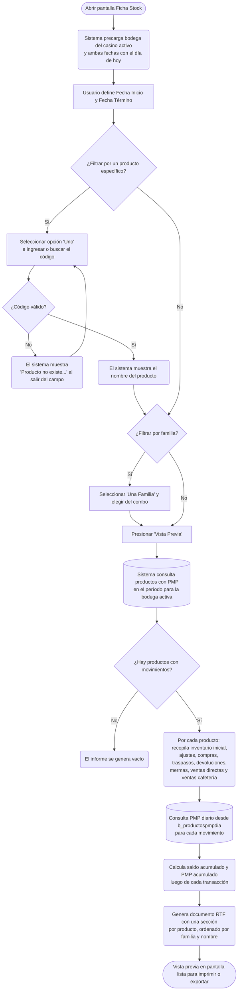

# Ficha Stock

**Formulario:** `I_FicSto.frm` (modo `FicSto`)
**Función principal:** `I_FichaStockMichel` en `Informes.bas`
**Tabla(s) principal(es):** `b_productospmpdia` (precio medio ponderado diario por producto), `b_tomainv` (inventarios físicos registrados), `b_totventas` / `b_detventas` (documentos de movimiento de stock), `b_totcompras` / `b_detcompras` (documentos de compra a proveedores), `b_totventaserviciosespeciales` / `b_detventaserviciosespeciales` (ventas y devoluciones de servicios especiales), `b_totventascaf` / `b_detventascafpro` (ventas de cafetería)
**Consulta principal:** Consultas directas + SP `sgp_Sel_ListarDevVentaServiciosEspecialesStock`

---

## Índice

- [1 — ¿Para qué sirve esta pantalla?](#1--para-qué-sirve-esta-pantalla)
- [2 — ¿Qué necesito para usarla?](#2--qué-necesito-para-usarla)
- [3 — ¿Cómo se usa?](#3--cómo-se-usa)
  - [3.1 Flujo paso a paso](#31-flujo-paso-a-paso)
  - [3.2 Controles y acciones disponibles](#32-controles-y-acciones-disponibles)
- [4 — ¿Qué restricciones debo conocer?](#4--qué-restricciones-debo-conocer)
  - [4.1 Validaciones del sistema](#41-validaciones-del-sistema)
  - [4.2 Reglas de cálculo](#42-reglas-de-cálculo)
- [5 — ¿Qué obtengo?](#5--qué-obtengo)
- [6 — Referencia técnica](#6--referencia-técnica)
  - [Tablas que intervienen](#tablas-que-intervienen)
  - [Relación con otros módulos](#relación-con-otros-módulos)

---

## 1 — ¿Para qué sirve esta pantalla?

[↑ Volver al índice](#índice)

La pantalla **Ficha Stock** entrega el historial completo de movimientos de inventario para uno o más productos dentro de un período de fechas definido. Para cada producto seleccionado, el informe muestra cronológicamente todas las transacciones que afectaron su stock: el inventario inicial con el que se parte, las entradas (compras a proveedores, traspasos recibidos, devoluciones de clientes, ajustes de entrada), y las salidas (consumo en producción, traspasos enviados, mermas, ventas directas, ventas de cafetería, ajustes de salida). Junto a cada movimiento se indica la cantidad involucrada, el costo unitario y el total del movimiento.

Lo que distingue a este informe de un simple listado de transacciones es que, además de mostrar cada movimiento individualmente, el sistema calcula y actualiza de forma acumulada la cantidad disponible en bodega y el Precio Medio Ponderado (PMP) tras cada operación. Esto permite ver, línea a línea, cómo evolucionó el stock y su valorización a lo largo del período.

El informe permite filtrar por un único producto o por todos los que tengan movimientos de PMP registrados en el período. Adicionalmente, es posible acotar la consulta a una familia de productos específica, lo que facilita el análisis por categoría (carnes, lácteos, verduras, etc.). El resultado se presenta como un documento RTF con vista previa en pantalla, generándose una sección por cada producto que tenga datos en el período.

---

## 2 — ¿Qué necesito para usarla?

[↑ Volver al índice](#índice)

| Campo | Descripción | Obligatorio |
|---|---|---|
| **Bodega** | Bodega del casino activo. Se carga automáticamente al abrir la pantalla y no puede ser modificada por el usuario. | Automático |
| **Fecha Inicio** | Fecha desde la cual se buscan movimientos de stock (formato dd/mm/yyyy). Se inicializa con la fecha del día. | Sí |
| **Fecha Término** | Fecha hasta la cual se buscan movimientos de stock (formato dd/mm/yyyy). Se inicializa con la fecha del día. | Sí |
| **Productos — Todos** | Opción predeterminada. Incluye en el informe todos los productos con control de stock que registren PMP en el período. | No (es el valor por defecto) |
| **Productos — Uno** | Restringe el informe a un único producto. Al seleccionarlo, se habilita el campo de código y el ícono de búsqueda. | No (opcional) |
| **Código de producto** | Código del producto a consultar. Solo activo cuando se selecciona la opción "Uno". Se puede ingresar directamente o buscar mediante el ícono lupa. | Solo si se eligió "Uno" |
| **Familia Producto — Todas** | Opción predeterminada. No aplica filtro por familia. | No (es el valor por defecto) |
| **Familia Producto — Una Familia** | Restringe el informe a los productos pertenecientes a la familia seleccionada en el combo. | No (opcional) |

> **Nota:** La bodega queda determinada por el casino con el que el usuario inició sesión. No es un parámetro editable; el sistema la utiliza internamente para filtrar todos los documentos de movimiento.

---

## 3 — ¿Cómo se usa?

[↑ Volver al índice](#índice)

### 3.1 Flujo paso a paso

[↑ Volver al índice](#índice)

### 3.2 Controles y acciones disponibles

[↑ Volver al índice](#índice)

| Control | Tipo | Descripción |
|---|---|---|
| **Bodega** (Frame4) | Combo deshabilitado | Muestra la bodega del casino activo. No es modificable. |
| **Todos** (Productos) | Botón de opción | Seleccionado por defecto. Incluye todos los productos con PMP registrado. |
| **Uno** (Productos) | Botón de opción | Habilita el campo de código y el ícono de búsqueda para elegir un producto específico. |
| **Código de producto** | Campo de texto | Solo activo con opción "Uno". Acepta el código ingresado manualmente o desde el buscador. |
| **Ícono lupa** | Botón de imagen | Abre el selector de productos (B_TabEst) para buscar y elegir un código. Solo activo con opción "Uno". |
| **Nombre del producto** | Etiqueta de estado | Muestra la descripción del producto una vez validado el código. |
| **Fecha Inicio** | Campo de fecha | Define el inicio del período a consultar (dd/mm/yyyy). |
| **Fecha Término** | Campo de fecha | Define el fin del período a consultar (dd/mm/yyyy). |
| **Todas** (Familia Producto) | Botón de opción | Seleccionado por defecto. No filtra por familia. |
| **Una Familia** (Familia Producto) | Botón de opción | Habilita el combo de familias para seleccionar una categoría específica. |
| **Combo de familias** | Lista desplegable | Lista las familias de producto disponibles (cargadas desde `a_tipopro`). Solo activo con "Una Familia". |
| **Vista Previa** (Toolbar) | Botón | Ejecuta la consulta y genera el informe RTF con vista previa. |
| **Salir** (Toolbar) | Botón | Cierra el formulario sin generar informe. |
| **Etiqueta de progreso** | Etiqueta de estado | Visible durante la generación del informe. Muestra el nombre del producto que se está procesando en ese momento. Se oculta al terminar. |

---

## 4 — ¿Qué restricciones debo conocer?

[↑ Volver al índice](#índice)

### 4.1 Validaciones del sistema

[↑ Volver al índice](#índice)

| # | Cuándo aparece | Qué verifica el sistema | Qué ve el usuario |
|---|---|---|---|
| 1 | Al abandonar el campo de código de producto (opción "Uno" activa) | Que el código ingresado exista en el maestro de productos (`b_productos`) para el casino activo | Mensaje: *"Producto no existe..."* y el campo queda vacío para reingresar |

> **Nota:** No existen validaciones de rango de fechas en este modo. El usuario debe asegurarse de ingresar un período coherente (Fecha Inicio ≤ Fecha Término).

### 4.2 Reglas de cálculo

[↑ Volver al índice](#índice)

El informe aplica dos cálculos acumulativos que se actualizan línea a línea al recorrer los movimientos de cada producto:

**Saldo de bodega acumulado:**
- Se inicializa con la cantidad del inventario inicial (`tin_stofis`).
- Cada movimiento de tipo "Entrada" o "Ajuste Inventario (+)" suma su cantidad al saldo.
- Cada movimiento de tipo "Salida" o "Ajuste Inventario (-)" resta su cantidad al saldo.

**Precio Medio Ponderado (PMP) acumulado:**
- El inventario inicial establece el PMP de arranque (`tin_propon`).
- Para cada movimiento posterior:
  - Si el denominador `(cantidad_mov + saldo_bode)` es cero, el PMP pasa a ser el costo del movimiento actual.
  - Si no: `PMP_nuevo = (cantidad_mov × costo_mov + saldo_bodega × PMP_anterior) / (cantidad_mov + saldo_bodega)`
  - Los valores negativos de saldo o cantidad se tratan como cero para este cálculo (se usa `Max(valor, 0)`).
- Para cada fila del informe, si no existe un PMP diario registrado en `b_productospmpdia` para ese producto y esa fecha, se usa el costo del movimiento actual como PMP de referencia para la columna "Precio Medio Ponderado".

**Costo unitario en entradas de proveedor:**
- Se toma el precio de recepción (`dec_prerec`) descontado el porcentaje de descuento (`dec_pctdes`) y se suma el impuesto por unidad (`imd_monimp / dec_canrec`, cuando el impuesto aplica al costo) y el flete por unidad (`dec_prefle / dec_canrec`, cuando exista).
- Fórmula: `Costo_unitario = dec_prerec × (1 - pctdes/100) + (impuesto / cantidad) + (flete / cantidad)`

---

## 5 — ¿Qué obtengo?

[↑ Volver al índice](#índice)

El informe genera un documento **RTF** en orientación **vertical (Portrait)**, con vista previa en pantalla y opción de impresión. El documento contiene:

- **Encabezado de página:** membrete del casino (logo + datos de la empresa), con pie de página numerado.
- **Título general:** "Informe Ficha Stock" centrado en la parte superior.
- **Sección por familia de producto:** título de la familia (nombre obtenido desde `a_tipopro`) como encabezado de grupo, en negrita.
- **Sección por producto:** código y nombre del producto como encabezado, seguido de una tabla de movimientos cronológicos para ese producto.
- **Tabla de movimientos:** una fila por transacción, con las columnas descritas a continuación. La tabla se ordena por nombre de producto, fecha, tipo de documento y número de documento.

Si un producto no tiene movimientos en el período y la cantidad del inventario inicial es cero, no se genera ninguna sección para ese producto.

**Estructura de datos del informe:**

| Campo | Descripción | Calculado |
|---|---|---|
| **Fecha** | Fecha del movimiento (dd/mm/yyyy) | No |
| **Tipo Movimiento** | Descripción textual del tipo: "Inventario Inicial", "Entrada", "Salida", "Ajuste Inventario (+)", "Ajuste Inventario (-)" | No |
| **Tipo Doc.** | Sigla del tipo de documento de origen (ej: FA, SP, DP, TR, ME, AI, SE, DE, VC) | No |
| **Número Doc.** | Número del documento que originó el movimiento | No |
| **Cantidad Movimiento** | Unidades involucradas en la transacción | No |
| **Costo Movimiento** | Costo unitario del movimiento en pesos | Sí (ver cálculo proveedores) |
| **Total Movimiento** | Monto total del movimiento = Cantidad × Costo | Sí |
| **Cantidad Stock** | Saldo acumulado en bodega después del movimiento | Sí |
| **Precio Medio Ponderado** | PMP vigente después del movimiento, o PMP registrado en `b_productospmpdia` para esa fecha | Sí |
| **Total Costo** | Valorización del stock = Cantidad Stock × PMP | Sí |

#### Cálculo — Total Movimiento

| Componente | Descripción |
|---|---|
| `Cantidad Movimiento` | Cantidad de unidades del movimiento (`dev_canmer`, `dec_canrec`, `dvp_candig`, etc.) |
| `Costo Movimiento` | Costo unitario calculado o registrado según el tipo de documento |
| **Fórmula** | `Total Movimiento = Cantidad Movimiento × Costo Movimiento` |

#### Cálculo — Cantidad Stock

| Componente | Descripción |
|---|---|
| `Saldo inicial` | `tin_stofis` del último inventario físico anterior a Fecha Inicio |
| `Entradas acumuladas` | Suma de cantidades de todos los movimientos de tipo "Entrada" y "Ajuste Inventario (+)" hasta la fila actual |
| `Salidas acumuladas` | Suma de cantidades de todos los movimientos de tipo "Salida" y "Ajuste Inventario (-)" hasta la fila actual |
| **Fórmula** | `Cantidad Stock = Saldo inicial + Entradas acumuladas − Salidas acumuladas` |

#### Cálculo — Precio Medio Ponderado (PMP acumulado)

| Componente | Descripción |
|---|---|
| `PMP_anterior` | PMP calculado en la fila inmediatamente anterior (o `tin_propon` para la primera fila) |
| `Saldo_bodega` | Cantidad Stock antes de incorporar el movimiento actual (mínimo 0) |
| `Cantidad_mov` | Cantidad del movimiento actual (mínimo 0) |
| `Costo_mov` | Costo unitario del movimiento actual |
| **Fórmula** | Si `(Cantidad_mov + Saldo_bodega) = 0` → `PMP = Costo_mov`; si no: `PMP = (Cantidad_mov × Costo_mov + Saldo_bodega × PMP_anterior) / (Cantidad_mov + Saldo_bodega)` |

#### Cálculo — Total Costo

| Componente | Descripción |
|---|---|
| `Cantidad Stock` | Saldo acumulado después del movimiento actual |
| `PMP` | PMP registrado en `b_productospmpdia` para esa fecha/producto, o el PMP acumulado calculado si no existe registro diario |
| **Fórmula** | `Total Costo = Cantidad Stock × PMP` |

**Tipos de movimiento incluidos en el informe:**

| Código interno | Descripción visible | Dirección |
|---|---|---|
| `00` | Inventario Inicial | Punto de partida (sin efecto entrada/salida) |
| `10` | Entrada — Proveedores (FA, FE, GD, etc.) | Entrada |
| `20` | Entrada — Traspaso recibido (TR) | Entrada |
| `25` / `90` | Ajuste Inventario (+) (AI tipo "A") | Entrada |
| `90` | Ajuste Inventario (-) (AI tipo distinto de "A") | Salida |
| `40` | Salida — Producción / Servicio Especial (SP, SE, VC) | Salida |
| `50` | Entrada — Devolución de producción / Servicio Especial (DP, DE) | Entrada |
| `60` | Salida — Traspaso enviado (TR) | Salida |
| `70` | Salida — Mermas (ME) | Salida |
| `80` | Salida — Venta directa (FA, FE, GD con mueve inventario) | Salida |

---

## 6 — Referencia técnica

[↑ Volver al índice](#índice)

### Tablas que intervienen

[↑ Volver al índice](#índice)

| Tabla | Rol en este informe |
|---|---|
| `b_productos` | Maestro de productos. Provee nombre, código de familia (`pro_codtip`), unidad de medida y flag de control de stock (`pro_ctrsto`). Solo se incluyen productos con `pro_ctrsto = 1`. |
| `b_productospmpdia` | Registro diario del Precio Medio Ponderado y saldo por producto y casino. Se usa para: (1) determinar qué productos tienen PMP en el período (lista base del informe) y (2) obtener el PMP oficial del día para la columna "Precio Medio Ponderado". |
| `b_tomainv` | Toma de inventario físico. Proporciona el saldo y PMP del inventario inicial más reciente anterior a la Fecha Inicio (`tin_stofis`, `tin_propon`, `tin_fectom`). |
| `b_totventas` | Cabecera de documentos de movimiento interno: ajustes de inventario (AI), traspasos (TR), mermas (ME), salidas a producción (SP), devoluciones de producción (DP). |
| `b_detventas` | Detalle de los documentos anteriores. Provee cantidades (`dev_canmer`, `dev_canmin`) y costo unitario (`dev_precos`) por producto. |
| `b_totcompras` | Cabecera de documentos de compra a proveedores. Provee fecha de remisión (`toc_fecrem`) y tipo/número de documento. |
| `b_detcompras` | Detalle de las compras. Provee cantidad recibida (`dec_canrec`), precio de recepción (`dec_prerec`), descuento (`dec_pctdes`) y flete (`dec_prefle`). |
| `b_detcomprasimp` | Detalle de impuestos de compra. Permite calcular el monto de impuesto que se incorpora al costo unitario cuando el impuesto está marcado como incluido en costo (`imp_inccos = 1`). |
| `a_impuesto` | Maestro de impuestos. Indica si el impuesto se suma al costo (`imp_inccos`). |
| `b_totventaserviciosespeciales` | Cabecera de documentos de servicios especiales (SE = salida, DE = devolución). |
| `b_detventaserviciosespeciales` | Detalle de servicios especiales. Provee cantidades y precio por producto. Consultado a través del SP `sgp_Sel_ListarDevVentaServiciosEspecialesStock`. |
| `b_totventascaf` | Cabecera de ventas de cafetería. |
| `b_detventascafpro` | Detalle de ventas de cafetería por producto. Provee cantidad digitada (`dvp_candig`) y costo (`dvp_precos`). Solo se incluyen cierres confirmados (`tvc_estado = 'C'`). |
| `a_tipopro` | Maestro de familias de producto. Se usa para mostrar el nombre de la familia como encabezado de grupo en el informe y para filtrar por familia cuando el usuario lo solicita. |
| `a_tipoajuste` | Maestro de tipos de ajuste de inventario. Indica si un ajuste es positivo ("A") o negativo. |
| `a_tiposervicio` | Maestro de tipos de servicio. Se usa para filtrar productos compatibles con el tipo de servicio del casino. |
| `b_clientes` | Maestro de clientes/casinos. Se usa para obtener el tipo de servicio del casino activo y así filtrar los productos aplicables. |
| `a_tipodocumento` | Maestro de tipos de documento. Se excluyen de las compras los documentos marcados como "SN" (sin nota), "NC" (nota de crédito) y "CE". |

**Stored Procedure:**

| SP | Parámetros | Descripción |
|---|---|---|
| `sgp_Sel_ListarDevVentaServiciosEspecialesStock` | `@IdBodega` (int), `@IDProducto` (varchar 20), `@FechaIni` (varchar 8 yyyymmdd), `@FechaFin` (varchar 8 yyyymmdd) | Retorna los movimientos de servicios especiales (salidas tipo SE y devoluciones tipo DE) que afectan el stock de un producto en la bodega y período indicados. Excluye documentos anulados (estado A o P) y filas donde la cantidad sea cero. |

### Relación con otros módulos

[↑ Volver al índice](#índice)

| Módulo relacionado | Relación |
|---|---|
| **Módulo de Proveedores / Compras** | Las entradas por compra se leen desde `b_totcompras` y `b_detcompras`, generadas al recepcionar guías de despacho o facturas de proveedor. |
| **Módulo de Traspasos** | Los traspasos entre bodegas generan documentos tipo TR en `b_totventas`/`b_detventas` que aparecen como "Entrada" o "Salida" según la dirección del traspaso (`tov_codser`: 1 = entrada, otro = salida). |
| **Módulo de Ajuste de Inventario** | Los ajustes manuales de stock (tipo AI) se leen desde `b_totventas`/`b_detventas` con clasificación según `a_tipoajuste`. |
| **Módulo de Producción (Salidas a Bodega)** | Las salidas de ingredientes a producción (tipo SP) y sus devoluciones (tipo DP) aparecen en la ficha como movimientos de salida y entrada respectivamente. |
| **Módulo de Mermas** | Los documentos de merma (tipo ME) se reflejan como salidas de stock. |
| **Módulo de Venta Directa** | Las ventas directas con documentos FA, FE o GD que mueven inventario (`dev_mueinv = 'S'`) aparecen como salidas. |
| **Módulo de Servicios Especiales** | Las salidas (SE) y devoluciones (DE) de servicios especiales se consultan a través del SP `sgp_Sel_ListarDevVentaServiciosEspecialesStock`. |
| **Módulo de Cafetería** | Las ventas de cafetería cerradas (tipo VC, `tvc_estado = 'C'`) con cantidad distinta de cero aparecen como salidas de stock. |
| **Cierre Diario** | El PMP almacenado en `b_productospmpdia` es actualizado por el proceso de cierre diario. Si el cierre no se ha ejecutado para un día, el PMP de ese día puede no existir en la tabla y el informe usará el costo del movimiento como aproximación. |

---

*Fuentes: `I_FicSto.frm`, función `I_FichaStockMichel` en `Informes.bas`, funciones auxiliares en `RutinaLectura.cls`, tabla `b_productospmpdia` y SP `sgp_Sel_ListarDevVentaServiciosEspecialesStock` en `SGP_Local.sql`*
