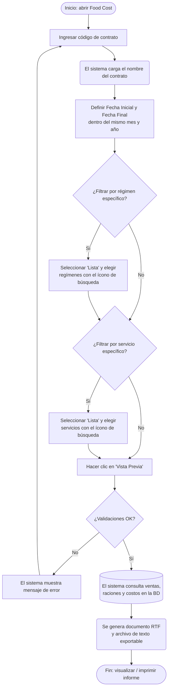

# Food Cost

**Formulario:** `I_FCost.frm` (modo `FooCos`)
**Función principal:** `I_FoodCost` en `Informes.bas`
**Tabla(s) principal(es):** `b_totventas` (encabezados de documentos de venta), `b_detventas` (líneas de producto de cada documento de venta), `b_minutaraciones` (raciones planificadas por cliente y servicio), `b_minuta` / `b_minutadet` (minuta real de producción), `b_totventaserviciosespeciales` / `b_detventaserviciosespeciales` (ventas de servicios especiales)
**Consulta principal:** Consultas directas SQL + SP `sgp_Sel_InfFoodCostSalidaDevolucionVentaServicioEspeciales`

---

## Índice

- [1 — ¿Para qué sirve esta pantalla?](#1--para-qué-sirve-esta-pantalla)
- [2 — ¿Qué necesito para usarla?](#2--qué-necesito-para-usarla)
- [3 — ¿Cómo se usa?](#3--cómo-se-usa)
  - [3.1 Flujo paso a paso](#31-flujo-paso-a-paso)
  - [3.2 Controles y acciones disponibles](#32-controles-y-acciones-disponibles)
- [4 — ¿Qué restricciones debo conocer?](#4--qué-restricciones-debo-conocer)
  - [4.1 Validaciones del sistema](#41-validaciones-del-sistema)
  - [4.2 Reglas de cálculo](#42-reglas-de-cálculo)
- [5 — ¿Qué obtengo?](#5--qué-obtengo)
- [6 — Referencia técnica](#6--referencia-técnica)
  - [Tablas que intervienen](#tablas-que-intervienen)
  - [Relación con otros módulos](#relación-con-otros-módulos)

---

## 1 — ¿Para qué sirve esta pantalla?

[↑ Volver al índice](#índice)

El informe **Food Cost** permite conocer, día a día y dentro de un mes calendario, la relación entre el costo de los insumos consumidos y los ingresos por venta de raciones en un contrato (casino). Para cada régimen y servicio seleccionado se muestran cuántas raciones se vendieron, el total de ingresos de ese día, el valor promedio de la bandeja vendida, las raciones producidas según la minuta real, el costo total del día y el costo por bandeja producida. La columna final —denominada **Food Cost**— expresa ese costo como porcentaje del ingreso diario, que es el indicador de gestión central del informe.

El informe se organiza jerárquicamente: primero agrupa por régimen y, dentro de cada régimen, por servicio. Al final de cada servicio aparece una fila de **Total Servicio** y, tras recorrer todos los regímenes, una fila de **Total General** que consolida el período completo. Si el contrato opera servicios especiales con precio por comensal, éstos se presentan en una sección separada con su propio total.

El resultado se entrega como documento RTF (visualizable en pantalla antes de imprimir) y simultáneamente se exporta un archivo de texto delimitado por barras que puede abrirse en Excel. Dado que el informe consolida un único mes, es adecuado tanto para el cierre mensual del casino como para el seguimiento quincenal o semanal dentro del mismo mes.

---

## 2 — ¿Qué necesito para usarla?

[↑ Volver al índice](#índice)

| Campo | Descripción | Obligatorio |
|---|---|---|
| Contrato | Código del casino (centro de costo) sobre el que se genera el informe. El sistema muestra automáticamente el nombre del contrato al escribir el código. | Sí |
| Fecha Inicial | Primer día del período a consultar (formato dd/mm/aaaa). Se inicializa con la fecha actual. | Sí |
| Fecha Final | Último día del período a consultar (formato dd/mm/aaaa). Se inicializa con la fecha actual. Debe pertenecer al mismo mes y año que la Fecha Inicial. | Sí |
| Tipo de costo | En este modo solo está disponible la opción **Total Costo**, que incluye tanto insumos alimentarios como desechables. | Fijo (Total Costo) |
| Régimen | Permite filtrar por uno o varios regímenes. Por defecto incluye todos los regímenes del contrato. Si se elige "Lista", se activa el ícono de búsqueda para seleccionarlos manualmente. | Sí (al menos uno) |
| Servicio | Permite filtrar por uno o varios servicios. Por defecto incluye todos los servicios del contrato. Si se elige "Lista", se activa el ícono de búsqueda para seleccionarlos manualmente. | Sí (al menos uno) |

---

## 3 — ¿Cómo se usa?

### 3.1 Flujo paso a paso

[↑ Volver al índice](#índice)

### 3.2 Controles y acciones disponibles

[↑ Volver al índice](#índice)

| Control | Descripción |
|---|---|
| Campo de contrato | Escribir el código del casino. Al salir del campo el nombre se carga automáticamente. La tecla F9 o el ícono de lupa abren el buscador de contratos. |
| Nombre del contrato | Etiqueta de solo lectura que muestra el nombre asociado al código ingresado. |
| Ícono de búsqueda de contrato | Abre un buscador sobre la tabla de clientes/contratos para seleccionar el casino. |
| Fecha Inicial | Campo de fecha (dd/mm/aaaa). Se puede escribir directamente o usar el calendario desplegable. |
| Fecha Final | Campo de fecha (dd/mm/aaaa). Se puede escribir directamente o usar el calendario desplegable. |
| Opción "Total Costo" | Única opción de tipo de costo disponible en este informe. Considera insumos de alimentación y desechables de forma conjunta. |
| Régimen — Todos | Selección predeterminada; incluye todos los regímenes del contrato en el informe. |
| Régimen — Lista | Habilita el ícono de búsqueda de régimen para elegir uno o varios regímenes específicos. |
| Ícono de búsqueda de régimen | Abre el buscador de regímenes; los seleccionados se guardan en la grilla interna de regímenes. |
| Servicio — Todos | Selección predeterminada; incluye todos los servicios del contrato en el informe. |
| Servicio — Lista | Habilita el ícono de búsqueda de servicio para elegir uno o varios servicios específicos. |
| Ícono de búsqueda de servicio | Abre el buscador de servicios; los seleccionados se guardan en la grilla interna de servicios. |
| Botón "Vista Previa" | Ejecuta las validaciones y genera el informe. |
| Botón "Histórico Planificación Teórica" | Permite seleccionar un período histórico (mes/año cerrado); al aceptar, actualiza automáticamente las fechas del formulario al primer y último día de ese mes. |
| Botón "Salir" | Cierra el formulario sin generar el informe. |

---

## 4 — ¿Qué restricciones debo conocer?

### 4.1 Validaciones del sistema

[↑ Volver al índice](#índice)

| # | Cuándo aparece | Qué verifica el sistema | Qué ve el usuario |
|---|---|---|---|
| 1 | Al hacer clic en "Vista Previa" | Que el código de contrato exista en la base de datos | "No existe contrato" |
| 2 | Al hacer clic en "Vista Previa" | Que la Fecha Inicial no sea posterior a la Fecha Final | "Fecha origen Mayor destino" |
| 3 | Al hacer clic en "Vista Previa" | Que ambas fechas pertenezcan al mismo mes | "Mes origen mayor destino" |
| 4 | Al hacer clic en "Vista Previa" | Que ambas fechas pertenezcan al mismo año | "Año origen mayor destino" |
| 5 | Al hacer clic en "Vista Previa" | Que haya al menos un régimen seleccionado | "Regimen debe ser informado" |
| 6 | Al hacer clic en "Vista Previa" | Que haya al menos un servicio seleccionado | "Servicio debe ser informado" |

### 4.2 Reglas de cálculo

[↑ Volver al índice](#índice)

- El informe solo puede abarcar días dentro de **un mismo mes y año**. No es posible cruzar meses.
- El tipo de costo **Total Costo** combina las cuentas contables configuradas en los parámetros del sistema como "insumos alimentarios" (`ctainsumo`) y "desechables" (`ctalimdes`). El filtro se aplica sobre el campo de cuenta contable de cada producto.
- Solo se consideran documentos de venta con tipo **SP** (salida de producción) y **DP** (devolución de producción), que no estén anulados ni pendientes. Las devoluciones se restan al costo total.
- Para las raciones producidas, el sistema consulta la **minuta real** (`mid_tipmin = '2'`); las minutas teóricas o planificadas no se incluyen en este informe.
- Las ventas a clientes internos **PERSONAL** y **PRODUCIDAS** quedan excluidas del conteo de raciones vendidas.
- Las ventas a contado registradas en `b_ventacontado` se suman al ingreso del día.
- Los **Servicios Especiales** (contratos con precio por comensal o precio total) se procesan de forma separada mediante el procedimiento almacenado `sgp_Sel_InfFoodCostSalidaDevolucionVentaServicioEspeciales`. Solo se incluyen servicios especiales con costo neto positivo (las devoluciones que resultan en costo negativo son excluidas).

---

## 5 — ¿Qué obtengo?

[↑ Volver al índice](#índice)

El informe genera un documento **RTF** orientado en **retrato (Portrait)**, con cabecera y pie de página de la empresa. Simultáneamente se exporta un archivo de texto delimitado por barras (`|`) que puede abrirse en Excel.

### Estructura del documento

El documento se divide en dos grandes bloques:

**Bloque 1 — Ventas de producción regular (por régimen y servicio)**

Organizado como:
- Encabezado general: nombre del contrato y rango de fechas.
- Por cada régimen → por cada servicio → filas diarias de detalle → fila "Tot. Serv." → fila "Tot. Gral." al final del bloque.

**Bloque 2 — Ventas de servicios especiales**

Si el contrato tiene operaciones de servicios especiales en el período, se presenta una sección adicional:
- Por cada servicio especial → filas diarias de detalle → fila "Tot. Serv. Vta. Especial" → fila "Tot. Gral. Vta. Especial" al final.

### Estructura de datos del informe

| Campo | Descripción | Calculado |
|---|---|---|
| Fecha | Día al que corresponde la fila (dd/mm/aaaa) | No |
| Servicio | Código y nombre del servicio o del servicio especial | No |
| Rac. Vendidas | Suma de raciones vendidas (clientes distintos de PERSONAL y PRODUCIDAS) en ese día, servicio y régimen | No |
| Venta Día | Total de ingresos del día: precio de venta por ración × raciones vendidas, más ventas a contado | Sí |
| Valor Bandeja | Ingreso promedio por ración vendida | Sí |
| Rac. Producidas | Total de raciones reales producidas según minuta real | No |
| Costo Día | Suma del costo neto de insumos (salidas menos devoluciones) del día | No |
| Costo Bandeja | Costo promedio por ración producida | Sí |
| Costo Bandeja Vendido | Costo promedio distribuido sobre las raciones vendidas | Sí |
| Food Cost | Porcentaje que representa el costo sobre el ingreso del día | Sí |
| Tot. Serv. | Subtotal del servicio para el período | Sí |
| Tot. Gral. | Total general de todos los servicios y regímenes para el período | Sí |

---

#### Cálculo — Valor Bandeja

> Ingreso promedio por ración vendida en un día determinado.

| Componente | Descripción |
|---|---|
| Venta Día | Suma de ingresos del día (raciones × precio vigente + ventas contado) |
| Rac. Vendidas | Cantidad de raciones vendidas en ese día |
| **Fórmula** | `Valor Bandeja = Venta Día / Rac. Vendidas` |

Solo se calcula si ambos valores son mayores que cero.

---

#### Cálculo — Costo Bandeja

> Costo promedio por ración efectivamente producida.

| Componente | Descripción |
|---|---|
| Costo Día | Costo neto de insumos consumidos (salidas menos devoluciones) |
| Rac. Producidas | Raciones reales según minuta real |
| **Fórmula** | `Costo Bandeja = Costo Día / Rac. Producidas` |

Solo se calcula si ambos valores son mayores que cero.

---

#### Cálculo — Costo Bandeja Vendido

> Costo promedio distribuido sobre las raciones vendidas (indicador alternativo al Costo Bandeja).

| Componente | Descripción |
|---|---|
| Costo Día | Costo neto de insumos consumidos |
| Rac. Vendidas | Cantidad de raciones vendidas |
| **Fórmula** | `Costo Bandeja Vendido = Costo Día / Rac. Vendidas` |

Solo se calcula si ambos valores son mayores que cero.

---

#### Cálculo — Food Cost

> Indicador principal: porcentaje del costo sobre el ingreso diario. Valores típicos en industria casino oscilan entre 25 % y 45 %.

| Componente | Descripción |
|---|---|
| Costo Día | Costo neto de insumos consumidos |
| Venta Día | Total de ingresos del día |
| **Fórmula** | `Food Cost (%) = (Costo Día / Venta Día) × 100` |

Solo se calcula si el Costo Día y la Venta Día son mayores que cero. Se muestra con dos decimales y el símbolo `%`.

---

### Formato de salida

| Atributo | Valor |
|---|---|
| Formato principal | RTF (visualización en pantalla y envío a impresora) |
| Exportación secundaria | Archivo de texto con campos delimitados por `\|` (compatible con Excel) |
| Orientación de página | Retrato (Portrait) |
| Estructura de columnas | 9 columnas: Fecha, Servicio, Rac. Vendidas, Venta Día, Valor Bandeja, Rac. Producidas, Costo Día, Costo Bandeja, Costo Bandeja Vendido, Food Cost |
| Encabezado de columnas | Fondo amarillo, negrita |
| Filas de totales | Negrita; "Tot. Serv." al final de cada servicio, "Tot. Gral." al final del informe |
| Tipografía | Arial 7 pt para datos, 8 pt para cabecera/pie, 12 pt para título del informe |

---

## 6 — Referencia técnica

### Tablas que intervienen

[↑ Volver al índice](#índice)

| Tabla | Para qué se usa | Campos clave |
|---|---|---|
| `b_clientes` | Validar que el contrato existe y obtener su nombre | `cli_codigo`, `cli_nombre`, `cli_activo`, `cli_codbod`, `cli_tipo` |
| `b_totventas` | Encabezados de documentos de venta (salidas y devoluciones de producción) | `tov_rutcli`, `tov_tipdoc` (SP/DP), `tov_fecpro`, `tov_codreg`, `tov_codser`, `tov_codbod`, `tov_estdoc` |
| `b_detventas` | Líneas de producto de cada documento de venta; aporta el valor monetario | `dev_rutcli`, `dev_tipdoc`, `dev_numdoc`, `dev_codmer`, `dev_ptotal`, `dev_canmer` |
| `b_productos` | Catálogo de productos/insumos; filtra por cuenta contable | `pro_codigo`, `pro_ctacon` |
| `a_servicio` | Maestro de servicios; aporta el nombre del servicio | `ser_codigo`, `ser_nombre` |
| `a_regimen` | Maestro de regímenes; aporta el nombre del régimen | `reg_codigo`, `reg_nombre` |
| `b_minutaraciones` | Raciones planificadas por cliente, servicio y fecha; se usa para obtener el precio de venta vigente | `mir_cencos`, `mir_codreg`, `mir_codser`, `mir_fecmin`, `mir_rutcli`, `mir_nrorac` |
| `b_preciovta` | Precios de venta por cliente, servicio, régimen y fecha de vigencia | `prv_rutcli`, `prv_codser`, `prv_codreg`, `prv_cencos`, `prv_fecvig`, `prv_preven` |
| `b_ventacontado` | Ventas en efectivo o contado registradas por día y servicio | `vtc_codreg`, `vtc_cencos`, `vtc_codser`, `vtc_fecvta`, `vtc_totmon` |
| `b_minuta` | Encabezado de la minuta de producción | `min_codigo`, `min_cencos`, `min_codreg`, `min_codser`, `min_fecmin`, `min_racrea` |
| `b_minutadet` | Detalle de la minuta; solo se lee la minuta real (`mid_tipmin='2'`) | `mid_codigo`, `mid_tipmin`, `mid_cosrec`, `mid_cosdes`, `mid_numrac` |
| `b_totventaserviciosespeciales` | Encabezados de documentos de servicios especiales (tipo SE/DE) | `tos_IdCeco`, `tos_Tipo_Documento`, `tos_Numero_Documento`, `tos_Venta_servicio_Especiales`, `tos_Fecha_Produccion`, `tos_Comensales`, `tos_Precio_Servicio`, `tos_IdBodega`, `tos_Estado_Documento` |
| `b_detventaserviciosespeciales` | Líneas de producto de servicios especiales; aporta el costo | `des_IdCeco`, `des_Tipo_Documento`, `des_Numero_Documento`, `des_IdProducto`, `des_Total_Documento`, `des_Cantidad_Mercaderia`, `des_Cantidad_Devolver` |
| `a_param` (parámetros del sistema) | Obtiene las cuentas contables de insumos (`ctainsumo`) y desechables (`ctalimdes`) para filtrar los productos | `par_codigo`, `par_valor` |

### Relación con otros módulos

[↑ Volver al índice](#índice)

| Módulo | Relación |
|---|---|
| Planificación / Minuta Real | Provee las raciones producidas (`b_minuta`, `b_minutadet` con `mid_tipmin='2'`) que se muestran en la columna "Rac. Producidas" |
| Ventas / Facturación | Provee los documentos SP y DP de `b_totventas` / `b_detventas` y las ventas a contado de `b_ventacontado` que conforman el ingreso diario |
| Contrato / Precio de venta | `b_preciovta` define el precio por ración según cliente, servicio y régimen; es necesario para calcular la "Venta Día" |
| Servicios Especiales | `b_totventaserviciosespeciales` / `b_detventaserviciosespeciales` alimentan el bloque de "Ventas Servicios Especiales" mediante el SP `sgp_Sel_InfFoodCostSalidaDevolucionVentaServicioEspeciales` |
| Maestros (Régimen / Servicio) | `a_regimen` y `a_servicio` se usan para mostrar los nombres en el informe y para el buscador de selección |
| Parámetros del sistema | `a_param` define qué cuentas contables corresponden a insumos y a desechables, controlando qué productos se incluyen en el costo |

---

*Fuentes: `I_FCost.frm`, función `I_FoodCost` en `Informes.bas`, SP `sgp_Sel_InfFoodCostSalidaDevolucionVentaServicioEspeciales` en `SGP_Local.sql`*
