# Impresión de Etiquetado de Recetas

**Formulario:** `I_EtiquetaReceta.frm`
**Tabla(s) principal(es):** `b_minuta` / `b_minutadet` (minuta real de producción), `b_receta` / `b_recetadet` (maestro de recetas con detalle de ingredientes), `a_sellosreceta` (sellos nutricionales configurados por receta)
**Consulta principal:** `sgp_Sel_EtiquedadoRecetaxMinutaReal` — carga el listado de recetas; `sgp_Sel_EtiquetadoNutricional` — genera la información nutricional completa para la impresión

---

## Índice

- [1 — ¿Para qué sirve esta pantalla?](#1--para-qué-sirve-esta-pantalla)
- [2 — ¿Qué necesito para usarla?](#2--qué-necesito-para-usarla)
- [3 — ¿Cómo se usa?](#3--cómo-se-usa)
  - [3.1 Flujo paso a paso](#31-flujo-paso-a-paso)
  - [3.2 Controles y acciones disponibles](#32-controles-y-acciones-disponibles)
- [4 — ¿Qué restricciones debo conocer?](#4--qué-restricciones-debo-conocer)
  - [4.1 Validaciones del sistema](#41-validaciones-del-sistema)
  - [4.2 Reglas de cálculo](#42-reglas-de-cálculo)
- [5 — ¿Qué obtengo?](#5--qué-obtengo)
- [6 — Referencia técnica](#6--referencia-técnica)
  - [Tablas que intervienen](#tablas-que-intervienen)
  - [Relación con otros módulos](#relación-con-otros-módulos)

---

## 1 — ¿Para qué sirve esta pantalla?

[↑ Volver al índice](#índice)

Esta pantalla genera etiquetas nutricionales impresas para las recetas que figuran en la minuta real de un día, régimen y servicio determinados. El resultado es un documento en vista previa (formato RTF, orientación vertical) que puede imprimirse directamente; cada receta seleccionada produce una etiqueta con el formato reglamentario exigido en producción de alimentos: encabezado del establecimiento, tabla nutricional por cada 100 gramos y por porción, listado de ingredientes ordenado por gramaje, alérgenos declarados y advertencia de elaboración en líneas compartidas.

La pantalla se organiza en tres zonas: una cabecera de filtros donde el usuario ingresa el contrato, régimen, servicio y fecha de la minuta; una grilla de selección de recetas que se carga con las recetas de esa minuta que tengan sello nutricional configurado; y una grilla secundaria donde se visualizan y seleccionan los nutrientes que aparecerán en la tabla nutricional de la etiqueta.

El sistema verifica al abrirse, antes de que el usuario haga nada, que estén configurados los datos mínimos para operar: que existan nutrientes con sello principal, que el contrato tenga dirección y resolución registradas, y que la tabla de parámetros tenga los nombres de los archivos gráficos (sellos de calorías, azúcares, grasas y sodio, más el logotipo). Si cualquiera de estas condiciones no se cumple, el botón de impresión queda deshabilitado y el sistema muestra un aviso explicando el motivo.

---

## 2 — ¿Qué necesito para usarla?

[↑ Volver al índice](#índice)

| Campo | Descripción | Obligatorio |
|---|---|---|
| Contrato (CECO) | Código del casino o unidad de negocio. Puede escribirse directamente o buscarse en el selector de clientes activos. El sistema muestra el nombre del contrato junto al código. | Sí |
| Régimen | Código numérico del régimen alimentario. Puede escribirse o buscarse con el selector de regímenes. Al ingresar un código válido, el sistema muestra el nombre del régimen. | Sí |
| Servicio | Código numérico del servicio (desayuno, almuerzo, cena, etc.). Puede escribirse o buscarse con el selector de servicios. Al ingresar un código válido, el sistema muestra el nombre del servicio. | Sí |
| Fecha de Minuta | Fecha para la cual se buscarán las recetas de la minuta real. Formato dd/mm/yyyy. Inicialmente toma la fecha actual. Cambiar esta fecha borra automáticamente el listado de recetas cargado. | Sí |
| Fecha de Emisión | Segunda fecha que aparece en el encabezado impreso de la etiqueta como fecha de elaboración del documento. Inicialmente toma la fecha actual. | Sí |
| Nombre de la receta | Opción de nombre a mostrar en la etiqueta: **Nombre Receta** (nombre interno del sistema) o **Nombre Fantasía** (nombre comercial visible al comensal). El valor por defecto es Nombre Fantasía. | Sí |

> **Nota sobre prerequisitos de configuración:** Al abrir la pantalla, el sistema verifica automáticamente que existan en la base de datos: nutrientes con indicador de sello principal activo, dirección y resolución registradas en el contrato, y los nombres de los archivos gráficos de sellos (configurados en la tabla de parámetros del sistema con el código `NomEtiRec`). Si falta cualquiera de estos datos, el botón de vista previa/impresión quedará deshabilitado.

---

## 3 — ¿Cómo se usa?

### 3.1 Flujo paso a paso

[↑ Volver al índice](#índice)



```mermaid
flowchart TD
    A([Abrir formulario]) --> B(Sistema carga nutrientes con sello principal)
    B --> C{¿Existen nutrientes con sello?}
    C -- No --> D(Botón imprimir deshabilitado\nMensaje: 'No existe información nutrientes...')
    C -- Sí --> E(Sistema valida dirección y resolución del contrato)
    E --> F{¿Contrato tiene dirección y resolución?}
    F -- No --> G(Botón imprimir deshabilitado\nMensaje: 'No existe información Dirección o bien Resolución...')
    F -- Sí --> H(Sistema carga nombres de archivos gráficos de sellos)
    H --> I{¿Existen parámetros de nombres de sellos?}
    I -- No --> J(Botón imprimir deshabilitado\nMensaje: 'No existe información nombre sello etiquetado...')
    I -- Sí --> K[Usuario ingresa Contrato / Régimen / Servicio]
    K --> L[Usuario ingresa Fecha de Minuta]
    L --> M[Usuario presiona botón Buscar]
    M --> N{¿Campos obligatorios completos?}
    N -- No --> O(Mensaje: 'Contrato no definido...' / 'Régimen no definido...' / 'Servicio no definido...' / 'Fecha esta nula...')
    N -- Sí --> P[(sgp_Sel_EtiquedadoRecetaxMinutaReal\nb_minuta + b_minutadet + b_receta + a_sellosreceta)]
    P --> Q{¿Existen recetas en la minuta\ncon sello configurado?}
    Q -- No --> R(Mensaje: 'No existe Información en la minuta real\no bien no esta definido los sellos en las recetas...')
    Q -- Sí --> S(Sistema muestra listado de recetas en grilla)
    S --> T[Usuario selecciona una o más recetas en la grilla]
    T --> U[Opcionalmente: asigna receta asociada para cada receta seleccionada]
    U --> V[Opcionalmente: ajusta número de porciones por receta]
    V --> W[Opcionalmente: activa o desactiva nutrientes en la grilla de nutrientes]
    W --> X[Usuario presiona Vista Previa]
    X --> Y{¿Al menos una receta seleccionada?}
    Y -- No --> Z(Mensaje: 'Debe seleccionar a lo menos una receta')
    Y -- Sí --> AA{¿Receta asociada sin receta origen seleccionada?}
    AA -- Sí --> AB(Mensaje: 'Debe seleccionar la receta origen asociada...')
    AA -- No --> AC{¿Parámetros del sistema configurados?}
    AC -- No --> AD(Mensaje según parámetro faltante:\nParSoliRec / ParLiquRec / ParNutTGra /\nParColeste / ParColPor / ParMaxEtRe /\nParMaxPorR / ParMaxNutr)
    AC -- Sí --> AE{¿Cantidad servida > 0 en todas las recetas?}
    AE -- No --> AF(Mensaje: 'Existe cantidad servida con valor cero...')
    AE -- Sí --> AG{¿Porción entre 1 y máximo configurado?}
    AG -- No --> AH(Mensaje: 'Existe porción con valor cero...' /\n'Debe seleccionar un máximo N porción de receta...')
    AG -- Sí --> AI{¿Número de recetas ≤ 1000?}
    AI -- No --> AJ(Mensaje: 'Debe seleccionar un máximo mil receta...')
    AI -- Sí --> AK{¿Archivos gráficos de sellos presentes\nen carpeta Etiquetado?}
    AK -- No --> AL(Mensaje: 'No existe carpeta Etiquetado...' /\n'No existe archivo X o bien fue borrado...')
    AK -- Sí --> AM[(sgp_Sel_EtiquetadoNutricional\nb_receta + b_recetadet + b_ingrediente +\nb_productonut + a_nutriente + b_recetaalergeno)]
    AM --> AN{¿Etiquetado definido con tipo\nLíquido o Sólido?}
    AN -- No --> AO(Mensaje: 'No esta definido el etiquetado en las recetas...')
    AN -- Sí --> AP(Sistema genera vista previa del documento RTF\nuna etiqueta por cada receta seleccionada)
    AP --> AQ([Usuario visualiza, imprime o cierra la vista previa])
```

### 3.2 Controles y acciones disponibles

[↑ Volver al índice](#índice)

| Control / Acción | Descripción |
|---|---|
| **Contrato** | Campo de texto para ingresar el código del casino. Al escribir el código el sistema muestra el nombre correspondiente junto al campo. |
| **Ícono de búsqueda — Contrato** | Abre el selector de clientes activos. Al seleccionar un cliente se llenan automáticamente el código y el nombre del contrato, y se limpian los campos de régimen y servicio. |
| **Régimen** | Campo numérico para ingresar el código de régimen. Al escribir un código válido el sistema muestra el nombre del régimen. |
| **Ícono de búsqueda — Régimen** | Abre el selector de regímenes. Al seleccionar uno se rellena el código y nombre del régimen. |
| **Servicio** | Campo numérico para ingresar el código de servicio. Al escribir un código válido el sistema muestra el nombre del servicio. |
| **Ícono de búsqueda — Servicio** | Abre el selector de servicios. Al seleccionar uno se rellena el código y nombre del servicio, y se activa el campo de fecha de minuta. |
| **Fecha Minuta** | Campo de fecha (formato dd/mm/yyyy) con selector de calendario. Determina qué día de la minuta real se consultará. Cambiar esta fecha borra el listado de recetas cargado. |
| **Nombre Receta / Nombre Fantasía** | Opciones excluyentes que definen el nombre que aparecerá en la etiqueta impresa. "Nombre Fantasía" es el valor predeterminado. |
| **Botón Buscar (barra inferior)** | Consulta la minuta real con los filtros ingresados y carga la grilla de recetas. Solo se activa si los campos de filtro están completos. |
| **Filtro por código de receta** | Campo de texto ubicado bajo la grilla de recetas. Al presionar Enter filtra las filas mostrando solo las que coinciden exactamente con el código ingresado. Escribir un código distinto limpia el filtro anterior. |
| **Filtro por nombre de receta** | Campo de texto ubicado bajo la grilla de recetas. Al presionar Enter filtra las filas cuyo nombre contiene el texto ingresado (búsqueda parcial). Puede usarse con múltiples términos separados por coma. Escribir un nombre distinto limpia el filtro anterior. |
| **Grilla de recetas (Selección Recetas)** | Lista las recetas encontradas en la minuta real. El usuario puede marcar o desmarcar cada receta haciendo clic sobre la fila. Hacer clic en el encabezado de la primera columna invierte la selección de todas las filas visibles. Incluye una columna desplegable para asignar la receta de origen asociada cuando una receta se imprime junto a otra. También permite editar el número de porciones por receta. |
| **Grilla de nutrientes** | Lista los nutrientes disponibles con indicador de sello principal. Los nutrientes marcados como índice principal aparecen bloqueados (siempre incluidos). El usuario puede activar o desactivar los demás nutrientes para controlar cuáles aparecen en la tabla nutricional de la etiqueta. |
| **Vista Previa (barra lateral)** | Ejecuta todas las validaciones, arma el documento con una etiqueta por cada receta seleccionada y abre la ventana de vista previa del sistema. Desde ahí puede imprimirse directamente. |
| **Salir (barra lateral)** | Cierra la pantalla sin generar ningún documento. |

---

## 4 — ¿Qué restricciones debo conocer?

### 4.1 Validaciones del sistema

[↑ Volver al índice](#índice)

| # | Cuándo aparece | Qué verifica el sistema | Qué ve o experimenta el usuario |
|---|---|---|---|
| 1 | Al abrir la pantalla | Que existan nutrientes con indicador de sello principal activo en el catálogo de nutrientes | Si no existen, el botón de vista previa queda deshabilitado y aparece: *"No existe información nutrientes, se desactivará el botón impresión..."* |
| 2 | Al abrir la pantalla | Que el contrato del casino tenga registrados los campos Dirección y Resolución en el maestro de contratos | Si faltan, el botón queda deshabilitado y aparece: *"No existe información [Dirección] o bien [Resolución] en el maestro de contratos. Es importante registrar esos datos, para etiquetado recetas, se desactivará el botón impresión..."* |
| 3 | Al abrir la pantalla | Que existan en la tabla de parámetros del sistema los nombres de los archivos gráficos de sellos (código de parámetro `NomEtiRec`) | Si no existen, el botón queda deshabilitado y aparece: *"No existe información nombre sello etiquetado en la tabla a_param, se desactivará el botón impresión..."* |
| 4 | Al presionar Buscar o Vista Previa | Que la fecha de minuta no esté en blanco | *"Fecha esta nula o en blanco..."* |
| 5 | Al presionar Buscar o Vista Previa | Que el contrato esté definido | *"Contrato no definido..."* |
| 6 | Al presionar Buscar o Vista Previa | Que el régimen esté definido | *"Régimen no definido..."* |
| 7 | Al presionar Buscar o Vista Previa | Que el servicio esté definido | *"Servicio no definido..."* |
| 8 | Al presionar Buscar | Que la minuta real del día seleccionado contenga recetas con sello nutricional configurado | *"No existe Información en la minuta real o bien no esta definido los sellos en las recetas..."* |
| 9 | Al presionar Vista Previa | Que haya al menos una receta marcada en la grilla | *"Debe seleccionar a lo menos una receta"* |
| 10 | Al presionar Vista Previa | Si una receta marcada tiene asignada una receta de origen, que esa receta de origen también esté marcada | *"Debe seleccionar la receta origen asociada, proceso cancelado..."* |
| 11 | Al presionar Vista Previa | Que el parámetro de código de receta sólida (`ParSoliRec`) esté configurado | *"No existe código parametro solido receta, en tabla a_param intentelo dentro de una hora..."* |
| 12 | Al presionar Vista Previa | Que el parámetro de código de receta líquida (`ParLiquRec`) esté configurado | *"No existe código parametro liquido receta, en tabla a_param intentelo dentro de una hora..."* |
| 13 | Al presionar Vista Previa | Que existan los códigos de nutrientes de gramos totales (`ParNutTGra`) | *"No existe códigos parametro nutriente gramos totales receta, en tabla a_param intentelo dentro de una hora..."* |
| 14 | Al presionar Vista Previa | Que exista el código del nutriente colesterol (`ParColeste`) | *"No existe códigos parametro nutriente colesterol, en tabla a_param intentelo dentro de una hora..."* |
| 15 | Al presionar Vista Previa | Que exista el parámetro de porcentaje de colesterol (`ParColPor`) | *"No existe parametro % colesterol, en tabla a_param intentelo dentro de una hora..."* |
| 16 | Al presionar Vista Previa | Que exista el parámetro de máximo de recetas por etiqueta (`ParMaxEtRe`) | *"No existe código parametro maximo receta, en tabla a_param intentelo dentro de una hora..."* |
| 17 | Al presionar Vista Previa | Que no se supere el máximo de recetas asociadas permitido por etiqueta | *"Debe seleccionar un máximo N receta asociada, proceso cancelado..."* |
| 18 | Al presionar Vista Previa | Que exista el parámetro de máximo de porciones (`ParMaxPorR`) | *"No existe código parametro máximo porción receta, en tabla a_param intentelo dentro de una hora..."* |
| 19 | Al presionar Vista Previa | Que la cantidad servida de cada receta seleccionada sea mayor que cero | *"Existe cantidad servida con valor cero en la grilla, proceso cancelado..."* |
| 20 | Al presionar Vista Previa | Que el número de porciones de cada receta sea al menos 1 | *"Existe porción con valor cero en la grilla, proceso cancelado..."* |
| 21 | Al presionar Vista Previa | Que el número de porciones no supere el máximo configurado | *"Debe seleccionar un máximo N porción de receta, proceso cancelado..."* |
| 22 | Al presionar Vista Previa | Que el código de receta de unión sea mayor que cero | *"Existe código de receta unión con valor cero en la grilla, proceso cancelado..."* |
| 23 | Al presionar Vista Previa | Que el total de recetas marcadas no supere 1000 | *"Debe seleccionar un máximo mil receta, proceso cancelado..."* |
| 24 | Al presionar Vista Previa | Que exista el parámetro de máximo de nutrientes (`ParMaxNutr`) | *"No existe código parametro maximo nutriente, en tabla a_param intentelo dentro de una hora..."* |
| 25 | Al presionar Vista Previa | Que no se supere el máximo de nutrientes seleccionados | *"Debe seleccionar un máximo N nutrientes, proceso cancelado..."* |
| 26 | Al presionar Vista Previa | Que exista la carpeta `Etiquetado` en el directorio de trabajo de informes | *"No existe la carpeta Etiquetado..."* |
| 27 | Al presionar Vista Previa | Que existan en la carpeta los archivos gráficos de Calorías, Azúcares, Grasas, Sodio y Logotipo | *"No existe archivo [nombre] o bien fue borrado..."* |
| 28 | Al generar el informe | Que existan los parámetros de calorias, grasas totales, azúcares y sodio en la tabla de parámetros del sistema (`ParCaloria`, `ParGrasas`, `ParAzucar`, `ParSodio`) | Mensajes individuales por cada parámetro faltante |
| 29 | Al generar el informe | Que las recetas seleccionadas tengan el etiquetado de sello definido con tipo Líquido o Sólido | *"No esta definido el etiquetado en las recetas con el concepto (Liquido o Solido)..."* |

### 4.2 Reglas de cálculo

[↑ Volver al índice](#índice)

**Cantidad servida por receta:** El sistema calcula automáticamente la cantidad servida en gramos por ración al cargar la grilla de recetas. Este valor se obtiene sumando, para cada ingrediente de la receta, el gramaje bruto multiplicado por el porcentaje de aprovechamiento y luego por el porcentaje de cocción:

```
canservida = SUM( (red_pctapr / 100 × red_canpro) × (red_pctcoc / 100) )
```

Donde `red_pctapr` es el porcentaje de aprovechamiento del ingrediente, `red_canpro` es la cantidad en gramos del ingrediente en la receta, y `red_pctcoc` es el porcentaje de cocción.

**Valor nutricional por porción:** El sistema calcula el aporte de cada nutriente por porción dividiendo el aporte nutricional del ingrediente por el factor nutricional del ingrediente y ponderando por el gramaje relativo al rendimiento base de la receta:

```
candiet = SUM( (red_pctnut/100 × pnu_canapo × (red_canpro / rec_basrac)) / ing_facnut )
```

Donde `red_pctnut` es el porcentaje neto del ingrediente, `pnu_canapo` es el aporte del nutriente en el ingrediente (por cada 100 g de alimento), `red_canpro` es la cantidad del ingrediente en la receta, `rec_basrac` es el rendimiento base de la receta en gramos, e `ing_facnut` es el factor de conversión nutricional del ingrediente.

**Grasa Total:** Se calcula de manera especial incluyendo el colesterol ajustado por el porcentaje configurado en `ParColPor`, sumándose junto a los demás tipos de grasa:

```
GrasaTotal = SUM(
  CASE WHEN nutriente = colesterol
       THEN aporte_nutriente / ParPorColesterol
       ELSE aporte_nutriente
  END
)
```

---

## 5 — ¿Qué obtengo?

[↑ Volver al índice](#índice)

Esta pantalla genera un único tipo de documento: una etiqueta nutricional por cada receta marcada en la grilla, agrupadas en un mismo documento de vista previa. El documento se genera en orientación vertical y puede imprimirse o exportarse como RTF desde la ventana de vista previa.

**Formato de salida:** Vista previa RTF — orientación vertical (Portrait).

**Función que genera el documento:** `I_Etiquetado_Receta`, definida en `Informes.bas`.

Cada etiqueta contiene los siguientes bloques, en este orden:

| Bloque | Contenido |
|---|---|
| Logotipo | Imagen gráfica del logotipo del establecimiento (archivo configurado en parámetros del sistema) |
| Encabezado del establecimiento | Texto fijo "Elaborado por Sodexo Chile SPA", dirección del casino, línea en blanco |
| Resolución y fecha | "Resolución exenta N° [número]" seguido de la Fecha de Emisión indicada por el usuario |
| Título nutricional | "Información Nutricional [nombre de la receta o recetas agrupadas]" |
| Indicación de conservación | "MANTENER 0°C - 4°C" |
| Listado de ingredientes | "Ingredientes: [lista de ingredientes ordenada de mayor a menor gramaje, separada por guiones]" |
| Alérgenos declarados | "Alergenos: [lista de alérgenos registrados en la receta]" |
| Advertencia de elaboración compartida | Texto fijo sobre líneas que procesan gluten, soya, lactosa, nueces, maní, sulfitos, huevo, pescados y crustáceos |
| Porción — Contenido aproximado | Cantidad servida en gramos por porción (calculada automáticamente) |
| Porciones por envase | Número de porciones indicado en la grilla por el usuario |
| Tabla nutricional | Encabezado con columnas "100 gramos" / "1 porción"; fila por cada nutriente seleccionado con nombre, unidad y valores calculados; filas de sellos (calorías, azúcares, grasas totales, sodio) con íconos gráficos y marcas de exceso según umbrales configurados |

**Sellos de advertencia en la tabla nutricional:** Para los cuatro nutrientes críticos (Calorías, Azúcares, Grasas Totales y Sodio) el sistema compara el valor calculado por porción contra los umbrales parametrizados según el tipo de receta (sólida o líquida). Si el valor supera el umbral configurado, se muestra el ícono de advertencia correspondiente (sello negro de exceso). Los umbrales de sólidos y líquidos se leen de los parámetros `ParSolido` y `ParLiquido` respectivamente.

**Recetas agrupadas:** Si el usuario asigna a una receta una "receta de origen" (columna desplegable en la grilla), ambas recetas se consolidan en una misma etiqueta. Los ingredientes y valores nutricionales se suman. El nombre en el título nutricional muestra ambos nombres concatenados con separador.

---

## 6 — Referencia técnica

### Tablas que intervienen

[↑ Volver al índice](#índice)

| Tabla | Para qué se usa en este reporte | Campos clave |
|---|---|---|
| `b_minuta` | Encabezado de la minuta real: filtra por contrato, régimen, servicio y fecha | `min_cencos`, `min_codreg`, `min_codser`, `min_fecmin` |
| `b_minutadet` | Detalle de la minuta real: identifica las recetas del día y el tipo de minuta (solo se usan registros de minuta real, `mid_tipmin = '2'`) | `mid_codigo`, `mid_codrec`, `mid_tiprec`, `mid_numlin` |
| `b_receta` | Maestro de recetas: nombre, nombre fantasía, categoría dietética, tipo de plato, rendimiento base, sello nutricional configurado | `rec_codigo`, `rec_nombre`, `rec_nomfan`, `rec_catdie`, `rec_tippla`, `rec_basrac`, `rec_fecvig`, `IdSellos`, `IdEtiquetadoSello` |
| `b_recetadet` | Detalle de ingredientes de cada receta: gramajes, porcentajes de aprovechamiento y cocción, porcentaje neto nutricional | `red_codigo`, `red_codpro`, `red_canpro`, `red_pctapr`, `red_pctcoc`, `red_pctnut`, `red_tiprec`, `red_cencos` |
| `b_ingrediente` | Catálogo de ingredientes: nombre, factor nutricional | `ing_codigo`, `ing_nombre`, `ing_facnut` |
| `b_productonut` | Tabla de aportes nutricionales por ingrediente: cuánto aporta cada nutriente por cada 100 g del ingrediente | `pnu_codpro`, `pnu_codapo`, `pnu_canapo` |
| `a_nutriente` | Catálogo de nutrientes: nombre, unidad de medida, indicador de sello principal, orden de presentación | `nut_codigo`, `nut_nombre`, `nut_nomuni`, `nut_IndicePrincipalSello`, `nut_secnro`, `nut_OrdenPrincipalSello` |
| `a_sellosreceta` | Configuración de sellos nutricionales disponibles; determina qué sello está activo para cada receta | `IdSellos`, `Activo` |
| `a_etiquetadoselloreceta` | Configuración del tipo de etiquetado (Sólido/Líquido) por receta | `IdEtiquetadoSello`, `activo` |
| `b_recetaalergeno` | Alérgenos declarados para cada receta | `IdReceta`, `Idalergeno`, `Activo` |
| `a_alergeno` | Catálogo de alérgenos | `IdAlergeno`, `NombreAlergeno`, `Activo` |
| `b_clientes` | Maestro de contratos/casinos: dirección y resolución necesarias para el encabezado de la etiqueta. Solo se usan registros de tipo casino activo (`cli_activo='1'`, `cli_tipo=0`, `cli_codbod>0`) | `cli_codigo`, `cli_direccion`, `cli_resolucion`, `cli_activo`, `cli_tipo`, `cli_codbod` |
| `a_regimen` | Catálogo de regímenes: para mostrar el nombre al ingresar el código | `reg_codigo`, `reg_nombre` |
| `a_servicio` | Catálogo de servicios: para mostrar el nombre al ingresar el código | `ser_codigo`, `ser_nombre` |
| `a_param` | Tabla de parámetros del sistema: almacena códigos y nombres de archivos gráficos de sellos, umbrales nutricionales por tipo de receta, y códigos internos de nutrientes críticos | `par_codigo`, `par_valor`, `par_cencos` |
| `b_productosing` | Tabla de vinculación entre productos e ingredientes; usada para validar que el ingrediente esté asociado a un producto activo | `pri_coding`, `pri_codpro` |
| `b_productos` | Maestro de productos; confirmación de que el ingrediente tiene producto asociado | `pro_codigo` |
| `a_recetacatdie` | Catálogo de categorías dietéticas | `car_codigo` |
| `a_recetatippla` | Catálogo de tipos de plato | `tip_codigo` |

### Relación con otros módulos

[↑ Volver al índice](#índice)

| Módulo | Relación |
|---|---|
| **Planificación / Minuta Real** | Provee los datos de origen: las recetas que aparecen en la grilla son las que están registradas en la minuta real (`b_minutadet`, `mid_tipmin='2'`) para el régimen, servicio y fecha seleccionados. Si no existe minuta real, la grilla queda vacía. |
| **Maestro de Recetas** | Define los ingredientes, gramajes, porcentajes de aprovechamiento/cocción y rendimiento base que se utilizan para calcular la cantidad servida y los valores nutricionales de la etiqueta. |
| **Catálogo de Nutrientes** | Define qué nutrientes están disponibles para la tabla nutricional y cuáles aparecen siempre como parte del sello principal. |
| **Maestro de Contratos (Clientes)** | Provee la dirección y resolución sanitaria del casino, que aparecen en el encabezado de cada etiqueta. Sin estos datos la pantalla no puede operar. |
| **Tabla de Parámetros del Sistema** | Provee los umbrales de exceso de calorías, azúcares, grasas y sodio (diferenciados por tipo sólido/líquido), los códigos internos de nutrientes críticos, los nombres de los archivos gráficos de sellos y los límites operativos (máximo de recetas, porciones y nutrientes por etiqueta). |

---

*Fuentes: `I_EtiquetaReceta.frm`, `Informes.bas` (función `I_Etiquetado_Receta`), SP `sgp_Sel_EtiquedadoRecetaxMinutaReal` en `SGP_Local.sql`, SP `sgp_Sel_EtiquetadoNutricional` en `SGP_Local.sql`, SP `sgp_Sel_NutrienteIndPrincipalSello` en `SGP_Local.sql`, SP `sgp_Sel_ValidarDireccionResolucion` en `SGP_Local.sql`, SP `sgp_Sel_NomEtiquetadoNutricional` en `SGP_Local.sql`, tablas `b_minuta`, `b_minutadet`, `b_receta`, `b_recetadet`, `b_ingrediente`, `b_productonut`, `a_nutriente`, `a_sellosreceta`, `a_etiquetadoselloreceta`, `b_recetaalergeno`, `a_alergeno`, `b_clientes`, `a_param` en `SGP_Local.sql`*
