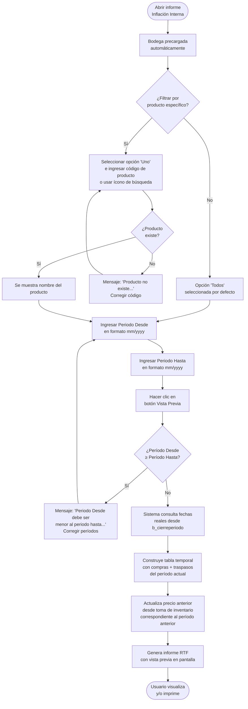

# Inflación Interna

**Formulario:** `I_FicSto.frm` (modo `InfInt`)
**Función principal:** `I_InflacionInterna` en `Informes.bas`
**Tabla(s) principal(es):** `b_totcompras` / `b_detcompras` (facturas y guías de proveedor), `b_totventas` / `b_detventas` (traspasos entre bodegas), `b_tomainv` (toma de inventario con PMP cierre de período), `b_cierreperiodo` (fechas reales de inicio y término de cada período)
**Consulta principal:** Consultas directas (sin stored procedure)

---

## Índice

- [1 — ¿Para qué sirve esta pantalla?](#1--para-qué-sirve-esta-pantalla)
- [2 — ¿Qué necesito para usarla?](#2--qué-necesito-para-usarla)
- [3 — ¿Cómo se usa?](#3--cómo-se-usa)
  - [3.1 Flujo paso a paso](#31-flujo-paso-a-paso)
  - [3.2 Controles y acciones disponibles](#32-controles-y-acciones-disponibles)
- [4 — ¿Qué restricciones debo conocer?](#4--qué-restricciones-debo-conocer)
  - [4.1 Validaciones del sistema](#41-validaciones-del-sistema)
  - [4.2 Reglas de cálculo](#42-reglas-de-cálculo)
- [5 — ¿Qué obtengo?](#5--qué-obtengo)
- [6 — Referencia técnica](#6--referencia-técnica)
  - [Tablas que intervienen](#tablas-que-intervienen)
  - [Relación con otros módulos](#relación-con-otros-módulos)

---

## 1 — ¿Para qué sirve esta pantalla?

[↑ Volver al índice](#índice)

Este informe compara el costo de los insumos entre dos períodos distintos (expresados en mes/año) para medir cuánto variaron los precios dentro del casino. La variación se denomina **"inflación interna"** porque refleja el cambio en el costo promedio ponderado (PMP) de los productos comprados o recibidos por traspaso, sin depender de índices externos.

En términos prácticos, el informe responde preguntas como:
- ¿Cuánto más (o menos) estoy pagando por los mismos insumos respecto al período anterior?
- ¿Qué productos concentran el mayor incremento de costo?
- ¿Cuál es el impacto total en pesos de esa variación sobre el volumen comprado?

El informe toma como precio de referencia del **período anterior** el PMP registrado en la toma de inventario de cierre de ese mes. El precio del **período actual** se calcula como el promedio de los precios unitarios reales de todas las facturas/guías y traspasos recibidos dentro del período, ajustado por impuestos recuperables cuando corresponde.

---

## 2 — ¿Qué necesito para usarla?

[↑ Volver al índice](#índice)

- Tener al menos **dos períodos distintos** con movimientos registrados en el casino activo. No es posible comparar un período consigo mismo.
- Que el período anterior tenga un **cierre de inventario consolidado** (`b_cierreperiodo`) con sus fechas de inicio y término, ya que esas fechas delimitan exactamente qué compras y traspasos se incluyen.
- Los períodos se ingresan en formato **mes/año** (`mm/yyyy`). No se ingresa una fecha exacta.
- No se requiere ningún permiso especial adicional al acceso normal al módulo de informes.
- La bodega se precarga automáticamente con la bodega del casino activo y no puede modificarse.

---

## 3 — ¿Cómo se usa?

[↑ Volver al índice](#índice)

### 3.1 Flujo paso a paso



### 3.2 Controles y acciones disponibles

[↑ Volver al índice](#índice)

| Control | Tipo | Descripción |
|---|---|---|
| **Bodega** | Lista (deshabilitada) | Muestra la bodega del casino activo. No se puede cambiar. |
| **Todos** | Opción de radio | Incluye todos los productos en el informe. Seleccionada por defecto. |
| **Uno** | Opción de radio | Habilita el campo de código de producto para filtrar un producto específico. |
| **Código de producto** | Campo de texto | Activo solo cuando se selecciona "Uno". Se puede ingresar el código manualmente o usar el ícono de búsqueda. |
| **Ícono de búsqueda** | Botón | Abre la pantalla de búsqueda de productos. Solo activo cuando se selecciona "Uno". |
| **Nombre del producto** | Etiqueta informativa | Muestra el nombre del producto encontrado. Se actualiza al salir del campo de código. |
| **Periodo Desde** | Campo fecha (`mm/yyyy`) | Mes y año del período base (el más antiguo). Se inicializa con el mes actual. |
| **Periodo Hasta** | Campo fecha (`mm/yyyy`) | Mes y año del período a comparar (el más reciente). Se inicializa con el mes actual. |
| **Vista Previa** (barra de herramientas) | Botón (Index=1) | Ejecuta las validaciones y genera el informe. |
| **Salir** (barra de herramientas) | Botón (Index=3) | Cierra el formulario sin generar el informe. |

---

## 4 — ¿Qué restricciones debo conocer?

[↑ Volver al índice](#índice)

### 4.1 Validaciones del sistema

| # | Condición que genera error | Mensaje | Acción requerida |
|---|---|---|---|
| 1 | El período desde es mayor o igual al período hasta (comparación en formato `yyyymm`) | "Periodo Desde debe ser menor al periodo hasta..." | Ingresar un período desde que sea cronológicamente anterior al período hasta. |
| 2 | El código de producto ingresado no existe en la tabla `b_productos` | "Producto no existe..." | Corregir el código o usar el ícono de búsqueda para seleccionar un producto válido. |

> **Importante:** Aunque los campos de período se inicializan con el mes actual, al hacer clic en Vista Previa ambos períodos tendrán el mismo valor. Eso activa la validación 1 (son iguales en `yyyymm`). Se deben ingresar dos períodos distintos antes de generar el informe.

### 4.2 Reglas de cálculo

[↑ Volver al índice](#índice)

1. **Delimitación temporal real:** Los períodos ingresados se convierten a fechas exactas consultando `b_cierreperiodo`. Si existe un registro de cierre para el período, se usan las fechas `cie_fecini` y `cie_fecter` registradas. Si no existe registro de cierre, el sistema usa por defecto el primer y último día del mes calendario.

2. **Precio del período actual (`preact`):** Se calcula como el promedio de los precios unitarios de recepción (`dec_prerec`) de todas las facturas y guías de proveedor recibidas en la bodega durante el período actual, excluyendo documentos de tipo "Sin Número" (`tdo_IdCodigo = 'SN'`). Solo se consideran líneas con `dec_mueinv = 'S'` (que mueven inventario) y cantidad recibida mayor a cero.

3. **Ajuste por impuestos recuperables:** Si un impuesto está marcado como `imp_inccos = 1` en `a_impuesto`, su monto proporcional se suma al precio unitario del producto (`preact = preact + imd_monimp / cantidad`). Esto asegura que el costo refleje el costo real de adquisición neto para el casino.

4. **Inclusión de traspasos:** Además de las compras a proveedor, se incluyen como fuente de precio del período actual los traspasos de entrada (`tov_tipdoc = 'TR'`) en estado diferente a "Anulado" (`A`) o "Pendiente" (`P`), usando el precio del documento (`dev_predoc`).

5. **Precio del período anterior (`preant`):** Se obtiene desde `b_tomainv` usando el PMP de la toma de inventario cuya fecha de toma (`tin_fectom`) coincide con el último día del período anterior (`cie_fecter`). Solo se considera si `tin_ciemes <> 0` (es decir, si la toma corresponde a un cierre de mes).

6. **Fórmula de inflación por producto:**
   ```
   Inflación (%) = ((preact × cantidad) - (preant × cantidad)) / (preant × cantidad) × 100
   ```
   Si el valor total del período anterior es cero, la inflación se muestra como `0 %`.

7. **Fórmula de inflación total (pie del informe):**
   ```
   Inflación Total (%) = ((Σ preact×cantidad) - (Σ preant×cantidad)) / (Σ preant×cantidad) × 100
   ```

---

## 5 — ¿Qué obtengo?

[↑ Volver al índice](#índice)

El informe se genera como un archivo **RTF con orientación vertical (Portrait)** que se muestra en pantalla con vista previa antes de imprimir.

### Encabezado del informe

El informe muestra en su parte superior:

| Campo | Contenido |
|---|---|
| Contrato | Código y nombre del casino activo |
| Periodo | Fecha de término del período anterior seguida de "A" y la fecha de término del período actual (ej.: `31/01/2025 A 28/02/2025`) |
| Producto | Código y nombre del producto filtrado, o "TODOS" si no se filtró |

### Detalle por producto (una fila por producto)

| Columna | Descripción |
|---|---|
| **Código** | Código del producto |
| **Descripción** | Nombre del producto |
| **Compras** | Cantidad total comprada/recibida en el período actual |
| **Unidad** | Unidad de medida abreviada (ej.: KG, LT, UN) |
| **Costo** (período anterior) | PMP del producto al cierre del período anterior |
| **Valor Total** (período anterior) | `PMP anterior × cantidad` |
| **Costo** (período actual) | Promedio de precios de recepción del período actual |
| **Valor Total** (período actual) | `Costo actual × cantidad` |
| **Inflación** | Variación porcentual entre ambos valores totales |

### Totales generales (pie del informe)

| Campo | Descripción |
|---|---|
| **Total General — Valor Total anterior** | Suma de todos los valores totales del período anterior |
| **Total General — Valor Total actual** | Suma de todos los valores totales del período actual |
| **Total General — Inflación** | Variación porcentual total entre ambos períodos |

> Los productos que no tienen precio anterior registrado (PMP = 0 en la toma de inventario) no contribuyen al denominador del porcentaje de inflación y su variación individual se muestra como `0 %`.

---

## 6 — Referencia técnica

[↑ Volver al índice](#índice)

### Tablas que intervienen

| Tabla | Rol en este informe | Columnas clave |
|---|---|---|
| `b_cierreperiodo` | Determina las fechas exactas de inicio (`cie_fecini`) y término (`cie_fecter`) de cada período mensual. PK: `cie_cencos` + `cie_periodo`. | `cie_cencos`, `cie_periodo`, `cie_fecini`, `cie_fecter`, `cie_estado` |
| `b_totcompras` | Encabezado de facturas/guías de proveedor. Se filtra por bodega (`toc_codbod`) y por fecha de recepción (`toc_fecrem`) dentro del período actual. Se excluyen documentos tipo "SN". | `toc_rutpro`, `toc_tipdoc`, `toc_numdoc`, `toc_codbod`, `toc_fecrem` |
| `b_detcompras` | Líneas de detalle de las facturas. Aporta el precio de recepción (`dec_prerec`) y la cantidad (`dec_canrec`). Solo líneas con `dec_mueinv = 'S'` y `dec_canrec > 0`. | `dec_rutpro`, `dec_tipdoc`, `dec_numdoc`, `dec_codmer`, `dec_canrec`, `dec_prerec`, `dec_mueinv` |
| `b_detcomprasimp` | Detalle de impuestos por línea de compra. Los impuestos con `imp_inccos = 1` se suman al precio de costo. | `imd_rutdoc`, `imd_tipdoc`, `imd_numdoc`, `imd_numlin`, `imd_codpro`, `imd_codimp`, `imd_monimp` |
| `a_impuesto` | Maestro de impuestos. La columna `imp_inccos = 1` identifica impuestos que deben incluirse en el costo del producto. | `imp_codigo`, `imp_inccos` |
| `a_tipodocumento` | Maestro de tipos de documento. Se usa para excluir los documentos cuyo `tdo_IdCodigo = 'SN'` (Sin Número, es decir, documentos no facturados). | `tdo_codigo`, `tdo_IdCodigo` |
| `b_totventas` | Encabezado de documentos de salida/traspaso. Se filtra por tipo `TR` (traspaso) y bodega destino (`tov_codbod`), excluyendo estados `A` (anulado) y `P` (pendiente). | `tov_rutcli`, `tov_tipdoc`, `tov_numdoc`, `tov_codbod`, `tov_fecemi`, `tov_estdoc` |
| `b_detventas` | Líneas de detalle de traspasos. Aporta el precio del documento (`dev_predoc`) y la cantidad trasladada (`dev_canmer`). Solo líneas con `dev_mueinv = 'S'`. | `dev_rutcli`, `dev_tipdoc`, `dev_numdoc`, `dev_codmer`, `dev_canmer`, `dev_predoc`, `dev_mueinv` |
| `b_tomainv` | Toma de inventario. Aporta el PMP de cierre del período anterior (`tin_propon`), buscado por bodega (`tin_codbod`) y fecha de toma exacta (`tin_fectom` = último día del período anterior). Solo registros con `tin_ciemes <> 0`. | `tin_fectom`, `tin_codbod`, `tin_codpro`, `tin_propon`, `tin_ciemes` |
| `b_productos` | Maestro de productos. Aporta nombre (`pro_nombre`) y unidad de medida (`pro_coduni`). Se usa para validar que el producto ingresado existe, y para poblar la tabla temporal. | `pro_codigo`, `pro_nombre`, `pro_coduni` |
| `a_unidad` | Maestro de unidades de medida. Aporta el nombre corto (`uni_nomcor`) para mostrarlo en la columna "Unidad" del informe. | `uni_codigo`, `uni_nomcor` |

**Tabla temporal en SQL Server:** Durante la ejecución se crea y utiliza una tabla temporal de nombre dinámico con el patrón `<usuario>_tmp_InflacionInterna`. Esta tabla se verifica y limpia antes de cada ejecución mediante la función `fg_CheckTmp`. Contiene columnas: `toc_rutpro`, `toc_tipdoc`, `toc_numdoc`, `pro_codigo`, `pro_nombre`, `pro_coduni`, `preact`, `preant`, `cantidad`.

### Relación con otros módulos

[↑ Volver al índice](#índice)

| Módulo | Relación |
|---|---|
| **Inventario — Ingreso de facturas** | Las compras a proveedor registradas en `b_totcompras` / `b_detcompras` son la fuente principal del precio actual. Sin facturas ingresadas en el período, el informe no tiene datos de costo actual. |
| **Inventario — Traspasos** | Los traspasos entre bodegas (`tov_tipdoc = 'TR'`) también alimentan el precio actual, lo que permite comparar incluso en períodos sin compras directas. |
| **Cierre de período** | El proceso de cierre mensual genera el registro en `b_cierreperiodo` (fechas exactas) y en `b_tomainv` (PMP de cierre). Ambas tablas son indispensables para que el informe pueda calcular el precio anterior. Sin cierre realizado del período anterior, el informe usará fechas del mes calendario y PMP igual a cero. |
| **Maestros (Contrato/SAP)** | Los productos (`b_productos`), unidades (`a_unidad`) e impuestos (`a_impuesto`) son administrados fuera del módulo de Producción/Inventario, en los módulos de Contrato o parámetros generales. |

---

*Fuentes: `I_FicSto.frm`, función `I_InflacionInterna` en `Informes.bas`, tablas `b_totcompras`, `b_detcompras`, `b_detcomprasimp`, `b_totventas`, `b_detventas`, `b_tomainv`, `b_cierreperiodo`, `b_productos`, `a_unidad`, `a_impuesto`, `a_tipodocumento` en `SGP_Local.sql`*
