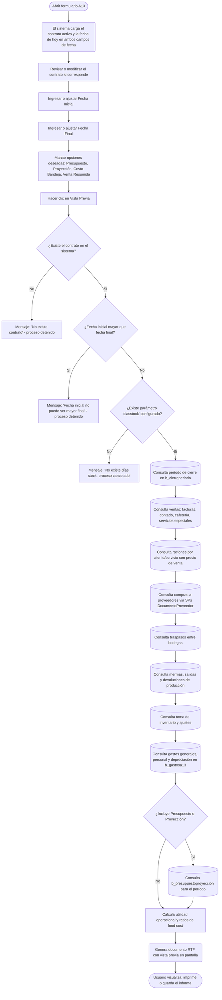

# Resultado Operacional Mensual (A13)

**Formulario:** `I_A13.frm`
**Tabla(s) principal(es):** `b_minutaraciones` (raciones vendidas por cliente/servicio), `b_totventas` / `b_detventas` (movimientos de inventario), `b_totcompras` / `b_detcompras` (compras a proveedores), `b_tomainv` (toma de inventario físico), `b_gastosa13` (gastos ingresados manualmente: personal, depreciación, gastos generales), `b_presupuestoproyeccion` (cifras de presupuesto y proyección por línea)
**Consultas principales:** `sgp_Sel_DocumentoProveedorA13`, `sgp_Sel_DocumentoProveedorImpuestoA13`, `sgp_Sel_DocumentoProveedorGastosGeneralA13`, `sgp_Sel_DocumentoProveedorImpuestoGastosGeneralA13`, `sgp_Sel_TraspasoEntradaSalidaA13`, `sgp_Sel_TraspasoEntradaCostoLogisticoA13`, `sgp_Sel_SalidaDevolucionVentaservicioEspecialesA13`, `sgp_Sel_TotalVentaServiciosEspecialesA13` — además de consultas directas al servidor para ventas, raciones, mermas, ajustes e inventario.

---

## Índice

- [1 — ¿Para qué sirve esta pantalla?](#1--para-qué-sirve-esta-pantalla)
- [2 — ¿Qué necesito para usarla?](#2--qué-necesito-para-usarla)
- [3 — ¿Cómo se usa?](#3--cómo-se-usa)
  - [3.1 Flujo paso a paso](#31-flujo-paso-a-paso)
  - [3.2 Controles y acciones disponibles](#32-controles-y-acciones-disponibles)
- [4 — ¿Qué restricciones debo conocer?](#4--qué-restricciones-debo-conocer)
  - [4.1 Validaciones del sistema](#41-validaciones-del-sistema)
  - [4.2 Reglas de cálculo](#42-reglas-de-cálculo)
- [5 — ¿Qué obtengo?](#5--qué-obtengo)
- [6 — Referencia técnica](#6--referencia-técnica)
  - [Tablas que intervienen](#tablas-que-intervienen)
  - [Relación con otros módulos](#relación-con-otros-módulos)

---

## 1 — ¿Para qué sirve esta pantalla?
[↑ Volver al índice](#índice)

Esta pantalla genera el **Estado de Resultado Operacional Mensual**, conocido internamente como "A13". Es el informe financiero-operativo más completo del casino: consolida en un solo documento las ventas del período, todos los costos de insumos (alimentos y desechables/limpieza), los gastos generales, el costo de personal, la depreciación y la utilidad operacional. Permite conocer de un vistazo si el casino operó con ganancia o pérdida durante el rango de fechas consultado, y en qué proporción se incurrieron los distintos costos respecto a las ventas totales.

El informe se estructura en dos grandes zonas. La parte izquierda presenta un bloque de ventas detallado por tipo (ventas al contado, ventas facturas, ventas cafetería, ventas servicios especiales, raciones por régimen y servicio con precio unitario). Junto a ello, la parte derecha desglosa los insumos con sus líneas de inventario inicial, compras centralizadas, compras FOFI, compras no estoqueable, traspasos recibidos y emitidos, mermas, salidas y devoluciones de producción, ajustes y toma de inventario; cada línea separada por columna de alimentos y columna de desechables/limpieza, con su porcentaje sobre ventas. Debajo aparecen las ratios de food cost, el resumen de gastos generales, costo de personal, depreciación y la utilidad operacional final.

El informe aplica al casino actualmente conectado (el contrato del campo "Contrato" determina el alcance) y puede opcionalmente incluir una comparativa con presupuesto y/o proyección si esos datos han sido cargados previamente en el sistema. También existe una variante para operaciones en Colombia (`I_RA13Colombia`) que se activa automáticamente según el país configurado en la instalación.

---

## 2 — ¿Qué necesito para usarla?
[↑ Volver al índice](#índice)

| Campo | Descripción | Obligatorio |
|---|---|---|
| Contrato | Código del contrato (casino) para el cual se genera el A13. Al abrir el formulario, el sistema carga automáticamente el contrato del casino activo. El campo puede editarse si el usuario tiene perfil de administrador multi-casino, y también es posible buscar mediante el ícono lupa. | Sí |
| Fecha Inicial | Primer día del rango a analizar. Formato dd/mm/aaaa. Por defecto se carga la fecha actual. | Sí |
| Fecha Final | Último día del rango a analizar. Debe ser mayor o igual a la fecha inicial. | Sí |
| Incluye Presupuesto | Casilla de verificación. Si está marcada, el informe agrega columnas de presupuesto y porcentaje de cumplimiento para cada línea del estado de resultado. Solo aplica si existe un período de cierre que contenga el rango de fechas. | No |
| Incluye Proyección | Casilla de verificación. Si está marcada, el informe agrega columnas de proyección. Se puede marcar junto con "Incluye Presupuesto" para ver ambas comparativas simultáneamente. Solo aplica si existe un período de cierre vigente. | No |
| Incluye Costo Bandeja | Casilla de verificación. Si está marcada, el sistema calcula y despliega un detalle adicional del costo por bandeja (planificado versus realizado), usando los datos de minuta y precio de venta. | No |
| Incluye Venta Resumida x Servicio | Casilla de verificación. Si está marcada, las raciones se presentan agrupadas por servicio (sin mostrar el cliente ni el precio unitario individual), mostrando únicamente la cantidad total de raciones por servicio. Si está desmarcada, el detalle se muestra cliente por cliente con cantidad y precio de venta. | No |

> **Nota sobre días stock:** El sistema también requiere que el parámetro `diasstock` esté configurado en la tabla de parámetros del casino. Si no existe, el proceso se cancela con un mensaje de error antes de generar el informe.

---

## 3 — ¿Cómo se usa?
[↑ Volver al índice](#índice)

### 3.1 Flujo paso a paso
[↑ Volver al índice](#índice)

### 3.2 Controles y acciones disponibles
[↑ Volver al índice](#índice)

| Control / Acción | Descripción |
|---|---|
| Campo Contrato (con etiqueta "Contrato") | Ingrese el código del contrato manualmente o use el ícono lupa para buscarlo en el listado de contratos activos. Al salir del campo, el sistema muestra el nombre del contrato junto al código. |
| Ícono lupa (junto al campo Contrato) | Abre un buscador emergente (`B_TabEst`) filtrado por la tabla de clientes. Permite seleccionar el contrato sin escribir el código. También puede presionar F9 mientras el cursor está en el campo Contrato para activarlo. |
| Campo Fecha Inicial | Seleccione la fecha de inicio del período. Use el calendario desplegable o escríbala en formato dd/mm/aaaa. |
| Campo Fecha Final | Seleccione la fecha de término. Use el calendario desplegable o escríbala. |
| Casilla "Incluye Presupuesto" | Marque para que el informe incluya la columna de presupuesto y el porcentaje de cumplimiento frente a cada línea. Requiere que existan datos en la tabla de presupuesto para el período. |
| Casilla "Incluye Proyección" | Marque para incluir la columna de proyección. Puede usarse junto con "Incluye Presupuesto". |
| Casilla "Incluye Costo Bandeja" | Marque para agregar al informe una sección con el costo planificado versus realizado por bandeja de producción. |
| Casilla "Incluye Venta Resumida x Servicio" | Marque para agrupar las raciones por servicio (sin detalle por cliente ni precio unitario). Útil cuando el objetivo es ver el volumen de raciones sin el desglose comercial. |
| Botón "Vista Previa" (barra de herramientas) | Ejecuta el proceso completo: valida los parámetros, consulta la base de datos y genera el informe en formato RTF con vista previa en pantalla. Solo está disponible si el perfil del usuario tiene habilitado el permiso de impresión. |
| Botón "Salir" (barra de herramientas) | Cierra el formulario sin generar el informe. |

---

## 4 — ¿Qué restricciones debo conocer?
[↑ Volver al índice](#índice)

### 4.1 Validaciones del sistema
[↑ Volver al índice](#índice)

| # | Cuándo aparece | Qué verifica el sistema | Qué ve o experimenta el usuario |
|---|---|---|---|
| 1 | Al hacer clic en Vista Previa | El código de contrato ingresado debe existir en la tabla de contratos (`b_clientes`) | Mensaje: `"No existe contrato"` — el proceso se cancela y debe corregir el código. |
| 2 | Al hacer clic en Vista Previa | La fecha inicial debe ser menor o igual a la fecha final | Mensaje: `"Fecha inicial no puede ser mayor final"` — el proceso se cancela. |
| 3 | Durante la generación del informe | El parámetro `diasstock` debe estar configurado para el casino | Mensaje: `"No existe días stock, proceso cancelado"` — el informe no se genera. El parámetro debe ser configurado por un administrador. |
| 4 | Al ingresar manualmente el contrato (salir del campo) | Si escribe un código inexistente, el campo de nombre queda en blanco; al intentar generar, se dispara la validación 1. | El campo de descripción del contrato aparece vacío como indicador visual. |

### 4.2 Reglas de cálculo
[↑ Volver al índice](#índice)

Las siguientes reglas aplican a nivel del formulario principal, independientemente de las opciones marcadas:

**Período de cierre:** El sistema busca en `b_cierreperiodo` un registro cuya fecha de inicio sea menor o igual a la fecha inicial ingresada y cuya fecha de término sea mayor o igual a la fecha final. Este "período" determina el mes al que corresponde el informe y afecta el cálculo del corte de ventas (raciones facturadas según el día de cierre de cada cliente).

**Corte de ventas por raciones:** Cuando existe un período de cierre, el sistema ajusta automáticamente el rango de fechas de las raciones para respetar el día de cierre contractual de cada cliente (`cli_ciedia`). Las raciones se toman desde el día siguiente al cierre del mes anterior hasta el día de cierre del mes en curso (o la fecha final si es menor).

**Clasificación de insumos:** Cada producto se clasifica como "alimento" o "desechable/limpieza" según su cuenta contable (`pro_ctacon`), comparándola con los parámetros `ctainsumo` (alimentos) y `ctalimdes` (desechables) configurados en la tabla `a_param`. Esta clasificación determina en qué columna aparece cada cifra en el informe.

**Tipo de documento de compras:** El sistema normaliza los tipos de documento para el cálculo de costos: FA/FE = Factura, ND/DE = Nota de débito, NC/CE = Nota de crédito (resta), GD = Guía. Las notas de crédito invierten el signo del costo.

**Impuesto recuperable:** Para productos con impuesto recuperable, el sistema calcula adicionalmente el monto del impuesto según el porcentaje registrado en la tabla `a_impuesto` y lo suma al costo de compra. Esto está manejado por los SPs `sgp_Sel_DocumentoProveedorImpuestoA13` y `sgp_Sel_DocumentoProveedorImpuestoGastosGeneralA13`.

---

## 5 — ¿Qué obtengo?
[↑ Volver al índice](#índice)

El resultado es un único informe en formato RTF (archivo de texto enriquecido) que se abre con vista previa en pantalla. El archivo se guarda automáticamente en la carpeta de trabajo con el nombre `A13<contrato><yyyymm>.rtf`. El documento tiene orientación **vertical (portrait)** y utiliza fuente Arial tamaño 7.5 puntos para maximizar la cantidad de información visible en cada página.

El informe se divide en las siguientes secciones, presentadas de arriba hacia abajo:

---

### Encabezado del informe

Incluye el título "Resultados Operacionales Mensual o A13", el nombre y código del contrato, y el rango de fechas del período consultado. Si se encontró un período de cierre, también indica el mes en texto (ej: "Mes: Enero 2025").

---

### Sección VENTAS

Lista todas las fuentes de ingreso del período:

| Línea | Descripción |
|---|---|
| Ventas Servicios Especiales | Total facturado por servicios especiales (eventos, externos). Solo aparece si el monto es mayor que cero. |
| Ventas al contado | Total de guías de despacho (tipo GD) y facturas/boletas del período. |
| Ventas por servicio (contado) | Monto por cada servicio de venta al contado registrado en `b_ventacontado`. |
| Ventas cafetería | Total de ventas de cafetería cerradas en el período. |
| Raciones por régimen y servicio | Detalle de raciones vendidas: se agrupa por régimen (ej: "Casino", "Dieta") y dentro de cada uno, por servicio (ej: "Almuerzo"). Si "Incluye Venta Resumida x Servicio" está desmarcada, muestra el cliente, la cantidad de raciones y el precio de venta; si está marcada, solo muestra el nombre del servicio y la cantidad total. |
| **Total** | Suma de todas las ventas. Es la base sobre la que se calculan todos los porcentajes del informe. |

---

### Sección INSUMOS

Tabla con columnas: `Descripción | Alimentos | Lim.-Des. | TOTAL | %`

| Campo / Columna | Descripción | Calculado |
|---|---|---|
| Inventario Inicial | Costo del stock físico registrado en la toma de inventario más reciente anterior al período, separado por alimentos y desechables. | No (tomado de `b_tomainv`) |
| Centralización Compras | Costo de productos comprados de forma centralizada (tipo "C" o "P" en `b_totcompras.toc_tipinf`) con existencia en bodega (`pro_ctrsto=1`). | No |
| Compras Fofi | Costo de productos comprados con financiamiento FOFI (tipo "F" en `toc_tipinf`). | No |
| Compras No Estoqueable | Costo de insumos adquiridos directamente para uso sin pasar por stock (tipo "C/P/F" con `pro_ctrsto<>1` y documentos distintos de FA/GD/ND/NC). | No |
| Traspasos recibidos | Costo de productos recibidos desde otra bodega (tipo de documento TR, servicio destino = 1). | No |
| Costo Logístico | Costo de flete/logística asociado a los traspasos de entrada (campo `tov_costologistico`). | No |
| Traspasos emitidos | Costo de productos enviados a otra bodega. Se muestra entre paréntesis (resta). | No |
| Traspaso Prod. Term. | Traspasos de productos terminados (mueve_inventario = 'N'). Puede ser positivo o negativo según dirección. | No |
| Mermas | Costo de mermas registradas (documentos tipo ME). Entre paréntesis porque son egresos. | No |
| Salida Producción | Costo de salidas de producción (SP) más costo de salidas de servicios especiales (SE). Entre paréntesis. | No |
| Devolución Producción | Costo de devoluciones de producción (DP) más devoluciones de servicios especiales (DE). Reduce el egreso. | No |
| Ajuste Inventario | Ajustes positivos o negativos al inventario (documentos tipo AI) ocurridos entre tomas de inventario. | No |
| Toma Inventario | Costo del stock físico final registrado en la toma de inventario del último día del período (si existe). | No |
| % (columna) | Porcentaje de cada línea respecto al total de ventas (`tgrval`). | Sí |

**Cálculo — % sobre ventas**

Cada valor en la columna `%` representa la participación de ese componente sobre el total de ventas del período.

**Fórmula o lógica:**
`% = (valor_linea / total_ventas) × 100`

| Componente | Qué representa | De dónde viene |
|---|---|---|
| valor_linea | Monto de alimentos + desechables de esa fila | Calculado según sección |
| total_ventas | Suma de todas las ventas del período (ventas especiales + contado + facturas + cafetería + raciones) | Variable `tgrval` |

> Ejemplo: Si las mermas totales son $1.500.000 y las ventas totales son $25.000.000, el porcentaje de mermas es 6,00%.

---

### Subsección Factores de Costo (F.Cost)

Aparece inmediatamente debajo de la tabla de insumos. Muestra ratios individuales expresados en porcentaje sobre ventas para los componentes más relevantes:

| Ratio | Qué mide |
|---|---|
| F.Cost (Sal. & Dev.) | Porcentaje neto de salidas de producción sobre ventas, después de restar devoluciones. |
| F.Cost (Sal.&Dev. Ser.Esp.) | Igual que el anterior pero solo para servicios especiales. |
| F.Cost (Merm. & Aju.) | Porcentaje de mermas y ajustes de inventario sobre ventas. |
| F.Cost Tras.Prod.Term. | Porcentaje de traspasos de productos terminados sobre ventas. |
| F.Cost C. No Estoq. | Porcentaje de compras no estoqueable sobre ventas. |
| F.Cost Flete Insumo | Porcentaje del costo de flete de insumos sobre ventas. |
| F.Cost Logístico | Porcentaje del costo logístico de traspasos sobre ventas. |
| F.Cost Total | Food Cost total: suma de salidas netas + mermas + ajustes + no estoqueable + flete + logístico, expresado en monto y porcentaje. |
| Totales Nominales | Misma composición que F.Cost Total pero expresada en pesos nominales además del porcentaje. |

---

### Subsección Días Stock

| Dato | Descripción |
|---|---|
| N° de días Trabajados | Cantidad de días del mes del período (calculado automáticamente). |
| N° de días de Stock | Indica cuántos días de operación cubre el inventario actual. **Fórmula:** `(Toma Inventario) / ((Salidas + Mermas - Ajustes) / 90)`, donde el denominador considera los últimos tres meses de movimientos. |

---

### Sección GASTOS GENERALES

Solo aparece si existen gastos generales en el período. Muestra las cuentas contables distintas de alimentos y desechables que tuvieron compras, traspasos o gastos manuales ingresados en `b_gastosa13` (códigos > 8). Columnas: Nombre de cuenta | Código cuenta | Monto | % sobre ventas.

---

### Sección DEPRECIACIÓN

Muestra el valor de depreciación ingresado manualmente para el período en `b_gastosa13` (código de gasto = 1). Incluye monto y porcentaje sobre ventas.

---

### Sección COSTO PERSONAL

Muestra los ítems de personal ingresados en `b_gastosa13` con códigos del 2 al 5 (ej: remuneraciones, cargas, otros costos de personal). Incluye subtotal de costo personal y su porcentaje sobre ventas. Adicionalmente muestra los códigos 6 a 8 (otros ítems de personal) en una tabla separada.

---

### Sección TOTAL DE GASTOS

Suma todos los egresos: mermas + gastos generales + salidas de producción + salidas servicios especiales - ajustes positivos + costo personal + depreciación + compras no estoqueable - devoluciones.

**Cálculo — Total de Gastos**

**Fórmula:**
`Total Gastos = (cmeali + cmedes + ctogas + tosali + TotSalidaAlimentoVtaEspecial + tosdes + TotSalidaDesechableVtaEspecial + (ajuali × −1) + (ajudes × −1) + tocope + totdep + cosans + cosdns) − (todali + TotDevolucionAlimentoVtaEspecial + toddes + TotDevoluciondesechableVtaEspecial + (crenal × −1) + (cennde × −1))`

| Componente | Qué representa |
|---|---|
| cmeali / cmedes | Mermas de alimentos / desechables |
| ctogas | Total gastos generales |
| tosali / tosdes | Salidas de producción alimentos / desechables |
| TotSalida/DevVtaEspecial | Salidas y devoluciones de servicios especiales |
| ajuali × −1 / ajudes × −1 | Ajustes de inventario (invertidos, pues restan costo) |
| tocope | Total costo personal |
| totdep | Depreciación |
| cosans / cosdns | Compras no estoqueable alimentos / desechables |
| todali / toddes | Devoluciones de producción alimentos / desechables |
| crenal × −1 / cennde × −1 | Traspasos de productos terminados invertidos |

---

### Sección UTILIDAD OPERACIONAL

| Dato | Descripción |
|---|---|
| UTILIDAD - OPERACIONAL | Resultado neto del período. **Fórmula:** `Utilidad = Total Ventas − Total Gastos`. Se muestra el monto y el porcentaje sobre ventas. |

---

### Sección de Presupuesto / Proyección (opcional)

Aparece solo si se marcó "Incluye Presupuesto" y/o "Incluye Proyección" y existe un período de cierre vigente. Muestra una tabla comparativa entre el valor real de cada línea del estado de resultado, el valor presupuestado y/o proyectado, y el porcentaje de cumplimiento (`valor_real / valor_presupuesto × 100`). Los datos provienen de `b_presupuestoproyeccion` (tipo `'1'` = presupuesto, tipo `'2'` = proyección). El sistema también exporta esta comparativa a un archivo de texto en la subcarpeta `Presupuesto-Proyeccion` de la carpeta de trabajo.

---

### Sección Costo Bandeja (opcional)

Aparece solo si se marcó "Incluye Costo Bandeja". Detalla el costo planificado versus el costo realizado por bandeja de producción, usando los datos de minuta y precio promedio ponderado de los insumos utilizados.

---

### Estructura del archivo generado

| Característica | Valor |
|---|---|
| Formato | RTF (Rich Text Format) con vista previa en pantalla |
| Orientación | Vertical (portrait) |
| Fuente | Arial, 7.5 puntos |
| Nombre del archivo | `A13<código_contrato><aaaamm>.rtf` |
| Carpeta de destino | Carpeta de trabajo de informes del sistema (`dir_trabajo_Inf`) |
| Archivo complementario | Archivo de texto plano (`.txt`) con los mismos datos tabulados con `|` como separador, generado en paralelo al RTF |

---

## 6 — Referencia técnica
[↑ Volver al índice](#índice)

### Tablas que intervienen
[↑ Volver al índice](#índice)

| Tabla | Para qué se usa en este reporte | Campos clave |
|---|---|---|
| `b_clientes` | Validar existencia del contrato; obtener el nombre del casino, día de cierre de ventas (`cli_ciedia`) y tipo de cierre (`cli_cievta`). | `cli_codigo`, `cli_nombre`, `cli_ciedia`, `cli_cievta`, `cli_tipo`, `cli_activo` |
| `b_cierreperiodo` | Determinar el período contable (mes de cierre) que contiene el rango de fechas ingresado. | `cie_cencos`, `cie_periodo`, `cie_fecini`, `cie_fecter` |
| `b_minutaraciones` | Obtener las raciones vendidas por cliente, régimen y servicio para el período. | `mir_cencos`, `mir_rutcli`, `mir_codreg`, `mir_codser`, `mir_fecmin`, `mir_nrorac`, `mir_nroguia` |
| `b_preciovta` | Precio de venta vigente por cliente, régimen y servicio, para calcular el valor de las raciones. | `prv_rutcli`, `prv_codser`, `prv_codreg`, `prv_cencos`, `prv_fecvig`, `prv_preven` |
| `b_totventas` / `b_detventas` | Movimientos de inventario: facturas, mermas (ME), salidas (SP), devoluciones (DP), traspasos (TR), ajustes (AI). | `tov_tipdoc`, `tov_codbod`, `tov_fecemi`, `tov_fecpro`, `tov_estdoc`, `dev_codmer`, `dev_canmer`, `dev_precos`, `dev_ptotal` |
| `b_totcompras` / `b_detcompras` | Compras a proveedores por período: costo, tipo de documento, cuenta contable, tipo de informe (C/F/P). | `toc_tipinf`, `toc_tipdoc`, `toc_codbod`, `toc_fecrem`, `dec_codmer`, `dec_precom`, `dec_canrec`, `dec_pctdes`, `dec_prefle` |
| `b_totventascaf` / `b_detventascaf` | Ventas de cafetería cerradas en el período. | `tvc_cencos`, `tvc_fecing`, `tvc_estado`, `tvc_codbod`, `dvc_precio`, `dvc_canart` |
| `b_detventascafpro` | Costo de insumos de cafetería (para sumar a salidas de producción). | `dvp_cencos`, `dvp_fecing`, `dvp_codmer`, `dvp_precos`, `dvp_candig` |
| `b_ventacontado` | Ventas al contado por servicio. | `vtc_cencos`, `vtc_codser`, `vtc_fecvta`, `vtc_totmon` |
| `b_totventaserviciosespeciales` / `b_detventaserviciosespeciales` | Ventas, salidas y devoluciones de servicios especiales. | `tos_IdCeco`, `tos_tipo_documento`, `tos_fecha_produccion`, `tos_Comensales`, `tos_Precio_servicio`, `des_Total_Documento` |
| `b_tomainv` | Toma de inventario físico para obtener inventario inicial y final del período. | `tin_codbod`, `tin_fectom`, `tin_codpro`, `tin_stofis`, `tin_propon`, `tin_ciemes` |
| `b_productos` | Clasificar cada producto por su cuenta contable (alimento o desechable) y control de stock. | `pro_codigo`, `pro_ctacon`, `pro_ctrsto` |
| `b_gastosa13` | Gastos ingresados manualmente: depreciación (código 1), personal (códigos 2-5), otros (6-8), gastos generales (>8). | `gas_cencos`, `gas_anomes`, `gas_codigo`, `gas_descri`, `gas_valor`, `gas_ctacon`, `gas_orden` |
| `b_presupuestoproyeccion` | Cifras de presupuesto (tipo '1') y proyección (tipo '2') para el período. | `ppr_cencos`, `ppr_anomes`, `ppr_tipo`, `ppr_codigo`, `ppr_descripcion`, `ppr_valor` |
| `a_param` | Parámetros del casino: cuentas contables de alimentos (`ctainsumo`), desechables (`ctalimdes`), fletes (`ctafleins`), gastos (`ctagastos`, `ctagastos2`), días de stock (`diasstock`). | `par_cencos`, `par_codigo`, `par_valor` |
| `a_regimen` | Nombre del régimen para presentar en el detalle de raciones. | `reg_codigo`, `reg_nombre` |
| `a_servicio` | Nombre del servicio para presentar en el detalle de raciones y ventas contado. | `ser_codigo`, `ser_nombre` |
| `a_ctacontable` | Nombre de la cuenta contable para presentar gastos generales por cuenta. | `cta_codigo`, `cta_nombre` |
| `a_tipoajuste` | Tipo de ajuste de inventario (A = aumento, D = disminución). | `aju_codigo`, `aju_tipo` |
| `r<usuario>_tmpfactA13` | Tabla temporal creada durante la ejecución para consolidar las raciones con su precio de venta antes de calcular el total. Se elimina al finalizar cada ejecución. | `mir_cencos`, `mir_rutcli`, `mir_codreg`, `mir_codser`, `mir_fecmin`, `mir_nrorac`, `prv_fecvig` |

### Relación con otros módulos
[↑ Volver al índice](#índice)

| Módulo | Relación |
|---|---|
| Módulo de Inventario — Compras a proveedor | Los documentos de compra (facturas, notas de crédito/débito, guías) generados en ese módulo son la fuente de los costos de centralización, FOFI y no estoqueable. |
| Módulo de Inventario — Traspasos entre bodegas | Los traspasos (recibidos y emitidos) entre bodegas impactan directamente las líneas de insumo del A13. |
| Módulo de Producción — Mermas y salidas | Las mermas de preparación y las salidas/devoluciones de producción alimentan las líneas de food cost del informe. |
| Módulo de Inventario — Toma de inventario | El inventario inicial y final provienen de las tomas de inventario físicas registradas por bodega. |
| Módulo de Ventas — Raciones y cierre | Las raciones vendidas y el día de cierre contractual determinan qué raciones se incluyen en el período del A13. |
| Módulo de Cafetería | Las ventas de cafetería cerradas se suman a las ventas totales y su costo de insumos a las salidas de producción. |
| Módulo de Servicios Especiales | Ventas, salidas y devoluciones de servicios especiales (eventos) se consolidan como fuente de ingresos y costos en el A13. |
| Mantenedor Gastos A13 (M_GasA13 / M_CoGA13) | Los formularios de mantención de gastos permiten ingresar manualmente los valores de depreciación, personal y gastos generales que alimentan la tabla `b_gastosa13` y aparecen en el A13. |
| Mantenedor Presupuesto/Proyección | Formulario donde se ingresan las cifras de presupuesto y proyección que se comparan en el informe cuando se marcan las casillas correspondientes. |
| Cierre de período | El módulo de cierre genera el registro en `b_cierreperiodo` que el A13 utiliza para determinar el mes contable y el corte de ventas. |

---

*Fuentes: `I_A13.frm`, función `I_RA13` en `Informes.bas`, función `I_RA13B` en `Informes.bas`, SPs `sgp_Sel_DocumentoProveedorA13`, `sgp_Sel_DocumentoProveedorImpuestoA13`, `sgp_Sel_DocumentoProveedorGastosGeneralA13`, `sgp_Sel_DocumentoProveedorImpuestoGastosGeneralA13`, `sgp_Sel_TraspasoEntradaSalidaA13`, `sgp_Sel_TraspasoEntradaCostoLogisticoA13`, `sgp_Sel_SalidaDevolucionVentaservicioEspecialesA13`, `sgp_Sel_TotalVentaServiciosEspecialesA13` en `SGP_Local.sql`, tablas `b_minutaraciones`, `b_totventas`, `b_detventas`, `b_totcompras`, `b_detcompras`, `b_tomainv`, `b_gastosa13`, `b_presupuestoproyeccion` en `SGP_Local.sql`*
