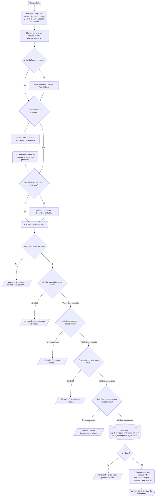

# Informe de Compras por Periodo

**Formulario:** `I_ComPer.frm`
**Tabla(s) principal(es):** `b_totcompras` (cabecera de documentos de compra registrados en bodega)
**Consulta principal:** `sgp_Sel_ResumenComprasxPeriodo`

---

## Índice

- [1 — ¿Para qué sirve esta pantalla?](#1--para-qué-sirve-esta-pantalla)
- [2 — ¿Qué necesito para usarla?](#2--qué-necesito-para-usarla)
- [3 — ¿Cómo se usa?](#3--cómo-se-usa)
  - [3.1 Flujo paso a paso](#31-flujo-paso-a-paso)
  - [3.2 Controles y acciones disponibles](#32-controles-y-acciones-disponibles)
- [4 — ¿Qué restricciones debo conocer?](#4--qué-restricciones-debo-conocer)
  - [4.1 Validaciones del sistema](#41-validaciones-del-sistema)
- [5 — ¿Qué obtengo?](#5--qué-obtengo)
- [6 — Referencia técnica](#6--referencia-técnica)
  - [Tablas que intervienen](#tablas-que-intervienen)
  - [Relación con otros módulos](#relación-con-otros-módulos)

---

## 1 — ¿Para qué sirve esta pantalla?

[↑ Volver al índice](#índice)

Esta pantalla genera un informe resumido de los documentos de compra registrados en el sistema durante un período determinado. El resultado es un documento con vista previa que lista cada documento agrupado por proveedor, mostrando los montos parciales (exento, neto, flete, IVA, otros impuestos) y el total de cada documento, junto con subtotales por proveedor y un total general al final.

La pantalla se organiza en dos áreas principales: un panel de filtros de selección en la parte superior, donde el usuario activa los criterios que desea aplicar marcando las casillas disponibles (fecha, bodega, proveedor y tipo de documento), y un área de paneles subordinados que se habilitan o deshabilitan según las casillas marcadas. Solo los criterios marcados participan en la consulta; si ninguno está activo, el sistema no genera el informe.

El informe no está acotado a un casino específico: consulta los documentos de compra almacenados en la base de datos del casino activo en sesión, filtrando únicamente los tipos de documento configurados como visibles (excluyendo los marcados internamente como "sin nota"). Los valores negativos, propios de notas de crédito y notas de crédito especiales, se muestran entre paréntesis tanto en las columnas de montos como en los subtotales.

---

## 2 — ¿Qué necesito para usarla?

[↑ Volver al índice](#índice)

Al abrir la pantalla, todos los filtros aparecen desactivados. El usuario debe marcar al menos uno antes de poder generar el informe. La lista desplegable de bodegas se carga automáticamente al abrir la pantalla con las bodegas asociadas al contrato activo en sesión.

| Campo | Descripción | Obligatorio |
|---|---|---|
| Casilla **Fecha** | Activa el filtro por rango de fechas de remisión del documento. Al marcarla, habilita los campos "Fecha Desde" y "Fecha Hasta", que se precargan con la fecha del día. | Al menos uno de los cuatro filtros debe estar marcado |
| **Fecha Desde** | Fecha de inicio del rango de búsqueda (formato dd/mm/yyyy). Solo disponible si la casilla Fecha está marcada. | Sí, si la casilla Fecha está marcada |
| **Fecha Hasta** | Fecha de término del rango de búsqueda (formato dd/mm/yyyy). Solo disponible si la casilla Fecha está marcada. | Sí, si la casilla Fecha está marcada |
| Casilla **Bodega** | Activa el filtro por bodega. La lista desplegable correspondiente ya está cargada; al marcar esta casilla el sistema la habilita para selección. Nota: la casilla Bodega aparece siempre marcada y no editable al abrir la pantalla — el sistema la fuerza activa por defecto. | Sí (forzado por defecto) |
| Lista desplegable **Bodega** | Selección de la bodega sobre la que se quiere consultar. Muestra las bodegas asociadas al contrato activo en sesión. | Sí, si la casilla Bodega está marcada |
| Casilla **Proveedor** | Activa el filtro por proveedor. Al marcarla, habilita el campo de RUT y el botón de búsqueda. | Al menos uno de los cuatro filtros debe estar marcado |
| Campo **Rut** del proveedor | RUT del proveedor a filtrar. Puede ingresarse directamente con dígito verificador o buscarse usando el ícono de lupa, que abre un selector de proveedores. Al perder el foco, el sistema valida el RUT y muestra el nombre del proveedor junto al campo. | Sí, si la casilla Proveedor está marcada |
| Casilla **Tipo de Documento** | Activa el filtro por tipo de documento de compra. Al marcarla, habilita la lista desplegable correspondiente. | Al menos uno de los cuatro filtros debe estar marcado |
| Lista desplegable **Documento** | Selección del tipo de documento (por ejemplo: Factura, Nota de Crédito, Nota de Débito, etc.). Solo muestra los tipos configurados como visibles en el catálogo. | Sí, si la casilla Tipo de Documento está marcada |

---

## 3 — ¿Cómo se usa?

### 3.1 Flujo paso a paso

[↑ Volver al índice](#índice)



### 3.2 Controles y acciones disponibles

[↑ Volver al índice](#índice)

| Control / Acción | Descripción |
|---|---|
| **Casilla Fecha** | Activa o desactiva el filtro por rango de fechas. Al activarse, habilita los campos de fecha y los precarga con la fecha del día. Al desactivarse, borra y deshabilita los campos. |
| **Fecha Desde / Fecha Hasta** | Campos de fecha en formato dd/mm/yyyy. Si el usuario escribe una fecha no válida y abandona el campo, el sistema la corrige automáticamente con la fecha del día. |
| **Casilla Bodega** | Aparece siempre marcada y no editable al abrir la pantalla. En la versión actual del formulario, el código de habilitación/deshabilitación de la lista de bodegas está comentado, por lo que esta casilla funciona como indicador informativo pero no activa ni desactiva la lista. |
| **Lista desplegable Bodega** | Muestra las bodegas del contrato activo. Queda deshabilitada al abrir la pantalla (el código de habilitación está comentado); sin embargo, el valor seleccionado se incluye en la consulta cuando la casilla Bodega está marcada. |
| **Casilla Proveedor** | Activa el campo de RUT y el ícono de búsqueda para filtrar por un proveedor específico. Al desactivarse, borra el RUT y el nombre del proveedor. |
| **Campo Rut** | Permite ingresar el RUT del proveedor directamente. Al presionar Enter o al salir del campo, el sistema valida el RUT y muestra el nombre del proveedor en el campo de descripción adyacente. Si el RUT no existe, borra el campo y devuelve el foco al mismo campo. |
| **Ícono de búsqueda (lupa)** | Abre un selector de proveedores donde el usuario puede buscar y seleccionar un proveedor. Al confirmar la selección, el campo RUT y el nombre se completan automáticamente. |
| **Casilla Tipo de Documento** | Activa la lista desplegable de tipos de documento. Al desactivarse, limpia la selección y deshabilita la lista. |
| **Lista desplegable Documento** | Permite elegir el tipo de documento por el que filtrar (factura, nota de crédito, etc.). Solo muestra los tipos marcados como visibles en el catálogo del sistema. |
| **Botón Vista Previa** | Ejecuta las validaciones, lanza la consulta con los filtros activos y abre la ventana de vista previa del informe RTF. Solo disponible si el usuario tiene permiso de impresión configurado para este formulario. |
| **Botón Salir** | Cierra el formulario. |

---

## 4 — ¿Qué restricciones debo conocer?

### 4.1 Validaciones del sistema

[↑ Volver al índice](#índice)

| # | Cuándo aparece | Qué verifica el sistema | Qué ve o experimenta el usuario |
|---|---|---|---|
| 1 | Al hacer clic en Vista Previa sin ninguna casilla marcada | Que al menos un criterio de filtro esté activo | Mensaje: `Seleccione metodo de busqueda...` |
| 2 | Al hacer clic en Vista Previa con la casilla Fecha marcada | Que Fecha Desde sea una fecha válida | Mensaje: `Rango de fechas no valido...` |
| 3 | Al hacer clic en Vista Previa con la casilla Fecha marcada | Que Fecha Hasta sea una fecha válida | Mensaje: `Rango de fechas no valido...` |
| 4 | Al hacer clic en Vista Previa con la casilla Fecha marcada | Que Fecha Desde no sea posterior a Fecha Hasta | Mensaje: `Rango de fechas no valido...` |
| 5 | Al hacer clic en Vista Previa con la casilla Bodega marcada | Que haya una bodega seleccionada en la lista | Mensaje: `Bodega no valida...` |
| 6 | Al hacer clic en Vista Previa con la casilla Proveedor marcada | Que el campo RUT tenga contenido | Mensaje: `Proveedor no valido...` |
| 7 | Al hacer clic en Vista Previa con la casilla Tipo de Documento marcada | Que haya un tipo de documento seleccionado | Mensaje: `Tipo de documento no valido...` |
| 8 | Tras ejecutar la consulta | Que la combinación de filtros devuelva al menos un documento | Mensaje: `No existen datos para la consulta...` El sistema no genera el documento RTF. |
| 9 | Al ingresar un RUT en el campo de proveedor y abandonar el campo | Que el RUT exista en el catálogo de proveedores | Si no existe: borra el campo y devuelve el foco al mismo campo, sin mensaje adicional. |
| 10 | Al abrir el formulario | Que el usuario tenga permiso de impresión para esta pantalla | Si no tiene permiso: el botón Vista Previa aparece deshabilitado. |

---

## 5 — ¿Qué obtengo?

[↑ Volver al índice](#índice)

Este formulario genera un único tipo de informe: un documento con vista previa que muestra el resumen de compras agrupado por proveedor según los filtros aplicados. No existe selector de tipo de informe.

**Qué muestra:** el informe lista todos los documentos de compra que cumplan los criterios seleccionados, ordenados por proveedor, fecha de remisión, tipo de documento y número de documento. Por cada proveedor aparece un bloque de documentos seguido de una línea de subtotal ("Total Proveedor"). Al final del informe se incluye una línea de total general que consolida todos los proveedores.

Los montos correspondientes a notas de crédito (NC) y notas de crédito especiales (CE) se muestran entre paréntesis en cada columna de monto y se restan en los subtotales, de modo que el "Total Proveedor" y el "Total General" reflejan el neto real de compras considerando las devoluciones.

**Estructura de datos del informe:**

| Campo / Columna | Descripción | Calculado |
|---|---|---|
| TD | Código de tipo de documento (ej. FA, NC, ND) | No |
| Doc. Nº | Número del documento de compra | No |
| Proveedor | RUT formateado y nombre (primeros 20 caracteres) del proveedor | No |
| F.Emisión | Fecha de remisión del documento (formato dd/mm/yyyy) | No |
| Exento | Monto exento del documento. Para NC y CE se muestra entre paréntesis | No |
| Neto | Monto neto del documento. Para NC y CE se muestra entre paréntesis | No |
| Flete | Monto de flete del documento. Para NC y CE se muestra entre paréntesis | No |
| I.V.A | Monto de IVA del documento. Para NC y CE se muestra entre paréntesis | No |
| O.Imp. | Otros impuestos del documento | No |
| Total | Monto total del documento. Para NC y CE se muestra entre paréntesis | No |
| **Total Proveedor** (fila de subtotal) | Suma acumulada por proveedor de cada columna de monto, descontando NC y CE | Sí |
| **Total General** (fila final) | Suma de todos los "Total Proveedor" del informe | Sí |

**Cálculo — Total Proveedor**

Fila resumen que aparece al final del bloque de cada proveedor. El sistema acumula los montos de cada documento del proveedor, restando los que corresponden a notas de crédito (NC) o notas de crédito especiales (CE), para reflejar el neto real de compras de ese proveedor en el período.

**Fórmula o lógica:**

Para cada columna de monto (Exento, Neto, Flete, IVA, Otros Imp., Total):

```
Acumulado = Suma de valores de documentos normales − Suma de valores de NC y CE
```

Los documentos NC y CE se identifican por el campo tipo de documento; sus montos se multiplican por −1 antes de sumarlos al acumulado.

| Componente | Qué representa | De dónde viene |
|---|---|---|
| Valor del documento normal | Monto de cada columna para facturas, notas de débito y similares | `b_totcompras.toc_exedoc`, `toc_netdoc`, `toc_fledoc`, `toc_ivadoc`, `toc_otrimp`, `toc_totdoc` |
| Valor del documento NC / CE | Monto de la nota de crédito o crédito especial, que se descuenta | Mismos campos, identificados cuando `toc_tipdoc` = `'NC'` o `'CE'` |

> Ejemplo: si un proveedor tiene una factura por $1.000.000 neto y una nota de crédito por $200.000 neto, la fila "Total Proveedor" en la columna Neto muestra $800.000.

**Cálculo — Total General**

Fila final del informe que suma los subtotales de todos los proveedores para cada columna de monto. Se calcula acumulando los "Total Proveedor" a medida que el sistema recorre el resultado de la consulta.

| Componente | Qué representa | De dónde viene |
|---|---|---|
| Total Proveedor (cada uno) | Subtotal neto de compras por proveedor ya descontadas NC y CE | Calculado en el recorrido del resultado, tal como se describe arriba |

**Formato de salida:** Documento RTF con vista previa. Una sola sección (no hay hojas separadas por servicio). Orientación retrato. Encabezado con logotipo del casino y paginación. El título del informe es "Compras por Período". Debajo del título aparecen las líneas descriptivas de los filtros activos (período consultado, bodega seleccionada, tipo de documento seleccionado). Los datos comienzan con una fila de encabezado de columnas en fondo amarillo y negrita, seguida de los bloques de documentos por proveedor. Una copia del contenido también se graba en un archivo de texto plano separado por barras verticales, en la ruta de reportes configurada en la sesión.

---

## 6 — Referencia técnica

### Tablas que intervienen

[↑ Volver al índice](#índice)

| Tabla | Para qué se usa en este reporte | Campos clave |
|---|---|---|
| `b_totcompras` | Fuente principal. Contiene un registro por cada documento de compra ingresado en el sistema (cabecera). | `toc_rutpro`, `toc_tipdoc`, `toc_numdoc`, `toc_codbod`, `toc_fecrem`, `toc_exedoc`, `toc_netdoc`, `toc_fledoc`, `toc_ivadoc`, `toc_otrimp`, `toc_totdoc` |
| `b_proveedor` | Catálogo de proveedores. Se cruza con `b_totcompras` para obtener el nombre del proveedor a partir de su RUT. | `prv_codigo`, `prv_nombre` |
| `a_tipodocumento` | Catálogo de tipos de documento. Se usa para filtrar solo los tipos visibles (excluye los marcados como "sin nota") y para poblar la lista desplegable de tipo de documento. | `tdo_codigo`, `tdo_nombre`, `tdo_orden`, `tdo_IdCodigo`, `tdo_VisualizaDoc` |
| `a_bodega` | Catálogo de bodegas. Se usa junto con `b_clientes` para cargar la lista desplegable de bodegas disponibles para el contrato activo. | `bod_codigo`, `bod_nombre` |
| `b_clientes` | Tabla de contratos (casinos). Se usa para filtrar las bodegas que pertenecen al contrato activo en sesión. | `cli_codigo`, `cli_codbod` |

### Relación con otros módulos

[↑ Volver al índice](#índice)

| Módulo | Relación |
|---|---|
| **Ingreso de documentos de compra** | Los registros que este informe consulta son creados por el módulo de recepción de documentos de compra, que registra guías, facturas, notas de crédito y otros documentos en `b_totcompras`. Este informe es de solo lectura: no modifica ningún dato. |
| **Catálogo de proveedores** | La búsqueda y validación de proveedores consume el catálogo mantenido en el módulo de administración de proveedores (`b_proveedor`). |
| **Configuración de bodegas** | Las bodegas disponibles en la lista desplegable dependen de la configuración del contrato activo, administrada en el módulo de contratos y bodegas. |
| **Catálogo de tipos de documento** | Los tipos visibles en la lista desplegable son los configurados como activos y visibles en el catálogo de tipos de documento (`a_tipodocumento`), mantenido en el módulo de administración general. |

---

*Fuentes: `I_ComPer.frm`, función `I_ComprasPer` en `InforEG.bas`, SP `sgp_Sel_ResumenComprasxPeriodo` en `SGP_Local.sql`, tablas `b_totcompras`, `b_proveedor`, `a_tipodocumento`, `a_bodega`, `b_clientes` en `SGP_Local.sql`*
