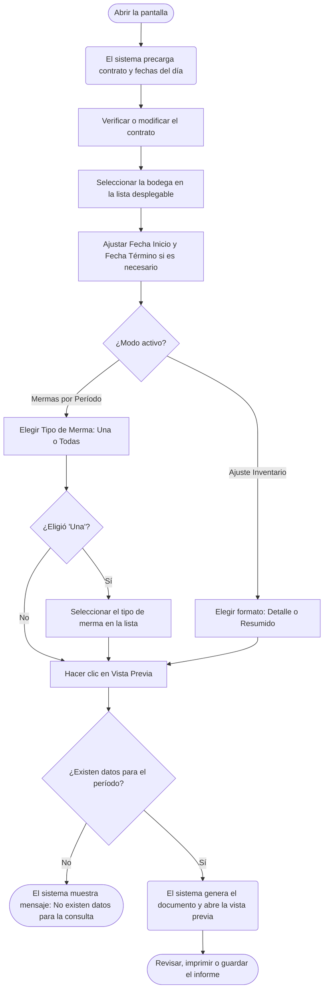

# Informe de Mermas por Período

**Formulario:** `I_MerPed.frm`
**Tablas principales:** `b_totventas` (cabecera de documentos de movimiento) · `b_detventas` (líneas de detalle de cada movimiento) · `a_tipoajuste` (catálogo de tipos de merma y ajuste de inventario)
**Consulta principal:** Sin procedimiento almacenado — consulta directa a las tablas del servidor

---

## Índice

- [1 — ¿Para qué sirve esta pantalla?](#1--para-qué-sirve-esta-pantalla)
- [2 — ¿Qué necesito para usarla?](#2--qué-necesito-para-usarla)
- [3 — ¿Cómo se usa?](#3--cómo-se-usa)
  - [3.1 Flujo paso a paso](#31-flujo-paso-a-paso)
  - [3.2 Controles y acciones disponibles](#32-controles-y-acciones-disponibles)
- [4 — ¿Qué restricciones debo conocer?](#4--qué-restricciones-debo-conocer)
  - [4.1 Validaciones del sistema](#41-validaciones-del-sistema)
  - [4.2 Reglas de cálculo](#42-reglas-de-cálculo)
- [5 — ¿Qué obtengo?](#5--qué-obtengo)
  - [Informe de Mermas por Período](#informe-de-mermas-por-período-1)
  - [Informe Ajuste Inventario](#informe-ajuste-inventario-1)
- [6 — Referencia técnica](#6--referencia-técnica)
  - [Tablas que intervienen](#tablas-que-intervienen)
  - [Relación con otros módulos](#relación-con-otros-módulos)

---

## 1 — ¿Para qué sirve esta pantalla?

[↑ Volver al índice](#índice)

Esta pantalla reutiliza el mismo formulario para dos informes distintos que el sistema activa según el punto de menú desde el que se accede: **Informe de Mermas por Período** e **Informe Ajuste Inventario**. Ambos modos comparten los filtros de contrato, bodega y rango de fechas, pero difieren en el tipo de documento que consultan y en la forma en que presentan sus resultados.

El **Informe de Mermas por Período** consolida todos los registros de merma de una bodega en un tramo de fechas seleccionado. Muestra los productos dados de baja como merma, agrupados por tipo de merma (por ejemplo: merma de producción, desconche, vencimiento), con la cantidad total descartada y el costo asociado a cada grupo. Es el instrumento principal para que el jefe de casino o el coordinador de zona analicen el comportamiento de las pérdidas de inventario en el tiempo.

El **Informe Ajuste Inventario** documenta los movimientos de ajuste de inventario realizados en una bodega durante el período indicado. Muestra los productos ajustados agrupados por familia contable y tipo de producto, con la diferencia de cantidad resultante (positiva si fue aumento, negativa si fue disminución) y el valor total del ajuste. Sirve para trazabilidad contable y para auditar las correcciones de stock efectuadas entre tomas de inventario.

---

## 2 — ¿Qué necesito para usarla?

[↑ Volver al índice](#índice)

| Campo | Descripción | Obligatorio |
|---|---|---|
| Contrato | Código del contrato (casino) sobre el que se desea generar el informe. Se puede escribir directamente o seleccionar con el botón de búsqueda. | Sí |
| Bodega | Lista desplegable con las bodegas asociadas al contrato activo. Se debe seleccionar una bodega específica; no existe opción "todas las bodegas". | Sí |
| Fecha Inicio | Primera fecha del período a consultar, en formato dd/mm/aaaa. Por defecto el sistema precarga la fecha del día. | Sí |
| Fecha Término | Última fecha del período a consultar, en formato dd/mm/aaaa. Por defecto el sistema precarga la fecha del día. | Sí |
| Tipo de Merma | Disponible solo en el modo Mermas por Período. Permite elegir entre consultar una merma específica (seleccionada de la lista) o incluir todos los tipos. | Solo en modo Mermas |
| Formato (Detalle / Resumido) | Disponible solo en el modo Ajuste Inventario. Determina si el informe muestra cada producto individualmente (Detalle) o solo los subtotales por familia (Resumido). | Solo en modo Ajuste |

> **Nota sobre el campo Contrato:** en entornos donde el usuario opera un único casino, el campo se precarga automáticamente y no requiere acción manual. En entornos multi-casino el campo queda habilitado para que el usuario indique el contrato deseado.

---

## 3 — ¿Cómo se usa?

[↑ Volver al índice](#índice)

### 3.1 Flujo paso a paso

[↑ Volver al índice](#índice)

### 3.2 Controles y acciones disponibles

[↑ Volver al índice](#índice)

| Control / Acción | Descripción |
|---|---|
| Campo Contrato | Campo de texto para ingresar el código del contrato. Valida que el contrato exista en el sistema al abandonar el campo. |
| Botón de búsqueda de contrato | Abre una ventana de selección con el listado de contratos disponibles. Al seleccionar uno, carga el código y nombre automáticamente. |
| Lista Bodega | Desplegable con las bodegas vinculadas al contrato. Obligatorio seleccionar una antes de generar el informe. |
| Fecha Inicio | Campo de fecha con formato dd/mm/aaaa. Acepta ingreso manual o navegación por teclado. |
| Fecha Término | Campo de fecha con formato dd/mm/aaaa. Acepta ingreso manual o navegación por teclado. |
| Opciones Tipo de Merma: "Una" / "Todas" | Visibles solo en modo Mermas por Período. Si se elige "Una", se habilita la lista de tipos de merma para seleccionar uno específico. Si se elige "Todas", la lista queda deshabilitada y el informe incluye todos los tipos. |
| Lista Tipo de Merma | Desplegable con los tipos de merma activos del sistema (tabla de tipos de ajuste con clasificación de merma). Se habilita únicamente al elegir la opción "Una". |
| Opciones Formato: "Detalle" / "Resumido" | Visibles solo en modo Ajuste Inventario. Controla si el informe muestra el desglose por producto o solo los subtotales agrupados. |
| Vista Previa (barra de herramientas) | Genera el informe con los parámetros ingresados y abre la ventana de vista previa para revisar el resultado antes de imprimir. Solo aparece si el usuario tiene permiso de impresión. |
| Salir (barra de herramientas) | Cierra la pantalla sin generar ningún informe. |

---

## 4 — ¿Qué restricciones debo conocer?

[↑ Volver al índice](#índice)

### 4.1 Validaciones del sistema

[↑ Volver al índice](#índice)

| # | Cuándo aparece | Qué verifica el sistema | Qué ve o experimenta el usuario |
|---|---|---|---|
| 1 | Al abandonar el campo Contrato con un código ingresado manualmente | Que el contrato exista en el sistema | Si no existe, muestra el mensaje `"Contrato no existe..."` y borra el campo para que el usuario lo corrija |
| 2 | Al hacer clic en Vista Previa sin seleccionar bodega | Que se haya elegido una bodega en la lista desplegable | El sistema muestra `"Seleccione bodega..."` y no avanza a la generación del informe |
| 3 | Al hacer clic en Vista Previa en modo Mermas, con "Una" seleccionado y sin elegir tipo de merma | Que se haya seleccionado un tipo de merma cuando se eligió filtrar por uno específico | El sistema muestra `"Seleccione Tipo de Merma..."` y no avanza |
| 4 | Al generar el informe con parámetros válidos pero sin registros en el período | Que la consulta devuelva al menos un registro | El sistema muestra `"No existen datos para la consulta..."` y no abre la vista previa |
| 5 | Al abrir la pantalla | Permisos del usuario para impresión | Si el usuario no tiene permiso de impresión, el botón Vista Previa no aparece en la barra de herramientas |

### 4.2 Reglas de cálculo

[↑ Volver al índice](#índice)

**Mermas por Período — cálculo de totales:**

- Para cada tipo de merma, el sistema acumula un subtotal de costo (`Total <nombre del tipo>`), sumando el valor total (`dev_ptotal`) de todas las líneas de ese tipo.
- Al final del informe se muestra el **Total General**, que es la suma de todos los subtotales por tipo de merma.
- Las cantidades se agrupan sumando todas las líneas del mismo producto (`dev_codmer`) dentro del mismo tipo de merma, para el rango de fechas y bodega seleccionados. Los documentos anulados (estado `A`) y los documentos pendientes (estado `P`) se excluyen del cálculo.

**Ajuste Inventario — cálculo de diferencias:**

- Para cada producto ajustado, la **Diferencia** (cantidad neta) se calcula considerando el tipo del ajuste: si el ajuste es de tipo "Aumento" (`aju_tipo = 'A'`) la cantidad suma positivo; si es "Disminución" suma en negativo. De este modo un producto con varios ajustes en el período puede mostrar una diferencia positiva, negativa o nula según el balance de movimientos.
- El **Total** por producto es el resultado de multiplicar esa diferencia por el costo unitario del producto al momento del ajuste.
- El informe agrupa y subtotaliza por familia de producto y por cuenta contable, mostrando `Total Familia` y `Total Cuenta` antes del `Total General`.

---

## 5 — ¿Qué obtengo?

[↑ Volver al índice](#índice)

### Informe de Mermas por Período

[↑ Volver al índice](#índice)

Informe generado en vista previa con orientación **vertical (Portrait)**. Puede guardarse en formato RTF.

**Encabezado del documento:**
- Nombre del informe: *Mermas por Período*
- Contrato: código y nombre del casino
- Tipo Merma: nombre del tipo seleccionado, o "Todos los Tipos"
- Período: fecha inicio — fecha término

**Estructura de datos del cuerpo:**

| Columna | Descripción | Calculado |
|---|---|---|
| Código | Código interno del producto mermado | No |
| Descripción | Nombre del producto | No |
| Cantidad | Suma de unidades mermadas en el período para ese producto y tipo | Sí — suma agrupada |
| Unidad | Unidad de medida del producto (abreviada) | No |
| Total | Costo total de la merma para ese producto y tipo | Sí — suma agrupada |

**Subtotales:**
- Fila en negrita `Total <nombre tipo de merma>` al cerrar cada grupo, con el costo acumulado del tipo.
- Fila final `Total General` con la suma de todos los tipos.

**Los documentos excluidos** son los que tienen estado Anulado (`A`) o Pendiente (`P`). Solo se consideran documentos de tipo `ME` (merma de inventario).

---

### Informe Ajuste Inventario

[↑ Volver al índice](#índice)

Informe generado en vista previa con orientación **vertical (Portrait)**. Puede guardarse en formato RTF. Disponible en dos formatos seleccionables antes de generar:

- **Detalle:** muestra cada producto individualmente con su código, descripción, unidad, diferencia y total.
- **Resumido:** muestra únicamente los subtotales por familia y cuenta contable, sin el desglose por producto.

**Encabezado del documento:**
- Nombre del informe: *Detalle Ajuste Inventario* o *Resumido Ajuste Inventario* según la opción elegida
- Contrato: código y nombre del casino
- Bodega: código y nombre, o "TODOS" si no se filtró por bodega
- Rango Fecha: fecha inicio — fecha término

**Estructura de datos del cuerpo (modo Detalle):**

| Columna | Descripción | Calculado |
|---|---|---|
| Código | Código interno del producto ajustado | No |
| Descripción | Nombre del producto | No |
| Unidad | Unidad de medida del producto | No |
| Diferencia | Cantidad neta del ajuste (positiva = aumento, negativa = disminución) | Sí — suma ponderada por tipo de ajuste |
| Total | Valor monetario de la diferencia al costo unitario del ajuste | Sí — diferencia × costo |

**Subtotales:**
- `Total Familia` al cerrar cada grupo de productos de la misma familia (tipo de producto).
- `Total Cuenta <código> <nombre>` al cerrar cada grupo de cuenta contable.
- `Total General` al final del documento.

> Cálculo — Diferencia: para cada ajuste en el período, si `aju_tipo = 'A'` (Aumento) la cantidad suma positiva; en cualquier otro caso suma negativa. El sistema acumula el balance neto por producto.

**Solo se consideran** documentos de tipo `AI` (ajuste de inventario) con estado distinto de Anulado (`A`) y Pendiente (`P`), y únicamente líneas con cantidad mayor a cero antes de aplicar el signo.

---

## 6 — Referencia técnica

[↑ Volver al índice](#índice)

### Tablas que intervienen

[↑ Volver al índice](#índice)

| Tabla | Para qué se usa | Campos clave |
|---|---|---|
| `b_totventas` | Cabecera de cada documento de movimiento (merma o ajuste). Registra el contrato, bodega, fecha, tipo de documento y estado | `tov_rutcli` (contrato), `tov_tipdoc` (`ME` = merma, `AI` = ajuste), `tov_codbod` (bodega), `tov_fecemi` (fecha), `tov_estdoc` (estado), `tov_codser` (tipo de merma/ajuste) |
| `b_detventas` | Líneas de detalle de cada documento: qué producto, en qué cantidad y a qué costo | `dev_codmer` (código producto), `dev_canmer` (cantidad), `dev_ptotal` (costo total línea, solo mermas), `dev_precos` (costo unitario, solo ajustes) |
| `a_tipoajuste` | Catálogo de tipos de merma y ajuste. Permite filtrar por tipo en el informe de mermas y agrupa los ajustes por su naturaleza | `aju_codigo` (código), `aju_nombre` (nombre que aparece en el informe), `aju_tipaju` (0 = merma/ajuste visible en informe), `aju_tipo` (`A` = aumento, otro = disminución, solo ajustes), `aju_activo` |
| `b_productos` | Maestro de productos. Aporta el nombre, unidad de medida, familia y cuenta contable de cada producto | `pro_codigo`, `pro_nombre`, `pro_coduni`, `pro_codtip` (familia), `pro_ctacon` (cuenta contable) |
| `a_unidad` | Catálogo de unidades de medida | `uni_codigo`, `uni_nomcor` (abreviatura usada en el informe de mermas), `uni_nombre` (nombre completo usado en ajuste) |
| `b_clientes` | Catálogo de contratos (casinos). Se usa para validar el contrato ingresado y para cargar las bodegas disponibles | `cli_codigo`, `cli_nombre`, `cli_codbod` |
| `a_bodega` | Catálogo de bodegas. Se usa para cargar la lista desplegable de bodegas filtrada por el contrato activo | `bod_codigo`, `bod_nombre` |
| `a_ctacontable` | Catálogo de cuentas contables. Solo en informe de ajuste, para mostrar el nombre de la cuenta en los subtotales | `cta_codigo`, `cta_nombre` |
| `a_tipopro` | Catálogo de familias de producto. Solo en informe de ajuste, para mostrar el nombre de la familia en los encabezados de grupo | `tip_codigo`, `tip_nombre` |

### Relación con otros módulos

[↑ Volver al índice](#índice)

| Módulo | Relación |
|---|---|
| Módulo de Mermas (`M_Mermas.frm`) | Es el origen de los documentos de tipo `ME` que este informe consulta. Toda merma registrada allí queda disponible en este informe. |
| Módulo de Ajuste de Inventario (`M_AjuInv.frm`) | Es el origen de los documentos de tipo `AI`. Los ajustes registrados allí se reflejan en el informe de Ajuste Inventario de esta pantalla. |
| Toma de Inventario (`M_TomInv.frm`) | Puede generar ajustes de inventario que también se visualizan en este informe, según lo documentado en el SQL del sistema. |
| Cierre de Período | Los documentos de merma (`ME`) permanecen disponibles para consulta histórica. El cierre no elimina los registros, solo cambia su estado; los anulados quedan excluidos automáticamente de los cálculos. |

---

*Fuentes: código fuente `I_MerPed.frm` (formulario principal) · `InforEG.bas` función `I_MerPer` (generación informe mermas) · `Informes.bas` función `I_AjuInv` (generación informe ajuste) · `RutinasI.bas` función `CargarDatoCombo` (carga de bodegas y tipos de ajuste) · `SGP_Local.sql` definición de tablas `b_totventas`, `b_detventas`, `a_tipoajuste`, `b_productos`, `a_unidad`, `b_clientes`, `a_bodega`, `a_ctacontable`, `a_tipopro`*
