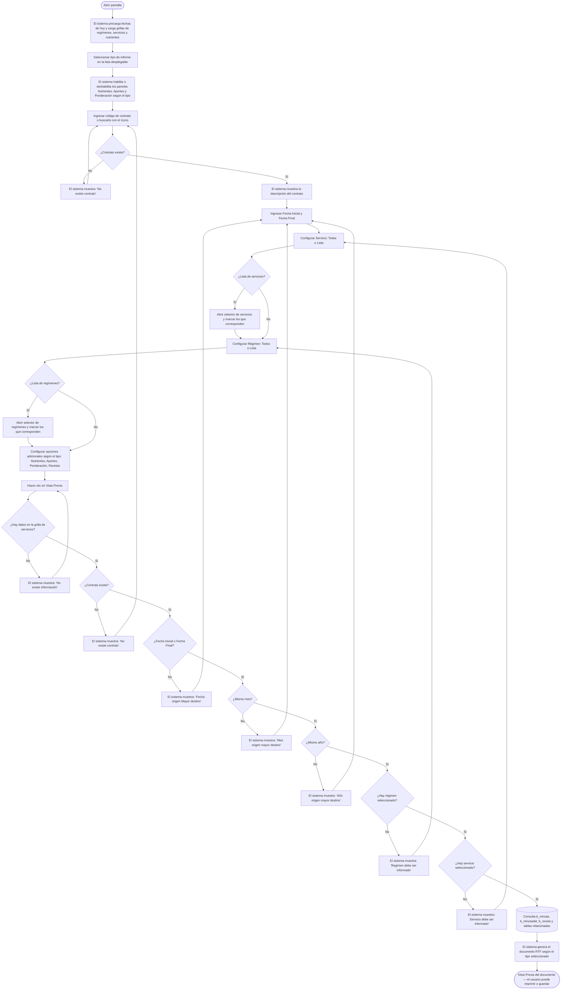

# Informe Planificación Teórica / Planificación Real

**Formulario:** `I_MenTeo.frm`
**Tablas principales:** `b_minuta` (cabecera de minutas planificadas), `b_minutadet` (detalle de recetas por día/servicio), `b_receta` (maestro de recetas), `b_recetadet` (ingredientes de cada receta), `a_servicio`, `a_regimen`, `b_clientes`, `a_nutriente`, `b_productonut`, `b_ingrediente`, `b_contlistpreing`
**Consulta principal:** Consultas directas sin procedimiento almacenado; la generación de cada tipo de informe se delega a funciones en `Informes.bas`

---

## Índice

- [1 — ¿Para qué sirve esta pantalla?](#1--para-qué-sirve-esta-pantalla)
- [2 — ¿Qué necesito para usarla?](#2--qué-necesito-para-usarla)
- [3 — ¿Cómo se usa?](#3--cómo-se-usa)
  - [3.1 Flujo paso a paso](#31-flujo-paso-a-paso)
  - [3.2 Controles y acciones disponibles](#32-controles-y-acciones-disponibles)
- [4 — ¿Qué restricciones debo conocer?](#4--qué-restricciones-debo-conocer)
  - [4.1 Validaciones del sistema](#41-validaciones-del-sistema)
- [5 — ¿Qué obtengo?](#5--qué-obtengo)
  - [Resumen de tipos disponibles](#resumen-de-tipos-disponibles)
  - [(0) Menú Mecano (`I_MenuPlanMecano`)](#0-menú-mecano-imenuplanmecano)
  - [(1) Menú Mensual (`I_MenuPlanMensual`)](#1-menú-mensual-imenuplanmensual)
  - [(2) Aporte Nutricionales Detallado (`I_AportePlanDetallado`)](#2-aporte-nutricionales-detallado-iaporteplandetallado)
  - [(3) Aporte Nutricionales Resumido (`I_AportePlanResumido`)](#3-aporte-nutricionales-resumido-iaporteplanresumido)
  - [(4) Costo Detallado (`I_CostoPlanDetallado`)](#4-costo-detallado-icostoplandetallado)
  - [(5) Costo Resumido (`I_CostoPlanResumido`)](#5-costo-resumido-icostoplanresumido)
  - [(6) Ingredientes Valor Cero en Planificación (`I_IngValCeroPlan`)](#6-ingredientes-valor-cero-en-planificación-iingvalceroplan)
  - [(7) Menú Mensual Servicios (`I_MenuPlanMensualServicio`)](#7-menú-mensual-servicios-imenuplanmensualservicio)
  - [(8) Menú Día Aporte Nutricionales (`I_MenuDiaAporteNutricional`)](#8-menú-día-aporte-nutricionales-imenudiaaportenutricional)
- [6 — Referencia técnica](#6--referencia-técnica)
  - [Tablas que intervienen](#tablas-que-intervienen)
  - [Relación con otros módulos](#relación-con-otros-módulos)

---

## 1 — ¿Para qué sirve esta pantalla?
[↑ Volver al índice](#índice)

Esta pantalla permite consultar e imprimir informes sobre la planificación de minutas de un casino. Según el contexto desde el que se accede, opera como **Informe de Planificación Teórica** (la minuta que se programó antes de que se sirvan los platos) o como **Informe de Planificación Real** (la minuta con los datos definitivos registrados al cierre). Ambos modos comparten exactamente la misma estructura de pantalla y el mismo conjunto de tipos de informe; la diferencia está en el tipo de minuta que se consulta en la base de datos.

La pantalla se organiza en un panel de filtros que ocupa la parte central. En la parte superior el usuario elige el tipo de informe desde una lista desplegable. Debajo aparecen el campo de contrato con su descripción, el rango de fechas (inicial y final), y cuatro paneles de opciones agrupados: **Servicio** (todos o una lista específica), **Régimen** (todos o una lista específica), **Nutrientes** (todos o una lista; solo se activa para tipos de informe que incluyen aportes), **Aportes** (tipo de peso a reportar; también solo activo en los tipos de aporte nutricional) y **Ponderación** (dos opciones que controlan qué recetas incluir y si se muestran las raciones planificadas). Un panel adicional llamado **Recetas** permite elegir si los nombres de recetas se presentan como "Nombre Fantasía" o "Nombre Receta". En la barra superior hay tres botones: Vista Previa (genera el documento), Histórico de Planificación y Salir.

El formulario puede generar nueve tipos distintos de documento RTF, cada uno con estructura y datos diferentes. Todos se abren primero en una ventana de vista previa antes de que el usuario decida imprimir o guardar.

---

## 2 — ¿Qué necesito para usarla?
[↑ Volver al índice](#índice)

| Campo | Descripción | Obligatorio |
|---|---|---|
| **Tipo de informe** | Lista desplegable con los nueve tipos disponibles. La selección determina qué paneles de opciones se habilitan automáticamente. | Sí |
| **Contrato** | Código del contrato (casino) sobre el cual se consulta la planificación. Puede escribirse directamente o buscarse haciendo clic en el ícono de búsqueda, que abre el selector de contratos. La descripción del contrato aparece al costado como referencia. | Sí |
| **Fecha Inicial** | Fecha de inicio del período a consultar, en formato dd/mm/aaaa. El campo incluye un calendario desplegable. | Sí |
| **Fecha Final** | Fecha de término del período a consultar, en formato dd/mm/aaaa. El campo incluye un calendario desplegable. | Sí |
| **Servicio** | Opción "Todos" (incluye todos los servicios del contrato) o "Lista" (permite seleccionar servicios específicos abriendo el selector de servicios). El selector solo está disponible si el contrato está ingresado. | Sí |
| **Régimen** | Opción "Todos" (incluye todos los regímenes del contrato) o "Lista" (permite seleccionar regímenes específicos abriendo el selector de regímenes). El selector solo está disponible si el contrato está ingresado. | Sí |
| **Nutrientes** | Solo activo para el tipo (2), (3) y (8). Permite incluir todos los nutrientes o seleccionar una lista específica. | Solo en tipos 2, 3 y 8 |
| **Aportes** | Solo activo para el tipo (2). Define qué tipo de peso se incluye en el cálculo: Peso Bruto, Peso Servido, Peso Neto o Ambos (bruto y servido). | Solo en tipo 2 |
| **Ponderación — Imprimir Recetas Sin Ponderación** | Casilla que, cuando está marcada, incluye en el informe las recetas que tienen cero raciones planificadas. Cuando no está marcada, el informe omite esas recetas. Solo activa para los tipos (0) y (1). | No |
| **Ponderación — Imprimir Ponderación** | Casilla que, cuando está marcada, muestra entre paréntesis la cantidad de raciones planificadas junto al nombre de la receta. Solo activa para los tipos (0) y (1). | No |
| **Recetas — Nombre Fantasía** | Muestra el nombre comercial de la receta (el que se presenta al comensal). Seleccionado por defecto. | No (uno de los dos es obligatorio) |
| **Recetas — Nombre Receta** | Muestra el nombre técnico de la receta registrado en el sistema. | No (uno de los dos es obligatorio) |

Al abrir el formulario, las fechas inicial y final se precargan con la fecha del día. La grilla interna de servicios y regímenes se carga automáticamente con todos los servicios y regímenes vigentes del sistema. La grilla de nutrientes también se carga al abrir y marca con check los nutrientes configurados como prioritarios.

---

## 3 — ¿Cómo se usa?
[↑ Volver al índice](#índice)

### 3.1 Flujo paso a paso
[↑ Volver al índice](#índice)

### 3.2 Controles y acciones disponibles
[↑ Volver al índice](#índice)

| Control / Acción | Descripción |
|---|---|
| **Lista desplegable de Informes** | Permite elegir uno de los nueve tipos de informe. Al cambiar la selección, el sistema habilita o deshabilita automáticamente los paneles de Nutrientes, Aportes y Ponderación. |
| **Campo Contrato** | Casilla de texto donde se ingresa el código del contrato (casino). Al salir del campo el sistema valida que el código exista y muestra la descripción. |
| **Ícono de búsqueda (Contrato)** | Abre el selector de contratos donde el usuario puede buscar y elegir un casino por nombre o código. |
| **Campo Fecha Inicial** | Campo de fecha con calendario desplegable. Al cambiar la fecha, el sistema actualiza la carga de las grillas de regímenes y servicios. |
| **Campo Fecha Final** | Campo de fecha con calendario desplegable. Debe ser igual o posterior a la fecha inicial y pertenecer al mismo mes y año. |
| **Panel Servicio — opción Todos** | Marca todos los servicios de la grilla interna para incluirlos en el informe. Activo por defecto. |
| **Panel Servicio — opción Lista** | Activa el ícono de búsqueda de servicios, permitiendo seleccionar un subconjunto específico de servicios. |
| **Ícono de búsqueda (Servicio)** | Visible solo cuando se selecciona "Lista" en el panel Servicio. Abre el selector de servicios donde el usuario marca los que desea incluir. Solo disponible si el contrato está ingresado. |
| **Panel Régimen — opción Todos** | Incluye todos los regímenes de la grilla interna. Activo por defecto. |
| **Panel Régimen — opción Lista** | Activa el ícono de búsqueda de regímenes para seleccionar un subconjunto. |
| **Ícono de búsqueda (Régimen)** | Abre el selector de regímenes. Solo disponible si el contrato está ingresado. |
| **Panel Nutrientes — opción Todos** | Solo disponible para tipos (2), (3) y (8). Incluye todos los nutrientes marcados en la grilla interna. |
| **Panel Nutrientes — opción Lista** | Solo disponible para tipos (2), (3) y (8). Abre el selector de nutrientes para elegir cuáles incluir. |
| **Ícono de búsqueda (Nutrientes)** | Abre el selector de nutrientes para el tipo seleccionado. |
| **Panel Aportes** | Solo activo para el tipo (2). Opciones: Peso Bruto (valor por defecto), Peso Servido, Peso Neto, Ambos. Determina qué columnas de gramaje aparecen en el informe de aporte nutricional detallado. |
| **Casilla "Imprimir Recetas Sin Ponderación"** | Solo activa para los tipos (0) y (1). Cuando está marcada, incluye recetas con cero raciones planificadas. |
| **Casilla "Imprimir Ponderación"** | Solo activa para los tipos (0) y (1). Cuando está marcada, agrega la cantidad de raciones planificadas entre paréntesis junto al nombre de la receta. |
| **Panel Recetas — Nombre Fantasía / Nombre Receta** | Selecciona con qué nombre se identifica cada receta en el informe. "Nombre Fantasía" está seleccionado por defecto. |
| **Botón Vista Previa** | Ejecuta las validaciones y, si todo es correcto, genera el documento RTF del tipo seleccionado y lo abre en la ventana de vista previa. El botón requiere que el usuario tenga permiso de impresión asignado en el sistema. |
| **Botón Histórico de Planificación** | Abre el historial de períodos planificados para el contrato ingresado. Permite seleccionar un mes anterior, que se carga automáticamente en los campos de fecha. |
| **Botón Salir** | Cierra el formulario. |

---

## 4 — ¿Qué restricciones debo conocer?
[↑ Volver al índice](#índice)

### 4.1 Validaciones del sistema
[↑ Volver al índice](#índice)

| # | Cuándo aparece | Qué verifica el sistema | Qué ve o experimenta el usuario |
|---|---|---|---|
| 1 | Al hacer clic en Vista Previa | Que exista al menos un servicio cargado en la grilla interna | Mensaje: **"No existe Información"**. El proceso se detiene. |
| 2 | Al hacer clic en Vista Previa | Que el código de contrato ingresado exista en la base de datos | Mensaje: **"No existe contrato"**. El campo de contrato se borra y el proceso se detiene. |
| 3 | Al hacer clic en Vista Previa | Que la Fecha Inicial no sea posterior a la Fecha Final | Mensaje: **"Fecha origen Mayor destino"**. El proceso se detiene. |
| 4 | Al hacer clic en Vista Previa | Que ambas fechas pertenezcan al mismo mes | Mensaje: **"Mes origen mayor destino"**. El proceso se detiene. El período consultado no puede cruzar meses. |
| 5 | Al hacer clic en Vista Previa | Que ambas fechas pertenezcan al mismo año | Mensaje: **"Año origen mayor destino"**. El proceso se detiene. |
| 6 | Al hacer clic en Vista Previa | Que haya al menos un régimen marcado en la selección | Mensaje: **"Regimen debe ser informado"**. El proceso se detiene. |
| 7 | Al hacer clic en Vista Previa | Que haya al menos un servicio marcado en la selección | Mensaje: **"Servicio debe ser informado"**. El proceso se detiene. |
| 8 | Al abrir el formulario | Que exista al menos un nutriente en el maestro de nutrientes | Mensaje: **"No existe maestro nutrientes"**. El formulario se cierra automáticamente. |
| 9 | Al hacer clic en Vista Previa (tipos 4 y 5) | Que existan datos de costo en el período y combinación seleccionada | Mensaje: **"No existen datos para imprimir..."**. El proceso se detiene. |
| 10 | Al hacer clic en Vista Previa | Que el usuario tenga el permiso de Vista Previa asignado en el sistema | El botón Vista Previa aparece deshabilitado si el usuario no tiene el permiso correspondiente. |
| 11 | Al ingresar el contrato y salir del campo | Que el código de contrato exista | El campo de descripción queda en blanco si el contrato no existe. No se muestra mensaje; el error aparece solo al intentar generar el informe. |

---

## 5 — ¿Qué obtengo?
[↑ Volver al índice](#índice)

### Resumen de tipos disponibles
[↑ Volver al índice](#índice)

| Código | Nombre en el selector | Formato de salida | Función principal |
|---|---|---|---|
| (0) | Menú Mecano | RTF — Retrato | `I_MenuPlanMecano` en `Informes.bas` |
| (1) | Menú Mensual | RTF — Paisaje | `I_MenuPlanMensual` en `Informes.bas` |
| (2) | Aporte Nutricionales Detallado | RTF — Retrato | `I_AportePlanDetallado` en `Informes.bas` |
| (3) | Aporte Nutricionales Resumido | RTF — Retrato | `I_AportePlanResumido` en `Informes.bas` |
| (4) | Costo Detallado | RTF — Retrato | `I_CostoPlanDetallado` en `Informes.bas` |
| (5) | Costo Resumido | RTF — Paisaje | `I_CostoPlanResumido` en `Informes.bas` |
| (6) | Ingredientes Valor Cero en Planificación | RTF — Retrato | `I_IngValCeroPlan` en `Informes.bas` |
| (7) | Menú Mensual Servicios | RTF — Paisaje | `I_MenuPlanMensualServicio` en `Informes.bas` |
| (8) | Menú Día Aporte Nutricionales | RTF — Retrato | `I_MenuDiaAporteNutricional` en `Informes.bas` |

---

### (0) Menú Mecano (`I_MenuPlanMecano`)
[↑ Volver al índice](#índice)

**Qué muestra:** Presenta la minuta diaria con el formato de carta tradicional de casino: cada día muestra las preparaciones agrupadas por estructura de servicio (por ejemplo, Entrada, Fondo, Postre) con el nombre de cada receta. Es el informe de uso operativo más directo para comunicar al personal de cocina qué preparar cada día.

**Cómo se seleccionan los servicios:** Utiliza los servicios marcados en el panel Servicio del formulario principal (opción "Todos" o selección individual desde el selector de servicios).

**Opciones de configuración disponibles:**
- **Nombre de receta:** Fantasía o Nombre técnico, según la selección en el panel Recetas.
- **Imprimir Recetas Sin Ponderación:** Si está marcada, incluye recetas con cero raciones planificadas. Si no, las omite.
- **Imprimir Ponderación:** Si está marcada, muestra el número de raciones planificadas entre paréntesis junto al nombre de la receta.
- **Grupo vulnerable:** Si el casino tiene configurada la opción `opgruvul = 'S'` en los parámetros del sistema, el informe agrega debajo de cada receta el texto del campo "grupo vulnerable" de la receta (información nutricional especial).

**Estructura de datos del informe:**

| Campo / Columna | Descripción | Calculado |
|---|---|---|
| Nombre del servicio | Nombre del servicio de alimentación (desayuno, almuerzo, etc.) | No |
| Nombre de la estructura | Nombre de la etapa del servicio (Entrada, Fondo, Postre, etc.) | No |
| Nombre de la receta | Nombre fantasía o nombre técnico según la opción seleccionada | No |
| Raciones planificadas | Cantidad de raciones previstas para esa receta en el día | No |
| Información grupo vulnerable | Texto adicional de la receta dirigido a comensales con necesidades especiales, si está activado en el casino | No |
| Fecha (en el pie de página) | Fecha del día en letras, seguida de "Bon Appétit!" | Sí |

**Cálculo — Fecha en el pie de página**

La fecha del día se expresa en texto con el nombre del día de la semana, día, mes y año, usando la función `fg_Fecha_Escrita`. No se almacena; se genera en el momento de la impresión a partir del campo numérico de fecha de la minuta.

**Formato de salida:** Documento RTF. Orientación retrato. Una página por día por servicio por régimen. Encabezado con los datos del casino. Recetas organizadas en tabla de tres columnas (estructura de servicio, separador, nombre de receta). Pie de página con la fecha del día en texto. Salto de página al cambiar de día o de servicio.

---

### (1) Menú Mensual (`I_MenuPlanMensual`)
[↑ Volver al índice](#índice)

**Qué muestra:** Presenta la planificación completa del mes en formato de grilla semanal: las filas son las estructuras de servicio (Entrada, Fondo, Postre, etc.) y las columnas son los días de la semana (Lunes a Domingo). Cada celda contiene los nombres de las recetas planificadas para esa combinación de día y estructura. Este es el formato clásico del "set de minuta" que se publica en el comedor.

**Restricciones propias del tipo:** El período consultado debe corresponder exactamente a un mes (fecha inicial y final dentro del mismo mes y año, lo cual el sistema valida con los mensajes correspondientes antes de ejecutar).

**Cómo se seleccionan los servicios:** Utiliza los servicios marcados en el panel Servicio del formulario principal.

**Opciones de configuración disponibles:**
- **Nombre de receta:** Fantasía o Nombre técnico.
- **Imprimir Recetas Sin Ponderación:** Incluye o excluye recetas sin raciones planificadas.
- **Imprimir Ponderación:** Agrega la cantidad de raciones planificadas entre paréntesis.

**Estructura de datos del informe:**

| Campo / Columna | Descripción | Calculado |
|---|---|---|
| Columna "Estructura" | Nombre de la etapa del servicio (Entrada, Fondo, etc.) | No |
| Columnas de días (Lunes a Domingo con número de día) | Nombre(s) de las recetas planificadas para esa estructura en ese día | No |
| Encabezado "S e t   d e   M i n u t a" | Título fijo del documento | No |
| Nombre del contrato | Nombre del casino obtenido del catálogo de contratos | No |
| Nombre del servicio y período | Nombre del servicio más el mes/año consultado | No |

**Formato de salida:** Documento RTF. Orientación paisaje. Una página por combinación de régimen y servicio. Encabezado con nombre del casino, nombre del servicio y período. Grilla con columna de estructura y una columna por cada día de la semana con su número. Los días del mes anterior al primer lunes aparecen resaltados en gris. Pie de página con número de página.

---

### (2) Aporte Nutricionales Detallado (`I_AportePlanDetallado`)
[↑ Volver al índice](#índice)

**Qué muestra:** Para cada día, muestra el aporte nutricional de cada preparación planificada, desglosado por ingrediente y por nutriente. Permite conocer el contenido nutricional detallado a nivel de receta y de ingrediente para la planificación de un período.

**Cómo se seleccionan los servicios:** Utiliza los servicios marcados en el panel Servicio del formulario principal.

**Opciones de configuración disponibles:**
- **Nombre de receta:** Fantasía o Nombre técnico.
- **Nutrientes:** Selección de todos o de una lista específica de nutrientes a incluir como columnas.
- **Aportes:** Tipo de peso base para el cálculo:
  - **Peso Bruto:** usa la cantidad bruta del ingrediente en la receta.
  - **Peso Servido:** usa la cantidad servida (peso bruto ajustado por el porcentaje de cocción).
  - **Peso Neto:** usa la cantidad neta (peso bruto ajustado por el porcentaje de aprovechamiento).
  - **Ambos:** incluye columnas para peso bruto y peso servido simultáneamente.

**Estructura de datos del informe:**

| Campo / Columna | Descripción | Calculado |
|---|---|---|
| Fecha | Fecha del día consultado | No |
| Preparaciones | Nombre de la receta (fantasía o técnico) | No |
| C.Bruta / C.Servida / C.Neta | Cantidad de gramaje según la opción de Aportes seleccionada | Sí |
| Columna por cada nutriente seleccionado | Aporte del nutriente para esa preparación en esa cantidad de gramaje | Sí |
| Total Aporte (fila) | Suma del aporte de cada nutriente a nivel de receta completa | Sí |
| Total Día (fila) | Suma del aporte de cada nutriente a lo largo del día | Sí |

**Cálculo — Gramaje (C.Bruta / C.Servida / C.Neta)**

El gramaje de cada ingrediente en la receta se expresa en función de la base de raciones de la receta y se ajusta según la opción elegida:

**Fórmula:**
- Cantidad base por ración = `b_recetadet.red_canpro` ÷ `b_receta.rec_basrac`
- Peso Bruto = Cantidad base por ración (sin ajuste)
- Peso Servido = Cantidad base × (1 − `red_pctcoc` / 100)
- Peso Neto = Cantidad base × (`red_pctapr` / 100)

| Componente | Qué representa | De dónde viene |
|---|---|---|
| `red_canpro` | Cantidad del ingrediente en la receta para la base de raciones | `b_recetadet.red_canpro` |
| `rec_basrac` | Base de raciones sobre la cual está definida la receta | `b_receta.rec_basrac` |
| `red_pctcoc` | Porcentaje de reducción por cocción | `b_recetadet.red_pctcoc` |
| `red_pctapr` | Porcentaje de aprovechamiento del ingrediente | `b_recetadet.red_pctapr` |

> Ejemplo: si una receta está definida para 100 raciones y un ingrediente tiene 5.000 g y 10% de merma por cocción, el Peso Servido por ración es 5.000 ÷ 100 × (1 − 0,10) = 45 g por comensal.

**Cálculo — Aporte nutricional por ingrediente**

**Fórmula:**
`aporte_nutriente` = (`red_pctnut` / 100) × (`pnu_canapo` × (gramaje_base)) / `ing_facnut`

| Componente | Qué representa | De dónde viene |
|---|---|---|
| `red_pctnut` | Porcentaje del nutriente que aporta el ingrediente en la receta | `b_recetadet.red_pctnut` |
| `pnu_canapo` | Cantidad del nutriente por unidad del ingrediente | `b_productonut.pnu_canapo` |
| `ing_facnut` | Factor de conversión nutricional del ingrediente | `b_ingrediente.ing_facnut` |

**Formato de salida:** Documento RTF. Orientación retrato. Una página por día por combinación de régimen y servicio. Encabezado con datos del casino. Tabla con columna de preparaciones y una columna por nutriente seleccionado. Fila de "Total Aporte" al final de cada receta y fila de "Total Día" al final del día.

---

### (3) Aporte Nutricionales Resumido (`I_AportePlanResumido`)
[↑ Volver al índice](#índice)

**Qué muestra:** Similar al tipo (2) pero sin el desglose por ingrediente: muestra el aporte nutricional total de cada preparación completa por día. Es la versión consolidada del informe nutricional, adecuada para revisiones generales del menú.

**Cómo se seleccionan los servicios:** Utiliza los servicios marcados en el panel Servicio del formulario principal.

**Opciones de configuración disponibles:**
- **Nombre de receta:** Fantasía o Nombre técnico.
- **Nutrientes:** Selección de todos o una lista específica. Las columnas del informe corresponden a los nutrientes seleccionados.

**Estructura de datos del informe:**

| Campo / Columna | Descripción | Calculado |
|---|---|---|
| Fecha | Fecha del día | No |
| Contrato / Régimen / Servicio | Encabezado identificador del grupo | No |
| Preparaciones | Nombre de la receta | No |
| Columna por cada nutriente seleccionado | Aporte total del nutriente calculado para la receta completa | Sí |
| Total Día (fila) | Suma de aportes del día por cada nutriente | Sí |

**Cálculo — Aporte nutricional por receta (versión resumida)**

Mismo mecanismo que el tipo (2) pero el cálculo se realiza por receta completa (sumando el aporte de todos sus ingredientes), sin mostrar el detalle por ingrediente.

**Formato de salida:** Documento RTF. Orientación retrato. Una página por día por combinación de régimen y servicio. Encabezado con contrato, régimen, servicio y fecha. Tabla con recetas y columnas de nutrientes. Fila de "Total Día" al final. Salto de página al cambiar de día.

---

### (4) Costo Detallado (`I_CostoPlanDetallado`)
[↑ Volver al índice](#índice)

**Qué muestra:** Para cada régimen y servicio, muestra el costo individual de cada receta planificada por día, junto al número de raciones y el costo total del día. Al final incluye el costo total del servicio y el costo promedio diario del mes. Es el informe de análisis de costos más granular disponible.

**Cómo se seleccionan los servicios:** Utiliza los servicios marcados en el panel Servicio del formulario principal.

**Opciones de configuración disponibles:**
- **Nombre de receta:** Fantasía o Nombre técnico.

**Estructura de datos del informe:**

| Campo / Columna | Descripción | Calculado |
|---|---|---|
| Día | Fecha de cada día en formato dd/mm/aaaa | No |
| Nombre Receta | Nombre de la preparación planificada | No |
| Costo Unit. | Costo unitario de la receta por ración | Sí |
| Nro. Rac. | Número de raciones planificadas | No |
| Costo | Costo total de esa receta ese día (costo unitario × raciones) | Sí |
| Total Día (fila resumen) | Suma de costos de todas las recetas del día | Sí |
| Total Servicio (fila resumen) | Suma de costos unitarios de todas las recetas del período | Sí |
| Costo Promedio Diario (fila resumen) | Costo total del servicio dividido entre el número de días con datos | Sí |

**Cálculo — Costo unitario de la receta**

El costo unitario por ración incluye el costo de receta más el costo de descripción, ambos congelados al momento de grabar la planificación (regla de negocio 15 del sistema).

**Fórmula:**
`Costo Unit.` = `b_minutadet.mid_cosrec` + `b_minutadet.mid_cosdes`

| Componente | Qué representa | De dónde viene |
|---|---|---|
| `mid_cosrec` | Costo de la receta congelado al grabar la minuta | `b_minutadet.mid_cosrec` |
| `mid_cosdes` | Costo de descripción adicional congelado al grabar | `b_minutadet.mid_cosdes` |

**Cálculo — Costo total de la receta en el día**

`Costo` = (`mid_cosrec` + `mid_cosdes`) × `mid_numrac`

| Componente | Qué representa | De dónde viene |
|---|---|---|
| `mid_numrac` | Número de raciones planificadas | `b_minutadet.mid_numrac` |

**Cálculo — Costo Promedio Diario**

`Costo Promedio Diario` = `Total Servicio` ÷ número de días con datos en el período

> Ejemplo: si el Total Servicio es $150.000 y el período tiene 20 días con datos, el Costo Promedio Diario es $7.500.

**Formato de salida:** Documento RTF. Orientación retrato. Una página por combinación de régimen y servicio. Encabezado con contrato, régimen y servicio. Tabla con cinco columnas (día, receta, costo unitario, raciones, costo). Filas de resumen al final: "Total Día", "Total Servicio" y "Costo Promedio Diario". Salto de página entre servicios.

---

### (5) Costo Resumido (`I_CostoPlanResumido`)
[↑ Volver al índice](#índice)

**Qué muestra:** Para cada régimen, presenta una grilla con los días del mes en las filas y los servicios en las columnas, mostrando el costo total planificado de cada día por servicio. Incluye filas de totales y promedios. Es el informe que permite comparar costos entre servicios en un mismo período.

**Cómo se seleccionan los servicios:** Utiliza los servicios marcados en el panel Servicio del formulario principal.

**Opciones de configuración disponibles:**
- **Nombre de receta:** No aplica (el informe trabaja con datos agregados, sin mostrar nombres de recetas).

**Estructura de datos del informe:**

| Campo / Columna | Descripción | Calculado |
|---|---|---|
| Fecha (columna) | Fecha de cada día del período | No |
| Columna por cada servicio seleccionado | Costo total de todas las recetas del día para ese servicio | Sí |
| Total (columna) | Suma de todos los servicios para ese día | Sí |
| Tot. Serv. (fila) | Total acumulado del servicio en todo el período | Sí |
| Tot. Prom. (fila) | Promedio diario del costo de cada servicio | Sí |

**Cálculo — Costo total por día y servicio**

`Costo` = SUM((`mid_cosdes` + `mid_cosrec`) × `mid_numrac`) agrupado por régimen, servicio y fecha

| Componente | Qué representa | De dónde viene |
|---|---|---|
| `mid_cosrec` + `mid_cosdes` | Costo congelado de la receta al grabar la minuta | `b_minutadet` |
| `mid_numrac` | Raciones planificadas | `b_minutadet.mid_numrac` |

**Formato de salida:** Documento RTF. Orientación paisaje. Una página por régimen. Encabezado con contrato y régimen. Tabla con filas por día, columnas por servicio más columna de total. Filas de totales y promedios al final. Salto de página entre regímenes.

---

### (6) Ingredientes Valor Cero en Planificación (`I_IngValCeroPlan`)
[↑ Volver al índice](#índice)

**Qué muestra:** Lista los ingredientes que tienen precio cero en el maestro de ingredientes del contrato, pero que forman parte de recetas planificadas en el período consultado. Permite identificar ingredientes sin costear que pueden distorsionar los cálculos de costo de la planificación.

**Cómo se seleccionan los servicios:** Utiliza los servicios marcados en el panel Servicio del formulario principal.

**Opciones de configuración disponibles:**
- **Nombre de receta:** Fantasía o Nombre técnico (afecta solo la identificación de las recetas en los filtros internos, no en las columnas del informe).

**Estructura de datos del informe:**

| Campo / Columna | Descripción | Calculado |
|---|---|---|
| Ingredientes (código) | Código del ingrediente con precio cero | No |
| Descripción (ingrediente) | Nombre del ingrediente con precio cero | No |
| Productos (código) | Código del producto asociado al ingrediente | No |
| Descripción (producto) | Nombre del producto asociado | No |

**Formato de salida:** Documento RTF. Orientación retrato. Una página por combinación de régimen y servicio. Encabezado con contrato, régimen y servicio. Tabla de cuatro columnas en formato par: código de ingrediente, descripción de ingrediente, código de producto, descripción de producto. Salto de página al cambiar de servicio.

---

### (7) Menú Mensual Servicios (`I_MenuPlanMensualServicio`)
[↑ Volver al índice](#índice)

**Qué muestra:** Variante del Menú Mensual (tipo 1) que presenta la planificación del mes en formato de grilla semanal, pero organizada por semanas del mes y con todos los servicios seleccionados en columnas. Permite ver de un vistazo qué se planificó para cada servicio cada semana del mes, agrupado por régimen.

**Cómo se seleccionan los servicios:** A diferencia de otros tipos, este informe lee directamente la lista de servicios marcados en la grilla interna del formulario principal para construir las columnas de la grilla de salida.

**Opciones de configuración disponibles:**
- **Nombre de receta:** Fantasía o Nombre técnico.

**Estructura de datos del informe:**

| Campo / Columna | Descripción | Calculado |
|---|---|---|
| Encabezado "S e t   d e   M i n u t a  S e r v i c i o s" | Título del documento | No |
| Nombre del contrato | Nombre del casino | No |
| Nombre del régimen | Régimen sobre el cual se imprime esta página | No |
| Período (mes-año) | Mes y año en formato abreviado (ej. Mar-26) | No |
| Columnas de días de la semana | Lunes a Domingo con número de día del mes | Calculado |
| Filas de recetas por estructura de servicio | Preparaciones del día agrupadas por estructura de servicio | No |

**Cálculo — Número de día en cada columna**

El sistema determina el día de la semana de la primera fecha de la minuta y construye las columnas de izquierda a derecha comenzando desde el primer lunes del mes. Los días que pertenecen al mes anterior aparecen con fondo resaltado.

**Formato de salida:** Documento RTF. Orientación paisaje. Una página por régimen. Encabezado con nombre del casino, régimen y período. Grilla con columnas por día de la semana y filas por estructura de servicio. Los datos de cada servicio seleccionado aparecen juntos en la celda correspondiente al día. Salto de página entre semanas o entre regímenes según el volumen de datos.

---

### (8) Menú Día Aporte Nutricionales (`I_MenuDiaAporteNutricional`)
[↑ Volver al índice](#índice)

**Qué muestra:** Combina la carta del día con los aportes nutricionales: para cada día del período presenta las preparaciones planificadas con sus estructuras de servicio y, al costado, los valores nutricionales de cada una. Es el formato de "menú del día" con información nutricional, pensado para publicación directa.

**Cómo se seleccionan los servicios:** Utiliza los servicios marcados en el panel Servicio del formulario principal.

**Opciones de configuración disponibles:**
- **Nombre de receta:** Fantasía o Nombre técnico.
- **Nutrientes:** Selección de todos o una lista específica, que determina qué columnas de nutrientes aparecen.

**Estructura de datos del informe:**

| Campo / Columna | Descripción | Calculado |
|---|---|---|
| Título "MENU DEL DIA" | Encabezado del día | No |
| Fecha | Fecha del día en formato dd/mm/aaaa | No |
| Preparaciones | Nombre de la receta agrupada por estructura de servicio | No |
| Columna por cada nutriente seleccionado | Aporte nutricional de la preparación para ese nutriente | Sí |

**Cálculo — Aporte nutricional por preparación**

Mismo mecanismo que el tipo (3) (resumido): el sistema calcula el aporte de cada nutriente para la receta completa consultando la composición de ingredientes y sus valores en la tabla de aportes nutricionales de productos.

**Formato de salida:** Documento RTF. Orientación retrato. Una página por día. Encabezado con el título "MENU DEL DIA" y la fecha. Tabla con columna de preparaciones y columnas de nutrientes. Sin pie de página con número de página (el encabezado de fecha sirve de identificación). Salto de página al cambiar de día.

---

## 6 — Referencia técnica
[↑ Volver al índice](#índice)

### Tablas que intervienen
[↑ Volver al índice](#índice)

| Tabla | Para qué se usa en este reporte | Campos clave |
|---|---|---|
| `b_minuta` | Cabecera de cada minuta planificada: identifica el contrato, el régimen, el servicio, la fecha y el estado del día | `min_codigo`, `min_cencos`, `min_codreg`, `min_codser`, `min_fecmin`, `min_indblo`, `min_tipmin` |
| `b_minutadet` | Líneas de detalle de la minuta: cada receta planificada para un día, con su costo congelado, número de raciones y tipo de minuta | `mid_codigo`, `mid_numlin`, `mid_codrec`, `mid_tiprec`, `mid_tipmin`, `mid_numrac`, `mid_cosrec`, `mid_cosdes`, `mid_estser`, `mid_descri` |
| `b_receta` | Maestro de recetas: nombre técnico, nombre fantasía, base de raciones, código de grupo vulnerable | `rec_codigo`, `rec_nombre`, `rec_nomfan`, `rec_basrac`, `rec_gruvul` |
| `b_recetadet` | Ingredientes de cada receta con cantidades y porcentajes de aprovechamiento, cocción y nutriente | `red_codigo`, `red_tiprec`, `red_cencos`, `red_codpro`, `red_canpro`, `red_pctapr`, `red_pctcoc`, `red_pctnut`, `red_nroite` |
| `a_servicio` | Catálogo de servicios de alimentación del casino | `ser_codigo`, `ser_nombre` |
| `a_estservicio` | Estructuras de servicio (Entrada, Fondo, Postre, etc.) por casino | `ess_codigo`, `ess_nombre`, `ess_cencos` |
| `a_regimen` | Catálogo de regímenes de alimentación | `reg_codigo`, `reg_nombre` |
| `b_clientes` | Catálogo de contratos (casinos) | `cli_codigo`, `cli_nombre` |
| `a_nutriente` | Maestro de nutrientes disponibles para cálculo de aportes | `nut_codigo`, `nut_nombre`, `nut_secnro`, `nut_indpri` |
| `b_productonut` | Valores nutricionales de cada ingrediente/producto por nutriente | `pnu_codpro`, `pnu_codapo`, `pnu_canapo` |
| `b_ingrediente` | Maestro de ingredientes con factor de conversión nutricional | `ing_codigo`, `ing_nombre`, `ing_facnut` |
| `b_productos` | Maestro de productos del casino, usado en el informe de ingredientes con valor cero | `pro_codigo`, `pro_nombre` |
| `b_productosing` | Relación entre productos y sus ingredientes | `pri_codpro`, `pri_coding` |
| `b_contlistpreing` | Lista de precios de ingredientes por contrato; identifica los ingredientes con precio cero | `cpi_coding`, `cpi_cencos`, `cpi_precos` |
| `a_param` | Parámetros del sistema por casino; contiene la opción `opgruvul` que activa la impresión de información de grupo vulnerable | `par_codigo`, `par_cencos`, `par_valor` |

### Relación con otros módulos
[↑ Volver al índice](#índice)

| Módulo | Relación |
|---|---|
| **Planificación de Minutas** | Los datos que este informe consume son generados por el módulo de planificación, donde el chef o encargado carga las recetas día por día por servicio y régimen. Sin una planificación grabada en el período consultado, el informe devuelve vacío. |
| **Maestro de Recetas** | El informe consulta el maestro de recetas para obtener nombres, composición de ingredientes y costos asociados. Los costos en el informe corresponden a los valores congelados en el momento de grabar la minuta, no al costo actual de la receta. |
| **Maestro de Ingredientes y Nutrientes** | Para los informes de aporte nutricional, el sistema consulta la tabla de composición nutricional de cada ingrediente. Si un ingrediente no tiene valores nutricionales registrados, no aparece en los cálculos de aporte. |
| **Parámetros del Casino** | La opción de impresión de información de "grupo vulnerable" en el tipo (0) depende de un parámetro configurado en el módulo de administración del sistema. |
| **Contratos y Servicios** | El filtro de contratos consulta el módulo de administración de contratos (externo a Producción). Los servicios y regímenes disponibles provienen de los catálogos mantenidos en ese módulo. |
| **Cierre Diario** | El tipo de minuta consultado (teórica o real) está determinado por el contexto desde el que se abre el formulario, no por una opción interna. La minuta "real" corresponde a la que queda grabada tras el proceso de cierre diario. |

---

*Fuentes: `I_MenTeo.frm`, funciones `I_MenuPlanMecano`, `I_MenuPlanMensual`, `I_AportePlanDetallado`, `I_AportePlanResumido`, `I_CostoPlanDetallado`, `I_CostoPlanResumido`, `I_IngValCeroPlan`, `I_MenuPlanMensualServicio`, `I_MenuDiaAporteNutricional` en `Informes.bas`, tablas `b_minuta`, `b_minutadet`, `b_receta`, `b_recetadet` y tablas de referencia en `SGP_Local.sql`*
