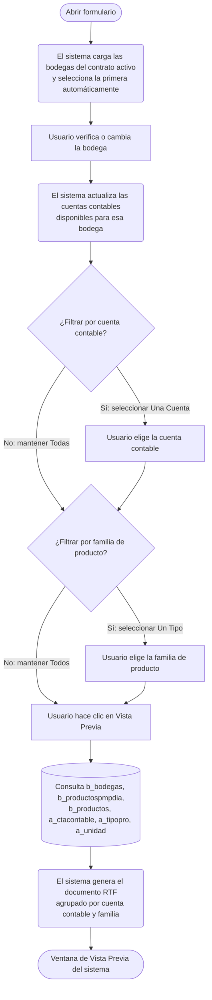

# Informe de Stock

**Formulario:** `I_Stock.frm`
**Tabla(s) principal(es):** `b_bodegas` (stock actual por bodega y producto), `b_productospmpdia` (precio medio ponderado diario por casino y producto)
**Consulta principal:** Sin procedimiento almacenado: consulta directa al servidor (función `I_StockxFecha` en `InforAN.bas`)

---

## Índice

- [1 — ¿Para qué sirve esta pantalla?](#1--para-qué-sirve-esta-pantalla)
- [2 — ¿Qué necesito para usarla?](#2--qué-necesito-para-usarla)
- [3 — ¿Cómo se usa?](#3--cómo-se-usa)
  - [3.1 Flujo paso a paso](#31-flujo-paso-a-paso)
  - [3.2 Controles y acciones disponibles](#32-controles-y-acciones-disponibles)
- [4 — ¿Qué restricciones debo conocer?](#4--qué-restricciones-debo-conocer)
  - [4.1 Validaciones del sistema](#41-validaciones-del-sistema)
- [5 — ¿Qué obtengo?](#5--qué-obtengo)
- [6 — Referencia técnica](#6--referencia-técnica)
  - [Tablas que intervienen](#tablas-que-intervienen)
  - [Relación con otros módulos](#relación-con-otros-módulos)

---

## 1 — ¿Para qué sirve esta pantalla?

[↑ Volver al índice](#índice)

Esta pantalla genera el **Informe de Stock**, un documento que muestra el inventario actual de productos en una bodega seleccionada, valorizado al precio medio ponderado (PMP) más reciente disponible. Para cada producto en stock se entrega el código, descripción, unidad de medida, cantidad en existencia, precio unitario vigente y el valor total (cantidad × precio).

El informe organiza los productos en dos niveles jerárquicos: primero por cuenta contable y luego por familia de producto dentro de cada cuenta. Al final de cada familia se presenta un subtotal, y al final de cada cuenta contable se presenta el total acumulado de esa cuenta. Esto permite obtener una valorización del inventario alineada con la estructura contable del casino.

La pantalla está diseñada para un único tipo de informe sin selector de variantes. El usuario configura tres filtros —bodega, cuenta contable y familia de producto— y presiona el botón de vista previa. El sistema genera el documento de forma automática y lo presenta en pantalla para revisión antes de imprimir.

---

## 2 — ¿Qué necesito para usarla?

[↑ Volver al índice](#índice)

| Campo | Descripción | Obligatorio |
|---|---|---|
| **Bodega** | Lista desplegable con las bodegas asociadas al contrato activo en sesión. El sistema la carga automáticamente al abrir el formulario y selecciona la primera opción disponible. | Sí |
| **Cuenta Contable** | Permite filtrar el informe por una cuenta contable específica. Se activa solo cuando se selecciona la opción "Una Cuenta"; las cuentas disponibles se cargan dinámicamente según la bodega elegida. Si se elige "Todas", se muestran todos los productos sin importar su cuenta. | No (por defecto: Todas) |
| **Familia Producto** | Permite filtrar por una familia (tipo) de producto específica. Se activa solo cuando se selecciona la opción "Un Tipo". Si se elige "Todos", se incluyen todas las familias. | No (por defecto: Todos) |

> **Nota:** La lista de cuentas contables disponibles en el filtro de cuenta se actualiza automáticamente cada vez que el usuario cambia la bodega seleccionada. Refleja únicamente las cuentas que tienen productos con stock en esa bodega.

---

## 3 — ¿Cómo se usa?

### 3.1 Flujo paso a paso

[↑ Volver al índice](#índice)

### 3.2 Controles y acciones disponibles

[↑ Volver al índice](#índice)

| Control / Acción | Descripción |
|---|---|
| **Lista desplegable Bodega** | Cargada automáticamente al abrir el formulario con las bodegas del contrato activo en sesión. El usuario puede cambiar la selección; al hacerlo, el sistema actualiza de inmediato la lista de cuentas contables disponibles. |
| **Opción "Una Cuenta" / "Todas" (Cuenta Contable)** | Controla si el informe se filtra por una cuenta contable específica. Al elegir "Una Cuenta", se habilita la lista desplegable de cuentas; al elegir "Todas", dicha lista se desactiva y el informe incluye todos los productos. Por defecto el formulario activa "Todas". |
| **Lista desplegable Cuenta Contable** | Solo disponible cuando se ha seleccionado "Una Cuenta". Muestra las cuentas contables que tienen productos con stock en la bodega seleccionada. Se deshabilita y limpia si se elige "Todas". |
| **Opción "Un Tipo" / "Todos" (Familia Producto)** | Controla si el informe se filtra por una familia de producto específica. Al elegir "Un Tipo", se habilita la lista desplegable de familias; al elegir "Todos", se incluyen todas. Por defecto el formulario activa "Todos". |
| **Lista desplegable Familia Producto** | Solo disponible cuando se ha seleccionado "Un Tipo". Muestra todas las familias de producto registradas en el sistema. Se deshabilita y limpia si se elige "Todos". |
| **Botón Vista Previa** | Ejecuta la consulta según los filtros configurados y presenta el documento del informe en la ventana de Vista Previa del sistema. Desde esa ventana el usuario puede revisar el contenido e imprimir. |
| **Botón Salir** | Cierra y descarga el formulario. |

---

## 4 — ¿Qué restricciones debo conocer?

### 4.1 Validaciones del sistema

[↑ Volver al índice](#índice)

| # | Cuándo aparece | Qué verifica el sistema | Qué ve o experimenta el usuario |
|---|---|---|---|
| 1 | Al hacer clic en Vista Previa, si ocurre algún error de acceso a la base de datos o un error interno durante la generación del informe | El sistema captura cualquier excepción durante la construcción del documento | Aparece un cuadro de mensaje con el número y descripción del error producido. El formulario regresa a su estado anterior. |
| 2 | En modo SQL Server (el modo habitual de producción) | El sistema aplica un filtro adicional sobre cuentas contables: solo incluye productos cuya cuenta pertenezca a los parámetros del sistema `ctainsumo` (cuenta de insumos) o `ctalimdes` (cuenta de alimentos/deslinde). | El usuario no ve este filtro; si un producto está asociado a otra cuenta contable fuera de esos dos grupos, no aparecerá en el informe aunque tenga stock. |
| 3 | En cualquier momento | El informe solo muestra productos con stock mayor a cero (después del redondeo configurado en el sistema). | Los productos agotados no aparecen en el listado, aunque existan en el catálogo. |

---

## 5 — ¿Qué obtengo?

[↑ Volver al índice](#índice)

El formulario genera un único informe sin variantes. El resultado es un documento en la ventana de Vista Previa del sistema, en formato retrato, que muestra el inventario valorizado de la bodega seleccionada.

**Opciones de configuración disponibles:**

- **Filtro de bodega:** el usuario puede seleccionar cualquier bodega asociada al contrato activo.
- **Filtro de cuenta contable:** se puede restringir el informe a una única cuenta o mostrar todas.
- **Filtro de familia de producto:** se puede restringir a una familia específica o mostrar todas.

**Estructura de datos del informe:**

| Campo / Columna | Descripción | Calculado |
|---|---|---|
| Código de cuenta contable + nombre | Encabezado de agrupación de primer nivel. Identifica la cuenta contable a la que pertenecen los productos del bloque. | No |
| Código de familia + nombre | Encabezado de agrupación de segundo nivel dentro de cada cuenta. Identifica la familia (tipo) de producto. | No |
| Código | Código identificador del producto. | No |
| Descripción | Nombre del producto. | No |
| Unidad | Abreviatura de la unidad de medida del producto (por ejemplo: KG, LT, UN). | No |
| Stock | Cantidad actual del producto en la bodega, expresada en la unidad de medida del producto. | No |
| Precio | Precio medio ponderado (PMP) unitario vigente del producto para el casino activo en sesión. | Sí |
| Total | Valor total del stock del producto (Stock × Precio). | Sí |
| Total Familia | Subtotal del valor del stock por cada familia de producto dentro de su cuenta contable. | Sí |
| TOTAL CUENTA | Suma total del valor del stock de todas las familias dentro de la cuenta contable. | Sí |

---

**Cálculo — Precio (PMP vigente)**

El precio unitario que aparece en el informe no se lee de un precio fijo del catálogo de productos, sino que es el precio medio ponderado más reciente disponible para ese producto en el casino activo en sesión.

**Fórmula o lógica:**

En modo SQL Server (habitual en producción): se busca en el historial de precios medios ponderados diarios el registro más reciente, con fecha igual o anterior al día actual, para ese producto y ese casino. Se toma el valor de precio de ese registro.

En modo Access (legacy): se genera una tabla temporal con el último registro de precio por producto y se obtiene el valor desde esa tabla.

| Componente | Qué representa | De dónde viene |
|---|---|---|
| Casino activo en sesión | Código del contrato del casino en el que se ejecuta el sistema | Variable de sesión del sistema |
| Fecha de consulta | Fecha del día en que se genera el informe | Fecha del sistema al momento de ejecutar |
| Precio medio ponderado del día | Precio unitario resultante del cálculo de PMP acumulado hasta esa fecha | `b_productospmpdia.ppd_propon` |

> Ejemplo: si el producto "Aceite vegetal" tiene su último registro de PMP el 20 de marzo con un precio de $1.250 por litro, y el informe se genera el 25 de marzo, el precio que aparece en el informe será $1.250.

---

**Cálculo — Total (valor del stock del producto)**

El total por producto es el resultado de multiplicar la cantidad en existencia por el precio medio ponderado vigente.

**Fórmula o lógica:**

Total = Stock × Precio PMP vigente

Si el precio PMP no está disponible para el producto (valor nulo), el sistema lo trata como cero, de modo que el total resultante es cero para ese producto.

| Componente | Qué representa | De dónde viene |
|---|---|---|
| Stock | Cantidad actual en bodega | `b_bodegas.bod_canmer` |
| Precio PMP vigente | Precio medio ponderado más reciente | `b_productospmpdia.ppd_propon` |

> Ejemplo: si hay 50 KG de "Aceite vegetal" en stock con un PMP de $1.250, el total del producto es $62.500.

---

**Cálculo — Total Familia**

Suma acumulada del Total de cada producto dentro de una familia de producto, presentada al finalizar el bloque de esa familia.

**Fórmula o lógica:**

Total Familia = Σ (Stock × Precio PMP) de todos los productos de la familia en esa cuenta contable

---

**Cálculo — TOTAL CUENTA**

Suma acumulada de todos los subtotales por familia dentro de una misma cuenta contable.

**Fórmula o lógica:**

TOTAL CUENTA = Σ (Total Familia) de todas las familias de la cuenta contable

---

**Formato de salida:** Documento en la ventana de Vista Previa del sistema (formato RTF interno). Orientación retrato. El encabezado del documento incluye el nombre de la empresa y el texto "Informe de Stock", seguido del nombre de la bodega seleccionada. Los datos se presentan en tablas agrupadas, con la cuenta contable y la familia como encabezados de sección en negrita. Los totales por familia y por cuenta aparecen al pie de cada grupo. El usuario puede imprimir directamente desde la ventana de Vista Previa.

---

## 6 — Referencia técnica

### Tablas que intervienen

[↑ Volver al índice](#índice)

| Tabla | Para qué se usa en este reporte | Campos clave |
|---|---|---|
| `b_bodegas` | Fuente principal del stock. Cada fila representa la cantidad en existencia de un producto en una bodega. Solo se incluyen filas con stock mayor a cero. | `bod_codbod`, `bod_codpro`, `bod_canmer` |
| `b_productos` | Catálogo de productos. Proporciona el nombre, la unidad de medida y la cuenta contable de cada producto. | `pro_codigo`, `pro_nombre`, `pro_coduni`, `pro_ctacon`, `pro_codtip` |
| `b_productospmpdia` | Historial de precios medios ponderados diarios por casino y producto. El sistema toma el valor más reciente disponible a la fecha del informe. | `ppd_cencos`, `ppd_codpro`, `ppd_fecdia`, `ppd_propon` |
| `a_ctacontable` | Catálogo de cuentas contables. Proporciona el nombre de la cuenta para los encabezados de agrupación. | `cta_codigo`, `cta_nombre` |
| `a_tipopro` | Catálogo de familias (tipos) de producto. Proporciona el nombre de la familia para los encabezados de agrupación. | `tip_codigo`, `tip_nombre` |
| `a_unidad` | Catálogo de unidades de medida. Proporciona la abreviatura de la unidad del producto. | `uni_codigo`, `uni_nomcor` |
| `b_clientes` | Catálogo de contratos/bodegas del sistema. Se usa para cargar la lista de bodegas disponibles asociadas al contrato activo en sesión. | `cli_codigo`, `cli_codbod` |
| `a_bodega` | Catálogo de bodegas físicas. Se usa para obtener el nombre de cada bodega en la lista desplegable. | `bod_codigo`, `bod_nombre` |
| `a_param` | Tabla de parámetros del sistema. En modo SQL Server, se consultan los parámetros `ctainsumo` y `ctalimdes` para delimitar qué cuentas contables incluye el informe. | `par_codigo`, `par_valor` |

### Relación con otros módulos

[↑ Volver al índice](#índice)

| Módulo | Relación |
|---|---|
| **Ingresos / Guías de despacho** | Los movimientos de entrada de mercadería actualizan el stock en `b_bodegas` y generan registros de PMP en `b_productospmpdia`. El informe consume esos datos acumulados. |
| **Salidas de bodega** | Las salidas registradas reducen el stock en `b_bodegas`. El informe refleja el saldo resultante tras las salidas efectuadas. |
| **Mermas** | Los ajustes por merma disminuyen el stock en `b_bodegas`. El informe muestra el stock neto después de mermas. |
| **Cierre de período** | El proceso de cierre consolida y congela los valores de PMP por día. El informe usa esos registros históricos para valorizar el stock a la fecha de consulta. |
| **Mantenedor de productos** (módulo externo) | El catálogo de productos, sus familias y sus cuentas contables se administran fuera del módulo de producción/inventario. El informe los consume como referencia de clasificación. |

---

*Fuentes: `I_Stock.frm`, función `I_StockxFecha` en `InforAN.bas`, función `CargarDatoCombo` en `RutinasI.bas`, tablas `b_bodegas`, `b_productos`, `b_productospmpdia`, `a_ctacontable`, `a_tipopro`, `a_unidad`, `b_clientes`, `a_bodega`, `a_param` en `SGP_Local.sql`*
