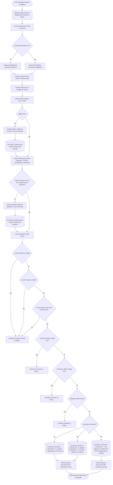

# Informe Traspasos

**Formulario:** `I_Traspa.frm`
**Tabla(s) principal(es):** `b_totventas` (cabecera de documentos de traspaso), `b_detventas` (líneas de detalle por producto)
**Consulta principal:** Sin procedimiento almacenado: consultas directas al servidor desde las funciones `I_ResumenTraspasos`, `I_DetalleTraspasos` e `I_DiferenciaTraspasos` definidas en `Informes.bas`

---

## Índice

- [1 — ¿Para qué sirve esta pantalla?](#1--para-qué-sirve-esta-pantalla)
- [2 — ¿Qué necesito para usarla?](#2--qué-necesito-para-usarla)
- [3 — ¿Cómo se usa?](#3--cómo-se-usa)
  - [3.1 Flujo paso a paso](#31-flujo-paso-a-paso)
  - [3.2 Controles y acciones disponibles](#32-controles-y-acciones-disponibles)
- [4 — ¿Qué restricciones debo conocer?](#4--qué-restricciones-debo-conocer)
  - [4.1 Validaciones del sistema](#41-validaciones-del-sistema)
- [5 — ¿Qué obtengo?](#5--qué-obtengo)
  - [Resumen de tipos disponibles](#resumen-de-tipos-disponibles)
  - [(01) Resumen Traspasos por Periodo](#01-resumen-traspasos-por-periodo-i_resumentraspasos)
  - [(02) Detalle Traspasos por Periodo](#02-detalle-traspasos-por-periodo-i_detalletraspasos)
  - [(03) Diferencia entre Contrato](#03-diferencia-entre-contrato-i_diferenciatraspasos)
- [6 — Referencia técnica](#6--referencia-técnica)
  - [Tablas que intervienen](#tablas-que-intervienen)
  - [Relación con otros módulos](#relación-con-otros-módulos)

---

## 1 — ¿Para qué sirve esta pantalla?

[↑ Volver al índice](#índice)

Esta pantalla permite consultar y obtener informes sobre los movimientos de traspaso de mercadería entre bodegas y contratos dentro del sistema. A través de ella se puede revisar, para un período de fechas definido, qué productos fueron traspasados, desde y hacia qué bodega y contrato, cuánto se recibió, cuánto se valoró y si existieron diferencias entre la cantidad indicada en la guía de traspaso y la cantidad efectivamente recibida.

La pantalla se organiza en un panel de filtros que el usuario completa antes de generar el informe. Los filtros incluyen: el tipo de informe deseado (selector en la parte superior), el rango de fechas (desde/hasta), la bodega de referencia, el contrato o casino (con opción de seleccionar uno específico o todos), el tipo de movimiento (entradas, salidas o ambos), y opcionalmente un producto específico. El panel de productos se habilita o deshabilita automáticamente según el tipo de informe elegido.

Los tres tipos de informe disponibles cubren niveles distintos de análisis: el primero entrega un resumen por documento de traspaso agrupado por contrato; el segundo desglosa cada traspaso hasta el nivel de producto con sus cantidades y precios; y el tercero se focaliza exclusivamente en los registros donde la cantidad indicada en la guía difiere de la cantidad efectivamente recibida, permitiendo detectar inconsistencias en la recepción de mercadería.

---

## 2 — ¿Qué necesito para usarla?

[↑ Volver al índice](#índice)

| Campo | Descripción | Obligatorio |
|---|---|---|
| Tipo de Informe | Lista desplegable con las tres modalidades de informe disponibles. Determina qué información se muestra y habilita o deshabilita el filtro de productos. | Sí |
| Fecha Desde | Fecha de inicio del período a consultar. Formato dd/mm/yyyy. | Sí |
| Fecha Hasta | Fecha de término del período a consultar. Formato dd/mm/yyyy. Debe ser igual o posterior a la fecha de inicio. | Sí |
| Bodega | Lista desplegable con las bodegas asociadas al contrato en sesión. Se carga automáticamente al abrir el formulario. | Sí |
| Contrato — Uno / Todos | Permite filtrar por un contrato específico o incluir todos los contratos. Si se elige "Uno", se debe ingresar el código de contrato manualmente o buscarlo con el ícono de búsqueda. | Sí |
| Código de contrato | Campo de texto para ingresar el código del contrato cuando se selecciona la opción "Uno". El sistema muestra automáticamente el nombre del contrato al salir del campo. Incluye un buscador que abre un selector de contratos. | Solo si se elige "Uno" |
| Tipo de Traspasos | Lista desplegable con las opciones: TODOS, ENTRADAS o SALIDAS. Filtra el sentido del movimiento de traspaso. | Sí |
| Productos — Uno / Todos | Permite filtrar por un producto específico o incluir todos. Solo disponible en los tipos de informe (02) y (03). El panel completo se deshabilita para el tipo (01). | No (solo para tipos 02 y 03) |
| Código de producto | Campo de texto para ingresar el código del producto cuando se selecciona "Uno" en el filtro de productos. El sistema muestra automáticamente el nombre del producto. Incluye un buscador que abre un selector de productos. | Solo si se elige "Uno" en productos |

---

## 3 — ¿Cómo se usa?

[↑ Volver al índice](#índice)

### 3.1 Flujo paso a paso

[↑ Volver al índice](#índice)

### 3.2 Controles y acciones disponibles

[↑ Volver al índice](#índice)

| Control / Acción | Descripción |
|---|---|
| **Tipo de Informe** | Lista desplegable principal con tres opciones. Al seleccionar la opción (01), el sistema deshabilita automáticamente el panel de Productos. Al seleccionar (03), fija el Tipo de Traspasos en ENTRADAS y deshabilita ese selector. |
| **Fecha Desde / Fecha Hasta** | Campos de fecha con formato dd/mm/yyyy. El sistema los inicializa al abrir el formulario. Definen el período de consulta. |
| **Bodega** | Lista desplegable que se carga automáticamente con las bodegas vinculadas al contrato activo en sesión. No requiere acción del usuario para llenarse. |
| **Contrato — opción "Uno"** | Al marcar esta opción se habilitan el campo de código de contrato y el ícono de búsqueda. Al escribir el código y salir del campo, el sistema muestra el nombre del contrato correspondiente. |
| **Contrato — opción "Todos"** | Al marcar esta opción se limpia y deshabilita el campo de código de contrato. El informe incluirá todos los contratos de la bodega seleccionada. |
| **Ícono de búsqueda de contrato** | Abre un selector de contratos donde el usuario puede localizar el contrato deseado. Al confirmar, el código y nombre se cargan automáticamente en el campo correspondiente. |
| **Tipo de Traspasos** | Lista desplegable con las opciones TODOS, ENTRADAS y SALIDAS. Determina el sentido del movimiento a incluir en el informe. Para el tipo de informe (03) queda fijo en ENTRADAS. |
| **Productos — opción "Uno"** | Al marcar esta opción se habilitan el campo de código de producto y el ícono de búsqueda de productos. Solo disponible para los tipos de informe (02) y (03). |
| **Productos — opción "Todos"** | Al marcar esta opción se limpia y deshabilita el campo de código de producto. El informe incluirá todos los productos del período. |
| **Ícono de búsqueda de producto** | Abre un selector de productos donde el usuario puede localizar el producto deseado. Al confirmar, el código y nombre se cargan automáticamente. |
| **Vista Previa** | Botón principal de la barra de herramientas. Valida todos los filtros y, si son correctos, ejecuta la consulta y genera el documento RTF con el informe seleccionado. Muestra el resultado en una ventana de vista previa. Solo visible para usuarios con permiso habilitado. |
| **Salir** | Botón de la barra de herramientas que cierra el formulario y lo descarga de memoria. |

---

## 4 — ¿Qué restricciones debo conocer?

[↑ Volver al índice](#índice)

### 4.1 Validaciones del sistema

[↑ Volver al índice](#índice)

| # | Cuándo aparece | Qué verifica el sistema | Qué ve o experimenta el usuario |
|---|---|---|---|
| 1 | Al presionar Vista Previa | Que la Fecha Desde sea una fecha válida | Mensaje: `Rango de fechas no valido...` y el proceso se detiene. |
| 2 | Al presionar Vista Previa | Que la Fecha Hasta sea una fecha válida | Mensaje: `Rango de fechas no valido...` y el proceso se detiene. |
| 3 | Al presionar Vista Previa | Que la Fecha Desde no sea posterior a la Fecha Hasta | Mensaje: `Rango de fechas no valido...` y el proceso se detiene. |
| 4 | Al presionar Vista Previa | Que el nombre del contrato esté cargado cuando se eligió filtrar por uno específico | Mensaje: `Contrato no valido...` y el proceso se detiene. |
| 5 | Al presionar Vista Previa | Que el nombre del producto esté cargado cuando se eligió filtrar por uno específico | Mensaje: `Producto no valido...` y el proceso se detiene. |
| 6 | Al presionar Vista Previa | Que haya una bodega seleccionada en la lista desplegable | Mensaje: `Bodega no valida...` y el proceso se detiene. |
| 7 | Al ejecutar la consulta (cualquier tipo) | Que existan registros de traspaso que cumplan los criterios ingresados | Mensaje: `No existen datos para la consulta...` y no se genera el documento. |
| 8 | Al abrir el formulario | Que el usuario tenga permiso para usar la opción Vista Previa | Si no tiene permiso, el botón Vista Previa aparece deshabilitado y no puede generarse ningún informe. |

---

## 5 — ¿Qué obtengo?

[↑ Volver al índice](#índice)

### Resumen de tipos disponibles

[↑ Volver al índice](#índice)

| Código | Nombre en el selector | Formato de salida | Función principal |
|---|---|---|---|
| (01) | Resumen Traspasos por Periodo | Documento RTF — vista previa | `I_ResumenTraspasos` |
| (02) | Detalle Traspasos por Periodo | Documento RTF — vista previa | `I_DetalleTraspasos` |
| (03) | Diferencia entre Contrato | Documento RTF — vista previa | `I_DiferenciaTraspasos` |

---

### (01) Resumen Traspasos por Periodo (`I_ResumenTraspasos`)

[↑ Volver al índice](#índice)

**Qué muestra:** Un resumen de los documentos de traspaso emitidos en el período indicado, agrupados por contrato. Cada fila corresponde a un documento de traspaso e indica si fue una entrada o salida, junto con el monto total valorizado. Al final de cada contrato se muestra un subtotal y al final del informe un total general.

**Cómo se seleccionan los servicios:** No aplica selección de servicios. El filtro principal es la bodega y, opcionalmente, el contrato.

**Opciones de configuración disponibles:**
- **Tipo de Traspasos:** controla si se incluyen TODOS los movimientos, solo ENTRADAS (código interno 1) o solo SALIDAS (código interno 0). Al elegir TODOS, se incluyen ambos tipos.
- **Contrato:** permite acotar el informe a un contrato específico o incluir todos los contratos asociados a la bodega seleccionada.

**Estructura de datos del informe:**

| Campo / Columna | Descripción | Calculado |
|---|---|---|
| N° Doc. | Número interno del documento de traspaso | No |
| N° Folio | Número de folio informativo del documento | No |
| T. Doc. | Tipo de movimiento: ENTRADA o SALIDA | Sí |
| Contratos | Código y nombre del contrato receptor o emisor | No |
| F.Emisión | Fecha en que se emitió el documento de traspaso | No |
| Total | Monto total valorizado del documento de traspaso | Sí |
| Total Contrato | Suma de los totales de todos los documentos del mismo contrato | Sí |
| Total General | Suma de todos los totales del informe | Sí |

**Cálculo — T. Doc.**

Indica si el movimiento corresponde a una entrada o una salida de mercadería en la bodega.

**Fórmula o lógica:**
El campo `tov_codser` de la cabecera del documento determina el tipo: si es igual a 1, se muestra "ENTRADA"; en caso contrario, se muestra "SALIDA".

| Componente | Qué representa | De dónde viene |
|---|---|---|
| `tov_codser` | Código de sentido del movimiento | `b_totventas.tov_codser` |

> Ejemplo: un documento con `tov_codser = 1` aparece como "ENTRADA"; uno con `tov_codser = 0` aparece como "SALIDA".

**Cálculo — Total**

Representa el valor monetario total del documento de traspaso, calculado como la suma de (cantidad recibida × precio de costo) para todas las líneas del documento.

**Fórmula o lógica:**
Total = SUM(`dev_canmer` × `dev_precos`) agrupado por documento (`tov_numdoc`)

| Componente | Qué representa | De dónde viene |
|---|---|---|
| `dev_canmer` | Cantidad efectivamente recibida o despachada en la línea | `b_detventas.dev_canmer` |
| `dev_precos` | Precio de costo unitario del producto en el momento del traspaso | `b_detventas.dev_precos` |

> Ejemplo: si una línea tiene 10 unidades recibidas a $500 cada una, aporta $5.000 al total del documento.

**Cálculo — Total Contrato**

Suma acumulada de los totales de todos los documentos de traspaso asociados al mismo contrato dentro del período consultado.

**Fórmula o lógica:**
Total Contrato = Σ Total de cada documento con el mismo `tov_codcas`

**Cálculo — Total General**

Suma de todos los totales del informe, sin distinción de contrato.

**Fórmula o lógica:**
Total General = Σ Total Contrato de todos los contratos incluidos en el informe.

**Formato de salida:** Documento RTF con vista previa en pantalla. Orientación retrato. Encabezado de página con nombre de la empresa y pie con número de página. El cuerpo del informe incluye un bloque de parámetros (bodega, contrato, tipo de traspaso y rango de fechas) seguido de la tabla de datos con encabezados en fondo amarillo. Los datos se agrupan por contrato con subtotales en negrita al final de cada grupo, y un total general en negrita al final del informe.

---

### (02) Detalle Traspasos por Periodo (`I_DetalleTraspasos`)

[↑ Volver al índice](#índice)

**Qué muestra:** El detalle completo de los traspasos del período, desglosado hasta el nivel de producto dentro de cada documento. Cada documento ocupa un bloque de filas: primero aparece una fila de encabezado con los datos del documento (número, folio, tipo, contrato y fecha), y debajo, una fila por cada producto incluido en ese documento con su unidad de medida, cantidad, precio unitario y total de la línea.

**Cómo se seleccionan los servicios:** No aplica selección de servicios. Los filtros son bodega, contrato y opcionalmente un producto específico.

**Opciones de configuración disponibles:**
- **Tipo de Traspasos:** controla si se incluyen TODOS los movimientos, solo ENTRADAS o solo SALIDAS.
- **Contrato:** permite filtrar por un contrato específico o incluir todos.
- **Productos:** permite filtrar por un producto específico o incluir todos los productos.

**Estructura de datos del informe:**

| Campo / Columna | Descripción | Calculado |
|---|---|---|
| N° Doc. | Número interno del documento de traspaso | No |
| N° Folio | Número de folio del documento | No |
| T. Doc. | Tipo de movimiento: ENTRADA o SALIDA | Sí |
| Contratos | Código y nombre del contrato | No |
| F.Emisión | Fecha de emisión del documento | No |
| (Código y nombre del producto) | Código y descripción del producto en la línea de detalle | No |
| Unidad | Nombre de la unidad de medida del producto | No |
| Cant. Rec. | Cantidad recibida o despachada en la línea | No |
| Precio | Precio de costo unitario del producto | No |
| Total | Valor total de la línea (cantidad × precio) | Sí |
| Total Traspaso | Suma de los totales de todas las líneas del mismo documento | Sí |
| Total General | Suma de todos los totales de documentos del informe | Sí |

**Cálculo — T. Doc.**

Mismo criterio que en el tipo (01): si `tov_codser = 1` se muestra "ENTRADA"; en caso contrario "SALIDA".

**Cálculo — Total (línea de producto)**

Valor monetario de la línea de detalle.

**Fórmula o lógica:**
Total línea = `dev_canmer` × `dev_precos`

| Componente | Qué representa | De dónde viene |
|---|---|---|
| `dev_canmer` | Cantidad recibida o despachada en la línea | `b_detventas.dev_canmer` |
| `dev_precos` | Precio de costo unitario | `b_detventas.dev_precos` |

> Ejemplo: 5 kg de harina a $800/kg = $4.000 en la columna Total de esa línea.

**Cálculo — Total Traspaso**

Suma de los totales de todas las líneas de producto dentro del mismo documento de traspaso.

**Fórmula o lógica:**
Total Traspaso = Σ (`dev_canmer` × `dev_precos`) para todas las líneas del mismo `tov_numdoc`

**Cálculo — Total General**

Suma acumulada de todos los totales de traspaso incluidos en el informe.

**Formato de salida:** Documento RTF con vista previa en pantalla. Orientación retrato. Encabezado de página con nombre de la empresa y pie con número de página. El cuerpo incluye un bloque de parámetros (bodega, contrato, tipo de traspaso y rango de fechas) seguido de la tabla de datos. Cada documento ocupa un bloque de dos o más filas: una fila de encabezado del documento y una o más filas de productos. Al final de cada documento se muestra el subtotal en negrita. Al final del informe aparece el Total General en negrita.

---

### (03) Diferencia entre Contrato (`I_DiferenciaTraspasos`)

[↑ Volver al índice](#índice)

**Qué muestra:** Un informe de control que lista exclusivamente las líneas de traspaso donde la cantidad indicada en la guía de origen difiere de la cantidad efectivamente recibida o registrada en el sistema. Permite detectar discrepancias en la recepción de mercadería. Solo se incluyen registros con diferencia distinta de cero.

**Restricciones propias del tipo:** Al seleccionar este tipo de informe, el selector de Tipo de Traspasos se fija automáticamente en ENTRADAS (código interno 1) y se deshabilita, por lo que no es posible consultar salidas en este tipo de informe.

**Cómo se seleccionan los servicios:** No aplica selección de servicios. Los filtros son bodega, contrato y opcionalmente un producto específico.

**Opciones de configuración disponibles:**
- **Contrato:** permite filtrar por un contrato específico o incluir todos.
- **Productos:** permite filtrar por un producto específico o incluir todos los productos.

**Estructura de datos del informe:**

| Campo / Columna | Descripción | Calculado |
|---|---|---|
| N° Doc. | Número interno del documento de traspaso | No |
| N° Folio | Número de folio del documento | No |
| T. Doc. | Tipo de movimiento: ENTRADA o SALIDA | Sí |
| Contratos | Código y nombre del contrato | No |
| F.Emisión | Fecha de emisión del documento | No |
| (Código y nombre del producto) | Código y descripción del producto | No |
| Unidad | Unidad de medida del producto | No |
| Cantidad Guia | Cantidad indicada en el documento de origen del traspaso | No |
| C. Recibida | Cantidad efectivamente recibida y registrada en el sistema | No |
| Diferencia | Diferencia entre la cantidad de la guía y la recibida | Sí |
| Precio | Precio de costo unitario del producto | No |
| Total | Valor monetario de la diferencia (diferencia × precio) | Sí |
| Total Diferencia | Suma de los totales de diferencia por documento | Sí |
| Total General | Suma de todos los totales de diferencia del informe | Sí |

**Cálculo — T. Doc.**

Mismo criterio que los tipos anteriores: `tov_codser = 1` se muestra "ENTRADA", de lo contrario "SALIDA".

**Cálculo — Diferencia**

Cuantifica la discrepancia entre lo documentado en origen y lo efectivamente recibido.

**Fórmula o lógica:**
Diferencia = `dev_canmin` − `dev_canmer`

| Componente | Qué representa | De dónde viene |
|---|---|---|
| `dev_canmin` | Cantidad indicada en la guía de traspaso de origen | `b_detventas.dev_canmin` |
| `dev_canmer` | Cantidad efectivamente recibida o registrada | `b_detventas.dev_canmer` |

> Ejemplo: la guía indica 20 kg (`dev_canmin = 20`) pero se reciben 18 kg (`dev_canmer = 18`). La diferencia es 2 kg.

> Nota: solo aparecen en este informe las líneas donde `dev_canmin ≠ dev_canmer`. Las líneas sin diferencia quedan excluidas de la consulta.

**Cálculo — Total (valor de la diferencia)**

Monetiza la diferencia detectada, permitiendo estimar el impacto económico de la discrepancia.

**Fórmula o lógica:**
Total = (`dev_canmin` − `dev_canmer`) × `dev_precos`

| Componente | Qué representa | De dónde viene |
|---|---|---|
| `dev_canmin` − `dev_canmer` | Diferencia de cantidad | `b_detventas` |
| `dev_precos` | Precio de costo unitario | `b_detventas.dev_precos` |

> Ejemplo: 2 kg de diferencia a $1.500/kg = $3.000 en la columna Total.

**Cálculo — Total Diferencia**

Suma de los valores de diferencia de todas las líneas del mismo documento.

**Fórmula o lógica:**
Total Diferencia = Σ ((`dev_canmin` − `dev_canmer`) × `dev_precos`) para todas las líneas del mismo `tov_numdoc`

**Cálculo — Total General**

Suma acumulada de todos los totales de diferencia incluidos en el informe.

**Formato de salida:** Documento RTF con vista previa en pantalla. Orientación paisaje (horizontal). Encabezado de página con nombre de la empresa y pie con número de página. El cuerpo incluye un bloque de parámetros (bodega, contrato, tipo de traspaso y rango de fechas) seguido de la tabla de datos con 11 columnas. Cada documento ocupa un bloque de filas: una fila de encabezado del documento y una o más filas de productos con diferencia. Al final de cada documento se muestra el subtotal de diferencia en negrita, y al final del informe el Total General en negrita.

---

## 6 — Referencia técnica

[↑ Volver al índice](#índice)

### Tablas que intervienen

[↑ Volver al índice](#índice)

| Tabla | Para qué se usa en este reporte | Campos clave |
|---|---|---|
| `b_totventas` | Fuente principal: cabecera de cada documento de traspaso. Se filtra por tipo de documento `'TR'`, bodega, contrato, sentido del movimiento y rango de fechas. | `tov_rutcli`, `tov_tipdoc`, `tov_numdoc`, `tov_numinf`, `tov_codbod`, `tov_codcas`, `tov_codser`, `tov_fecemi` |
| `b_detventas` | Detalle de líneas por producto dentro de cada documento de traspaso. Contiene las cantidades y precios. | `dev_rutcli`, `dev_tipdoc`, `dev_numdoc`, `dev_codmer`, `dev_canmin`, `dev_canmer`, `dev_precos` |
| `b_clientes` | Catálogo de contratos/casinos. Se usa para obtener el nombre del contrato asociado al código de cliente del documento. | `cli_codigo`, `cli_nombre`, `cli_codbod` |
| `b_productos` | Catálogo de productos. Se usa en los tipos (02) y (03) para obtener el nombre del producto a partir de su código. | `pro_codigo`, `pro_nombre`, `pro_coduni` |
| `a_unidad` | Catálogo de unidades de medida. Se usa en los tipos (02) y (03) para mostrar el nombre de la unidad de cada producto. | `uni_codigo`, `uni_nombre` |
| `a_bodega` | Catálogo de bodegas. Se usa para cargar la lista desplegable de bodegas y para mostrar el nombre de la bodega en el encabezado del informe. | `bod_codigo`, `bod_nombre` |

### Relación con otros módulos

[↑ Volver al índice](#índice)

| Módulo | Relación |
|---|---|
| **Inventario / Bodega** | Los documentos de traspaso (`b_totventas` con tipo `'TR'`) son generados por el módulo de bodega cuando se registra un movimiento de mercadería entre bodegas o hacia un contrato. Este informe los consume como datos de solo lectura. |
| **Contratos** | La lista de contratos disponibles y sus nombres provienen del maestro de clientes/contratos (`b_clientes`), que es administrado por el módulo de Contratos. |
| **Productos** | El catálogo de productos (`b_productos`) y sus unidades de medida (`a_unidad`) son mantenidos externamente a este módulo. Este informe los usa únicamente como referencia para enriquecer los datos de las líneas de traspaso. |

---

*Fuentes: `I_Traspa.frm`, funciones `I_ResumenTraspasos`, `I_DetalleTraspasos`, `I_DiferenciaTraspasos` en `Informes.bas`, tablas `b_totventas`, `b_detventas`, `b_clientes`, `b_productos`, `a_unidad`, `a_bodega` en `SGP_Local.sql`*
