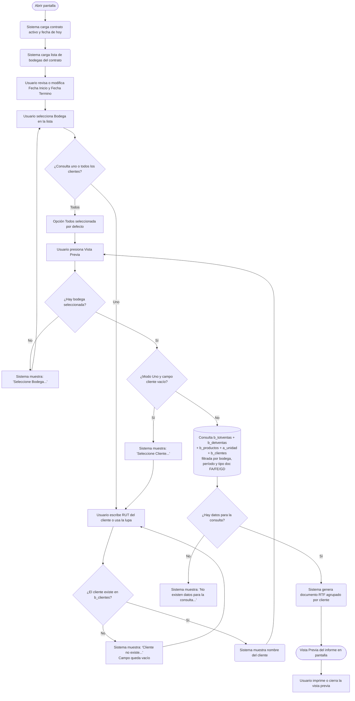

# Informe de Venta Directa

**Formulario:** `I_VenDir.frm`
**Tablas principales:** `b_totventas` (encabezados de documentos de venta), `b_detventas` (líneas de detalle de cada documento)
**Consulta principal:** Sin procedimiento almacenado — consulta directa a las tablas `b_totventas`, `b_detventas`, `b_productos`, `a_unidad` y `b_clientes`

---

## Índice

- [1 — ¿Para qué sirve esta pantalla?](#1--para-qué-sirve-esta-pantalla)
- [2 — ¿Qué necesito para usarla?](#2--qué-necesito-para-usarla)
- [3 — ¿Cómo se usa?](#3--cómo-se-usa)
  - [3.1 Flujo paso a paso](#31-flujo-paso-a-paso)
  - [3.2 Controles y acciones disponibles](#32-controles-y-acciones-disponibles)
- [4 — ¿Qué restricciones debo conocer?](#4--qué-restricciones-debo-conocer)
  - [4.1 Validaciones del sistema](#41-validaciones-del-sistema)
- [5 — ¿Qué obtengo?](#5--qué-obtengo)
- [6 — Referencia técnica](#6--referencia-técnica)
  - [Tablas que intervienen](#tablas-que-intervienen)
  - [Relación con otros módulos](#relación-con-otros-módulos)

---

## 1 — ¿Para qué sirve esta pantalla?

[↑ Volver al índice](#índice)

Esta pantalla genera un informe de ventas directas realizadas a clientes en un período determinado. El informe consolida los documentos de tipo factura (`FA`), factura electrónica (`FE`) o guía de despacho (`GD`) emitidos para una bodega específica, mostrando el detalle de los productos vendidos (cantidad, unidad de medida y monto total) agrupados por cliente.

La pantalla permite dos modalidades de consulta: consultar las ventas de un único cliente específico, o bien consultar las ventas de todos los clientes que tengan documentos emitidos en la bodega y período seleccionados. El modo de consulta se elige mediante los botones de opción del panel "Cliente". Los documentos anulados (estado `A`) y los marcados como pendientes (estado `P`) quedan excluidos de la consulta en ambas modalidades.

Visualmente, la pantalla se organiza en dos paneles: el panel superior contiene los campos de filtro (contrato, rango de fechas y selector de bodega), y el panel inferior contiene las opciones de cliente. Una barra de herramientas en la parte superior ofrece los botones de acción: "Vista Previa" para generar el informe y "Salir" para cerrar la pantalla. El resultado se genera como un documento RTF que se presenta en un visor de vista previa antes de imprimir.

---

## 2 — ¿Qué necesito para usarla?

[↑ Volver al índice](#índice)

| Campo | Descripción | Obligatorio |
|---|---|---|
| Contrato | Código del contrato (casino) sobre el que se consultan las ventas. Se puede escribir directamente el código o usar el botón de búsqueda (lupa) para abrir un formulario auxiliar de selección de contratos. Al salir del campo, el sistema valida que el contrato exista y muestra su nombre a la derecha. Si el sistema está en modo de un solo casino, el contrato se carga automáticamente al abrir la pantalla. | Sí |
| Fecha Inicio | Fecha de inicio del período a consultar, en formato `dd/mm/aaaa`. Por defecto se carga la fecha del día actual al abrir el formulario. | Sí |
| Fecha Termino | Fecha de término del período a consultar, en formato `dd/mm/aaaa`. Por defecto se carga la fecha del día actual al abrir el formulario. | Sí |
| Bodega | Lista desplegable con las bodegas asociadas al contrato activo. Se carga automáticamente al abrir el formulario a partir de la relación entre `a_bodega` y `b_clientes`. Siempre se preselecciona la primera bodega de la lista. | Sí |
| Cliente — Uno / Todos | Botones de opción que determinan si el informe abarca un cliente específico o todos los clientes. Por defecto se selecciona "Todos". Si se elige "Uno", se habilita el campo de cliente. | Sí |
| Cliente (código RUT) | Visible y obligatorio solo cuando se selecciona la opción "Uno". Permite ingresar el RUT del cliente o buscarlo mediante la lupa. Al salir del campo, el sistema valida que el RUT exista en la tabla de clientes y muestra el nombre. | Condicional |

---

## 3 — ¿Cómo se usa?

[↑ Volver al índice](#índice)

### 3.1 Flujo paso a paso

[↑ Volver al índice](#índice)

### 3.2 Controles y acciones disponibles

[↑ Volver al índice](#índice)

| Control / Acción | Descripción |
|---|---|
| **Campo Contrato** | Campo de texto donde se ingresa el código del contrato. Al perder el foco, valida que el contrato exista (`cli_tipo = 0`) y muestra su nombre. |
| **Lupa junto a Contrato** | Abre el formulario auxiliar `B_TabEst` para buscar y seleccionar un contrato de la tabla `b_clientes`. Disponible solo cuando el sistema está en modo multi-casino. |
| **Fecha Inicio** | Campo de fecha con selector de calendario. Acepta ingreso manual en formato `dd/mm/aaaa`. Presionar Enter avanza al siguiente campo. |
| **Fecha Termino** | Campo de fecha con selector de calendario. Acepta ingreso manual en formato `dd/mm/aaaa`. Presionar Enter avanza al siguiente campo. |
| **Lista desplegable Bodega** | Muestra las bodegas asociadas al contrato activo. Solo permite seleccionar; no es editable. Presionar Enter avanza al siguiente campo. |
| **Botón Uno** | Activa la modalidad de un cliente específico. Habilita el campo de RUT de cliente y su lupa. |
| **Botón Todos** | Activa la modalidad de todos los clientes. Deshabilita y limpia el campo de RUT de cliente. Esta opción está activa por defecto al abrir la pantalla. |
| **Campo Cliente (RUT)** | Habilitado solo en modo "Uno". Al perder el foco, el sistema verifica el RUT en `b_clientes` (`cli_tipo = 1`, `cli_activo = '1'`) y muestra el nombre del cliente. El RUT se formatea automáticamente con dígito verificador. |
| **Lupa junto a Cliente** | Habilitada solo en modo "Uno". Abre `B_TabEst` para buscar y seleccionar un cliente. |
| **Vista Previa** (barra de herramientas) | Valida los filtros ingresados y, si son correctos, ejecuta la consulta y genera el documento RTF en el visor de vista previa. Visible solo si el usuario tiene permiso de impresión. |
| **Salir** (barra de herramientas) | Cierra el formulario sin generar ningún informe. |

---

## 4 — ¿Qué restricciones debo conocer?

[↑ Volver al índice](#índice)

### 4.1 Validaciones del sistema

[↑ Volver al índice](#índice)

| # | Cuándo aparece | Qué verifica el sistema | Qué ve o experimenta el usuario |
|---|---|---|---|
| 1 | Al salir del campo Contrato | Que el código ingresado corresponda a un registro en `b_clientes` con `cli_tipo = 0` (tipo contrato). | Mensaje: `Contrato no existe...` El campo queda vacío y el foco regresa al campo de contrato. |
| 2 | Al salir del campo Cliente (modo "Uno") | Que el RUT ingresado corresponda a un cliente activo en `b_clientes` con `cli_tipo = 1` y `cli_activo = '1'`. | Mensaje: `Cliente no existe...` El campo queda vacío. |
| 3 | Al presionar Vista Previa | Que haya una bodega seleccionada en la lista desplegable. | Mensaje: `Seleccione Bodega...` El sistema no ejecuta la consulta. |
| 4 | Al presionar Vista Previa (modo "Uno") | Que el campo de RUT de cliente no esté vacío. | Mensaje: `Seleccione Cliente...` El sistema no ejecuta la consulta. |
| 5 | Al generar el informe | Que la consulta devuelva al menos un registro (documentos FA, FE o GD no anulados ni pendientes, en la bodega y período indicados). | Mensaje: `No existen datos para la consulta...` No se genera el documento. |
| 6 | Acceso al botón Vista Previa | Que el usuario tenga permiso de impresión configurado en el sistema. | Si no tiene permiso, el botón "Vista Previa" no aparece en la barra de herramientas. |

---

## 5 — ¿Qué obtengo?

[↑ Volver al índice](#índice)

El formulario genera un único tipo de informe: **Ventas por Período**. No existe selector de tipo; el resultado es siempre el mismo documento con el alcance definido por los filtros (un cliente o todos).

**Función que genera el informe:** `I_VenDirect` en `InforEG.bas`

**Formato de salida:** documento RTF con vista previa en pantalla, orientación vertical (portrait), margen izquierdo de 500 twips. El documento también se exporta simultáneamente a un archivo de texto delimitado por `|` en la ruta temporal configurada en `vg_Archxls`.

**Encabezado del documento:** el informe incluye un bloque de encabezado con:

| Campo en el encabezado | Contenido |
|---|---|
| Contrato | Código y nombre del contrato consultado |
| Bodega | Nombre de la bodega seleccionada |
| Período | Fecha inicio — Fecha término |

**Detalle del informe:** los registros se presentan agrupados por cliente. Para cada cliente aparece primero una fila de encabezado con su RUT y nombre en negrita, luego las líneas de productos, y finalmente una fila de subtotal para ese cliente. Al final del documento se muestra el Total General de todas las ventas.

**Columnas del detalle por producto:**

| Columna | Origen | Calculado | Descripción |
|---|---|---|---|
| Código | `b_detventas.dev_codmer` | No | Código interno del producto vendido |
| Descripción | `b_productos.pro_nombre` | No | Nombre del producto |
| Cantidad | `SUM(b_detventas.dev_canmer)` | Sí | Suma de cantidades vendidas del producto para ese cliente en el período |
| Unidad | `a_unidad.uni_nomcor` | No | Abreviatura de la unidad de medida del producto |
| Total | `SUM(b_detventas.dev_ptotal)` | Sí | Suma del monto total vendido del producto para ese cliente en el período |

**Filas de subtotal:**

| Fila | Contenido |
|---|---|
| Total Cliente `<RUT>` | Suma de la columna Total de todos los productos del cliente |
| Total General | Suma de la columna Total de todos los clientes del informe |

**Documentos incluidos:** solo se consideran documentos con `tov_tipdoc` igual a `FA` (factura), `FE` (factura electrónica) o `GD` (guía de despacho), y cuyo estado (`tov_estdoc`) no sea `A` (anulado) ni `P` (pendiente).

---

## 6 — Referencia técnica

[↑ Volver al índice](#índice)

### Tablas que intervienen

[↑ Volver al índice](#índice)

| Tabla | Descripción funcional | Rol en este informe |
|---|---|---|
| `b_totventas` | Encabezados de documentos de venta (facturas, guías, etc.) | Fuente principal: filtra por bodega, período, tipo de documento y estado |
| `b_detventas` | Líneas de detalle de cada documento de venta | Provee código de producto, cantidad vendida y monto total por línea |
| `b_productos` | Maestro de productos del inventario | Aporta el nombre del producto |
| `a_unidad` | Tabla de unidades de medida | Aporta la abreviatura de la unidad (`uni_nomcor`) |
| `b_clientes` | Registro de contratos y clientes del sistema | Aporta el nombre del cliente; también se usa para validar el contrato ingresado y para cargar la lista de bodegas disponibles |
| `a_bodega` | Bodegas registradas en el sistema | Se usa al cargar el combo de bodegas: se une con `b_clientes` para mostrar solo las bodegas asociadas al contrato activo (`a_bodega.bod_codigo = b_clientes.cli_codbod`) |

**Campos clave de `b_totventas`:**

| Campo | Descripción |
|---|---|
| `tov_rutcli` | RUT del titular del documento (contrato/casino) |
| `tov_codcas` | Código del cliente final al que se emitió el documento |
| `tov_tipdoc` | Tipo de documento: `FA` = factura, `FE` = factura electrónica, `GD` = guía de despacho, entre otros |
| `tov_numdoc` | Número correlativo del documento |
| `tov_codbod` | Código de la bodega que emitió el documento |
| `tov_fecemi` | Fecha de emisión del documento |
| `tov_estdoc` | Estado del documento: `A` = anulado, `P` = pendiente; los demás estados son vigentes |

**Campos clave de `b_detventas`:**

| Campo | Descripción |
|---|---|
| `dev_numdoc` | Número del documento al que pertenece la línea |
| `dev_tipdoc` | Tipo de documento (debe coincidir con `tov_tipdoc`) |
| `dev_codmer` | Código del producto vendido |
| `dev_canmer` | Cantidad vendida en la línea |
| `dev_ptotal` | Monto total de la línea (precio × cantidad) |

### Relación con otros módulos

[↑ Volver al índice](#índice)

- **Módulo de Inventario / Ventas:** los documentos consultados (`b_totventas`, `b_detventas`) son generados por el módulo de ventas y salidas de bodega. Este informe es de solo lectura y no modifica ningún dato.
- **Maestro de Clientes y Contratos (`b_clientes`):** el contrato ingresado en el filtro es validado contra esta tabla (campo `cli_tipo = 0` identifica contratos). Los clientes en modo "Uno" se validan con `cli_tipo = 1`.
- **Bodegas (`a_bodega`):** la lista de bodegas disponibles se obtiene cruzando `a_bodega` con `b_clientes` a través del campo `cli_codbod`, de modo que solo se muestran bodegas asociadas al contrato activo.
- **Maestro de Productos (`b_productos`) y Unidades (`a_unidad`):** se usan para enriquecer el detalle del informe con el nombre del producto y la unidad de medida, pero no son modificados por esta pantalla.
- **Permisos de usuario:** el botón "Vista Previa" se oculta si el perfil del usuario no tiene habilitada la acción de impresión para este formulario (se evalúa con `ValidarUsuario`).

---

*Fuentes: `I_VenDir.frm`, función `I_VenDirect` en `InforEG.bas`, función `CargarDatoCombo` en `RutinasI.bas`, función `Cliente` en `RutinaLectura.cls`, tablas `b_totventas`, `b_detventas`, `b_clientes`, `b_productos`, `a_unidad`, `a_bodega` en `SGP_Local.sql`*
