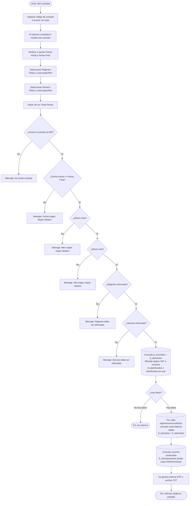

# Insumos no Planificados en Salida Bodega

**Formulario:** `I_FCost.frm` (modo `InNPla`)
**Función principal:** `I_InsumoNoPlanifSalBod` en `Informes.bas`
**Tabla(s) principal(es):** `b_totventas` (cabeceras de documentos de salida de bodega), `b_detventas` (líneas de insumos de cada salida)
**Consulta principal:** consulta directa (SQL dinámico sin stored procedure)

---

## Índice

- [1 — ¿Para qué sirve esta pantalla?](#1--para-qué-sirve-esta-pantalla)
- [2 — ¿Qué necesito para usarla?](#2--qué-necesito-para-usarla)
- [3 — ¿Cómo se usa?](#3--cómo-se-usa)
  - [3.1 Flujo paso a paso](#31-flujo-paso-a-paso)
  - [3.2 Controles y acciones disponibles](#32-controles-y-acciones-disponibles)
- [4 — ¿Qué restricciones debo conocer?](#4--qué-restricciones-debo-conocer)
  - [4.1 Validaciones del sistema](#41-validaciones-del-sistema)
  - [4.2 Reglas de cálculo](#42-reglas-de-cálculo)
- [5 — ¿Qué obtengo?](#5--qué-obtengo)
- [6 — Referencia técnica](#6--referencia-técnica)
  - [Tablas que intervienen](#tablas-que-intervienen)
  - [Relación con otros módulos](#relación-con-otros-módulos)

---

## 1 — ¿Para qué sirve esta pantalla?

[↑ Volver al índice](#índice)

Este informe permite identificar, dentro de las salidas de bodega de producción, aquellos insumos que **no estaban contemplados en la planificación de la minuta**, así como los insumos planificados que **no fueron efectivamente utilizados**. Dicho de otro modo, responde a la pregunta: "¿qué se despachó desde bodega sin estar planificado, y qué estaba planificado pero nunca salió?"

El informe se organiza por régimen y servicio dentro del contrato seleccionado, y dentro de cada combinación régimen/servicio muestra dos bloques diferenciados: **"INSUMOS NO PLANIFICADOS UTILIZADOS"** (insumos que salieron de bodega sin figurar en la minuta planificada) e **"INSUMOS PLANIFICADOS NO UTILIZADOS"** (insumos que estaban en la minuta pero cuya cantidad planificada no se despachó). Para cada insumo se detalla código, nombre, unidad de medida, cantidad, precio medio ponderado (P.M.P.) y costo total, además de su proporción sobre el costo total de salida del día.

El resultado se genera en formato RTF (visualización en pantalla con opción de impresión) y simultáneamente en un archivo de texto delimitado por pipes (`|`) para exportación, lo que permite revisión fuera del sistema sin necesidad de impresión física.

---

## 2 — ¿Qué necesito para usarla?

[↑ Volver al índice](#índice)

| Campo | Tipo | Descripción | Obligatorio |
|---|---|---|---|
| Contrato | Código alfanumérico | Identificador del centro de costo (casino) a consultar. Se puede ingresar directamente o buscar con el ícono de lupa | Sí |
| Nombre del contrato | Solo lectura | Se completa automáticamente al ingresar el código de contrato | — |
| Fecha Inicial | Fecha (dd/mm/yyyy) | Primer día del rango a consultar. Se inicializa con la fecha actual | Sí |
| Fecha Final | Fecha (dd/mm/yyyy) | Último día del rango a consultar. Se inicializa con la fecha actual | Sí |
| Régimen | Lista o "Todos" | Permite filtrar por uno o varios regímenes (ej. Normal, Liviano). Por defecto incluye todos | Sí |
| Servicio | Lista o "Todos" | Permite filtrar por uno o varios servicios (ej. Almuerzo, Cena). Por defecto incluye todos | Sí |

> **Restricción de rango de fechas:** el período consultado debe pertenecer al **mismo mes y año**. No se permiten rangos que crucen meses ni años distintos.

---

## 3 — ¿Cómo se usa?

### 3.1 Flujo paso a paso

[↑ Volver al índice](#índice)



### 3.2 Controles y acciones disponibles

[↑ Volver al índice](#índice)

| Control | Tipo | Descripción |
|---|---|---|
| Campo Contrato | Entrada de texto | Se escribe el código de contrato directamente |
| Ícono lupa (Contrato) | Botón | Abre el selector de contratos para búsqueda asistida |
| Nombre del contrato | Etiqueta (solo lectura) | Muestra el nombre del contrato una vez validado el código |
| Fecha Inicial | Selector de fecha | Define el inicio del período a consultar |
| Fecha Final | Selector de fecha | Define el fin del período a consultar |
| Marco Régimen — Todos | Opción | Incluye todos los regímenes del contrato (seleccionado por defecto) |
| Marco Régimen — Lista | Opción + búsqueda | Permite elegir uno o más regímenes específicos |
| Marco Servicio — Todos | Opción | Incluye todos los servicios del contrato (seleccionado por defecto) |
| Marco Servicio — Lista | Opción + búsqueda | Permite elegir uno o más servicios específicos |
| Botón Vista Previa | Acción principal | Ejecuta las validaciones y genera el informe RTF |
| Botón Histórico Planificación Teórica | Acción secundaria | Abre el informe complementario de planificación teórica |
| Botón Salir | Navegación | Cierra el formulario |

---

## 4 — ¿Qué restricciones debo conocer?

### 4.1 Validaciones del sistema

[↑ Volver al índice](#índice)

| # | Cuándo aparece | Qué verifica | Qué ve el usuario |
|---|---|---|---|
| 1 | Al hacer clic en Vista Previa | El código de contrato ingresado existe en la tabla de clientes (`b_clientes`, `cli_tipo=0`) | `No existe contrato` |
| 2 | Al hacer clic en Vista Previa | La Fecha Inicial no es posterior a la Fecha Final | `Fecha origen Mayor destino` |
| 3 | Al hacer clic en Vista Previa | Ambas fechas pertenecen al mismo mes | `Mes origen mayor destino` |
| 4 | Al hacer clic en Vista Previa | Ambas fechas pertenecen al mismo año | `Año origen mayor destino` |
| 5 | Al hacer clic en Vista Previa | Se ha seleccionado al menos un régimen | `Regimen debe ser informado` |
| 6 | Al hacer clic en Vista Previa | Se ha seleccionado al menos un servicio | `Servicio debe ser informado` |

> **Nota:** si todas las validaciones pasan pero no existen movimientos con las condiciones requeridas para el período seleccionado, el sistema cierra el proceso silenciosamente sin generar informe (sin mensaje de error).

### 4.2 Reglas de cálculo

[↑ Volver al índice](#índice)

**Criterio de clasificación de insumos**

El sistema distingue los insumos según los campos `dev_canmin` (cantidad planificada en minuta) y `dev_canmer` (cantidad real despachada/devuelta) en la tabla `b_detventas`:

| Condición | Clasificación |
|---|---|
| `dev_canmer > 0` y `dev_canmin = 0` | INSUMO NO PLANIFICADO UTILIZADO (salió de bodega sin estar en minuta) |
| `dev_canmer = 0` y `dev_canmin > 0` | INSUMO PLANIFICADO NO UTILIZADO (estaba en minuta pero no se despachó) |

**Cálculo del costo por insumo**

- Para insumos no planificados: `Cantidad × P.M.P.` = `dev_canmer × dev_precos`
- Para insumos planificados no utilizados: `Cantidad × P.M.P.` = `dev_canmin × dev_precos`

El campo `dev_precos` corresponde al **Precio Medio Ponderado (P.M.P.)** del insumo vigente al momento de la salida de bodega.

**Cálculo del porcentaje sobre costo de salida**

Para cada insumo se calcula su proporción respecto al costo total de salida del día para ese régimen/servicio:

```
% Sobre Costo = (Costo del insumo / Costo total de salida del día) × 100
```

El costo total de salida del día se obtiene sumando `dev_canmer × dev_precos` para **todas** las líneas del documento de salida (`tov_tipdoc = 'SP'`) de ese régimen, servicio y fecha, independientemente de si son planificados o no.

Si el costo total de salida del día es cero, la columna "% Sobre Costo" queda vacía.

**Encabezado de grupo (por régimen/servicio/fecha)**

Cada bloque de régimen/servicio/fecha muestra en su encabezado:
- Fecha de producción
- Código y nombre del régimen
- Código y nombre del servicio
- Número de raciones producidas (obtenido de `b_minutaraciones` donde `mir_rutcli = 'PRODUCIDAS'`)
- Costo total de salida del día en `$`

---

## 5 — ¿Qué obtengo?

[↑ Volver al índice](#índice)

El informe genera un documento **RTF en orientación vertical (portrait)**, visualizable en pantalla, con el siguiente contenido:

- Encabezado corporativo con logo de la empresa y datos de página
- Título: "Insumos no Planificados en Salida Bodega"
- Datos del contrato (código y nombre)
- Por cada combinación de régimen / servicio / fecha dentro del período:
  - Encabezado de grupo (fecha, régimen, servicio, raciones producidas, costo de salida)
  - Bloque "INSUMOS NO PLANIFICADOS UTILIZADOS" con detalle de cada insumo
  - Bloque "INSUMOS PLANIFICADOS NO UTILIZADOS" con detalle de cada insumo
  - Fila de totales al cierre de cada bloque
- Pie de página con número de página

Además, se genera un **archivo de texto plano delimitado por pipes** (`|`) en la carpeta de trabajo del sistema, con la misma información para exportación o procesamiento externo.

### Estructura de columnas del informe

| # | Campo | Descripción | Calculado |
|---|---|---|---|
| 1 | Código | Código del insumo/producto (`pro_codigo`) | No |
| 2 | Producto | Nombre del insumo (`pro_nombre`) | No |
| 3 | Unidad Medida | Unidad de medida del insumo (`uni_nombre`) | No |
| 4 | Cantidad | Cantidad despachada (no planificados: `dev_canmer`) o planificada sin despachar (`dev_canmin`) | No (leído de BD) |
| 5 | P.M.P. | Precio Medio Ponderado al momento de la salida (`dev_precos`) | No (congelado en salida) |
| 6 | Total | Costo del insumo = Cantidad × P.M.P. | Sí |
| 7 | % Sobre Costo | Proporción del costo del insumo sobre el costo total de salida del día | Sí |

#### Cálculo — Total (columna 6)

```
Total = Cantidad × dev_precos

Donde Cantidad es:
  - dev_canmer  si el insumo es NO PLANIFICADO UTILIZADO
  - dev_canmin  si el insumo es PLANIFICADO NO UTILIZADO
```

#### Cálculo — % Sobre Costo (columna 7)

```
% Sobre Costo = (Total del insumo / Costo total salida del día para ese régimen/servicio/fecha) × 100

Costo total salida del día = SUM(dev_canmer × dev_precos) sobre TODAS las líneas
  de b_detventas donde tov_tipdoc='SP', tov_codbod=<bodega actual>,
  tov_rutcli=<contrato>, tov_codreg=<régimen>, tov_codser=<servicio>,
  tov_fecpro=<fecha>
```

> Si el costo total de salida del día es 0 (sin movimientos valorados), la columna queda en blanco.

### Filas de resumen

Al pie de cada bloque (INSUMOS NO PLANIFICADOS / PLANIFICADOS NO UTILIZADOS) se agrega una fila **"Total $"** con:
- Suma acumulada de la columna Total del bloque
- Suma acumulada del % Sobre Costo del bloque

---

## 6 — Referencia técnica

### Tablas que intervienen

[↑ Volver al índice](#índice)

| Tabla | Descripción funcional | Campos clave usados |
|---|---|---|
| `b_totventas` | Cabeceras de documentos de salida/ingreso de bodega. Cada fila es un documento completo (una salida de producción, una devolución, etc.) | `tov_rutcli` (contrato), `tov_tipdoc` (tipo: `SP`=salida producción), `tov_numdoc`, `tov_fecpro` (fecha de producción), `tov_codreg` (régimen), `tov_codser` (servicio), `tov_codbod` (bodega) |
| `b_detventas` | Líneas de detalle de cada documento de bodega. Cada fila es un insumo dentro de una salida | `dev_numdoc`, `dev_tipdoc`, `dev_rutcli`, `dev_codmer` (código insumo), `dev_canmin` (cantidad planificada), `dev_canmer` (cantidad real despachada), `dev_precos` (P.M.P. al momento de salida), `dev_numlin` |
| `b_minutaraciones` | Registro de raciones por tipo de comensal para cada minuta (fecha/régimen/servicio/contrato). Se usa para obtener las raciones "PRODUCIDAS" | `mir_cencos`, `mir_codreg`, `mir_codser`, `mir_fecmin`, `mir_rutcli` (='PRODUCIDAS'), `mir_nrorac` |
| `b_productos` | Maestro de insumos y productos del sistema | `pro_codigo`, `pro_nombre`, `pro_coduni` |
| `a_unidad` | Catálogo de unidades de medida | `uni_codigo`, `uni_nombre` |
| `a_regimen` | Catálogo de regímenes alimentarios (Normal, Liviano, etc.) | `reg_codigo`, `reg_nombre` |
| `a_servicio` | Catálogo de servicios (Almuerzo, Once, Cena, etc.) | `ser_codigo`, `ser_nombre` |
| `b_clientes` | Maestro de contratos/casinos. Se usa solo para validar existencia y obtener el nombre del contrato | `cli_codigo`, `cli_nombre`, `cli_tipo` (=0 para contratos) |

**Tipo de documento consultado:** `tov_tipdoc = 'SP'` corresponde a **Salida de Producción**, que es el documento generado cuando bodega despacha insumos hacia producción.

### Relación con otros módulos

[↑ Volver al índice](#índice)

| Módulo relacionado | Vínculo |
|---|---|
| **Planificación de minuta** | La columna `dev_canmin` en `b_detventas` se pobla durante el proceso de generación de la requisición, tomando como base la minuta planificada. Una diferencia entre `dev_canmin` y `dev_canmer` indica desviación respecto al plan. |
| **Salida de bodega (producción)** | El formulario de salida de bodega es quien genera los registros en `b_totventas` (tipdoc=`SP`) y `b_detventas`. Este informe los analiza a posteriori. |
| **Raciones producidas** | Se consulta `b_minutaraciones` con `mir_rutcli='PRODUCIDAS'` para mostrar en el encabezado de grupo cuántas raciones se produjeron efectivamente ese día, dando contexto al volumen de insumos utilizados. |
| **Maestro de contratos/casinos** | `b_clientes` valida que el contrato ingresado exista antes de ejecutar el informe. |
| **Catálogos (Régimen, Servicio, Unidad)** | `a_regimen`, `a_servicio` y `a_unidad` se usan exclusivamente para mostrar nombres descriptivos en el informe. |
| **Informe complementario** | El botón "Histórico Planificación Teórica" en la barra de herramientas permite navegar hacia el informe de planificación teórica, útil para contrastar lo planificado con lo realmente despachado. |

---

*Fuentes: `I_FCost.frm`, función `I_InsumoNoPlanifSalBod` en `Informes.bas`, tablas `b_totventas`, `b_detventas`, `b_minutaraciones`, `b_productos`, `a_regimen`, `a_servicio`, `a_unidad`, `b_clientes` en `SGP_Local.sql`*
