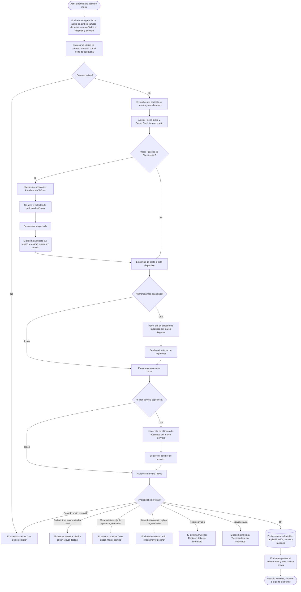

# Multi-Form de Costos y Análisis

**Formulario:** `I_FCost.frm`
**Tabla(s) principal(es):** `b_minuta` (planificación diaria), `b_minutadet` (detalle de planificación), `b_totventas` / `b_detventas` (salidas de bodega a producción), `b_minutaraciones` (raciones por tipo de comensal)
**Consulta principal:** Sin procedimiento almacenado: consultas directas al servidor desde `Informes.bas`

---

## Índice

- [1 — ¿Para qué sirve esta pantalla?](#1--para-qué-sirve-esta-pantalla)
- [2 — ¿Qué necesito para usarla?](#2--qué-necesito-para-usarla)
- [3 — ¿Cómo se usa?](#3--cómo-se-usa)
  - [3.1 Flujo paso a paso](#31-flujo-paso-a-paso)
  - [3.2 Controles y acciones disponibles](#32-controles-y-acciones-disponibles)
- [4 — ¿Qué restricciones debo conocer?](#4--qué-restricciones-debo-conocer)
  - [4.1 Validaciones del sistema](#41-validaciones-del-sistema)
- [5 — ¿Qué obtengo?](#5--qué-obtengo)
  - [Resumen de tipos disponibles](#resumen-de-tipos-disponibles)
  - [CosTot — Costos Totales del Período](#costot--costos-totales-del-período-i_costostotperiodo)
  - [FooCos — Food Cost](#foocos--food-cost-i_foodcost)
  - [CosSec — Costo x Sector](#cossec--costo-x-sector-i_costoxsector)
  - [InNPla — Insumos no Planificados en Salida Bodega](#innpla--insumos-no-planificados-en-salida-bodega-i_insumonoplanifsalbod)
  - [CosPer — Costo Detalle Periodo Realizado](#cosper--costo-detalle-periodo-realizado-i_costodetperiodorealizado)
  - [CurABC — Curva ABC](#curabc--curva-abc-i_curvaabc)
  - [CocABC — Comparativo Curva ABC](#cocabc--comparativo-curva-abc-i_comparativocurvaabc)
  - [ConRac — Comparativo de Raciones](#conrac--comparativo-de-raciones-i_comparativoderaciones)
  - [Raciones no Vendidas (modo por defecto)](#raciones-no-vendidas-modo-por-defecto-i_mermapreparacion)
- [6 — Referencia técnica](#6--referencia-técnica)
  - [Tablas que intervienen](#tablas-que-intervienen)
  - [Relación con otros módulos](#relación-con-otros-módulos)

---

## 1 — ¿Para qué sirve esta pantalla?

[↑ Volver al índice](#índice)

Esta pantalla es un formulario compartido que el sistema abre con una configuración distinta según el tipo de análisis que el usuario seleccionó en el menú. Dependiendo del modo de apertura, la barra de título y los controles disponibles cambian automáticamente: puede presentarse como **Food Cost**, **Costos Totales del Período**, **Costo x Sector**, **Insumos no Planificados en Salida Bodega**, **Costo Detalle Periodo Realizado**, **Curva ABC**, **Comparativo Curva ABC**, **Comparativo de Raciones** o **Raciones no Vendidas**. En todos los casos, el resultado final es un informe en formato de vista previa con orientación configurable.

La pantalla se organiza en un panel de cabecera con tres zonas: el campo de contrato con su buscador, el rango de fechas (Fecha Inicial / Fecha Final) y las opciones de desglose del costo. Debajo del panel de cabecera aparecen dos marcos — **Regimen** y **Servicio** — que permiten filtrar exactamente qué régimen o servicio incluir en el informe. Cada marco ofrece la opción "Todos" (seleccionado por defecto) o "Lista" (para escoger manualmente desde un selector de múltiples opciones). La barra de herramientas superior contiene los botones de ejecución: **Vista Previa**, **Histórico Planificación Teórica** y **Salir**.

El formulario consolida datos de un único contrato (casino) a la vez. No existe un modo multicontrato. La selección de régiemens y servicios puede ser total o parcial, lo que permite generar el informe acotado a solo los servicios relevantes para el período analizado.

---

## 2 — ¿Qué necesito para usarla?

[↑ Volver al índice](#índice)

| Campo | Descripción | Obligatorio |
|---|---|---|
| Contrato | Código del contrato (casino). Se puede ingresar directamente o buscar haciendo clic en el ícono de búsqueda junto al campo, lo que abre un selector de contratos. El nombre del contrato se muestra automáticamente al lado. | Sí |
| Fecha Inicial | Fecha de inicio del período a analizar, en formato dd/mm/yyyy. Se inicializa con la fecha actual al abrir el formulario. | Sí |
| Fecha Final | Fecha de término del período a analizar, en formato dd/mm/yyyy. Se inicializa con la fecha actual al abrir el formulario. | Sí |
| Tipo de costo (Costo Alimentación / Costo Desechable / Total Costo) | Selector de qué cuentas contables incluir en el cálculo. Disponible en los modos Food Cost, Costos Totales y Costo x Sector. En otros modos estos botones pueden estar ocultos o renombrados. | Varía según modo |
| Régimen (Todos / Lista) | Determina si se incluyen todos los regímenes del contrato o solo los seleccionados. Al elegir "Lista" se habilita el buscador de régimen. Por defecto está marcado "Todos". | Sí |
| Servicio (Todos / Lista) | Determina si se incluyen todos los servicios del contrato o solo los seleccionados. Al elegir "Lista" se habilita el buscador de servicio. Por defecto está marcado "Todos". | Sí |

> **Nota sobre el Histórico:** El botón **Histórico Planificación Teórica** de la barra de herramientas permite seleccionar un período histórico a partir de un calendario de planificaciones anteriores. Al confirmar la selección, el sistema actualiza automáticamente las fechas y recarga los catálogos de régimen y servicio.

---

## 3 — ¿Cómo se usa?

### 3.1 Flujo paso a paso

[↑ Volver al índice](#índice)

### 3.2 Controles y acciones disponibles

[↑ Volver al índice](#índice)

| Control / Acción | Descripción |
|---|---|
| **Campo Contrato** | Campo numérico donde se ingresa el código del contrato. Acepta la tecla Enter para avanzar al siguiente campo. |
| **Ícono de búsqueda (junto a Contrato)** | Abre el selector de contratos. También se activa presionando F9 sobre el campo de contrato. El nombre del contrato seleccionado se muestra en el área de descripción a la derecha. |
| **Fecha Inicial** | Campo de fecha con selector de calendario integrado. Formato dd/mm/yyyy. |
| **Fecha Final** | Campo de fecha con selector de calendario integrado. Formato dd/mm/yyyy. |
| **Costo Alimentación** | Opción de desglose: incluye solo insumos de alimentación según la cuenta contable configurada en el parámetro `ctainsumo`. Disponible según modo. |
| **Costo Desechable** | Opción de desglose: incluye solo insumos de tipo desechable según la cuenta contable configurada en el parámetro `ctalimdes`. Disponible según modo. |
| **Total Costo** | Opción de desglose: incluye ambas categorías (alimentación y desechables). Disponible según modo. |
| **Marco Régimen — opción Todos** | Marca todos los regímenes del contrato como seleccionados. Es la opción por defecto. Al marcar esta opción se deshabilita el buscador de régimen. |
| **Marco Régimen — opción Lista** | Habilita el buscador de régimen para seleccionar manualmente los regímenes a incluir en el informe. |
| **Ícono de búsqueda (marco Régimen)** | Abre el selector de regímenes filtrado por el contrato y el rango de fechas indicado. Solo disponible cuando se selecciona "Lista" en el marco Régimen. |
| **Marco Servicio — opción Todos** | Marca todos los servicios del contrato como seleccionados. Es la opción por defecto. Al marcar esta opción se deshabilita el buscador de servicio. |
| **Marco Servicio — opción Lista** | Habilita el buscador de servicio para seleccionar manualmente los servicios a incluir en el informe. |
| **Ícono de búsqueda (marco Servicio)** | Abre el selector de servicios filtrado por el contrato y el rango de fechas indicado. Solo disponible cuando se selecciona "Lista" en el marco Servicio. |
| **Vista Previa** (barra de herramientas) | Ejecuta todas las validaciones, consulta la base de datos y abre la vista previa del informe. Solo visible para usuarios con el permiso correspondiente. |
| **Histórico Planificación Teórica** (barra de herramientas) | Abre el selector de períodos históricos de planificación. Al seleccionar un período, el sistema actualiza automáticamente las fechas del formulario y recarga los catálogos de régimen y servicio según ese período. |
| **Salir** (barra de herramientas) | Cierra el formulario sin generar ningún informe. |

---

## 4 — ¿Qué restricciones debo conocer?

### 4.1 Validaciones del sistema

[↑ Volver al índice](#índice)

| # | Cuándo aparece | Qué verifica el sistema | Qué ve o experimenta el usuario |
|---|---|---|---|
| 1 | Al hacer clic en Vista Previa | Que el código de contrato ingresado exista en la tabla de clientes. | Mensaje: **"No existe contrato"**. El campo de contrato se limpia y la descripción queda vacía. |
| 2 | Al hacer clic en Vista Previa | Que la Fecha Inicial no sea posterior a la Fecha Final. | Mensaje: **"Fecha origen Mayor destino"**. No se genera el informe. |
| 3 | Al hacer clic en Vista Previa (excepto en modo Comparativo de Raciones) | Que la Fecha Inicial y la Fecha Final correspondan al mismo mes. | Mensaje: **"Mes origen mayor destino"**. No se genera el informe. |
| 4 | Al hacer clic en Vista Previa (excepto en modo Comparativo de Raciones) | Que la Fecha Inicial y la Fecha Final correspondan al mismo año. | Mensaje: **"Año origen mayor destino"**. No se genera el informe. |
| 5 | Al hacer clic en Vista Previa | Que al menos un régimen esté seleccionado (ya sea por Todos o por Lista). | Mensaje: **"Regimen debe ser informado"**. No se genera el informe. |
| 6 | Al hacer clic en Vista Previa | Que al menos un servicio esté seleccionado (ya sea por Todos o por Lista). | Mensaje: **"Servicio debe ser informado"**. No se genera el informe. |
| 7 | Al hacer clic en Histórico Planificación Teórica | Que el código de contrato ingresado exista antes de abrir el selector de histórico. | Mensaje: **"No existe contrato"**. No se abre el selector de histórico. |
| 8 | Durante la generación del informe Insumos no Planificados | Que existan registros con la condición de insumo no planificado para el período y filtros indicados. | Si no hay datos, el sistema cierra el informe sin mostrar nada y regresa al formulario. |
| 9 | Durante la generación del informe Costo Detalle Periodo Realizado | Que existan salidas de producción con sector asignado en el período indicado. | Mensaje: **"No existe información ó bien las salidas no tiene indicada la opción x sector"**. |
| 10 | Durante la generación de Curva ABC o Comparativo Curva ABC | Que exista planificación o salidas de producción en el período para los servicios seleccionados. | Si no hay datos, el sistema abandona la generación del informe sin mostrarlo. |

> **Restricción de rango:** Para todos los modos excepto **Comparativo de Raciones**, el período debe estar contenido dentro de un mismo mes y año. El modo Comparativo de Raciones acepta rangos que abarquen meses o años distintos.

> **Permiso de Vista Previa:** El botón Vista Previa solo se habilita si el perfil del usuario tiene el permiso correspondiente configurado en el sistema. Si el usuario no tiene permiso, el botón aparece deshabilitado.

---

## 5 — ¿Qué obtengo?

[↑ Volver al índice](#índice)

### Resumen de tipos disponibles

[↑ Volver al índice](#índice)

| Código interno | Nombre visible en el menú | Formato de salida | Función generadora |
|---|---|---|---|
| CosTot | Costos Totales del Período | Vista previa RTF (orientación vertical) | `I_CostosTotPeriodo` |
| FooCos | Food Cost | Vista previa RTF (orientación vertical) | `I_FoodCost` |
| CosSec | Costo x Sector | Vista previa RTF (orientación vertical) | `I_CostoxSector` |
| InNPla | Insumos no Planificados en Salida Bodega | Vista previa RTF (orientación vertical) | `I_InsumoNoPlanifSalBod` |
| CosPer | Costo Detalle Periodo Realizado | Vista previa RTF (orientación vertical) | `I_CostoDetPeriodoRealizado` |
| CurABC | Curva ABC | Vista previa RTF (orientación vertical) | `I_CurvaABC` |
| CocABC | Comparativo Curva ABC | Vista previa RTF (orientación **horizontal**) | `I_ComparativoCurvaABC` |
| ConRac | Comparativo de Raciones | Vista previa RTF (orientación **horizontal**) | `I_ComparativodeRaciones` |
| — (default) | Raciones no Vendidas | Vista previa RTF (orientación vertical) | `I_MermaPreparacion` |

Todos los informes abren una ventana de vista previa donde el usuario puede revisar el documento antes de imprimirlo. Los informes también generan un archivo de texto plano delimitado por `|` en paralelo, disponible para exportación manual.

---

### CosTot — Costos Totales del Período (`I_CostosTotPeriodo`)

[↑ Volver al índice](#índice)

**Qué muestra:** Presenta el costo total del período agrupado por servicio, comparando el costo derivado de la planificación real (minuta real `mid_tipmin='2'`) contra el costo efectivamente realizado en las salidas de bodega. Incluye también la estructura fija del servicio cuando está configurada.

**Opciones de configuración disponibles:**
- **Costo Alimentación:** considera solo insumos cuya cuenta contable coincida con el parámetro `ctainsumo`.
- **Costo Desechable:** considera solo insumos cuya cuenta contable coincida con el parámetro `ctalimdes`.
- **Total Costo:** (opción por defecto en este modo) suma ambas categorías.

**Estructura de datos del informe:**

| Columna | Descripción |
|---|---|
| Servicio | Nombre del servicio (régimen + servicio) |
| Costos Planificación Real | Suma del costo de la minuta real para el período: `SUM(mid_cosrec × mid_numrac)` + `SUM(mid_cosdes × mid_numrac)` + costo de estructura fija, según la categoría seleccionada |
| Costos Realizados | Suma del monto efectivo de las salidas de bodega a producción (`b_totventas` / `b_detventas`, documentos SP y DP) para el período, según la categoría contable seleccionada |

**Estructura del archivo generado:** Documento RTF con orientación vertical, con logotipo del casino, encabezado con nombre de contrato y período, tabla de resumen por servicio y fila de totales generales al pie.

---

### FooCos — Food Cost (`I_FoodCost`)

[↑ Volver al índice](#índice)

**Qué muestra:** Muestra el indicador de Food Cost diario para el período seleccionado, desglosado por régimen y servicio. Por cada día se muestran las raciones vendidas, la venta del día, el valor de bandeja vendida, las raciones producidas (planificación real), el costo del día, el costo de bandeja producida, el costo de bandeja sobre raciones vendidas y el porcentaje Food Cost (costo sobre venta).

**Opciones de configuración disponibles:**
- **Costo Alimentación / Costo Desechable / Total Costo:** determina qué cuentas contables se incluyen en el cálculo del costo del día.

**Estructura de datos del informe:**

| Columna | Descripción | Calculado |
|---|---|---|
| Fecha | Día del período | No |
| Servicio | Nombre del servicio dentro del régimen | No |
| Rac. Vendidas | Suma de raciones facturadas para ese día según `b_minutaraciones` y `b_preciovta` (excluye PERSONAL y PRODUCIDAS) | No |
| Venta Día | Monto total de venta del día = raciones × precio de venta vigente + ventas de contado (`b_ventacontado`) | Sí |
| Valor Bandeja | Venta del día dividida por raciones vendidas | Sí |
| Rac. Producidas | Raciones de planificación real (`min_racrea`) de la minuta del día | No |
| Costo Día | Suma del costo efectivo de salidas de bodega del día (`b_totventas`/`b_detventas`, documentos SP y DP), según cuenta contable seleccionada | No |
| Costo Bandeja | Costo del día dividido por raciones producidas | Sí |
| Costo Bandeja Vendido | Costo del día dividido por raciones vendidas | Sí |
| Food Cost | (Costo del día / Venta del día) × 100, expresado en porcentaje | Sí |

**Cálculo — Valor Bandeja**

| Componente | Origen |
|---|---|
| Venta Día | Raciones vendidas × precio de venta vigente (`b_preciovta`) + ventas de contado del día (`b_ventacontado`) |
| Raciones Vendidas | Suma de `mir_nrorac` de `b_minutaraciones` excluyendo PERSONAL y PRODUCIDAS, con raciones mayores a cero |

Fórmula: `Valor Bandeja = Venta Día / Raciones Vendidas`

**Cálculo — Food Cost**

Fórmula: `Food Cost (%) = (Costo Día / Venta Día) × 100`

**Estructura del archivo generado:** Documento RTF vertical, con encabezado de contrato y período, tabla de detalle diario agrupada por régimen y servicio, subtotales por servicio y total general al pie.

---

### CosSec — Costo x Sector (`I_CostoxSector`)

[↑ Volver al índice](#índice)

**Qué muestra:** Muestra el costo de los insumos de alimentación desglosado por sector de la estación de servicio (por ejemplo: Ensaladas, Proteína, Acompañamiento), comparando el costo de la planificación teórica, la planificación real y las salidas de producción reales. Incluye también una fila de "Estructura Fija" para los insumos sin clasificación por sector.

**Opciones de configuración disponibles en este modo:**
- **Detalle** (equivale a la opción de índice 0): presenta el desglose completo por fecha, régimen, servicio y sector.
- **Resumido** (equivale a la opción de índice 1): presenta el costo agrupado sin desglose por fecha.

> **Nota:** En este modo las opciones del selector de costo se renombran a "Detalle" y "Resumido". No existe la opción "Total Costo".

**Estructura de datos del informe:**

| Columna | Descripción |
|---|---|
| Fecha producción | Fecha de la salida de bodega o de la planificación |
| Régimen / Servicio | Código y nombre del régimen y servicio |
| Sector | Nombre del sector de la estación de servicio (`a_sector`) |
| Planificación Teórica | Costo calculado a partir de `b_minuta` / `b_minutadet` tipo minuta `'1'`, con `mid_numrac × mid_cosrec`, agrupado por sector |
| Planificación Real | Costo calculado a partir de `b_minuta` / `b_minutadet` tipo minuta `'2'`, con `mid_numrac × mid_cosrec`, agrupado por sector |
| Costo Realizado | Monto efectivo de las salidas de bodega (`b_totventas` / `b_detventas`, documentos SP y DP) filtrado por cuenta contable de insumo, agrupado por sector |

**Estructura del archivo generado:** Documento RTF vertical, con encabezado de contrato y período, detalle por régimen y servicio con subtotales por sector, y totales generales al pie.

---

### InNPla — Insumos no Planificados en Salida Bodega (`I_InsumoNoPlanifSalBod`)

[↑ Volver al índice](#índice)

**Qué muestra:** Lista los productos que aparecen en una salida de bodega a producción (`b_totventas` / `b_detventas`) pero que no tienen cantidad planificada en la minuta correspondiente, o bien tienen cantidad planificada pero la cantidad real salida es cero. Se usa para detectar desvíos entre lo planificado y lo realmente entregado.

**Restricciones propias del tipo:** No tiene selector de tipo de costo. Las tres opciones de costo están ocultas en este modo. Si no hay insumos no planificados en el período indicado, el sistema cierra el informe sin mostrarlo.

**Estructura de datos del informe:**

| Columna | Descripción |
|---|---|
| Fecha | Fecha de la salida de bodega |
| Régimen / Servicio | Agrupador de las filas de detalle |
| Código | Código del producto (`b_productos`) |
| Producto | Nombre del producto |
| Unidad de Medida | Nombre corto de la unidad (`a_unidad`) |
| Cantidad | Cantidad entregada en la salida de bodega (`dev_canmer`) |
| P.M.P. | Precio Medio Ponderado del producto (`dev_precos`) al momento de la salida |
| Total | Cantidad × P.M.P. = monto total del insumo no planificado |
| % Sobre Costo | Porcentaje que representa el costo de ese insumo no planificado sobre el costo total del período para ese servicio |

**Estructura del archivo generado:** Documento RTF vertical, agrupado por régimen / servicio / fecha, con subtotales por grupo y total general al pie.

---

### CosPer — Costo Detalle Periodo Realizado (`I_CostoDetPeriodoRealizado`)

[↑ Volver al índice](#índice)

**Qué muestra:** Presenta el detalle completo de cada salida de bodega a producción durante el período, documento por documento (folio). Por cada folio muestra los ingredientes entregados con su sector, costo unitario, cantidad y costo total, incluyendo los ítems de estructura fija. También indica las raciones producidas del día.

**Restricciones propias del tipo:** Solo incluye salidas de bodega (`tov_tipdoc = 'SP'`) con sector asignado (`dev_codsec > 0`). Si hay salidas sin sector asignado, no aparecen en el informe principal (aparecen en la sección "Estructura Fija"). Si no existen salidas con sector para el período y filtros indicados, el sistema muestra el mensaje "No existe información ó bien las salidas no tiene indicada la opción x sector".

> **Nota:** En este modo el selector de costo tiene sus tres opciones ocultas. La etiqueta del campo muestra "Planif. Teórico", "Planif. Real" y "Salida Prod." pero los tres botones están ocultados; el tipo se pasa como parámetro fijo desde el formulario llamador.

**Estructura de datos del informe — encabezado por folio:**

| Campo | Descripción |
|---|---|
| Folio | Número del documento de salida de bodega |
| F. Emisión | Fecha de emisión del documento |
| F. Producción | Fecha de producción (fecha a la que corresponde la entrega) |
| Contrato | Código y nombre del casino |
| Bodega | Código de la bodega de origen |
| Servicios | Régimen y servicio al que corresponde la salida |
| Rac. Producidas | Total de raciones producidas del día para ese servicio, según `b_minutaraciones` (tipo PRODUCIDAS) |

**Estructura de datos del informe — detalle de ingredientes:**

| Columna | Descripción |
|---|---|
| Código | Código del producto entregado |
| Descripción | Nombre del ingrediente y del producto |
| UN | Unidad de medida abreviada |
| Costo Unit. | Precio unitario al momento de la salida (`dev_predoc`) |
| Cantidad | Cantidad entregada en unidades de bodega |
| Costo Total | Costo unitario × cantidad |

Las filas se agrupan por sector (`a_sector`). Al final de cada sector aparece el subtotal. Al final del folio aparece el total del documento.

**Estructura del archivo generado:** Documento RTF vertical, un folio por página, con recetas planificadas del día al lado (extraídas de `b_minutadet` tipo minuta `'2'`).

---

### CurABC — Curva ABC (`I_CurvaABC`)

[↑ Volver al índice](#índice)

**Qué muestra:** Clasifica los productos utilizados en el período según la curva ABC: los productos de categoría A representan el mayor porcentaje del costo total (según el parámetro configurado en `a_curvaabc`), los de categoría B el siguiente tramo y los de categoría C el resto. El informe se genera por mes, régimen y servicio.

**Opciones de configuración disponibles en este modo:**
Los botones del selector de costo se renombran en este modo a:
- **Planif. Teórico** (tipmin = "1"): calcula el costo a partir de la planificación teórica (`b_minutadet` tipo `'1'`).
- **Planif. Real** (tipmin = "2"): calcula el costo a partir de la planificación real (`b_minutadet` tipo `'2'`).
- **Salida Prod.** (tipmin = "0"): calcula el costo a partir de las salidas de bodega reales (`b_totventas` / `b_detventas`).

**Estructura de datos del informe:**

| Columna | Descripción |
|---|---|
| Régimen / Servicio / Mes | Agrupador del informe |
| Código producto | Código del producto en bodega |
| Nombre producto | Nombre del producto |
| Cantidad | Cantidad total utilizada en el período (en unidades de bodega, aplicando `pro_facing`) |
| Costo Unit. | Costo unitario del producto (desde `b_minutacosto` o desde la salida de bodega según modo) |
| Costo Total | Cantidad × costo unitario |
| % sobre total | Porcentaje que representa el costo del producto sobre el costo total del período para ese servicio/mes |
| % Acumulado | Porcentaje acumulado ordenado de mayor a menor costo |
| Curva | Clasificación A, B o C según los umbrales configurados en `a_curvaabc` |

Incluye también los ítems de estructura fija (`b_minutafijadia`) cuando corresponde.

**Estructura del archivo generado:** Documento RTF vertical, un bloque por combinación de régimen / servicio / mes, con totales por bloque.

---

### CocABC — Comparativo Curva ABC (`I_ComparativoCurvaABC`)

[↑ Volver al índice](#índice)

**Qué muestra:** Compara el costo de los productos según la Curva ABC calculada a partir de la planificación (teórica o real) contra el precio negociado registrado en la lista de precios de ingredientes (`b_contlistpreing`). Permite identificar si los insumos de mayor impacto en el costo están siendo adquiridos al precio negociado o con desvíos.

**Opciones de configuración disponibles:**
Igual que en Curva ABC: **Planif. Teórico**, **Planif. Real** y **Salida Prod.**

**Estructura del archivo generado:** Documento RTF en orientación **horizontal** (apaisada), para acomodar las columnas adicionales del precio negociado comparado.

**Estructura de datos del informe:**

| Columna | Descripción |
|---|---|
| Código / Nombre producto | Producto analizado |
| Cantidad | Cantidad utilizada en el período |
| Costo Planificado | Costo calculado desde planificación o salidas según modo seleccionado |
| Precio Negociado | Precio unitario negociado registrado en la lista de precios de ingredientes |
| Diferencia | Costo planificado − precio negociado × cantidad |
| % sobre total | Participación porcentual del producto en el costo total |
| % Acumulado | Porcentaje acumulado |
| Curva | Clasificación A, B o C |

---

### ConRac — Comparativo de Raciones (`I_ComparativodeRaciones`)

[↑ Volver al índice](#índice)

**Qué muestra:** Presenta una tabla comparativa diaria con los distintos tipos de raciones registrados para cada combinación de régimen y servicio durante el período. Cada columna del informe corresponde a un día del período, y cada fila a un tipo de ración. Permite visualizar de un vistazo las diferencias entre lo que se planificó, lo que se produjo, lo que se vendió y lo que se perdió.

**Restricciones propias del tipo:** Es el único modo que acepta rangos de fechas que abarquen meses o años distintos. Los selectores de tipo de costo están ocultos en este modo. El informe se genera en orientación **horizontal** (apaisada).

**Estructura de datos del informe:**

| Fila | Descripción | Fuente |
|---|---|---|
| Rac. Plan. Teórico | Raciones de planificación teórica (`min_racteo`) del día | `b_minuta` |
| Rac. Plan. Real | Raciones de planificación real (`min_racrea`) del día | `b_minuta` |
| Rac. Producidas | Raciones efectivamente producidas, registradas como "PRODUCIDAS" | `b_minutaraciones` (mir_rutcli = 'PRODUCIDAS') |
| Rac. Control Venta | Raciones vendidas a clientes (excluye PERSONAL, PRODUCIDAS y MUESTRA R) | `b_minutaraciones` |
| Rac. Mermas | Mermas del día, calculadas como: `ROUND(costo mermas / (costo real / raciones real), 0)` | `b_minutadet` (mid_tipmin = '2') |
| Rac. Personal | Raciones entregadas al personal del casino | `b_minutaraciones` (mir_rutcli = 'PERSONAL') |
| Muestra Ref. | Raciones de muestra de referencia | `b_minutaraciones` (mir_rutcli = 'MUESTRA R') |

Las columnas se generan dinámicamente: cada día del período es una columna. El encabezado muestra el número de día de cada columna.

**Estructura del archivo generado:** Documento RTF horizontal, una página por combinación de régimen y servicio, con encabezado de contrato, régimen, servicio y período.

---

### Raciones no Vendidas (modo por defecto) (`I_MermaPreparacion`)

[↑ Volver al índice](#índice)

**Qué muestra:** Lista las recetas que tienen merma de preparación registrada en la minuta real del período. La merma de preparación (`mid_nummer`) representa las raciones planificadas que no fueron servidas. El informe puede generarse en forma detallada (por receta y día) o resumida (por fecha, con totales de costo y merma).

> **Nota:** Aunque la función se llama internamente `I_MermaPreparacion`, el informe se titula "Raciones no Vendidas" en el documento generado.

**Opciones de configuración disponibles:**
Los botones del selector se renombran en este modo a:
- **Detalle** (opción de índice 0): muestra el detalle por receta, con columnas de programado, costo, total costo, merma, merma por kilo y total merma.
- **Resumido** (opción de índice 1): muestra solo los totales de costo y merma agrupados por fecha.

**Estructura de datos del informe — modo Detalle:**

| Columna | Descripción |
|---|---|
| Fecha | Fecha de la minuta |
| Régimen / Servicio | Agrupador de las filas |
| Código | Código de la receta |
| Recetas | Nombre de la receta |
| Programado | Raciones planificadas en la minuta real (`mid_numrac`) |
| Costo | Costo unitario congelado de la receta (`mid_cosrec + mid_cosdes`) al momento de la planificación |
| Total Costo | `Programado × Costo` |
| Merma | Raciones no servidas (`mid_nummer`) |
| MermaxKilo | Merma expresada en cantidad servida (`mid_mermaxcantservida`) |
| Total Merma | `Merma × Costo` |

**Estructura de datos del informe — modo Resumido:**

| Columna | Descripción |
|---|---|
| Fecha | Fecha de la minuta |
| Total Costo | Suma de `mid_numrac × (mid_cosrec + mid_cosdes)` para ese día y servicio |
| Total Merma | Suma de `mid_nummer × (mid_cosrec + mid_cosdes)` para ese día y servicio |

Solo se incluyen en ambos modos las filas donde `mid_numrac > 0 AND mid_nummer > 0` y el tipo de minuta sea real (`mid_tipmin = '2'`).

**Estructura del archivo generado:** Documento RTF vertical, agrupado por régimen y servicio, con subtotales por grupo y totales generales al pie.

---

## 6 — Referencia técnica

### Tablas que intervienen

[↑ Volver al índice](#índice)

| Tabla | Para qué se usa en este formulario | Campos clave |
|---|---|---|
| `b_clientes` | Valida que el contrato ingresado exista y obtiene el nombre del casino | `cli_codigo`, `cli_nombre`, `cli_tipo` |
| `b_minuta` | Encabezado de la planificación diaria (fecha, régimen, servicio, raciones teóricas y reales) | `min_codigo`, `min_cencos`, `min_codreg`, `min_codser`, `min_fecmin`, `min_racteo`, `min_racrea` |
| `b_minutadet` | Detalle de la planificación: recetas, raciones planificadas, costos congelados y mermas | `mid_codigo`, `mid_codrec`, `mid_numrac`, `mid_cosrec`, `mid_cosdes`, `mid_nummer`, `mid_mermaxcantservida`, `mid_tipmin`, `mid_estser`, `mid_numlin`, `mid_tiprec`, `mid_fecval` |
| `b_minutaraciones` | Raciones por tipo de comensal (vendidas, producidas, personal, muestra) | `mir_cencos`, `mir_codreg`, `mir_codser`, `mir_fecmin`, `mir_rutcli`, `mir_nrorac` |
| `b_totventas` | Cabecera de los documentos de salida de bodega (guías de despacho a producción) | `tov_rutcli`, `tov_tipdoc`, `tov_numdoc`, `tov_codreg`, `tov_codser`, `tov_fecpro`, `tov_fecemi`, `tov_codbod`, `tov_estdoc` |
| `b_detventas` | Detalle de los documentos de salida: productos, cantidades, costos y codificación | `dev_rutcli`, `dev_tipdoc`, `dev_numdoc`, `dev_codmer`, `dev_canmer`, `dev_canmin`, `dev_ptotal`, `dev_precos`, `dev_predoc`, `dev_codsec`, `dev_coding`, `dev_numlin` |
| `b_preciovta` | Precios de venta vigentes por contrato, régimen, servicio y cliente | `prv_rutcli`, `prv_cencos`, `prv_codser`, `prv_codreg`, `prv_fecvig`, `prv_preven` |
| `b_ventacontado` | Ventas de contado por servicio (complementa el cálculo de venta del día en Food Cost) | `vtc_cencos`, `vtc_codreg`, `vtc_codser`, `vtc_fecvta`, `vtc_totmon` |
| `b_productos` | Maestro de productos de bodega: código, nombre, unidad, cuenta contable, factor de conversión | `pro_codigo`, `pro_nombre`, `pro_coduni`, `pro_ctacon`, `pro_facing`, `pro_fecven` |
| `b_productospmpdia` | PMP diario histórico de productos para cálculo de costos de estructura fija | `ppd_cencos`, `ppd_codpro`, `ppd_propon`, `ppd_fecdia` |
| `b_receta` | Maestro de recetas: código, nombre, base de raciones | `rec_codigo`, `rec_nombre`, `rec_basrac` |
| `b_recetadet` | Detalle de ingredientes de la receta y cantidad por ración | `red_codigo`, `red_codpro`, `red_canpro`, `red_tiprec`, `red_cencos` |
| `b_ingrediente` | Maestro de ingredientes: código, nombre, unidad de medida del ingrediente | `ing_codigo`, `ing_nombre`, `ing_unimed` |
| `b_minutacosto` | Costo de ingredientes de la receta vigente a la fecha de la planificación | `mic_cencos`, `mic_codpro`, `mic_cospro`, `mic_fecval`, `mic_tipmin` |
| `b_minutafija` | Estructura fija de insumos por servicio con cantidad por día de la semana | `mif_cencos`, `mif_codreg`, `mif_codser`, `mif_codpro`, `mif_canpro`, `mif_fecval`, `mif_dianro` |
| `b_minutafijadia` | Estructura fija aplicada día a día con costo calculado | `mfd_cencos`, `mfd_codreg`, `mfd_codser`, `mfd_codpro`, `mfd_canpro`, `mfd_cospro`, `mfd_fecha`, `mfd_tipmin` |
| `b_contlistpreing` | Lista de precios negociados de ingredientes por contrato, usada en Comparativo Curva ABC | `cpi_cencos`, `cpi_coding`, `cpi_codped` |
| `a_regimen` | Maestro de regímenes (tipo de alimentación) | `reg_codigo`, `reg_nombre` |
| `a_servicio` | Maestro de servicios (turno de alimentación) | `ser_codigo`, `ser_nombre` |
| `a_sector` | Maestro de sectores de estación de servicio | `sec_codigo`, `sec_nombre`, `sec_orden` |
| `a_estservicio` | Relación entre servicio y sector | `ess_cencos`, `ess_codigo`, `ess_codser`, `ess_codsec` |
| `a_curvaabc` | Configuración de los umbrales porcentuales para las categorías A, B y C | `abc_codigo`, `abc_porce` |
| `a_unidad` | Maestro de unidades de medida de bodega | `uni_codigo`, `uni_nomcor` |
| `a_unidadmed` | Maestro de unidades de medida de ingredientes | `unm_codigo`, `unm_nomcor` |

### Relación con otros módulos

[↑ Volver al índice](#índice)

| Módulo | Relación |
|---|---|
| **Planificación** | Los informes de costo leen la minuta (`b_minuta` / `b_minutadet`) y los costos congelados al momento de planificar (`mid_cosrec`, `mid_cosdes`). El Food Cost usa las raciones planificadas reales (`min_racrea`). |
| **Salida de Bodega** | Los informes de costo realizado leen las salidas de producción registradas en `b_totventas` / `b_detventas` (documentos tipo SP y DP). El sector asignado en la salida es necesario para los informes por sector. |
| **Facturación / Control de Ventas** | El Food Cost combina las raciones facturadas de `b_minutaraciones` con los precios de venta de `b_preciovta` para calcular la venta del día. Las ventas de contado de `b_ventacontado` también se suman a la venta diaria. |
| **Inventario / PMP** | El cálculo del costo de estructura fija usa el PMP histórico de `b_productospmpdia`. El informe de Insumos no Planificados muestra el PMP al momento de la salida (`dev_precos`). |
| **Recetas** | La Curva ABC y el Comparativo Curva ABC desglosan el costo hasta el nivel de ingrediente a través de `b_recetadet`, `b_ingrediente` y `b_minutacosto`. |
| **Contratos / Precios Negociados** | El Comparativo Curva ABC contrasta el costo calculado con los precios negociados registrados en `b_contlistpreing`. |

---

*Fuentes: `I_FCost.frm`, funciones `I_FoodCost`, `I_CostosTotPeriodo`, `I_CostoxSector`, `I_InsumoNoPlanifSalBod`, `I_CostoDetPeriodoRealizado`, `I_CurvaABC`, `I_ComparativoCurvaABC`, `I_ComparativodeRaciones`, `I_MermaPreparacion` en `Informes.bas`, tablas `b_minuta`, `b_minutadet`, `b_totventas`, `b_detventas`, `b_minutaraciones`, `b_preciovta` en `SGP_Local.sql`*
