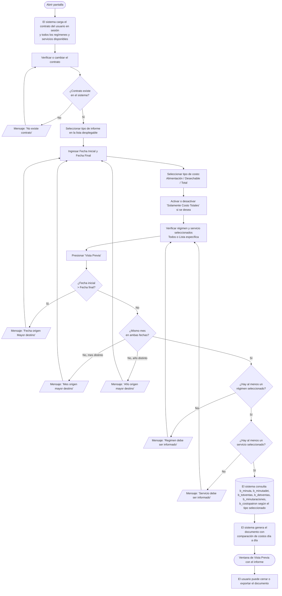

# Comparativo de Costos: Planificación Teórica, Real y Realizado

**Formulario:** `I_CoteRe.frm`
**Tablas principales:** `b_minuta` / `b_minutadet` (planificación de minutas y detalle de recetas), `b_totventas` / `b_detventas` (movimientos de salida y devolución de bodega), `b_minutaraciones` (raciones producidas), `b_costopatron` (costo piso/techo por régimen-servicio-mes)
**Funciones de generación:** `I_CostoTeoricoRealFood`, `I_CostoTeoricoRealFoodAcum`, `I_CostoTeoricoNegociado` — definidas en `Informes.bas`

---

## Índice

- [1 — ¿Para qué sirve esta pantalla?](#1--para-qué-sirve-esta-pantalla)
- [2 — ¿Qué necesito para usarla?](#2--qué-necesito-para-usarla)
- [3 — ¿Cómo se usa?](#3--cómo-se-usa)
  - [3.1 Flujo paso a paso](#31-flujo-paso-a-paso)
  - [3.2 Controles y acciones disponibles](#32-controles-y-acciones-disponibles)
- [4 — ¿Qué restricciones debo conocer?](#4--qué-restricciones-debo-conocer)
  - [4.1 Validaciones del sistema](#41-validaciones-del-sistema)
  - [4.2 Reglas de cálculo](#42-reglas-de-cálculo)
- [5 — ¿Qué obtengo?](#5--qué-obtengo)
  - [Resumen de tipos disponibles](#resumen-de-tipos-disponibles)
  - [(0) Plan. Teórico & Realizado](#0-plan-teórico--realizado-icostoteoricorealfood)
  - [(1) Plan. Real & Realizado](#1-plan-real--realizado-icostoteoricorealfood)
  - [(2) Plan. Teórico & Plan. Real & Realizado](#2-plan-teórico--plan-real--realizado-icostoteoricorealfood)
  - [(3) Plan. Teórico & Realizado Acumulado](#3-plan-teórico--realizado-acumulado-icostoteoricorealfoodacum)
  - [(4) Plan. Real & Realizado Acumulado](#4-plan-real--realizado-acumulado-icostoteoricorealfoodacum)
  - [(5) Plan. Teórico & Plan. Real & Realizado Acumulado](#5-plan-teórico--plan-real--realizado-acumulado-icostoteoricorealfoodacum)
  - [(6) Comparativo Plan. Teórico & Negociado](#6-comparativo-plan-teórico--negociado-icostoteoriconegociado)
- [6 — Referencia técnica](#6--referencia-técnica)
  - [Tablas que intervienen](#tablas-que-intervienen)
  - [Relación con otros módulos](#relación-con-otros-módulos)

---

## 1 — ¿Para qué sirve esta pantalla?

[↑ Volver al índice](#índice)

Esta pantalla genera informes de comparación de costos de alimentación para un contrato (casino) en un rango de fechas dentro del mismo mes. Permite contrastar, día a día o de forma acumulada, cuánto costó lo que se planificó servir versus lo que efectivamente se sirvió o salió de bodega. Según el tipo de informe elegido, la comparación se establece entre la planificación teórica (minuta teórica aprobada), la planificación real (minuta ajustada con raciones reales confirmadas) y el costo realizado (valor de las salidas de bodega registradas).

La pantalla se abre en dos variantes según cómo se la invoca desde el menú: en la variante "CoTeRe" el usuario puede elegir entre seis tipos de informe que comparan planificación y realizado; en la variante alternativa la pantalla queda restringida al tipo único "Comparativo Plan. Teórico & Negociado", que contrasta el costo planificado con el precio negociado en lista de precios SAC para el período. En ambas variantes, la estructura visual es la misma: una barra de herramientas en la parte superior, un panel de configuración con los campos de cabecera (contrato, fechas, tipo de informe, dimensión de costo y opción de totales), y dos selectores ocultos de régimen y servicio que se cargan al abrir el formulario.

El resultado se entrega siempre como un documento en ventana de vista previa del sistema —que puede exportarse a RTF— con las comparaciones detalladas día a día por cada combinación de régimen y servicio seleccionada, incluyendo costo por bandeja, número de raciones, costo total y desviación entre los escenarios comparados. La pantalla también dispone de un botón "Histórico Planificación Teórica" para consultar períodos anteriores y establecer el rango de fechas automáticamente.

---

## 2 — ¿Qué necesito para usarla?

[↑ Volver al índice](#índice)

| Campo | Descripción | Obligatorio |
|---|---|---|
| **Contrato** | Código del contrato (casino) que se desea analizar. Al abrir el formulario se carga automáticamente el contrato asociado al usuario en sesión. Si el usuario tiene permiso de operar en múltiples casinos, puede cambiar el código manualmente o usar el buscador de contratos (icono de lupa junto al campo). | Sí |
| **Fecha Inicial** | Fecha de inicio del período a analizar, en formato dd/mm/yyyy. Se inicializa con la fecha del día. La fecha debe pertenecer al mismo mes y año que la Fecha Final. | Sí |
| **Fecha Final** | Fecha de término del período, en formato dd/mm/yyyy. Se inicializa con la fecha del día. | Sí |
| **Informes** (lista desplegable) | Selector del tipo de informe a generar. Define qué escenarios de costo se comparan y si el período se reporta día a día o en forma acumulada mensual. Ver sección 5 para el detalle de cada opción. | Sí |
| **Tipo de costo** (opciones) | Define si el informe considera **Costo Alimentación** (ingredientes de receta), **Costo Desechable** (materiales descartables), o **Total Costo** (ambos combinados). Por defecto se selecciona "Costo Alimentación". | Sí |
| **Solamente Costo Totales** (casilla) | Cuando se activa, el informe omite las columnas de número de raciones y costo por bandeja, mostrando únicamente los montos totales por día. Esta casilla se deshabilita automáticamente para el tipo (6) Comparativo con Negociado. | No |
| **Régimen** (selección interna) | Lista de regímenes disponibles para el contrato. Al abrir el formulario todos quedan seleccionados ("Todos"). El usuario puede cambiar a "Lista" para filtrar por los regímenes marcados en el selector auxiliar. | Sí |
| **Servicio** (selección interna) | Lista de servicios disponibles para el contrato. Igual comportamiento que Régimen. Al abrir, todos quedan seleccionados ("Todos"). | Sí |

> **Nota:** Los selectores de régimen y servicio se cargan automáticamente al abrir el formulario con todos los regímenes y servicios activos en el sistema. Si se cambia el contrato, se recarga la lista. El usuario debe confirmar que al menos un régimen y un servicio queden incluidos antes de generar el informe.

---

## 3 — ¿Cómo se usa?

### 3.1 Flujo paso a paso

[↑ Volver al índice](#índice)

### 3.2 Controles y acciones disponibles

[↑ Volver al índice](#índice)

| Control / Acción | Descripción |
|---|---|
| **Campo Contrato** | Muestra el código del casino activo. Si el usuario tiene acceso a múltiples casinos, puede editarlo directamente o usar el buscador de contratos para seleccionar uno distinto. Al cambiar el contrato, se recarga la lista de regímenes y servicios. |
| **Buscador de Contratos** (icono junto al campo) | Abre el selector de contratos del sistema. Al seleccionar, carga el código y nombre del contrato en el campo. También se puede activar con la tecla F9. |
| **Fecha Inicial / Fecha Final** | Campos de fecha con selector de calendario. Ambos se inicializan con la fecha del día al abrir el formulario. |
| **Lista desplegable "Informes"** | Permite elegir el tipo de comparación. Al cambiar la selección, el título de la ventana cambia para reflejar el modo activo, y la casilla "Solamente Costo Totales" se habilita o deshabilita según corresponda. |
| **Opciones de tipo de costo** | Tres opciones excluyentes: "Costo Alimentación", "Costo Desechable" y "Total Costo". Determinan qué categoría de productos se incluye en los montos. |
| **Casilla "Solamente Costo Totales"** | Cuando está marcada, el informe muestra únicamente los montos totales sin desglose por bandeja ni raciones. Se deshabilita para el tipo (6). |
| **Régimen — opción "Todos"** | Incluye todos los regímenes disponibles del contrato. Seleccionado por defecto al abrir. |
| **Régimen — opción "Lista"** | Activa el selector de régimen para elegir regímenes específicos. Al activar, habilita el buscador auxiliar de régimen. |
| **Servicio — opción "Todos"** | Incluye todos los servicios disponibles del contrato. Seleccionado por defecto al abrir. |
| **Servicio — opción "Lista"** | Activa el selector de servicio para elegir servicios específicos. Al activar, habilita el buscador auxiliar de servicio. |
| **Vista Previa** (botón de la barra) | Ejecuta el proceso de generación del informe. Aplica todas las validaciones y, si son correctas, construye el documento y lo muestra en la ventana de vista previa. Habilitado solo si el usuario tiene permiso de consulta asignado. |
| **Histórico Planificación Teórica** (botón de la barra) | Abre el formulario de histórico de planificación para el contrato activo, permitiendo seleccionar un período anterior. Al seleccionar, carga automáticamente el primer y último día del mes elegido en Fecha Inicial y Fecha Final. |
| **Salir** (botón de la barra) | Cierra el formulario y libera la memoria. |

---

## 4 — ¿Qué restricciones debo conocer?

### 4.1 Validaciones del sistema

[↑ Volver al índice](#índice)

| # | Cuándo aparece | Qué verifica el sistema | Qué ve o experimenta el usuario |
|---|---|---|---|
| 1 | Al presionar "Vista Previa" o al escribir en el campo de contrato | Que el código de contrato exista en la tabla de clientes del sistema | Mensaje: **"No existe contrato"**. El campo queda en blanco y el nombre del contrato desaparece. |
| 2 | Al presionar "Vista Previa" | Que la Fecha Inicial no sea posterior a la Fecha Final | Mensaje: **"Fecha origen Mayor destino"**. El informe no se genera. |
| 3 | Al presionar "Vista Previa" | Que ambas fechas pertenezcan al mismo mes calendario | Mensaje: **"Mes origen mayor destino"**. El informe no se genera. |
| 4 | Al presionar "Vista Previa" | Que ambas fechas pertenezcan al mismo año | Mensaje: **"Año origen mayor destino"**. El informe no se genera. |
| 5 | Al presionar "Vista Previa" | Que haya al menos un régimen seleccionado en el selector | Mensaje: **"Regimen debe ser informado"**. El informe no se genera. |
| 6 | Al presionar "Vista Previa" | Que haya al menos un servicio seleccionado en el selector | Mensaje: **"Servicio debe ser informado"**. El informe no se genera. |
| 7 | Al presionar "Vista Previa" con datos válidos | Que existan registros de planificación para el período, contrato, régimen y servicio indicados | Si no hay datos, el informe finaliza sin mostrar nada. No se emite mensaje de error al usuario. |
| 8 | Al usar "Régimen — Lista" o "Servicio — Lista" | Que el contrato esté cargado antes de abrir el selector auxiliar | Si el contrato está vacío, el buscador auxiliar no se abre. |

### 4.2 Reglas de cálculo

[↑ Volver al índice](#índice)

- El rango de fechas está limitado a un único mes calendario. No es posible generar un informe que cruce dos meses distintos.
- La categorización de productos como "alimentación" o "desechable" se determina por el parámetro de sistema `ctainsumo` (cuenta contable de insumos alimenticios) y `ctalimdes` (cuenta contable de desechables), configurados en la tabla de parámetros del sistema. El informe solo incluye productos que pertenecen a alguna de esas dos cuentas.
- El costo del día para cada régimen/servicio se obtiene de dos fuentes complementarias: (a) el costo de las recetas de la planificación diaria (`mid_cosrec × mid_numrac` o `mid_cosdes × mid_numrac` desde `b_minutadet`) y (b) el costo de la estructura fija del servicio (tablas `b_minutafijadia` o `b_minutafija`), que se suma al costo de recetas cuando corresponde. Si existe una estructura fija registrada día a día, tiene precedencia sobre la estructura fija general.
- El "costo realizado" corresponde al neto de salidas de bodega (tipo documento "SP") menos devoluciones (tipo documento "DP"), filtrando solo documentos no anulados y no pendientes para el casino en sesión.
- El número de raciones "realizado" se toma de la fila especial "PRODUCIDAS" en la tabla de raciones (`b_minutaraciones`). Cuando la opción "Solamente Costo Totales" está activa, la columna de raciones realizado se omite en el informe.
- Los valores de costo piso y costo techo se leen desde `b_costopatron` para cada combinación de régimen, servicio y año-mes, y se muestran en el encabezado de cada sección del informe como referencia.
- Para el tipo (6) "Comparativo Plan. Teórico & Negociado", el costo negociado se calcula cruzando los ingredientes de las recetas planificadas con los precios de la lista de precios SAC (`b_sac_listaprecio`) vigente para el período (año-mes de la fecha inicial), considerando el formato de compra configurado para el contrato en `b_contlistpreing`.

---

## 5 — ¿Qué obtengo?

[↑ Volver al índice](#índice)

### Resumen de tipos disponibles

[↑ Volver al índice](#índice)

Esta pantalla está disponible en dos variantes. La variante "CoTeRe" ofrece seis tipos de informe; la variante "PlaTei" (accedida desde otro punto del menú) ofrece solo el tipo (6).

| Código | Nombre en el selector | Modo | Formato de salida | Función de generación |
|---|---|---|---|---|
| (0) | Plan. Teórico & Realizado | Diario | Vista Previa / RTF | `I_CostoTeoricoRealFood` |
| (1) | Plan. Real & Realizado | Diario | Vista Previa / RTF | `I_CostoTeoricoRealFood` |
| (2) | Plan. Teórico & Plan. Real & Realizado | Diario | Vista Previa / RTF | `I_CostoTeoricoRealFood` |
| (3) | Plan. Teórico & Realizado Acumulado | Acumulado mensual | Vista Previa / RTF | `I_CostoTeoricoRealFoodAcum` |
| (4) | Plan. Real & Realizado Acumulado | Acumulado mensual | Vista Previa / RTF | `I_CostoTeoricoRealFoodAcum` |
| (5) | Plan. Teórico & Plan. Real & Realizado Acumulado | Acumulado mensual | Vista Previa / RTF | `I_CostoTeoricoRealFoodAcum` |
| (6) | Comparativo Plan. Teórico & Negociado | Diario | Vista Previa / RTF | `I_CostoTeoricoNegociado` |

---

### (0) Plan. Teórico & Realizado (`I_CostoTeoricoRealFood`)

[↑ Volver al índice](#índice)

**Qué muestra:** Compara día a día el costo de la planificación teórica (minuta teórica aprobada, tipmin='1') con el costo realizado (salidas netas de bodega). Por cada combinación de régimen y servicio se genera una sección con una fila por día del período.

**Orientación del documento:** Vertical (portrait) para los tipos (0) y (1); horizontal (landscape) para el tipo (2).

**Opciones de configuración disponibles:**
- Tipo de costo: Alimentación, Desechable o Total.
- "Solamente Costo Totales": muestra solo montos totales, sin costo por bandeja ni raciones.

**Estructura de datos del informe:**

Cada sección del informe tiene un encabezado con contrato, régimen, servicio y los valores de costo piso y techo del mes. La tabla de detalle por día contiene las columnas:

| Campo en el informe | Qué representa | Calculado |
|---|---|---|
| Fecha | Día del período (dd/mm/yyyy) | No |
| Costo Bandeja — Plan. Teórico | Costo unitario por ración de la planificación teórica ese día | Sí |
| Nro. Rac. — Plan. Teórico | Número de raciones planificadas teóricamente (`min_racteo`) | No |
| Costo Total — Plan. Teórico | Monto total planificado teórico del día | No |
| Costo Bandeja — Realizado | Costo unitario por ración según salidas de bodega ese día | Sí |
| Nro. Rac. — Realizado | Número de raciones producidas registradas ("PRODUCIDAS") | No |
| Costo Total — Realizado | Monto neto de salidas de bodega del día (SP menos DP) | No |
| Desviación | Diferencia entre costo bandeja realizado y teórico | Sí |

Al final de cada sección aparece una fila "Total" con la acumulación del período y una fila "T. General" con el total de todos los regímenes/servicios incluidos.

**Cálculo — Costo Bandeja — Plan. Teórico**

Cuando la opción "Solamente Costo Totales" está inactiva:

> Costo Bandeja Teórico = Costo Total Teórico del día ÷ Nro. Rac. Teóricas del día

Cuando la opción está activa, se muestra el Costo Total directamente.

**Cálculo — Desviación**

> Desviación = Costo Bandeja Realizado − Costo Bandeja Teórico

Si la opción "Solamente Costo Totales" está activa:

> Desviación = Costo Total Realizado − Costo Total Teórico

**Estructura del archivo generado:** Documento RTF exportado con vista previa, en orientación vertical. Organizado por sección (una por cada combinación régimen/servicio), con encabezado de página del sistema y número de página al pie.

---

### (1) Plan. Real & Realizado (`I_CostoTeoricoRealFood`)

[↑ Volver al índice](#índice)

**Qué muestra:** Compara día a día el costo de la planificación real (minuta con raciones reales confirmadas, tipmin='2') con el costo realizado (salidas netas de bodega). La estructura de columnas es idéntica a la del tipo (0), reemplazando "Plan. Teórico" por "Plan. Real" en los encabezados.

**Orientación del documento:** Vertical (portrait).

**Opciones de configuración:** Igual que el tipo (0).

**Estructura de datos del informe:**

| Campo en el informe | Qué representa | Calculado |
|---|---|---|
| Fecha | Día del período (dd/mm/yyyy) | No |
| Costo Bandeja — Plan. Real | Costo unitario por ración de la planificación real ese día | Sí |
| Nro. Rac. — Plan. Real | Número de raciones reales confirmadas (`min_racrea`) | No |
| Costo Total — Plan. Real | Monto total de la planificación real del día | No |
| Costo Bandeja — Realizado | Costo unitario según salidas de bodega ese día | Sí |
| Nro. Rac. — Realizado | Número de raciones producidas registradas ("PRODUCIDAS") | No |
| Costo Total — Realizado | Monto neto de salidas de bodega del día | No |
| Desviación | Diferencia entre costo bandeja realizado y plan real | Sí |

**Cálculo — Desviación**

> Desviación = Costo Bandeja Realizado − Costo Bandeja Plan. Real

---

### (2) Plan. Teórico & Plan. Real & Realizado (`I_CostoTeoricoRealFood`)

[↑ Volver al índice](#índice)

**Qué muestra:** Presenta los tres escenarios en simultáneo: planificación teórica, planificación real y realizado (salidas de bodega). Permite ver en una sola vista si la planificación real se ajustó respecto a la teórica y cuánto difirió el realizado de ambas planificaciones. Consulta tanto la minuta teórica (tipmin='1') como la minuta real (tipmin='2').

**Orientación del documento:** Horizontal (landscape), porque requiere más columnas.

**Estructura de datos del informe:**

| Campo en el informe | Qué representa | Calculado |
|---|---|---|
| Fecha | Día del período | No |
| Costo Bandeja — Plan. Teórico | Costo unitario teórico del día | Sí |
| Nro. Rac. — Plan. Teórico | Raciones planificadas teóricas | No |
| Costo Total — Plan. Teórico | Monto total teórico del día | No |
| Desviación Plan. Real vs Teórico | Diferencia de costo bandeja entre planificación real y teórica | Sí |
| Costo Bandeja — Plan. Real | Costo unitario de la planificación real | Sí |
| Nro. Rac. — Plan. Real | Raciones reales confirmadas | No |
| Costo Total — Plan. Real | Monto total planificación real | No |
| Costo Bandeja — Realizado | Costo unitario según salidas de bodega | Sí |
| Nro. Rac. — Realizado | Raciones producidas registradas | No |
| Costo Total — Realizado | Monto neto de salidas de bodega | No |
| Desviación Realizado vs Plan. Real | Diferencia de costo bandeja entre realizado y planificación real | Sí |

---

### (3) Plan. Teórico & Realizado Acumulado (`I_CostoTeoricoRealFoodAcum`)

[↑ Volver al índice](#índice)

**Qué muestra:** Igual que el tipo (0) en cuanto a escenarios comparados (teórico vs. realizado), pero en lugar de mostrar un detalle día por día presenta el acumulado del período como un único total para cada régimen/servicio. Útil para una visión de resumen mensual sin el detalle diario.

**Opciones de configuración:** Igual que el tipo (0).

**Estructura de datos del informe:** Igual que el tipo (0) pero sin la columna Fecha —una sola fila de total por combinación de régimen y servicio, más el total general al final.

---

### (4) Plan. Real & Realizado Acumulado (`I_CostoTeoricoRealFoodAcum`)

[↑ Volver al índice](#índice)

**Qué muestra:** Igual que el tipo (1) (planificación real vs. realizado) pero en modo acumulado mensual, sin detalle diario.

**Estructura de datos del informe:** Igual que el tipo (1) pero presentado como totales acumulados del período por régimen/servicio.

---

### (5) Plan. Teórico & Plan. Real & Realizado Acumulado (`I_CostoTeoricoRealFoodAcum`)

[↑ Volver al índice](#índice)

**Qué muestra:** Equivalente al tipo (2) pero en modo acumulado mensual. Muestra los tres escenarios (teórico, real y realizado) como totales del período para cada combinación de régimen/servicio.

---

### (6) Comparativo Plan. Teórico & Negociado (`I_CostoTeoricoNegociado`)

[↑ Volver al índice](#índice)

**Qué muestra:** Compara el costo de la planificación teórica con el costo que habría tenido esa planificación si los ingredientes se hubieran valorizado al precio negociado en la lista de precios SAC vigente para el mes del período. Permite detectar cuánto difiere el costo según receta (PMP histórico) del costo según precios comprometidos con el proveedor. Solo disponible desde la variante de formulario "PlaTei" o cuando `lc_Aux ≠ "CoTeRe"`.

**Restricciones propias del tipo:**
- La casilla "Solamente Costo Totales" está deshabilitada para este tipo.
- Solo usa la minuta teórica (tipmin='1'); la minuta real no se incluye.
- El precio negociado se obtiene del período año-mes de la Fecha Inicial (`b_sac_listaprecio.lps_periodo`). Si no hay precios negociados registrados para el período, los montos negociados aparecen en cero.

**Orientación del documento:** Vertical (portrait).

**Cómo se calcula el costo negociado:**

El sistema reconstruye el costo de cada receta planificada cruzando:
1. Los ingredientes de la receta (`b_recetadet`).
2. Los ingredientes habilitados para el contrato en la lista de precios negociada (`b_contlistpreing`).
3. El precio negociado del período desde la lista de precios SAC (`b_sac_listaprecio`), dividido por el factor de rendimiento del producto (`pro_facing`).

El resultado es el costo negociado por ración para cada receta de la planificación.

**Estructura de datos del informe:**

| Campo en el informe | Qué representa | Calculado |
|---|---|---|
| Fecha | Día del período | No |
| Costo Bandeja — Plan. Teórico | Costo por ración según receta valorizada a PMP | Sí |
| Nro. Rac. — Plan. Teórico | Raciones planificadas teóricas del día | No |
| Costo Total — Plan. Teórico | Monto total teórico del día | No |
| Costo Bandeja — Negociado | Costo por ración valorizado a precio negociado SAC | Sí |
| Nro. Rac. — Negociado | Igual que Nro. Rac. Teórico (misma planificación) | No |
| Costo Total — Negociado | Monto total al precio negociado del día | Sí |
| Desviación | Diferencia entre costo bandeja negociado y teórico | Sí |

**Cálculo — Desviación**

> Desviación = Costo Bandeja Negociado − Costo Bandeja Teórico

Una desviación negativa indica que los precios negociados son más convenientes que el PMP valorizado en la planificación.

---

## 6 — Referencia técnica

### Tablas que intervienen

[↑ Volver al índice](#índice)

| Tabla | Para qué se usa en este reporte | Campos clave |
|---|---|---|
| `b_minuta` | Encabezado de la planificación de minutas (teórica y real) | `min_cencos`, `min_codreg`, `min_codser`, `min_fecmin`, `min_racteo`, `min_racrea`, `min_indblo` |
| `b_minutadet` | Detalle de recetas planificadas con costo y número de raciones | `mid_codigo`, `mid_tipmin`, `mid_cosrec`, `mid_cosdes`, `mid_numrac`, `mid_codrec`, `mid_tiprec` |
| `b_minutafijadia` | Estructura de costo fijo del servicio registrada por día (complementa el costo de recetas) | `mfd_cencos`, `mfd_codreg`, `mfd_codser`, `mfd_fecha`, `mfd_tipmin`, `mfd_codpro`, `mfd_canpro`, `mfd_cospro` |
| `b_minutafija` | Estructura de costo fijo del servicio general (usada si no hay registro por día) | `mif_cencos`, `mif_codreg`, `mif_codser`, `mif_fecval`, `mif_dianro`, `mif_codpro`, `mif_canpro` |
| `b_totventas` | Encabezado de documentos de salida y devolución de bodega (realizado) | `tov_cencos`, `tov_fecpro`, `tov_codreg`, `tov_codser`, `tov_tipdoc`, `tov_estdoc`, `tov_codbod`, `tov_numdoc`, `tov_rutcli` |
| `b_detventas` | Detalle de productos de cada documento de salida o devolución | `dev_rutcli`, `dev_tipdoc`, `dev_numdoc`, `dev_codmer`, `dev_canmer`, `dev_ptotal` |
| `b_minutaraciones` | Raciones producidas por día/régimen/servicio (fila "PRODUCIDAS") | `mir_cencos`, `mir_fecmin`, `mir_codreg`, `mir_codser`, `mir_rutcli`, `mir_nrorac` |
| `b_costopatron` | Costo piso y techo negociado por contrato, régimen, servicio y mes | `cpa_cencos`, `cpa_codreg`, `cpa_codser`, `cpa_anomes`, `cpa_descripcion`, `cpa_valor` |
| `b_productospmpdia` | Precio medio ponderado diario de productos (PMP) | `ppd_cencos`, `ppd_codpro`, `ppd_fecdia`, `ppd_propon` |
| `b_productos` | Maestro de productos: cuenta contable para clasificar entre alimentación y desechable | `pro_codigo`, `pro_ctacon`, `pro_facing`, `pro_ctrsto` |
| `a_regimen` | Maestro de regímenes: nombre del régimen para encabezados del informe | `reg_codigo`, `reg_nombre` |
| `a_servicio` | Maestro de servicios: nombre del servicio para encabezados del informe | `ser_codigo`, `ser_nombre` |
| `b_clientes` | Maestro de contratos: nombre del casino para encabezados del informe | `cli_codigo`, `cli_nombre` |
| `b_recetadet` | Detalle de ingredientes de cada receta (solo tipo 6) | `red_codigo`, `red_tiprec`, `red_codpro`, `red_canpro`, `red_cencos` |
| `b_ingrediente` | Maestro de ingredientes: relaciona ingrediente con producto (solo tipo 6) | `ing_codigo` |
| `b_contlistpreing` | Ingredientes habilitados por contrato para lista de precios negociada (solo tipo 6) | `cpi_cencos`, `cpi_coding`, `cpi_codcom`, `cpi_precos` |
| `b_sac_listaprecio` | Lista de precios negociados por período SAC (solo tipo 6) | `lps_cencos`, `lps_codsac`, `lps_periodo`, `lps_precio` |
| `b_formatocompras` / `b_formatocomprassgp` | Relación entre formato de compra SAC y producto SGP (solo tipo 6) | `foc_codsac`, `fcs_codsac`, `fcs_codsgp` |
| `p_costrr` | Tabla de trabajo temporal de sesión usada solo por la función de envío ("Enviar SGP Inf.") para acumular resultados antes de transmitir. No persiste entre sesiones. | `trr_cencos`, `trr_usuario` |
| `a_param` | Parámetros del sistema: cuentas contables `ctainsumo` y `ctalimdes` que clasifican alimentación vs. desechable | `par_codigo`, `par_valor` |

### Relación con otros módulos

[↑ Volver al índice](#índice)

| Módulo | Relación |
|---|---|
| **Planificación (Minuta Teórica)** | Provee los registros de `b_minuta` y `b_minutadet` con `mid_tipmin='1'` que forman la base del costo teórico. El costo de receta (`mid_cosrec`, `mid_cosdes`) se congela en el momento de guardar la planificación. |
| **Planificación (Minuta Real)** | Provee los registros de `b_minuta` y `b_minutadet` con `mid_tipmin='2'`, con las raciones reales confirmadas (`min_racrea`). |
| **Raciones Producidas** | Provee la fila "PRODUCIDAS" en `b_minutaraciones`, que representa las raciones efectivamente servidas y que se usa como denominador del costo bandeja realizado. |
| **Salidas de Bodega / Inventario** | Los documentos tipo "SP" (salida) y "DP" (devolución) de `b_totventas` / `b_detventas` conforman el costo realizado. Solo se consideran documentos no anulados y no pendientes. |
| **Estructura Fija de Servicio** | Las tablas `b_minutafijadia` y `b_minutafija` aportan costos adicionales fijos por servicio (por ejemplo, artículos de limpieza o consumibles de cocina no asociados a receta), que se suman al costo de recetas en la planificación teórica y real. |
| **Precio Medio Ponderado (PMP)** | `b_productospmpdia` provee el PMP por producto, utilizado en el cálculo de la estructura fija cuando no existe un costo fijo registrado día a día (`b_minutafijadia`). |
| **Lista de Precios Negociada (SAC)** | Para el tipo (6), `b_sac_listaprecio`, `b_formatocompras`, `b_formatocomprassgp` y `b_contlistpreing` proveen los precios negociados con proveedores, utilizados para calcular el costo negociado alternativo. |
| **Costo Patrón** | `b_costopatron` registra el costo piso y techo acordado para cada servicio-régimen-mes, que se muestra en el encabezado de cada sección del informe como referencia de rangos aceptables. |
| **Contrato / Régimen / Servicio** | `b_clientes`, `a_regimen` y `a_servicio` son mantenidos desde el módulo de Contrato/Régimen/Servicio. Este formulario solo los lee para mostrar nombres en el informe. |

---

*Fuentes: `I_CoteRe.frm`, funciones `I_CostoTeoricoRealFood`, `I_CostoTeoricoRealFoodAcum`, `I_CostoTeoricoNegociado` en `Informes.bas`, tablas `b_minuta`, `b_minutadet`, `b_totventas`, `b_detventas`, `b_minutaraciones`, `b_costopatron`, `b_sac_listaprecio`, `b_contlistpreing` en `SGP_Local.sql`*
