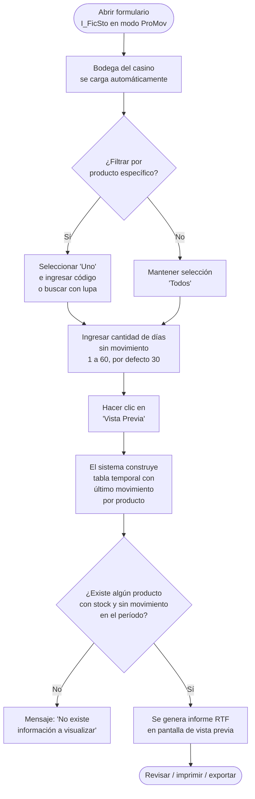

# Producto Sin Movimiento

**Formulario:** `I_FicSto.frm` (modo `ProMov`)
**Función principal:** `I_ProductoSinMovimiento` en `Informes.bas`
**Tabla(s) principal(es):** `b_bodegas` (stock actual por bodega y producto), `b_productospmpdia` (precio PMP histórico diario por producto y casino), `b_totcompras`/`b_detcompras` (recepciones de compra), `b_totventas`/`b_detventas` (traspasos, salidas y devoluciones), `b_totventascaf`/`b_detventascafpro` (ventas de cafetería)
**Consulta principal:** Consulta directa — tabla temporal en sesión + cruce con tablas de movimientos

---

## Índice

- [1 — ¿Para qué sirve esta pantalla?](#1--para-qué-sirve-esta-pantalla)
- [2 — ¿Qué necesito para usarla?](#2--qué-necesito-para-usarla)
- [3 — ¿Cómo se usa?](#3--cómo-se-usa)
  - [3.1 Flujo paso a paso](#31-flujo-paso-a-paso)
  - [3.2 Controles y acciones disponibles](#32-controles-y-acciones-disponibles)
- [4 — ¿Qué restricciones debo conocer?](#4--qué-restricciones-debo-conocer)
  - [4.1 Validaciones del sistema](#41-validaciones-del-sistema)
  - [4.2 Reglas de cálculo](#42-reglas-de-cálculo)
- [5 — ¿Qué obtengo?](#5--qué-obtengo)
- [6 — Referencia técnica](#6--referencia-técnica)
  - [Tablas que intervienen](#tablas-que-intervienen)
  - [Relación con otros módulos](#relación-con-otros-módulos)

---

## 1 — ¿Para qué sirve esta pantalla?

[↑ Volver al índice](#índice)

Este informe identifica todos los productos que tienen stock disponible en la bodega del casino pero que **no han registrado ningún movimiento durante los últimos N días**. Es una herramienta de control de inventario que permite detectar productos inmovilizados o con bajo nivel de rotación, lo cual puede representar un riesgo de vencimiento, merma no registrada o sobre-stock.

Para cada producto inmovilizado, el informe muestra cuál fue el último movimiento registrado (compra, traspaso, salida, devolución o venta de cafetería), su fecha, tipo de documento, número de documento, cantidad actual en bodega y su valorización al precio PMP vigente en esa fecha.

---

## 2 — ¿Qué necesito para usarla?

[↑ Volver al índice](#índice)

| Requisito | Detalle |
|---|---|
| Casino activo | El sistema usa la bodega del casino con el que se inició sesión. No se puede cambiar la bodega. |
| Días sin movimiento | Número entero entre **1 y 60**. Valor por defecto: **30 días**. No se usan fechas de inicio ni de fin; el criterio es enteramente relativo a la fecha de procesamiento del sistema. |
| Producto (opcional) | Se puede filtrar por un producto específico o dejar en blanco para analizar **todos los productos** de la bodega. |

> **Importante:** Este informe no utiliza rangos de fechas. El único parámetro temporal es la cantidad de días de inmovilidad que se desea detectar. El sistema calcula automáticamente el corte hacia atrás desde la fecha actual.

---

## 3 — ¿Cómo se usa?

[↑ Volver al índice](#índice)

### 3.1 Flujo paso a paso



### 3.2 Controles y acciones disponibles

[↑ Volver al índice](#índice)

| Control | Descripción |
|---|---|
| **Bodega** (Frame4) | Muestra la bodega del casino activo. Solo lectura — no se puede cambiar. |
| **Todos** (opción por defecto) | Analiza todos los productos con stock en la bodega. |
| **Uno** | Activa el campo de código de producto y el ícono de búsqueda (lupa). Al ingresar un código inexistente y salir del campo, el sistema muestra el aviso "Producto no existe..." |
| **Sin movimientos los últimos [N] días** | Campo numérico entero. Rango válido: 1 a 60. Valor inicial: 30. |
| **Vista Previa** (barra de herramientas, índice 1) | Ejecuta el informe y lo muestra en pantalla. |
| **Salir** (barra de herramientas, índice 3) | Cierra el formulario sin generar el informe. |

> **Controles NO visibles en este modo:** los campos de fecha inicio y fecha fin están ocultos (`fpDateTime1(0)` y `fpDateTime1(1)`). El marco "Familia Producto" (`Frame3`) también está oculto — no existe filtro por familia.

---

## 4 — ¿Qué restricciones debo conocer?

[↑ Volver al índice](#índice)

### 4.1 Validaciones del sistema

- **Producto inexistente:** Si se elige la opción "Uno" y se escribe un código que no existe en `b_productos`, el sistema muestra un aviso de error al perder el foco del campo. No se puede continuar con un código inválido.
- **Sin resultados:** Si ningún producto cumple el criterio de inmovilidad (stock > 0 y último movimiento anterior al corte), el sistema muestra el mensaje "No existe información a visualizar..." y no genera el informe.
- **Bodega fija:** No es posible cambiar la bodega desde este formulario. El informe siempre corresponde a la bodega del casino activo en la sesión.
- **Rango de días:** El campo numérico acepta solo valores entre 1 y 60. Valores fuera de este rango no son admitidos por el control.

### 4.2 Reglas de cálculo

[↑ Volver al índice](#índice)

**Fecha de corte:**
La fecha de corte se calcula restando los días ingresados a la fecha actual del sistema:

```
Fecha_corte = Fecha_actual - N_días
```

Un producto aparece en el informe si y solo si:
1. Su stock actual en `b_bodegas` (`bod_canmer`) es mayor que 0 (redondeado a 3 decimales).
2. La fecha de su último movimiento registrado es **anterior** a la fecha de corte.

**Detección del último movimiento (orden de prioridad):**

El sistema analiza tres fuentes de movimientos. Para cada producto candidato, busca el detalle del último movimiento en este orden:

1. **Compras:** Cruza `b_totcompras` + `b_detcompras` + `b_productospmpdia`. Busca la recepción más reciente asociada a ese producto en esa bodega.
2. **Traspasos y salidas de bodega** (documentos tipo `SP` y `DP`): Cruza `b_totventas` + `b_detventas` + `b_productospmpdia`. Solo se consideran documentos no anulados ni pendientes (`tov_estdoc <> 'A'` y `<> 'P'`), con cantidad mayor que 0. Se excluyen los documentos tipo `AI`.
3. **Ventas de cafetería:** Cruza `b_totventascaf` + `b_detventascafpro` + `b_productospmpdia`. Solo se consideran ventas cerradas (`tvc_estado = 'C'`).

Si ninguna de las tres fuentes tiene detalle disponible para ese producto en la fecha del último movimiento, la fila no se agrega al informe (el flag `estexi` queda en falso).

**Valorización:**

```
Total = bod_canmer (stock actual) × ppd_propon (precio PMP de la fecha del último movimiento)
```

El precio PMP se obtiene de `b_productospmpdia` usando el campo `ppd_propon`, filtrado por el centro de costos del casino activo (`ppd_cencos`). El total acumulado de todos los productos aparece como "Total General" al final del informe.

---

## 5 — ¿Qué obtengo?

[↑ Volver al índice](#índice)

El sistema genera un **informe RTF en orientación vertical (Portrait)**, con vista previa en pantalla, que puede imprimirse o exportarse.

**Encabezado del informe:**

| Campo | Contenido |
|---|---|
| Contrato | Nombre del casino activo |
| Período | "N Últimos días (Fecha de Procesamiento: DD/MM/AAAA)" |
| Producto | Nombre del producto si se filtró por uno, o "TODOS" |

**Detalle por producto (una fila por producto inmovilizado):**

| Columna | Descripción |
|---|---|
| Código | Código del producto (`dec_codmer` / `dvp_codmer`) |
| Descripción | Nombre del producto (`pro_nombre`) |
| UN. | Unidad de medida abreviada (`uni_nomcor`) |
| Cantidad | Stock actual en bodega (`bod_canmer`), con formato de decimales configurado por casino |
| Precio PMP | Precio Medio Ponderado a la fecha del último movimiento (`ppd_propon`), 2 decimales |
| Total | Stock × Precio PMP, 2 decimales |
| T.Doc. | Tipo de documento del último movimiento (ej.: `GU`, `SP`, `DP`, `VC` para cafetería) |
| Fecha | Fecha del último movimiento registrado |
| N°. Doc. | Número de documento del último movimiento (vacío para ventas de cafetería) |

**Pie del informe:**

- **Total General:** suma de la columna "Total" de todos los productos listados, expresada en pesos.

> Si no hay ningún producto que cumpla el criterio, el informe no se genera y se muestra un aviso en pantalla.

---

## 6 — Referencia técnica

[↑ Volver al índice](#índice)

### Tablas que intervienen

| Tabla | Rol en el informe |
|---|---|
| `b_bodegas` | Fuente del stock actual (`bod_canmer`) y vínculo producto-bodega (`bod_codpro`, `bod_codbod`) |
| `b_productos` | Nombre del producto (`pro_nombre`), unidad de medida (`pro_coduni`), validación de existencia |
| `a_unidad` | Nombre corto de la unidad de medida (`uni_nomcor`) |
| `b_productospmpdia` | Precio PMP histórico por día y por casino (`ppd_propon`, `ppd_fecdia`, `ppd_cencos`). Fuente de la valorización |
| `b_totcompras` | Cabecera de recepciones de compra (`toc_rutpro`, `toc_tipdoc`, `toc_numdoc`, `toc_fecrem`, `toc_codbod`) |
| `b_detcompras` | Detalle de líneas de compra (`dec_codmer`, `dec_rutpro`, `dec_tipdoc`, `dec_numdoc`) |
| `b_totventas` | Cabecera de traspasos y salidas (`tov_tipdoc`, `tov_numdoc`, `tov_fecpro`, `tov_fecemi`, `tov_estdoc`, `tov_codbod`) |
| `b_detventas` | Detalle de líneas de traspaso/salida (`dev_codmer`, `dev_canmer`, `dev_tipdoc`, `dev_numdoc`) |
| `b_totventascaf` | Cabecera de ventas de cafetería (`tvc_cencos`, `tvc_fecing`, `tvc_codbod`, `tvc_estado`) |
| `b_detventascafpro` | Detalle de productos vendidos en cafetería (`dvp_codmer`, `dvp_cencos`, `dvp_fecing`) |
| Tabla temporal `<usuario>_tmp_ProductoSinMov` | Tabla de trabajo creada en sesión. Consolida el último movimiento por producto desde las tres fuentes. Se elimina al inicio de cada ejecución mediante `fg_CheckTmp`. |

**Proceso de la tabla temporal:**

```sql
-- Paso 1: SELECT INTO desde compras (crea la tabla)
SELECT DISTINCT b.dec_codmer, c.bod_canmer, MAX(a.toc_fecrem)
INTO <usuario>_tmp_ProductoSinMov
FROM b_totcompras a, b_detcompras b, b_bodegas c
WHERE ... AND a.toc_codbod = <codbod> AND ROUND(c.bod_canmer, 3) > 0

-- Paso 2: INSERT desde traspasos/salidas (tipos SP, DP)
INSERT INTO <usuario>_tmp_ProductoSinMov
SELECT b.dev_codmer, c.bod_canmer,
  MAX(CASE WHEN a.tov_tipdoc IN ('SP','DP') THEN a.tov_fecpro ELSE a.tov_fecemi END)
FROM b_totventas a, b_detventas b, b_bodegas c
WHERE ... AND a.tov_codbod = <codbod> AND a.tov_tipdoc <> 'AI'
  AND (a.tov_estdoc <> 'A' OR a.tov_estdoc <> 'P')

-- Paso 3: INSERT desde ventas cafetería
INSERT INTO <usuario>_tmp_ProductoSinMov
SELECT b.dvp_codmer, c.bod_canmer, MAX(a.tvc_fecing)
FROM b_totventascaf a, b_detventascafpro b, b_bodegas c
WHERE ... AND a.tvc_codbod = <codbod> AND a.tvc_estado = 'C'

-- Paso 4: Consulta final — agrupa y filtra por stock > 0
SELECT a.dec_codmer, c.pro_nombre, b.uni_nomcor, a.bod_canmer,
       MAX(a.toc_fecrem) AS toc_fecrem
FROM <usuario>_tmp_ProductoSinMov a, a_unidad b, b_productos c
WHERE a.dec_codmer = c.pro_codigo AND c.pro_coduni = b.uni_codigo
  AND a.bod_canmer > 0
GROUP BY a.dec_codmer, c.pro_nombre, b.uni_nomcor, a.bod_canmer
ORDER BY c.pro_nombre
```

No se invocan procedimientos almacenados. Toda la lógica es SQL dinámico generado desde VB6.

### Relación con otros módulos

[↑ Volver al índice](#índice)

| Módulo relacionado | Tipo de relación |
|---|---|
| **Recepciones / Compras** | El informe lee la fecha de la última recepción de cada producto desde `b_totcompras` y `b_detcompras`. Un producto recepcionado recientemente no aparecerá como inmovilizado. |
| **Traspasos y Salidas de Bodega** | Las salidas de tipo `SP` (Salida Producción) y `DP` (Devolución Producción) se consideran como movimientos. La fecha usada es `tov_fecpro` (fecha de proceso). |
| **Inventario / Stock** | El stock de referencia proviene de `b_bodegas`, que es la misma tabla usada por todos los módulos de inventario. |
| **PMP (Precio Medio Ponderado)** | La valorización se obtiene de `b_productospmpdia`, la misma tabla que alimenta los informes de costo y la ficha stock. El precio corresponde al PMP de la fecha del último movimiento, no al PMP actual. |
| **Cafetería** | Las ventas de cafetería cerradas (`tvc_estado = 'C'`) también se contabilizan como movimiento. Un producto vendido en cafetería pero no en bodega principal puede no aparecer en el informe si tiene movimiento por esta vía. |
| **Cierre diario** | No existe dependencia directa con el cierre. El informe consulta datos ya registrados y no requiere que el período esté cerrado. |

---

*Fuentes: `I_FicSto.frm`, función `I_ProductoSinMovimiento` en `Informes.bas`, tablas `b_bodegas`, `b_productos`, `b_productospmpdia`, `b_totcompras`, `b_detcompras`, `b_totventas`, `b_detventas`, `b_totventascaf`, `b_detventascafpro`, `a_unidad` en `SGP_Local.sql`*
