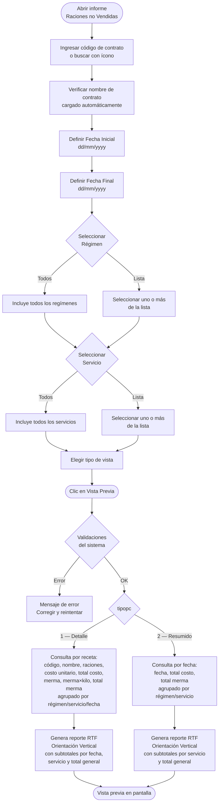

# Raciones no Vendidas

**Formulario:** `I_FCost.frm` (modo por defecto)
**Función principal:** `I_MermaPreparacion` en `Informes.bas`
**Tablas principales:** `b_minuta` (cabecera de minutas), `b_minutadet` (detalle de recetas por minuta), `b_receta` (catálogo de recetas), `a_servicio` (catálogo de servicios), `a_regimen` (catálogo de regímenes)
**Consulta principal:** Consulta directa SQL (sin stored procedure)

---

## Índice

- [1 — ¿Para qué sirve esta pantalla?](#1--para-qué-sirve-esta-pantalla)
- [2 — ¿Qué necesito para usarla?](#2--qué-necesito-para-usarla)
- [3 — ¿Cómo se usa?](#3--cómo-se-usa)
  - [3.1 Flujo paso a paso](#31-flujo-paso-a-paso)
  - [3.2 Controles y acciones disponibles](#32-controles-y-acciones-disponibles)
- [4 — ¿Qué restricciones debo conocer?](#4--qué-restricciones-debo-conocer)
  - [4.1 Validaciones del sistema](#41-validaciones-del-sistema)
  - [4.2 Reglas de cálculo](#42-reglas-de-cálculo)
- [5 — ¿Qué obtengo?](#5--qué-obtengo)
  - [Resumen de tipos disponibles](#resumen-de-tipos-disponibles)
  - [(Detalle) Vista Detallada](#detalle-vista-detallada)
  - [(Resumido) Vista Resumida](#resumido-vista-resumida)
- [6 — Referencia técnica](#6--referencia-técnica)
  - [Tablas que intervienen](#tablas-que-intervienen)
  - [Relación con otros módulos](#relación-con-otros-módulos)

---

## 1 — ¿Para qué sirve esta pantalla?

[↑ Volver al índice](#índice)

Este informe identifica las **recetas que fueron planificadas pero cuyas raciones no se vendieron en su totalidad**, permitiendo además cuantificar el costo económico de esas mermas. En términos operativos, responde a la pregunta: *"¿Cuánto me costó lo que preparé pero no vendí?"*

Para cada combinación de régimen y servicio dentro del período consultado, el informe cruza:

- Las **raciones programadas** (`mid_numrac`) — lo que se planificó producir.
- El **número de mermas** (`mid_nummer`) — lo que efectivamente no se vendió.
- El **costo unitario de la receta** (`mid_cosrec + mid_cosdes`) — congelado al momento del cierre.

Con esa información calcula el costo total de lo programado y el costo total de lo que se perdió, mostrando los resultados agrupados por fecha, régimen y servicio.

El informe solo considera minutas de tipo real (`mid_tipmin = '2'`) y excluye recetas sin raciones programadas ni mermas registradas.

---

## 2 — ¿Qué necesito para usarla?

[↑ Volver al índice](#índice)

| Requisito | Detalle |
|-----------|---------|
| **Contrato** | Debe existir en el sistema. Se puede ingresar el código directamente o buscarlo con el ícono de búsqueda. |
| **Fecha Inicial** | Día desde el cual se consultará (formato dd/mm/yyyy). Se inicializa con la fecha del día. |
| **Fecha Final** | Día hasta el cual se consultará (formato dd/mm/yyyy). Se inicializa con la fecha del día. |
| **Período** | La fecha inicial y la final deben pertenecer al **mismo mes y año**. No se permiten rangos que crucen meses. |
| **Régimen** | Al menos un régimen debe quedar seleccionado (opción "Todos" o selección manual desde "Lista"). |
| **Servicio** | Al menos un servicio debe quedar seleccionado (opción "Todos" o selección manual desde "Lista"). |
| **Tipo de vista** | Elegir entre "Detalle" (por receta y fecha) o "Resumido" (totales por fecha). |
| **Datos en BD** | Deben existir minutas reales (`mid_tipmin='2'`) con raciones (`mid_numrac > 0`) y mermas (`mid_nummer > 0`) en el período indicado para que el informe muestre contenido. |

---

## 3 — ¿Cómo se usa?

[↑ Volver al índice](#índice)

### 3.1 Flujo paso a paso

[↑ Volver al índice](#índice)



### 3.2 Controles y acciones disponibles

[↑ Volver al índice](#índice)

| Control | Tipo | Descripción |
|---------|------|-------------|
| Campo contrato | Texto + ícono búsqueda | Ingreso del código de centro de costo. El ícono abre un buscador. Al confirmar, se muestra automáticamente el nombre del cliente. |
| Fecha Inicial | Selector de fecha | Rango de inicio. Inicializa con la fecha actual. |
| Fecha Final | Selector de fecha | Rango de término. Inicializa con la fecha actual. |
| Detalle / Resumido | Botones de opción (radio) | Selecciona el nivel de desglose del informe. Solo estas dos opciones son visibles en este modo. |
| Marco Régimen | Opciones + lista | "Todos" incluye todos los regímenes del contrato. "Lista" habilita la selección múltiple de regímenes específicos. |
| Marco Servicio | Opciones + lista | "Todos" incluye todos los servicios del contrato. "Lista" habilita la selección múltiple de servicios específicos. |
| Vista Previa | Botón toolbar | Ejecuta las validaciones y genera el informe RTF en el visor integrado. |
| Histórico Planificación Teórica | Botón toolbar | Abre un informe complementario de planificación histórica (función independiente). |
| Salir | Botón toolbar | Cierra el formulario sin generar ningún reporte. |

---

## 4 — ¿Qué restricciones debo conocer?

[↑ Volver al índice](#índice)

### 4.1 Validaciones del sistema

[↑ Volver al índice](#índice)

Las siguientes validaciones se ejecutan al pulsar **Vista Previa**, en el orden indicado. Si alguna falla, se muestra el mensaje correspondiente y el informe no se genera.

| # | Mensaje exacto del sistema | Condición que lo provoca |
|---|---------------------------|--------------------------|
| 1 | `No existe contrato` | El código de contrato ingresado no existe en la base de datos. |
| 2 | `Fecha origen Mayor destino` | La Fecha Inicial es posterior a la Fecha Final. |
| 3 | `Mes origen mayor destino` | La Fecha Inicial y la Fecha Final pertenecen a meses distintos. |
| 4 | `Año origen mayor destino` | La Fecha Inicial y la Fecha Final pertenecen a años distintos. |
| 5 | `Regimen debe ser informado` | No hay ningún régimen seleccionado (ni "Todos" ni ninguno de la lista). |
| 6 | `Servicio debe ser informado` | No hay ningún servicio seleccionado (ni "Todos" ni ninguno de la lista). |

> **Nota importante:** Las validaciones 3 y 4 implican que el rango de fechas no puede cruzar meses ni años. El período consultado debe estar completamente dentro de un único mes de un único año.

### 4.2 Reglas de cálculo

[↑ Volver al índice](#índice)

| Concepto | Fórmula aplicada |
|----------|-----------------|
| **Costo unitario de receta** | `mid_cosrec + mid_cosdes` (costo de receta + costo de descarte, ambos congelados al momento del cierre) |
| **Total Costo** (por receta) | `ROUND(mid_numrac × (mid_cosrec + mid_cosdes), 0)` — costo de las raciones programadas |
| **Total Merma** (por receta) | `ROUND(mid_nummer × (mid_cosrec + mid_cosdes), 0)` — costo de las raciones no vendidas |
| **Merma×Kilo** | `mid_mermaxcantservida` — cantidad de merma expresada por cantidad servida, según lo registrado en el detalle de minuta |
| **Subtotales** | Se acumulan por fecha (solo en Detalle), por régimen/servicio, y finalmente un Total General |
| **Filtro de datos** | Solo se consideran registros con `mid_tipmin='2'` (minuta real), `mid_numrac > 0` y `mid_nummer > 0` |

> El costo de receta (`mid_cosrec`) y el costo de descarte (`mid_cosdes`) se registran en el detalle de minuta en el momento en que se realiza el cierre del período. Una vez cerrado, estos valores no cambian, por lo que el informe siempre refleja el costo vigente al cierre de cada día.

---

## 5 — ¿Qué obtengo?

[↑ Volver al índice](#índice)

El informe se genera como un documento **RTF** en orientación **vertical (Portrait)**, con encabezado y pie de página corporativos, y se visualiza directamente en el visor integrado de la aplicación.

### Resumen de tipos disponibles

[↑ Volver al índice](#índice)

| Vista | Nivel de desglose | Columnas principales | Subtotales |
|-------|------------------|----------------------|------------|
| **Detalle** | Por receta, dentro de cada fecha, régimen y servicio | Código, Recetas, Programado, Costo, Total Costo, Merma, Merma×Kilo, Total Merma | Por fecha, por servicio, Total General |
| **Resumido** | Por fecha, dentro de cada régimen y servicio | Fecha, Total Costo, Total Merma | Por servicio, Total General |

---

### (Detalle) Vista Detallada

[↑ Volver al índice](#índice)

Muestra cada receta que tuvo merma, con todos sus valores económicos desglosados.

**Agrupación del informe:**

1. Encabezado de grupo: `Regimen: [nombre] \ Servicio: [nombre]`
2. Encabezado de fecha: `dd/mm/yyyy` en negrita
3. Filas de detalle por receta
4. Fila de subtotal por fecha: **Total** (columnas Total Costo y Total Merma en negrita)
5. Fila de subtotal por servicio: **Total Servicio** (al cambiar de régimen/servicio)
6. Fila final: **Total General** al terminar todos los registros

**Columnas del cuerpo de datos:**

| # | Encabezado | Origen | Formato |
|---|-----------|--------|---------|
| 1 | Código | `b_receta.rec_codigo` | Texto |
| 2 | Recetas | `b_receta.rec_nombre` | Texto |
| 3 | Programado | `b_minutadet.mid_numrac` | Número entero |
| 4 | Costo | `mid_cosrec + mid_cosdes` | Número con 2 decimales |
| 5 | Total Costo | `ROUND(mid_numrac × (mid_cosrec + mid_cosdes), 0)` | Número entero |
| 6 | Merma | `b_minutadet.mid_nummer` | Número con 3 decimales (en blanco si es 0) |
| 7 | MermaxKilo | `b_minutadet.mid_mermaxcantservida` | Número con 3 decimales (en blanco si es 0) |
| 8 | Total Merma | `ROUND(mid_nummer × (mid_cosrec + mid_cosdes), 0)` | Número entero (en blanco si merma es 0) |

**Orden de los datos:** por régimen (`min_codreg`), servicio (`min_codser`), fecha (`min_fecmin`), línea de detalle (`mid_numlin`).

---

### (Resumido) Vista Resumida

[↑ Volver al índice](#índice)

Muestra el costo total del período agregado por fecha, sin desglosar las recetas individuales.

**Agrupación del informe:**

1. Encabezado de grupo: `Regimen: [nombre] \ Servicio: [nombre]`
2. Filas de detalle por fecha
3. Fila de subtotal por servicio: **Total** (al cambiar de régimen/servicio)
4. Fila final: **Total General** al terminar todos los registros

**Columnas del cuerpo de datos:**

| # | Encabezado | Origen | Formato |
|---|-----------|--------|---------|
| 1 | Fecha | `b_minuta.min_fecmin` convertida a `dd/mm/yyyy` | Fecha |
| 2 | Total Costo | `SUM(ROUND(mid_numrac × (mid_cosrec + mid_cosdes), 0))` | Número entero |
| 3 | Total Merma | `SUM(ROUND(mid_nummer × (mid_cosrec + mid_cosdes), 0))` | Número entero |

**Orden de los datos:** por fecha (`min_fecmin`), régimen (`min_codreg`), servicio (`min_codser`).

---

## 6 — Referencia técnica

[↑ Volver al índice](#índice)

### Tablas que intervienen

[↑ Volver al índice](#índice)

| Tabla | Rol en este informe | Campos utilizados |
|-------|--------------------|--------------------|
| `b_minuta` | Cabecera de la minuta planificada. Define el contrato, régimen, servicio y fecha de cada día. | `min_codigo` (PK), `min_cencos` (contrato/centro de costo), `min_codreg` (código régimen), `min_codser` (código servicio), `min_fecmin` (fecha en formato YYYYMMDD) |
| `b_minutadet` | Detalle de recetas dentro de cada minuta. Contiene las raciones, mermas y costos congelados al cierre. | `mid_codigo` (FK a `b_minuta`), `mid_codrec` (FK a `b_receta`), `mid_tipmin` (tipo: '2'=real), `mid_numrac` (raciones programadas), `mid_nummer` (merma registrada), `mid_cosrec` (costo receta congelado), `mid_cosdes` (costo descarte congelado), `mid_mermaxcantservida` (merma por cantidad servida), `mid_numlin` (número de línea para orden) |
| `b_receta` | Catálogo maestro de recetas. Provee el código y nombre descriptivo de cada preparación. | `rec_codigo`, `rec_nombre` |
| `a_servicio` | Catálogo de servicios (casino, cafetería, etc.). Provee el nombre del servicio para encabezados de grupo. | `ser_codigo`, `ser_nombre` |
| `a_regimen` | Catálogo de regímenes alimentarios (régimen normal, diabético, hiposódico, etc.). Provee el nombre del régimen para encabezados de grupo. | `reg_codigo`, `reg_nombre` |

**Consulta principal (modo Detalle):**

```sql
SELECT a.rec_codigo, a.rec_nombre, d.ser_nombre,
       ISNULL(c.mid_numrac, 0) AS mid_numrac,
       ISNULL(c.mid_cosrec, 0) AS mid_cosrec,
       ISNULL(c.mid_cosdes, 0) AS mid_cosdes,
       c.mid_numlin,
       ISNULL(c.mid_nummer, 0) AS mid_nummer,
       b.min_fecmin, b.min_codreg, e.reg_nombre, b.min_codser,
       ISNULL(c.mid_mermaxcantservida, 0) AS mid_mermaxkilo,
       ROUND(SUM(ISNULL(c.mid_numrac, 0) * (ISNULL(c.mid_cosrec, 0) + ISNULL(c.mid_cosdes, 0))), 0) AS totcos,
       ROUND(SUM((ISNULL(c.mid_cosrec, 0) + ISNULL(c.mid_cosdes, 0)) * ISNULL(c.mid_nummer, 0)), 0) AS totmer
FROM   b_minuta b WITH (NOLOCK)
       INNER JOIN b_minutadet c WITH (NOLOCK) ON b.min_codigo = c.mid_codigo
       INNER JOIN b_receta a WITH (NOLOCK) ON c.mid_codrec = a.rec_codigo
       INNER JOIN a_servicio d WITH (NOLOCK) ON b.min_codser = d.ser_codigo
       INNER JOIN a_regimen e WITH (NOLOCK) ON b.min_codreg = e.reg_codigo
WHERE  b.min_cencos = '<contrato>'
AND    b.min_codreg IN (<lista_regímenes>)
AND    b.min_codser IN (<lista_servicios>)
AND    b.min_fecmin >= <fecini>
AND    b.min_fecmin <= <fecfin>
AND    c.mid_tipmin = '2'
AND    c.mid_numrac > 0
AND    c.mid_nummer > 0
GROUP BY a.rec_codigo, a.rec_nombre, d.ser_nombre, c.mid_numrac, c.mid_cosrec,
         c.mid_cosdes, c.mid_numlin, c.mid_nummer, b.min_fecmin, b.min_codreg,
         e.reg_nombre, b.min_codser, c.mid_mermaxcantservida
ORDER BY b.min_codreg, b.min_codser, b.min_fecmin, c.mid_numlin
```

> Las lecturas usan `WITH (NOLOCK)` para no bloquear la operación del día mientras se consulta el informe.

**Consulta principal (modo Resumido):**

```sql
SELECT b.min_fecmin, b.min_codreg, e.reg_nombre, b.min_codser, d.ser_nombre,
       SUM(ROUND(ISNULL(c.mid_numrac, 0) * (ISNULL(c.mid_cosrec, 0) + ISNULL(c.mid_cosdes, 0)), 0)) AS totcos,
       SUM(ROUND(ISNULL(c.mid_nummer, 0) * (ISNULL(c.mid_cosrec, 0) + ISNULL(c.mid_cosdes, 0)), 0)) AS totmer
FROM   b_receta a, b_minuta b, b_minutadet c, a_servicio d, a_regimen e
WHERE  b.min_codigo = c.mid_codigo
AND    c.mid_codrec = a.rec_codigo
AND    b.min_codreg = e.reg_codigo
AND    b.min_codser = d.ser_codigo
AND    b.min_cencos = '<contrato>'
AND    b.min_codreg IN (<lista_regímenes>)
AND    b.min_codser IN (<lista_servicios>)
AND    b.min_fecmin >= <fecini>
AND    b.min_fecmin <= <fecfin>
AND    c.mid_tipmin = '2'
AND    c.mid_numrac > 0
AND    c.mid_nummer > 0
GROUP BY b.min_fecmin, b.min_codreg, e.reg_nombre, b.min_codser, d.ser_nombre
ORDER BY b.min_fecmin, b.min_codreg, b.min_codser
```

> El modo Resumido usa sintaxis de JOIN implícito (sin `INNER JOIN` explícito) y no aplica `WITH (NOLOCK)`.

### Relación con otros módulos

[↑ Volver al índice](#índice)

| Módulo relacionado | Tipo de relación |
|-------------------|-----------------|
| **Cierre de Período** | Los costos `mid_cosrec` y `mid_cosdes` se congelan cuando se ejecuta el cierre diario. Sin cierre ejecutado, este informe no mostrará valores económicos correctos. |
| **Planificación / Minuta** | Las minutas de tipo real (`mid_tipmin='2'`) son el insumo principal. Solo aparecen en el informe las recetas incluidas en una minuta real aprobada. |
| **Mermas de Preparación** | El campo `mid_nummer` se alimenta desde el registro de mermas realizado por el chef durante el proceso de producción. Si no se registran mermas, el informe no mostrará filas (el filtro `mid_nummer > 0` las excluye). |
| **Regímenes y Servicios** | Los catálogos `a_regimen` y `a_servicio` son mantenidos por el módulo de Contrato/Régimen. Producción no tiene mantenedores propios para estas tablas. |
| **Informe Histórico Planificación Teórica** | Botón disponible en la misma barra de herramientas; complementa este informe mostrando lo planificado versus lo real. |

---

*Fuentes: `I_FCost.frm`, función `I_MermaPreparacion` en `Informes.bas`, tablas `b_minuta`, `b_minutadet`, `b_receta`, `a_servicio`, `a_regimen` en `SGP_Local.sql`*
