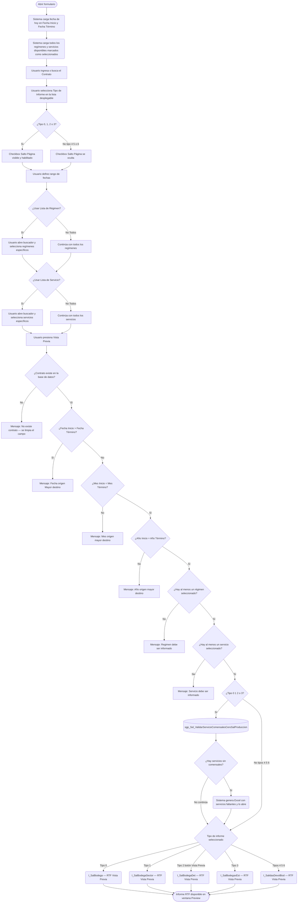
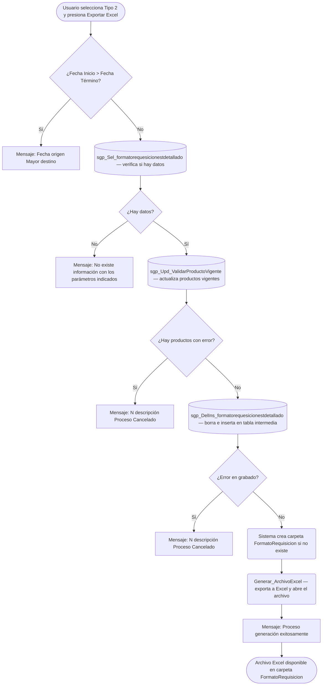

# Salida y Devolución de Producción

**Formulario:** `I_SalBod.frm`
**Tabla(s) principal(es):** `b_minuta` / `b_minutadet` (minutas de planificación y detalle de recetas), `b_totventas` / `b_detventas` (documentos de salida y devolución a bodega), `b_formatorequesicionestdetallado` (tabla intermedia de formato de requisición detallado)
**Consulta principal:** Múltiple según tipo de informe — ver detalle en Sección 5

---

## Índice

- [1 — ¿Para qué sirve esta pantalla?](#1--para-qué-sirve-esta-pantalla)
- [2 — ¿Qué necesito para usarla?](#2--qué-necesito-para-usarla)
- [3 — ¿Cómo se usa?](#3--cómo-se-usa)
  - [3.1 Flujo paso a paso](#31-flujo-paso-a-paso)
  - [3.2 Controles y acciones disponibles](#32-controles-y-acciones-disponibles)
- [4 — ¿Qué restricciones debo conocer?](#4--qué-restricciones-debo-conocer)
  - [4.1 Validaciones del sistema](#41-validaciones-del-sistema)
  - [4.2 Reglas de cálculo](#42-reglas-de-cálculo)
- [5 — ¿Qué obtengo?](#5--qué-obtengo)
  - [Resumen de tipos disponibles](#resumen-de-tipos-disponibles)
  - [(0) Formato de Requisición Resumido](#0-formato-de-requisición-resumido-i_salbodega)
  - [(1) Formato de Requisición x Sector](#1-formato-de-requisición-x-sector-i_salbodegasector)
  - [(2) Formato de Requisición x Estructura Servicio Detallado](#2-formato-de-requisición-x-estructura-servicio-detallado-i_salbodegadet)
  - [(3) Formato de Requisición x Estructura Servicio Resumido](#3-formato-de-requisición-x-estructura-servicio-resumido-i_salbodegaxest)
  - [(4) Resumen de Salida a Bodega](#4-resumen-de-salida-a-bodega-i_salidasdevolbod)
  - [(5) Devolución de Salida a Bodega](#5-devolución-de-salida-a-bodega-i_salidasdevolbod)
  - [(6) Salida Menos Devoluciones a Bodega](#6-salida-menos-devoluciones-a-bodega-i_salidasdevolbod)
- [6 — Referencia técnica](#6--referencia-técnica)
  - [Tablas que intervienen](#tablas-que-intervienen)
  - [Relación con otros módulos](#relación-con-otros-módulos)

---

## 1 — ¿Para qué sirve esta pantalla?

[↑ Volver al índice](#índice)

Esta pantalla centraliza en un solo formulario siete tipos distintos de informes relacionados con el movimiento de mercadería entre bodega y producción. Los cuatro primeros tipos (opciones 0 a 3) son formatos de **requisición**: calculan qué cantidad de cada producto debe solicitarse a bodega para preparar las minutas planificadas del período, considerando las recetas, los gramajes y el número de raciones. Los tres tipos restantes (opciones 4, 5 y 6) son informes de **movimientos reales**: muestran lo que efectivamente salió de bodega hacia producción, lo que fue devuelto, o la diferencia entre ambos.

La pantalla se organiza en un encabezado superior donde el usuario indica el contrato (casino), el rango de fechas y el tipo de informe que desea generar. Debajo del encabezado hay dos paneles de selección múltiple: uno para regímenes y otro para servicios. Cada panel ofrece las opciones "Todos" (incluye todo lo disponible en el sistema) o "Lista" (permite elegir una selección específica mediante un buscador auxiliar). La barra de herramientas superior contiene los botones de ejecución, exportación a Excel, acceso a la carpeta de archivos generados y cierre del formulario.

Los cuatro informes de requisición (opciones 0 a 3) aplican una validación previa que detecta servicios sin comensales registrados; si la hay, genera automáticamente un archivo Excel con la información faltante antes de continuar. El tipo 2 tiene además la capacidad de **grabar y exportar** el formato de requisición detallado a una tabla intermedia en la base de datos y luego exportarlo a Excel, lo que lo diferencia del resto como el único tipo que escribe datos.

---

## 2 — ¿Qué necesito para usarla?

[↑ Volver al índice](#índice)

| Campo | Descripción | Obligatorio |
|---|---|---|
| Contrato | Código del contrato (casino) al que corresponden los informes. Se puede escribir directamente o buscar mediante el ícono de lupa que abre el formulario `B_TabEst` con la tabla `b_clientes`. El nombre del contrato se muestra automáticamente al lado del campo. | Sí |
| Tipo de Informe | Lista desplegable con 7 opciones. Determina qué clase de informe se genera y habilita o deshabilita controles adicionales como el botón "Exportar Excel" y el checkbox "Salto Página". | Sí |
| Fecha Inicio | Fecha de inicio del período a consultar. Formato `dd/mm/yyyy`. Al ingresar esta fecha se habilita la Fecha Término. | Sí |
| Fecha Término | Fecha de cierre del período. Debe estar en el mismo mes y año que la Fecha Inicio. | Sí |
| Régimen — "Todos" / "Lista" | Selector dentro del panel Regimen. "Todos" incluye todos los regímenes disponibles en el sistema. "Lista" habilita el ícono de búsqueda para seleccionar regímenes específicos desde `B_MTaEst`. Por defecto viene seleccionado "Todos". | Sí (al menos uno debe quedar seleccionado) |
| Servicio — "Todos" / "Lista" | Selector dentro del panel Servicio. "Todos" incluye todos los servicios del contrato. "Lista" habilita el ícono de búsqueda para seleccionar servicios específicos desde `B_MTaEst`. Por defecto viene seleccionado "Todos". | Sí (al menos uno debe quedar seleccionado) |
| Salto Página | Checkbox visible únicamente para los tipos 0, 1, 2 y 3. Controla si el informe RTF insertará un salto de página entre secciones. No aplica a los tipos 4, 5 y 6. | No |

Al abrirse el formulario, el sistema carga automáticamente la fecha del día del equipo en ambos campos de fecha, y carga en las grillas internas todos los regímenes y servicios disponibles marcados como seleccionados.

---

## 3 — ¿Cómo se usa?

### 3.1 Flujo paso a paso

[↑ Volver al índice](#índice)



**Flujo adicional exclusivo del Tipo 2 — botón Exportar Excel:**



### 3.2 Controles y acciones disponibles

[↑ Volver al índice](#índice)

| Control / Acción | Descripción |
|---|---|
| **Campo Contrato** | Campo de texto donde se ingresa el código del contrato. Al escribir, el sistema busca en la tabla `b_clientes` y muestra el nombre del casino en el panel gris adyacente. |
| **Lupa de Contrato** | Ícono que abre el formulario auxiliar `B_TabEst` cargando la tabla `b_clientes`. Permite buscar y seleccionar el contrato desde una lista. |
| **Lista Tipo de Informe** | Combo desplegable con las 7 opciones de informe. Controla qué otros elementos se habilitan: muestra u oculta el checkbox "Salto Página" y activa o desactiva el botón "Exportar Excel". |
| **Fecha Inicio** | Campo de fecha con selector de calendario. Al dejarlo vacío, deshabilita la Fecha Término. El sistema lo precarga con la fecha actual al abrir el formulario. |
| **Fecha Término** | Campo de fecha con selector de calendario. Se habilita solo cuando Fecha Inicio tiene un valor. El sistema lo precarga con la fecha actual. |
| **Panel Regimen — opción "Todos"** | Selecciona todos los regímenes disponibles. Al activar esta opción se marcan todos los regímenes en la grilla interna y se deshabilita el ícono de búsqueda de regímenes. |
| **Panel Regimen — opción "Lista"** | Permite restringir la selección a regímenes específicos. Habilita el ícono de búsqueda para abrir el formulario `B_MTaEst` con los regímenes. |
| **Panel Servicio — opción "Todos"** | Selecciona todos los servicios disponibles. Al activar esta opción se marcan todos los servicios en la grilla interna y se deshabilita el ícono de búsqueda de servicios. |
| **Panel Servicio — opción "Lista"** | Permite restringir la selección a servicios específicos. Habilita el ícono de búsqueda para abrir el formulario `B_MTaEst` con los servicios filtrados por contrato y rango de fechas. |
| **Checkbox "Salto Página"** | Solo visible para los tipos 0, 1, 2 y 3. Si está marcado, el informe RTF inserta un salto de página entre bloques de información. Se oculta automáticamente al seleccionar los tipos 4, 5 o 6. |
| **Botón "Vista Previa"** | Ejecuta todas las validaciones y genera el informe RTF correspondiente al tipo seleccionado. El resultado se muestra en la ventana de vista previa del sistema. |
| **Botón "Exportar Excel"** | Solo habilitado cuando se selecciona el Tipo 2. Valida los datos, actualiza los productos vigentes en la tabla de lista de compras, graba la requisición detallada en la tabla `b_formatorequesicionestdetallado` y genera un archivo Excel en la carpeta `FormatoRequisicion`. |
| **Botón "Ver Carpeta"** | Abre el Explorador de Windows directamente en la carpeta `FormatoRequisicion` donde se almacenan los archivos Excel generados por el tipo 2. |
| **Botón "Salir"** | Cierra y descarga el formulario de la memoria. |

---

## 4 — ¿Qué restricciones debo conocer?

### 4.1 Validaciones del sistema

[↑ Volver al índice](#índice)

| # | Cuándo aparece | Qué verifica el sistema | Qué ve o experimenta el usuario |
|---|---|---|---|
| 1 | Al presionar "Vista Previa" o "Exportar Excel" | Que el código de contrato ingresado exista en la tabla de clientes (`b_clientes`) | Mensaje: `No existe contrato`. El campo Contrato se limpia. |
| 2 | Al presionar "Vista Previa" o "Exportar Excel" (tipos 0–3) | Que la Fecha Inicio no sea posterior a la Fecha Término | Mensaje: `Fecha origen Mayor destino` |
| 3 | Al presionar "Vista Previa" (tipos 0–3) | Que el mes de la Fecha Inicio coincida con el mes de la Fecha Término | Mensaje: `Mes origen mayor destino` |
| 4 | Al presionar "Vista Previa" (tipos 0–3) | Que el año de la Fecha Inicio coincida con el año de la Fecha Término | Mensaje: `Año origen mayor destino` |
| 5 | Al presionar "Vista Previa" (todos los tipos) | Que haya al menos un régimen seleccionado en la grilla interna | Mensaje: `Regimen debe ser informado` |
| 6 | Al presionar "Vista Previa" (todos los tipos) | Que haya al menos un servicio seleccionado en la grilla interna | Mensaje: `Servicio debe ser informado` |
| 7 | Solo para tipos 0, 1, 2 y 3 — antes de generar el informe | Que todos los servicios seleccionados tengan comensales registrados en el período (`sgp_Sel_ValidarServicioComensalesCeroSalProduccion`) | Mensaje: `Falta ingreso comensales totales, se generará archivo Excel con información faltante...`. El sistema crea o usa la carpeta `ExcelSGP` y abre automáticamente el archivo con los servicios afectados. El proceso del informe continúa de todas formas. |
| 8 | Al presionar "Exportar Excel" (tipo 2) | Que existan datos de minuta real (`mid_tipmin = '2'`) para el contrato, regímenes, servicios y período indicados (`sgp_Sel_formatorequesicionestdetallado`) | Mensaje: `No existe información, con los parametros indicados..` |
| 9 | Al presionar "Exportar Excel" (tipo 2) — después de verificar datos | Que los productos vigentes en la lista de compras puedan ser actualizados sin conflictos (`sgp_Upd_ValidarProductoVigente`) | Si hay errores, el sistema muestra: `[número de errores] [descripción] Proceso Cancelado` y no graba ni exporta nada. |
| 10 | Al presionar "Exportar Excel" (tipo 2) — después de validar productos | Que la grabación en la tabla intermedia se complete sin errores (`sgp_DelIns_formatorequesicionestdetallado`) | Si falla la transacción en la base de datos, el sistema muestra: `[número de errores] [descripción] Proceso Cancelado`. |
| 11 | Para los tipos 0, 1, 2 y 3 al generar el informe RTF | Que existan minutas planificadas con el tipo minuta real (`mid_tipmin = '2'`) para el período, contrato, regímenes y servicios indicados | Mensaje: `No existe información con los datos seleccionados`. El informe no se genera. |
| 12 | Para los tipos 4, 5 y 6 al generar el informe RTF | Que existan documentos de salida o devolución en `b_totventas` / `b_detventas` para los parámetros indicados | Mensaje: `No existen datos para consulta...`. El informe no se genera. |

### 4.2 Reglas de cálculo

[↑ Volver al índice](#índice)

La pantalla aplica una regla de cálculo central para los tipos de requisición (0, 1, 2 y 3), que determina la cantidad de producto a solicitar a bodega:

**Cantidad a solicitar = (Raciones planificadas × Gramaje del producto en la receta) / Factor de envasado del producto (`pro_facing`)**

Esta fórmula aparece expresada en los procedimientos de base de datos como:

```
((mid_numrac * red_canpro) / pro.pro_facing) AS Cantidad
```

Donde:
- `mid_numrac` es el número de raciones planificadas en la minuta para esa preparación.
- `red_canpro` es el gramaje del ingrediente en la receta (gramos por ración base).
- `pro_facing` es el factor de empaque del producto (unidades por envase, para convertir gramos a unidades de pedido).

El sistema excluye automáticamente del cálculo cualquier preparación con raciones cero, gramaje cero o `pro_facing` igual a cero, para evitar divisiones inválidas.

Adicionalmente, para el tipo 2, antes de grabar la requisición el sistema ejecuta la rutina `sgp_Upd_ValidarProductoVigente`, que actualiza los códigos de producto en la tabla de lista de compras (`b_contlistpreing`) reemplazando productos vencidos sin stock por sustitutos vigentes, cuando existen. Esto garantiza que la cantidad calculada se asocie a un producto actualmente disponible en bodega.

---

## 5 — ¿Qué obtengo?

[↑ Volver al índice](#índice)

### Resumen de tipos disponibles

[↑ Volver al índice](#índice)

| # | Nombre en la lista | Función generadora | Módulo | Formato de salida |
|---|---|---|---|---|
| 0 | Formato de Requisición Resumido | `I_SalBodega` | `InforAN.bas` | RTF / Vista Previa |
| 1 | Formato de Requisición x Sector | `I_SalBodegaSector` | `Informes.bas` | RTF / Vista Previa |
| 2 | Formato de Requisición x Estructura Servicio Detallado | `I_SalBodegaDet` | `Informes.bas` | RTF / Vista Previa + Excel grabado |
| 3 | Formato de Requisición x Estructura Servicio Resumido | `I_SalBodegaxEst` | `Informes.bas` | RTF / Vista Previa |
| 4 | Resumen de Salida a Bodega | `I_SalidasDevolBod` | `InforEG.bas` | RTF / Vista Previa |
| 5 | Devolución de Salida a Bodega | `I_SalidasDevolBod` | `InforEG.bas` | RTF / Vista Previa |
| 6 | Salida Menos Devoluciones a Bodega | `I_SalidasDevolBod` | `InforEG.bas` | RTF / Vista Previa |

---

### (0) Formato de Requisición Resumido (`I_SalBodega`)

[↑ Volver al índice](#índice)

Genera un listado de los productos que deben pedirse a bodega para cumplir las minutas planificadas del período, en formato de tabla con totales por día y por receta. El informe se organiza primero por régimen y servicio, luego por fecha, y dentro de cada fecha por número de línea de minuta, estación de servicio y número de ítem de receta.

**Fuente de datos:** Invoca internamente el procedimiento `sgp_Sel_FormatoRequisicion` (no presente en el archivo SQL analizado — posiblemente es un procedimiento del esquema anterior o una vista). Usa solo minutas de tipo real (`mid_tipmin = '2'`), con raciones mayores a cero, gramaje mayor a cero y `pro_facing` mayor a cero.

**Estructura del informe:**

| Columna | Calculado | Descripción |
|---|---|---|
| Contrato | No | Código y nombre del casino |
| Rango Fecha | No | Período seleccionado |
| Régimen / Servicio | No | Agrupador de cabecera por cada combinación |
| Día de la semana | No | Nombre del día calculado a partir de la fecha de minuta |
| Preparación | No | Código y nombre de la receta |
| Ingrediente / Producto | No | Nombre del ingrediente de receta y código del producto de compra |
| Unidad de medida | No | Unidad de medición del producto |
| Raciones planificadas | No | Cantidad de raciones registradas en la minuta |
| Gramaje | No | Gramaje definido en la receta (gramos por ración base) |
| Cantidad a solicitar | Sí | `(Raciones × Gramaje) / pro_facing` |

**Formato de salida:** RTF orientación vertical (`orPortrait`), con vista previa interactiva. También genera un archivo de texto plano paralelo con los mismos datos separados por `|`, utilizado para exportaciones adicionales.

**Restricción específica:** Si no hay minutas planificadas para los parámetros indicados, el sistema muestra `No existe información con los datos seleccionados` y no genera el informe.

---

### (1) Formato de Requisición x Sector (`I_SalBodegaSector`)

[↑ Volver al índice](#índice)

Variante del tipo 0 que agrupa los productos necesarios por **sector de despacho** (`a_sector`), en lugar de por receta. Útil para distribuir la requisición entre las distintas áreas físicas de cocina o despacho del casino. El parámetro `opgruvul` (leído desde `a_param` con código `opgruvul`) controla si el informe incluye una sección de "Grupo Vulnerable".

**Fuente de datos:** Usa el mismo procedimiento `sgp_Sel_FormatoRequisicion` para el nivel de régimen/servicio/fecha, y luego ejecuta una consulta directa sobre `b_minuta`, `b_minutadet`, `b_receta`, `b_recetadet`, `a_estservicio`, `b_contlistpreing`, `b_productos`, `a_unidad` y `a_sector`, agrupando por sector.

**Estructura del informe:** Similar al tipo 0 pero con una columna adicional:

| Columna | Calculado | Descripción |
|---|---|---|
| Sector | No | Nombre del sector de despacho (`a_sector`) al que se destina el producto |
| Código producto | No | Código del producto en bodega |
| Nombre producto | No | Nombre del producto |
| Unidad | No | Unidad de medida |
| Cantidad a solicitar | Sí | `SUM((gramaje / raciones_base × raciones) / pro_facing)` agrupado por producto y sector |

**Formato de salida:** RTF orientación vertical, con vista previa interactiva.

---

### (2) Formato de Requisición x Estructura Servicio Detallado (`I_SalBodegaDet`)

[↑ Volver al índice](#índice)

Es el tipo más completo. Muestra los productos requeridos organizados por la **estructura del servicio** (estaciones de despacho, `a_estservicio`), desagregando cada preparación con su detalle completo de receta. Es el único tipo que, al presionarse el botón "Exportar Excel", además de generar el informe RTF, **graba los datos en la tabla intermedia** `b_formatorequesicionestdetallado` y exporta directamente a un archivo Excel que se abre en pantalla.

El parámetro `opgruvul` (leído desde `a_param`) controla si el informe incluye una sección de "Grupo Vulnerable", igual que el tipo 1.

**Fuente de datos para Vista Previa:** `sgp_Sel_FormatoRequisicion` para el listado de fechas/regímenes/servicios, y luego consulta directa a las tablas de minuta, receta, estructura de servicio, lista de compras, productos y unidades.

**Fuente de datos para Exportar Excel:** `sgp_Sel_formatorequesicionestdetallado` — lee desde la tabla intermedia después de grabarla.

**Estructura del informe:**

| Columna | Calculado | Descripción |
|---|---|---|
| Fecha | No | Fecha de la minuta (formato `dd/mm/yyyy`) |
| Ceco SAP / Sitio | No | Código del contrato (casino) |
| Régimen | No | Código del régimen |
| Servicio | No | Código del servicio |
| Código SGP Preparación | No | Código de la receta en SGP |
| Código SGP Producto | No | Código del producto de compra en SGP |
| Unidad de Medición | No | Unidad de medida del producto |
| Raciones Preparación | No | Raciones planificadas en la minuta |
| Gramaje de Producto | No | Gramaje del producto en la receta |
| Cantidad | Sí | `(Raciones × Gramaje) / pro_facing` |

**Restricción específica:** El sistema excluye automáticamente los días cuya fecha sea anterior al último cierre diario registrado en `a_param` (parámetro `ciediario`, leído con la función desencriptadora `sgp_p_desencripta`). Esto significa que no se pueden generar requisiciones para períodos ya cerrados.

**Formato de salida:** RTF orientación vertical con vista previa, y adicionalmente un archivo Excel guardado en la carpeta `FormatoRequisicion` con nombre `FormatoRequisicion_[contrato]_[fecha]_[hora].xls`.

---

### (3) Formato de Requisición x Estructura Servicio Resumido (`I_SalBodegaxEst`)

[↑ Volver al índice](#índice)

Versión resumida del tipo 2. Muestra los totales de producto por estación de servicio (`a_estservicio`) sin el detalle línea a línea de cada receta, consolidando las cantidades de un mismo producto en todos los días del período. Comparte la misma función generadora que el tipo 2 (`I_SalBodegaxEst`) pero con el parámetro de tipo de informe en modo resumido.

**Fuente de datos:** `sgp_Sel_FormatoRequisicion` para cabeceras, y luego consulta directa con `GROUP BY` por producto y estación de servicio.

**Estructura del informe:**

| Columna | Calculado | Descripción |
|---|---|---|
| Estación de Servicio | No | Nombre de la estación (`a_estservicio`) |
| Código producto | No | Código del producto de bodega |
| Nombre producto | No | Nombre del producto |
| Unidad | No | Unidad de medida |
| Cantidad total a solicitar | Sí | Suma de `(gramaje/raciones_base × raciones) / pro_facing` agrupada por producto y estación para todo el período |

**Formato de salida:** RTF orientación vertical con vista previa.

---

### (4) Resumen de Salida a Bodega (`I_SalidasDevolBod`)

[↑ Volver al índice](#índice)

Muestra los productos que **efectivamente salieron** de bodega hacia producción en el período indicado, con su cantidad y valor total. Los datos provienen de los documentos de salida (`tov_tipdoc = 'SP'`) registrados en `b_totventas` y `b_detventas`. El informe agrupa los productos por servicio, régimen y categoría contable (Alimentos, Desechables, Otros), con subtotales por categoría, por servicio y un total general.

**Fuente de datos:** Consulta directa sobre `b_totventas`, `b_detventas`, `b_productos` y `a_unidad`. La categoría contable (Alimentos / Desechables / Otros) se asigna comparando el campo `pro_ctacon` del producto con los parámetros del sistema `ctainsumo`, `ctalimdes`, `ctagastos` y `ctagastos2`.

**Estructura del informe:**

| Columna | Calculado | Descripción |
|---|---|---|
| Código | No | Código del producto |
| Descripción | No | Nombre del producto |
| Cantidad | No | Total de unidades despachadas desde bodega |
| Unidad | No | Unidad de medida |
| Total | No | Valor total de la salida (precio × cantidad) |
| Subtotal por categoría | Sí | Suma de "Total" por Alimentos / Desechables / Otros |
| Total Servicio | Sí | Suma de "Total" para el servicio |
| Total General | Sí | Suma de todos los servicios |

**Formato de salida:** RTF orientación vertical con vista previa. Título del informe: `Resumen de Salidas para Producción`.

---

### (5) Devolución de Salida a Bodega (`I_SalidasDevolBod`)

[↑ Volver al índice](#índice)

Muestra los productos que fueron **devueltos** desde producción a bodega en el período indicado. Utiliza la misma función que el tipo 4 pero filtrando por documentos de devolución (`tov_tipdoc = 'DP'`). La estructura del informe es idéntica al tipo 4.

**Formato de salida:** RTF orientación vertical con vista previa. Título del informe: `Resumen de Devoluciones de Producción`.

---

### (6) Salida Menos Devoluciones a Bodega (`I_SalidasDevolBod`)

[↑ Volver al índice](#índice)

Muestra el resultado neto: la diferencia entre las salidas de bodega y las devoluciones recibidas. El sistema calcula este neto restando las cantidades y montos de los documentos de devolución (`DP`) de los correspondientes documentos de salida (`SP`), producto a producto, por servicio y régimen. Si la diferencia en algún producto resulta cero o negativa, igual aparece en el informe con el valor calculado.

**Estructura del informe:** Idéntica a los tipos 4 y 5, pero los valores de Cantidad y Total reflejan la diferencia neta.

**Formato de salida:** RTF orientación vertical con vista previa. Título del informe: `Resumen de Salidas Menos Devoluciones de Producción`.

---

## 6 — Referencia técnica

### Tablas que intervienen

[↑ Volver al índice](#índice)

| Tabla | Operación | Descripción en el contexto de este formulario |
|---|---|---|
| `b_clientes` | SELECT | Valida que el contrato exista y obtiene el nombre del casino |
| `b_minuta` | SELECT | Cabeceras de minutas de planificación del período |
| `b_minutadet` | SELECT | Detalle de la minuta: recetas planificadas, raciones, tipo de minuta |
| `b_receta` | SELECT | Datos de la receta: código, nombre, base de raciones |
| `b_recetadet` | SELECT | Ingredientes de la receta: gramaje por producto |
| `b_ingrediente` | SELECT | Tabla de ingredientes de recetas |
| `b_contlistpreing` | SELECT / UPDATE | Lista de compras del contrato: relación ingrediente → producto de bodega |
| `b_productos` | SELECT / UPDATE (vía `sgp_Upd_ValidarProductoVigente`) | Maestro de productos: código, nombre, unidad, fecha de vencimiento, `pro_facing` |
| `b_productosing` | SELECT | Relaciones entre ingredientes y productos sustitutos |
| `b_bodegas` | SELECT | Stock actual de productos en bodega (para validar vigencia) |
| `a_servicio` | SELECT | Maestro de servicios del casino |
| `a_regimen` | SELECT | Maestro de regímenes |
| `a_estservicio` | SELECT | Estaciones de servicio (estructura del servicio) |
| `a_sector` | SELECT | Sectores físicos de despacho |
| `a_unidad` | SELECT | Unidades de medida |
| `a_param` | SELECT | Parámetros del casino: `ciediario` (último cierre), `opgruvul` (grupo vulnerable), `ctainsumo`, `ctalimdes`, `ctagastos`, `ctagastos2` |
| `b_totventas` | SELECT | Documentos de salida/devolución: cabecera con tipo de documento (`SP`/`DP`), fecha, estado |
| `b_detventas` | SELECT | Detalle de los documentos de salida/devolución: producto, cantidad, valor |
| `b_formatorequesicionestdetallado` | DELETE / INSERT (solo tipo 2 con Exportar Excel) | Tabla intermedia que almacena la requisición detallada calculada. Se borra y recalcula cada vez que se usa el botón Exportar Excel. |

### Relación con otros módulos

[↑ Volver al índice](#índice)

| Módulo relacionado | Tipo de dependencia | Descripción |
|---|---|---|
| Planificación / Minuta | Lectura | Los tipos 0 al 3 dependen completamente de que exista planificación de minutas reales (`mid_tipmin = '2'`) para el período solicitado. Sin planificación, el informe no genera datos. |
| Cierre Diario | Restricción de fechas | El tipo 2 con Exportar Excel excluye automáticamente días anteriores al último cierre registrado en `a_param` (`ciediario`). |
| Inventario / Bodega — Salida de Producción | Lectura | Los tipos 4, 5 y 6 leen los documentos de salida (`SP`) y devolución (`DP`) generados por el proceso de salida de bodega a producción (`b_totventas` / `b_detventas`). |
| Maestro de Productos | Lectura / Actualización | El botón Exportar Excel del tipo 2 actualiza la tabla `b_contlistpreing` reemplazando productos vencidos por sustitutos vigentes antes de calcular la requisición. |
| Maestro de Contrato / Régimen / Servicio | Lectura | El formulario no tiene mantenedores propios: los contratos, regímenes y servicios son mantenidos en otros módulos del sistema. |

---

*Fuentes: `I_SalBod.frm`, `InforAN.bas` (SGP_Local), `Informes.bas` (SGP_Local), `InforEG.bas` (SGP_Local), `RutinasI.bas` (SGP_Local), SP `sgp_DelIns_formatorequesicionestdetallado` en `SGP_Local.sql`, SP `sgp_Sel_formatorequesicionestdetallado` en `SGP_Local.sql`, SP `sgp_Upd_ValidarProductoVigente` en `SGP_Local.sql`*
