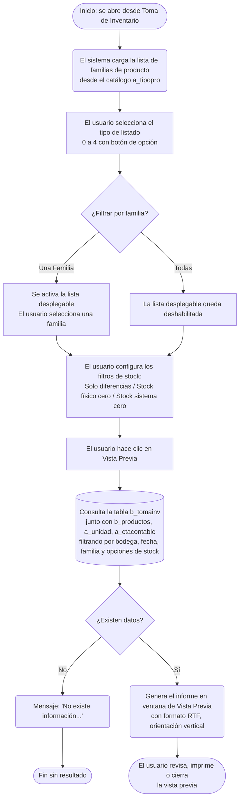

# Imprimir Toma de Inventario

**Formulario:** `I_TomInv.frm`
**Tabla principal:** `b_tomainv` (registro de toma de inventario físico por bodega y fecha)
**Consulta principal:** Sin procedimiento almacenado — consulta directa a la base de datos construida en el formulario

---

## Índice

- [1 — ¿Para qué sirve esta pantalla?](#1--para-qué-sirve-esta-pantalla)
- [2 — ¿Qué necesito para usarla?](#2--qué-necesito-para-usarla)
- [3 — ¿Cómo se usa?](#3--cómo-se-usa)
  - [3.1 Flujo paso a paso](#31-flujo-paso-a-paso)
  - [3.2 Controles y acciones disponibles](#32-controles-y-acciones-disponibles)
- [4 — ¿Qué restricciones debo conocer?](#4--qué-restricciones-debo-conocer)
  - [4.1 Validaciones del sistema](#41-validaciones-del-sistema)
  - [4.2 Reglas de cálculo](#42-reglas-de-cálculo)
- [5 — ¿Qué obtengo?](#5--qué-obtengo)
  - [Tabla resumen de tipos de listado](#tabla-resumen-de-tipos-de-listado)
  - [(0) Listado para la toma de inventario](#0-listado-para-la-toma-de-inventario-i_toma1)
  - [(1) Listado de diferencias Físico v/s Sistema](#1-listado-de-diferencias-físico-vs-sistema-i_toma2)
  - [(2) Listado de inventario Físico Valorizado](#2-listado-de-inventario-físico-valorizado-i_toma3)
  - [(3) Listado de inventario Sistema Valorizado](#3-listado-de-inventario-sistema-valorizado-i_toma4)
  - [(4) Diferencias Físico v/s Sistema - Valorizado](#4-diferencias-físico-vs-sistema---valorizado-i_toma5)
- [6 — Referencia técnica](#6--referencia-técnica)
  - [Tablas que intervienen](#tablas-que-intervienen)
  - [Relación con otros módulos](#relación-con-otros-módulos)

---

## 1 — ¿Para qué sirve esta pantalla?

[↑ Volver al índice](#índice)

Esta pantalla permite generar e imprimir informes relacionados con la toma de inventario físico de una bodega en una fecha determinada. Dependiendo del tipo de listado seleccionado, el informe puede mostrar desde una planilla en blanco para que el bodeguero anote las cantidades contadas en terreno, hasta comparaciones valorizadas entre el stock físico contado y el stock que el sistema tiene registrado.

La pantalla se organiza en dos paneles principales. El panel izquierdo permite seleccionar el tipo de listado entre cinco opciones. El panel derecho ofrece filtros opcionales: elegir entre todas las familias de producto o una familia específica, y activar o desactivar la inclusión de productos con stock cero (físico o de sistema) o bien mostrar solo aquellos con diferencias entre ambos stocks.

La bodega y la fecha de la toma se heredan de la pantalla de Toma de Inventario que la origina; esta pantalla de impresión no permite modificar esos valores, solo configurar la presentación del informe. El resultado siempre se muestra en una ventana de vista previa antes de imprimirse o exportarse.

---

## 2 — ¿Qué necesito para usarla?

[↑ Volver al índice](#índice)

Esta pantalla se abre desde la pantalla de Toma de Inventario, por lo que los datos de bodega y fecha ya vienen seleccionados. El usuario solo debe configurar los parámetros de presentación dentro de esta pantalla.

| Campo | Descripción | Obligatorio |
|---|---|---|
| Tipo de listado | Selección entre cinco tipos de informe (ver sección 5). Se elige uno a la vez mediante botones de opción. | Sí (uno debe estar seleccionado) |
| Familia de producto | Permite filtrar el informe por una familia específica o incluir todas las familias. Por defecto se muestran todas. | No — por defecto "Todas" |
| Lista desplegable de familia | Si se elige "Una Familia", se activa esta lista para seleccionar la familia deseada. La lista se carga automáticamente desde el catálogo de tipos de producto al abrir la pantalla. | Solo si se elige "Una Familia" |
| Solo productos con diferencias | Filtra el listado mostrando únicamente los productos donde el stock físico difiere del stock sistema. | No |
| Incluir productos con Stock Físico cero | Permite incluir en el listado productos cuyo conteo físico resultó en cero. | No |
| Incluir productos con Stock Sistema cero | Permite incluir en el listado productos que el sistema registra con stock cero. | No |

> **Nota sobre la bodega y fecha:** estos valores provienen de la pantalla de Toma de Inventario (formulario padre). La pantalla de impresión los utiliza tal como están seleccionados en esa pantalla; no es posible cambiarlos desde aquí.

---

## 3 — ¿Cómo se usa?

### 3.1 Flujo paso a paso

[↑ Volver al índice](#índice)

### 3.2 Controles y acciones disponibles

[↑ Volver al índice](#índice)

| Control / Acción | Descripción |
|---|---|
| Tipo de listado (5 opciones) | Botones de opción que determinan qué informe se genera. Solo se puede seleccionar uno a la vez. Por defecto se activa "Listado para la toma de inventario". |
| Familia de producto — "Todas" | Botón de opción activo por defecto. Incluye todos los productos sin filtrar por familia. |
| Familia de producto — "Una Familia" | Activa la lista desplegable de familias para elegir una en particular. |
| Lista desplegable de familia | Muestra las familias de producto disponibles en el sistema. Solo se habilita cuando se elige "Una Familia". Se carga automáticamente al abrir la pantalla. |
| Solo productos con diferencias | Casilla de verificación. Cuando está marcada, el listado incluye únicamente los productos donde el stock físico y el stock sistema son distintos. |
| Incluir productos con Stock Físico cero | Casilla de verificación. Permite mostrar productos cuyo stock físico contado es cero. Por defecto no está marcada. |
| Incluir productos con Stock Sistema cero | Casilla de verificación. Permite mostrar productos cuyo stock en sistema es cero. Por defecto no está marcada. |
| Vista Previa | Botón de la barra de herramientas. Ejecuta la consulta con los filtros configurados y abre la ventana de vista previa con el informe generado. |
| Salir | Botón de la barra de herramientas. Cierra la pantalla de impresión y regresa a la pantalla de Toma de Inventario. |

---

## 4 — ¿Qué restricciones debo conocer?

### 4.1 Validaciones del sistema

[↑ Volver al índice](#índice)

| # | Cuándo aparece | Qué verifica el sistema | Qué ve o experimenta el usuario |
|---|---|---|---|
| 1 | Al hacer clic en Vista Previa | Verifica que existan registros en la tabla de toma de inventario para la bodega, fecha y filtros seleccionados | Si no hay datos, aparece el mensaje "No existe información..." y no se genera ningún informe |

### 4.2 Reglas de cálculo

[↑ Volver al índice](#índice)

Las reglas de cálculo son propias de cada tipo de informe. Consultar la sección correspondiente dentro de la sección 5.

La lógica de filtrado de productos —compartida entre todos los tipos— funciona de la siguiente manera:

- Si **Solo productos con diferencias** está marcado: se excluyen los productos donde el stock físico y el stock sistema son iguales.
- Si **ninguna** de las opciones de stock cero está marcada: se excluyen los productos donde ambos stocks son cero simultáneamente.
- Si solo **Incluir Stock Físico cero** está marcado: se excluyen los productos que tienen stock físico distinto de cero pero sistema igual a cero (es decir, se filtran los que solo existen en sistema).
- Si solo **Incluir Stock Sistema cero** está marcado: se excluyen los productos que tienen stock sistema distinto de cero pero físico igual a cero (es decir, se filtran los que solo existen físicamente).
- Si **ambas** opciones de stock cero están marcadas: no se aplica ningún filtro adicional por stock cero; se incluyen todos los productos.

El orden de presentación dentro del informe depende de una configuración del sistema: si el parámetro `opfampro` está activo, los productos se ordenan primero por cuenta contable, luego por familia y finalmente por nombre. Si no está activo, se ordenan por cuenta contable y nombre directamente.

---

## 5 — ¿Qué obtengo?

[↑ Volver al índice](#índice)

### Tabla resumen de tipos de listado

| N° | Nombre en el selector | Formato de salida | Función de generación |
|---|---|---|---|
| 0 | Listado para la toma de inventario | Vista previa / RTF | `I_Toma1` en `InforAN.bas` |
| 1 | Listado de diferencias Físico v/s Sistema | Vista previa / RTF | `I_Toma2` en `InforAN.bas` |
| 2 | Listado de inventario Físico Valorizado | Vista previa / RTF | `I_Toma3` en `InforAN.bas` |
| 3 | Listado de inventario Sistema Valorizado | Vista previa / RTF | `I_Toma4` en `InforAN.bas` |
| 4 | Diferencias Físico v/s Sistema - Valorizado | Vista previa / RTF | `I_Toma5` en `InforAN.bas` |

Todos los tipos se generan en orientación **vertical (portrait)**, se muestran en ventana de vista previa y pueden imprimirse o exportarse desde ahí. El encabezado de cada página incluye el nombre del casino y el pie de página muestra el número de página.

---

### (0) Listado para la toma de inventario (`I_Toma1`)

[↑ Volver al índice](#índice)

**Qué muestra:** genera una planilla en blanco para que el bodeguero realice el conteo físico en terreno. Muestra todos los productos que deben contarse en la bodega a la fecha de toma, dejando una línea en blanco en la columna de cantidad para que se anote a mano.

**Cuándo usarlo:** antes o durante el proceso de conteo físico, como planilla de trabajo en papel.

**Estructura de datos del informe:**

| Campo / Columna | Descripción | Calculado |
|---|---|---|
| Código | Código interno del producto en el sistema | No |
| Descripción | Nombre del producto | No |
| Unidad | Unidad de medida abreviada (ej: Kg, Lt, Und) | No |
| Cantidad | Línea en blanco para anotar manualmente el conteo físico | — |

Cuando la opción de mostrar familia de producto está activa (parámetro de configuración del casino), el informe inserta una fila de encabezado con el nombre de la familia antes de listar los productos que le pertenecen.

**Formato de salida:** informe con 4 columnas, orientación vertical, encabezado con nombre de bodega, fecha de toma y familia seleccionada.

---

### (1) Listado de diferencias Físico v/s Sistema (`I_Toma2`)

[↑ Volver al índice](#índice)

**Qué muestra:** lista los productos con el stock físico contado, el stock que el sistema registra y la diferencia entre ambos valores (en unidades). Permite al bodeguero o jefe de casino identificar rápidamente qué productos tienen descuadres de cantidad, sin expresarlos en valor monetario.

**Cuándo usarlo:** después de ingresar el conteo físico en el sistema, para revisar las diferencias de unidades antes de analizarlas económicamente.

**Estructura de datos del informe:**

| Campo / Columna | Descripción | Calculado |
|---|---|---|
| Código | Código interno del producto | No |
| Descripción | Nombre del producto | No |
| Unidad | Unidad de medida abreviada | No |
| Stock Físico | Cantidad contada físicamente registrada en el sistema | No |
| Stock Sistema | Cantidad que el sistema tiene registrada antes del conteo | No |
| Diferencia | Diferencia entre el stock físico y el stock sistema | Sí |

**Cálculo — Diferencia de stock**

Indica cuántas unidades sobran o faltan respecto al stock que el sistema tenía registrado.

**Fórmula o lógica:**

Diferencia = Stock Físico − Stock Sistema

| Componente | Qué representa | De dónde viene |
|---|---|---|
| Stock Físico | Cantidad contada en la toma de inventario | Campo `tin_stofis` de la tabla `b_tomainv` |
| Stock Sistema | Cantidad registrada por el sistema al momento de la toma | Campo `tin_stosis` de la tabla `b_tomainv` |

> Ejemplo: Stock Físico = 15,000 Kg; Stock Sistema = 18,500 Kg → Diferencia = −3,500 Kg (faltante)

Cuando la configuración del casino activa la agrupación por familia, el informe inserta encabezados de familia entre los grupos de productos.

**Formato de salida:** informe con 6 columnas, orientación vertical, encabezado con bodega, fecha y familia.

---

### (2) Listado de inventario Físico Valorizado (`I_Toma3`)

[↑ Volver al índice](#índice)

**Qué muestra:** presenta el stock físico contado de cada producto multiplicado por su precio promedio ponderado (PMP), expresando el valor del inventario físico en términos monetarios. Los productos se agrupan primero por cuenta contable y opcionalmente por familia dentro de cada cuenta. El informe incluye subtotales por familia, subtotales por cuenta contable y un resumen final separando Alimentos & Bebidas de Limpieza & Desechables.

**Cuándo usarlo:** para valorizar el inventario físico real al cierre de período o en auditorías internas.

**Estructura de datos del informe:**

| Campo / Columna | Descripción | Calculado |
|---|---|---|
| Código | Código interno del producto | No |
| Descripción | Nombre del producto | No |
| Unidad | Unidad de medida abreviada | No |
| Cantidad | Stock físico contado | No |
| Precio | Precio promedio ponderado (PMP) del producto | No |
| Total | Valorización del stock físico (Cantidad × Precio) | Sí |
| Total Familia | Suma del Total de todos los productos de la familia | Sí |
| Total Cuenta | Suma del Total de todos los productos de la cuenta contable | Sí |
| Alimentos & Bebidas | Suma de los totales de las cuentas contables de tipo alimento/bebida | Sí |
| Limpieza & Desechables | Suma de los totales de las cuentas contables de tipo limpieza/desechables | Sí |
| Totales Generales | Suma de Alimentos & Bebidas + Limpieza & Desechables | Sí |

**Cálculo — Valorización por producto (Total)**

Expresa en pesos (u otra moneda configurada) cuánto vale el stock físico contado de un producto.

**Fórmula o lógica:**

Total = Stock Físico × Precio Promedio Ponderado

| Componente | Qué representa | De dónde viene |
|---|---|---|
| Stock Físico | Cantidad contada en la toma de inventario | Campo `tin_stofis` de la tabla `b_tomainv` |
| Precio Promedio Ponderado | Precio unitario del producto al momento de la toma | Campo `tin_propon` de la tabla `b_tomainv` |

> Ejemplo: Stock Físico = 10,000 Kg; PMP = $1.250 → Total = $12.500

Las cuentas que se clasifican como "Alimentos & Bebidas" o "Limpieza & Desechables" se determinan por parámetros de configuración del casino (`ctainsumo` y `ctalimdes`).

**Formato de salida:** informe con 7 columnas, orientación vertical. Agrupa por cuenta contable (con encabezado subrayado) y opcionalmente por familia. Incluye subtotales por familia y por cuenta, y una tabla resumen al final con los totales generales por categoría.

---

### (3) Listado de inventario Sistema Valorizado (`I_Toma4`)

[↑ Volver al índice](#índice)

**Qué muestra:** es análogo al tipo anterior pero usa el stock que el sistema registra (en lugar del stock físico contado). Permite ver el valor del inventario según los registros del sistema, agrupado por cuenta contable y opcionalmente por familia, con los mismos subtotales y resumen final.

**Cuándo usarlo:** para comparar el valor del inventario teórico (según sistema) con el inventario físico valorizado, o para validar los registros antes de la toma.

**Estructura de datos del informe:**

| Campo / Columna | Descripción | Calculado |
|---|---|---|
| Código | Código interno del producto | No |
| Descripción | Nombre del producto | No |
| Unidad | Unidad de medida abreviada | No |
| Cantidad | Stock registrado en el sistema | No |
| Precio | Precio promedio ponderado del producto | No |
| Total | Valorización del stock sistema (Cantidad × Precio) | Sí |
| Total Familia | Suma del Total de los productos de la familia | Sí |
| Total Cuenta | Suma del Total de los productos de la cuenta contable | Sí |
| Alimentos & Bebidas | Suma de cuentas contables de tipo alimento/bebida | Sí |
| Limpieza & Desechables | Suma de cuentas contables de tipo limpieza/desechables | Sí |
| Totales Generales | Suma de Alimentos & Bebidas + Limpieza & Desechables | Sí |

**Cálculo — Valorización por producto (Total)**

**Fórmula o lógica:**

Total = Stock Sistema × Precio Promedio Ponderado

| Componente | Qué representa | De dónde viene |
|---|---|---|
| Stock Sistema | Cantidad registrada en el sistema | Campo `tin_stosis` de la tabla `b_tomainv` |
| Precio Promedio Ponderado | Precio unitario del producto al momento de la toma | Campo `tin_propon` de la tabla `b_tomainv` |

> Ejemplo: Stock Sistema = 12,000 Kg; PMP = $1.250 → Total = $15.000

**Formato de salida:** estructura idéntica al tipo (2), con 7 columnas, subtotales por familia y cuenta, y tabla resumen al final. Orientación vertical.

---

### (4) Diferencias Físico v/s Sistema - Valorizado (`I_Toma5`)

[↑ Volver al índice](#índice)

**Qué muestra:** el informe más completo. Para cada producto muestra en una misma fila el PMP, el stock físico con su valorización, el stock sistema con su valorización, la diferencia de unidades y el valor monetario de esa diferencia. Los productos se agrupan por cuenta contable y opcionalmente por familia. Al final de cada cuenta contable se muestra un subtotal de los tres valores (total físico, total sistema, total diferencia), y al final del informe aparece el gran total general.

**Cuándo usarlo:** al cierre de período o cuando se requiere cuantificar el impacto económico de los descuadres de inventario para reportes financieros o ajustes contables.

**Estructura de datos del informe:**

| Campo / Columna | Descripción | Calculado |
|---|---|---|
| Código | Código interno del producto | No |
| Descripción | Nombre del producto | No |
| Unidad | Unidad de medida abreviada | No |
| P.M.P. | Precio promedio ponderado del producto | No |
| Stock Físico | Cantidad contada físicamente | No |
| Total Físico | Valor del stock físico (Stock Físico × PMP) | Sí |
| Stock Sist. | Cantidad registrada en el sistema | No |
| Total Sist. | Valor del stock sistema (Stock Sistema × PMP) | Sí |
| Diferencia | Diferencia de unidades (Físico − Sistema) | Sí |
| Total Dif. | Valor monetario de la diferencia (Diferencia × PMP) | Sí |
| Total Cta. Contable | Subtotal de Total Físico, Total Sist. y Total Dif. de la cuenta | Sí |
| Total General | Gran total de todos los productos del informe | Sí |

**Cálculo — Total Físico**

**Fórmula o lógica:** Total Físico = Stock Físico × PMP

| Componente | Qué representa | De dónde viene |
|---|---|---|
| Stock Físico | Cantidad contada en terreno | Campo `tin_stofis` de `b_tomainv` |
| PMP | Precio promedio ponderado | Campo `tin_propon` de `b_tomainv` |

**Cálculo — Total Sistema**

**Fórmula o lógica:** Total Sistema = Stock Sistema × PMP

| Componente | Qué representa | De dónde viene |
|---|---|---|
| Stock Sistema | Cantidad registrada en el sistema | Campo `tin_stosis` de `b_tomainv` |
| PMP | Precio promedio ponderado | Campo `tin_propon` de `b_tomainv` |

**Cálculo — Diferencia y Total Diferencia**

**Fórmula o lógica:**

Diferencia (unidades) = Stock Físico − Stock Sistema

Total Diferencia = (Stock Físico − Stock Sistema) × PMP

| Componente | Qué representa | De dónde viene |
|---|---|---|
| Stock Físico | Cantidad contada | Campo `tin_stofis` de `b_tomainv` |
| Stock Sistema | Cantidad en sistema | Campo `tin_stosis` de `b_tomainv` |
| PMP | Precio promedio ponderado | Campo `tin_propon` de `b_tomainv` |

> Ejemplo: Stock Físico = 15 Kg; Stock Sistema = 18 Kg; PMP = $1.000 → Diferencia = −3 Kg; Total Dif. = −$3.000

Los subtotales por cuenta contable acumulan los totales físico, sistema y diferencia de todos los productos que pertenecen a esa cuenta contable. El total general suma todos los productos del informe.

**Formato de salida:** informe con 10 columnas, orientación vertical. Es el informe de mayor ancho entre los cinco tipos. Incluye subtotales en negrita por cuenta contable y total general al final.

---

## 6 — Referencia técnica

### Tablas que intervienen

[↑ Volver al índice](#índice)

| Tabla | Para qué se usa en este informe | Campos clave |
|---|---|---|
| `b_tomainv` | Fuente principal: almacena el registro de la toma de inventario con el stock físico, stock sistema y precio promedio ponderado por producto, bodega y fecha | `tin_fectom` (fecha como entero YYYYMMDD), `tin_codbod` (código de bodega), `tin_codpro` (código producto), `tin_stofis` (stock físico), `tin_stosis` (stock sistema), `tin_propon` (precio promedio ponderado) |
| `b_productos` | Catálogo de productos: aporta nombre, código de tipo/familia y cuenta contable de cada producto | `pro_codigo`, `pro_nombre`, `pro_codtip`, `pro_ctacon`, `pro_coduni` |
| `a_unidad` | Catálogo de unidades de medida: aporta la abreviatura de la unidad | `uni_codigo`, `uni_nomcor` |
| `a_ctacontable` | Catálogo de cuentas contables: aporta el nombre de la cuenta para agrupar productos en los informes valorizados | `cta_codigo`, `cta_nombre` |
| `a_tipopro` | Catálogo de familias de producto: aporta el nombre de la familia para encabezados de agrupación cuando la opción de familia está activa | `tip_codigo`, `tip_nombre` |
| `a_param` | Parámetros de configuración del casino: determina el orden de presentación (`opfampro`) y las cuentas contables de clasificación (`ctalimdes`, `ctainsumo`) | — |

### Relación con otros módulos

[↑ Volver al índice](#índice)

| Módulo | Relación |
|---|---|
| Toma de Inventario (`M_TomInv.frm`) | Módulo padre que origina esta pantalla. Provee la bodega y fecha de la toma sobre las que se ejecutan los informes. La pantalla de impresión lee directamente esos valores desde el formulario padre activo. |
| Módulo de Inventario / Bodega | La tabla `b_tomainv` es alimentada por el proceso de registro de inventario físico. Los informes de esta pantalla reflejan los datos ingresados en ese proceso. |
| Módulo de Productos y Maestros | Los catálogos `a_tipopro`, `a_unidad` y `a_ctacontable` son mantenidos por módulos externos de administración del sistema. Esta pantalla solo los consulta. |
| Módulo de Valorización (PMP) | El campo `tin_propon` almacena el precio promedio ponderado del producto al momento de registrar la toma. Los informes de tipos 2, 3 y 4 usan ese valor para calcular totales en pesos. |

---

*Fuentes: `I_TomInv.frm`, `InforAN.bas` (funciones `I_Toma1` a `I_Toma5`), tabla `b_tomainv` en `SGP_Local.sql`, tablas `b_productos`, `a_tipopro`, `a_unidad`, `a_ctacontable` en `SGP_Local.sql`*
