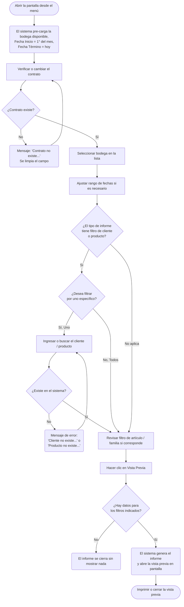

# Informe de Venta Cafetería

**Formulario:** `I_VenCaf.frm`
**Tablas principales:** `b_detventascaf` (detalle de ventas de cafetería), `b_totventascaf` (totales de ventas de cafetería), `b_totpreciocaf` (artículos de cafetería con precios), `b_detventascafpro` (detalle de insumos consumidos por ventas de cafetería)
**Consulta principal:** Sin procedimiento almacenado — consultas directas a las tablas según el tipo de informe seleccionado

---

## Índice

- [1 — ¿Para qué sirve esta pantalla?](#1--para-qué-sirve-esta-pantalla)
- [2 — ¿Qué necesito para usarla?](#2--qué-necesito-para-usarla)
- [3 — ¿Cómo se usa?](#3--cómo-se-usa)
  - [3.1 Flujo paso a paso](#31-flujo-paso-a-paso)
  - [3.2 Controles y acciones disponibles](#32-controles-y-acciones-disponibles)
- [4 — ¿Qué restricciones debo conocer?](#4--qué-restricciones-debo-conocer)
  - [4.1 Validaciones del sistema](#41-validaciones-del-sistema)
  - [4.2 Reglas de cálculo](#42-reglas-de-cálculo)
- [5 — ¿Qué obtengo?](#5--qué-obtengo)
  - [Tipo VenCaf1 — Ventas por artículo de cafetería](#tipo-vencaf1--ventas-por-artículo-de-cafetería)
  - [Tipo VenCaf2 — Ventas de cafetería por cliente y centro de costo](#tipo-vencaf2--ventas-de-cafetería-por-cliente-y-centro-de-costo)
  - [Tipo VenCaf3 — Ventas de cafetería por cliente y centro de costo detallado](#tipo-vencaf3--ventas-de-cafetería-por-cliente-y-centro-de-costo-detallado)
  - [Tipo VenCaf4 — Salida de bodega por ventas de cafetería](#tipo-vencaf4--salida-de-bodega-por-ventas-de-cafetería)
- [6 — Referencia técnica](#6--referencia-técnica)
  - [Tablas que intervienen](#tablas-que-intervienen)
  - [Relación con otros módulos](#relación-con-otros-módulos)

---

## 1 — ¿Para qué sirve esta pantalla?

[↑ Volver al índice](#índice)

Esta pantalla agrupa cuatro informes relacionados con las ventas registradas en la cafetería del casino. Dependiendo del tipo de informe que se abra, permite ver las ventas resumidas por artículo vendido, por cliente pagador y su centro de costo, o bien el desglose de los insumos de bodega que respaldaron esas ventas en un período determinado.

Los informes operan siempre sobre un único contrato (casino) y una bodega específica, dentro de un rango de fechas. Solo se incluyen ventas cuyo estado de cierre está marcado como "Cerrado" (`tvc_estado = 'C'`), lo que garantiza que los datos corresponden a transacciones completamente procesadas.

El resultado se presenta en vista previa en pantalla, con encabezado corporativo y pie de página con número de página, y puede ser impreso directamente desde esa vista.

---

## 2 — ¿Qué necesito para usarla?

[↑ Volver al índice](#índice)

| Campo | Descripción | Obligatorio |
|---|---|---|
| Contrato | Código del casino (centro de costo) sobre el cual se generará el informe. Se puede escribir directamente o buscar mediante el ícono de lupa. | Sí |
| Bodega | Lista desplegable con las bodegas disponibles para el contrato seleccionado. | Sí |
| Fecha Inicio | Primera fecha del período a consultar. Por defecto se carga el primer día del mes en curso. Formato `dd/mm/yyyy`. | Sí |
| Fecha Término | Última fecha del período a consultar. Por defecto se carga la fecha del día. Formato `dd/mm/yyyy`. | Sí |
| Cliente / Producto | Filtro opcional de segundo nivel. Su etiqueta y disponibilidad cambian según el tipo de informe: en VenCaf2 y VenCaf3 corresponde al RUT del cliente; en VenCaf4 corresponde al código del producto (insumo de bodega). No aparece en VenCaf1. | No (opción "Todos") |
| Artículo de cafetería / Familia | Filtro opcional de tercer nivel. En VenCaf1 y VenCaf3 corresponde al código del artículo de cafetería; en VenCaf4 corresponde al código de familia de producto. No aparece en VenCaf2. | No (opción "Todos") |

> El usuario debe tener permiso de impresión en el sistema para que el botón "Vista Previa" esté habilitado. Si no tiene ese permiso, el botón aparece desactivado al abrir la pantalla.

---

## 3 — ¿Cómo se usa?

[↑ Volver al índice](#índice)

### 3.1 Flujo paso a paso

[↑ Volver al índice](#índice)

### 3.2 Controles y acciones disponibles

[↑ Volver al índice](#índice)

| Control / Acción | Descripción |
|---|---|
| Campo Contrato | Ingrese el código del casino. Al salir del campo, el sistema valida que exista y muestra el nombre a la derecha. |
| Lupa junto a Contrato | Abre un buscador de contratos para elegir sin necesidad de saber el código. |
| Lista Bodega | Desplegable con las bodegas disponibles. Debe seleccionarse obligatoriamente antes de generar el informe. |
| Campo Fecha Inicio | Fecha de inicio del período. Se puede editar directamente en formato `dd/mm/yyyy`. |
| Campo Fecha Término | Fecha de cierre del período. Se puede editar directamente en formato `dd/mm/yyyy`. |
| Opción "Uno" / "Todos" (primer bloque) | Controla si se filtra por un cliente o producto específico (activa el campo de ingreso) o si se incluyen todos. |
| Campo Cliente / Producto | Visible en VenCaf2, VenCaf3 y VenCaf4. En VenCaf2 y VenCaf3 acepta el RUT del cliente. En VenCaf4 acepta el código de producto. Al salir del campo, valida la existencia y muestra el nombre. |
| Lupa junto a Cliente / Producto | Abre un buscador de clientes o productos, según el tipo de informe. |
| Opción "Uno" / "Todos" (segundo bloque) | Controla si se filtra por un artículo de cafetería o familia específica (activa el campo) o si se incluyen todos. Disponible en VenCaf1, VenCaf3 y VenCaf4. |
| Campo Artículo de cafetería / Familia | Visible en VenCaf1, VenCaf3 y VenCaf4. Ingrese el código del artículo o familia. Al salir del campo, valida y muestra el nombre. |
| Lupa junto a Artículo / Familia | Abre un buscador de artículos de cafetería (VenCaf1 y VenCaf3) o un árbol de familias de productos (VenCaf4). |
| Botón Vista Previa (barra de herramientas) | Valida los filtros y genera el informe. Si falta un campo obligatorio, muestra un mensaje de error. Requiere permiso de impresión. |
| Botón Salir (barra de herramientas) | Cierra la pantalla sin generar el informe. |

---

## 4 — ¿Qué restricciones debo conocer?

[↑ Volver al índice](#índice)

### 4.1 Validaciones del sistema

[↑ Volver al índice](#índice)

| # | Cuándo aparece | Qué verifica el sistema | Qué ve o experimenta el usuario |
|---|---|---|---|
| 1 | Al salir del campo Contrato con un valor ingresado | Que el contrato exista en la tabla de clientes | Mensaje: `"Contrato no existe..."`. El campo se vacía y el cursor vuelve al campo. |
| 2 | Al salir del campo Cliente con un valor ingresado (VenCaf2 y VenCaf3) | Que el RUT del cliente exista en la tabla de clientes | Mensaje: `"Cliente no existe..."`. El campo se vacía. |
| 3 | Al salir del campo Producto con un valor ingresado (VenCaf4) | Que el código de producto exista y esté disponible para el contrato actual | Mensaje: `"Producto no existe..."`. El campo se vacía. |
| 4 | Al salir del campo Artículo de cafetería con un valor ingresado (VenCaf1 y VenCaf3) | Que el código de artículo exista en la tabla de artículos de cafetería para el contrato actual | Mensaje: `"Articulo no existe..."`. El campo se vacía. |
| 5 | Al salir del campo Familia con un valor ingresado (VenCaf4) | Que el código de familia exista en el árbol de tipos de producto | Mensaje: `"No existe codigo en la tabla..."`. El campo se vacía. |
| 6 | Al hacer clic en Vista Previa sin seleccionar bodega | Que haya una bodega seleccionada en la lista | Mensaje: `"Seleccione Bodega..."`. El informe no se genera. |
| 7 | Al hacer clic en Vista Previa con opción "Uno" activa y campo vacío | Que si se eligió filtrar por uno específico, el campo correspondiente no esté vacío | Mensaje: `"Seleccione <nombre del bloque>..."` (por ejemplo, `"Seleccione Cliente..."` o `"Seleccione Articulo de cafetería..."`). El informe no se genera. |
| 8 | Al generar el informe sin resultados | Que existan ventas cerradas para los filtros indicados | El informe se cierra silenciosamente sin mostrar vista previa. No aparece un mensaje, simplemente no se abre la ventana de resultados. |

### 4.2 Reglas de cálculo

[↑ Volver al índice](#índice)

- Solo se incluyen en el informe las ventas cuyo registro de totales tiene estado `'C'` (Cerrado). Las ventas en estado abierto o pendiente no aparecen.
- El **total por línea** se calcula como `cantidad × precio unitario`.
- En el informe VenCaf3 (detallado), el sistema agrupa los artículos bajo el encabezado del cliente y centro de costo al que pertenecen, mostrando un **subtotal** por cada par cliente/centro de costo y un **total general** al final.
- En el informe VenCaf4 (insumos), el **precio costo unitario** se calcula como `total acumulado ÷ cantidad total`, lo que corresponde al precio promedio ponderado del período.

---

## 5 — ¿Qué obtengo?

[↑ Volver al índice](#índice)

Todos los informes se presentan en una **vista previa en pantalla** con orientación vertical (carta), encabezado corporativo y pie de página con número de página. Desde esa vista es posible imprimirlos. El sistema genera simultáneamente un archivo de texto plano separado por pipes (`|`) en la carpeta de reportes configurada en el sistema.

---

### Tipo VenCaf1 — Ventas por artículo de cafetería

[↑ Volver al índice](#índice)

Muestra cuántas unidades se vendieron de cada artículo de cafetería en el período, junto con el precio y el monto total recaudado. El resultado se agrupa por artículo y ordena por código de artículo.

**Filtros disponibles:** Contrato (obligatorio), Bodega (obligatorio), rango de fechas (obligatorio), Artículo de cafetería (opcional — "Uno" o "Todos").

**Bloque de parámetros impreso en el encabezado del reporte:**

| Etiqueta | Contenido |
|---|---|
| Contrato | Código y nombre del casino |
| Bodega | Nombre de la bodega seleccionada |
| Periodo | Fecha inicio — Fecha término |
| Articulo de cafetería | "Todos" o código y nombre del artículo específico |

**Estructura de la tabla de datos:**

| Campo | Descripción | Calculado |
|---|---|---|
| Artículo de cafetería | Nombre del artículo vendido | No |
| Cantidad | Suma de unidades vendidas del artículo en el período | Sí — `SUM(dvc_canart)` |
| Precio | Precio unitario del artículo | No |
| Total | Monto total recaudado por ese artículo | Sí — `cantidad × precio` |

Al final de la tabla aparece una fila de **Total** que suma todos los montos.

---

### Tipo VenCaf2 — Ventas de cafetería por cliente y centro de costo

[↑ Volver al índice](#índice)

Muestra el monto total consumido por cada cliente en cafetería, indicando también el centro de costo al que cargaron su consumo. El resultado se ordena por RUT de cliente.

**Filtros disponibles:** Contrato (obligatorio), Bodega (obligatorio), rango de fechas (obligatorio), Cliente (opcional — "Uno" o "Todos"). No tiene filtro de artículo.

**Bloque de parámetros impreso en el encabezado del reporte:**

| Etiqueta | Contenido |
|---|---|
| Contrato | Código y nombre del casino |
| Bodega | Nombre de la bodega seleccionada |
| Periodo | Fecha inicio — Fecha término |
| Cliente | "Todos" o RUT formateado y nombre del cliente específico |

**Estructura de la tabla de datos:**

| Campo | Descripción | Calculado |
|---|---|---|
| Cliente | RUT formateado y nombre del cliente | No |
| Centro de costo | Centro de costo al que el cliente cargó su consumo | No |
| Precio | Monto total consumido por ese cliente en ese centro de costo en el período | Sí — `SUM(cantidad × precio unitario)` |

Al final de la tabla aparece una fila de **Total** que suma todos los montos.

---

### Tipo VenCaf3 — Ventas de cafetería por cliente y centro de costo detallado

[↑ Volver al índice](#índice)

Expande el informe VenCaf2 mostrando, dentro de cada cliente y centro de costo, el detalle artículo por artículo de lo que consumió. Es el informe más completo de ventas de cafetería.

**Filtros disponibles:** Contrato (obligatorio), Bodega (obligatorio), rango de fechas (obligatorio), Cliente (opcional), Artículo de cafetería (opcional).

**Bloque de parámetros impreso en el encabezado del reporte:**

| Etiqueta | Contenido |
|---|---|
| Contrato | Código y nombre del casino |
| Bodega | Nombre de la bodega seleccionada |
| Periodo | Fecha inicio — Fecha término |
| Cliente | "Todos" o RUT formateado y nombre del cliente específico |
| Articulo de cafetería | "Todos" o código y nombre del artículo específico |

**Estructura de la tabla de datos:**

Los datos se presentan agrupados. Para cada par cliente/centro de costo se imprime un encabezado de grupo con el nombre del cliente y su centro de costo. Luego, dentro del grupo, se listan los artículos consumidos.

| Campo | Descripción | Calculado |
|---|---|---|
| Artículo de cafetería | Nombre del artículo consumido por ese cliente | No |
| Cantidad | Suma de unidades consumidas del artículo | Sí — `SUM(dvc_canart)` |
| Precio | Precio unitario del artículo | No |
| Total | Monto de ese artículo para ese cliente | Sí — `cantidad × precio` |

Al final de cada grupo aparece un **subtotal** del cliente/centro de costo. Al final del informe aparece un **Total General** que suma todos los grupos.

---

### Tipo VenCaf4 — Salida de bodega por ventas de cafetería

[↑ Volver al índice](#índice)

Muestra los insumos de bodega que fueron consumidos para soportar las ventas de cafetería registradas en el período. Permite entender el costo de los insumos detrás de las ventas. El resultado se ordena por código de producto.

**Filtros disponibles:** Contrato (obligatorio), Bodega (obligatorio), rango de fechas (obligatorio), Producto específico (opcional), Familia de producto (opcional).

**Bloque de parámetros impreso en el encabezado del reporte:**

| Etiqueta | Contenido |
|---|---|
| Contrato | Código y nombre del casino |
| Bodega | Nombre de la bodega seleccionada |
| Periodo | Fecha inicio — Fecha término |
| Producto | "Todos" o código y nombre del producto específico |
| Familia | "Todas" o código y nombre de la familia de producto |

**Estructura de la tabla de datos:**

| Campo | Descripción | Calculado |
|---|---|---|
| Codigo | Código del producto (insumo de bodega) | No |
| Producto | Nombre del producto | No |
| Unidad | Unidad de medida abreviada | No |
| Cantidad | Total de unidades consumidas del producto en el período | Sí — `SUM(dvp_candig)` |
| Precio costo | Precio promedio ponderado del insumo en el período | Sí — `total acumulado ÷ cantidad total` |
| Total | Costo total del insumo consumido en el período | Sí — `SUM(dvp_candig × dvp_precos)` |

Al final de la tabla aparece una fila de **Total** que suma todos los costos.

---

## 6 — Referencia técnica

[↑ Volver al índice](#índice)

### Tablas que intervienen

[↑ Volver al índice](#índice)

| Tabla | Para qué se usa | Campos clave |
|---|---|---|
| `b_totventascaf` | Registro de cabecera de cada sesión de ventas de cafetería. Actúa como filtro principal de estado y bodega. | `tvc_cencos` (contrato), `tvc_fecing` (fecha), `tvc_estado` ('C' = cerrado), `tvc_codbod` (bodega) |
| `b_detventascaf` | Detalle de cada artículo vendido dentro de una sesión. Contiene cantidad, precio, RUT del cliente y centro de costo del cliente. | `dvc_cencos`, `dvc_fecing`, `dvc_articulo`, `dvc_canart`, `dvc_precio`, `dvc_rutcli`, `dvc_cencli` |
| `b_totpreciocaf` | Maestro de artículos de cafetería del contrato, con sus nombres y códigos. | `tpc_codigo`, `tpc_nombre`, `tpc_cencos` |
| `b_detventascafpro` | Detalle de los insumos de bodega consumidos en las ventas de cafetería. Usado exclusivamente en VenCaf4. | `dvp_cencos`, `dvp_fecing`, `dvp_codmer` (código de producto), `dvp_candig` (cantidad), `dvp_precos` (precio de costo) |
| `b_clientes` | Maestro de contratos y clientes. Se usa para validar el contrato, obtener el nombre del casino y obtener el nombre del cliente a partir del RUT. | `cli_codigo`, `cli_nombre` |
| `b_productos` | Maestro de productos (insumos). Usado en VenCaf4 para validar el producto filtrado y obtener su nombre. | `pro_codigo`, `pro_nombre`, `pro_coduni`, `pro_codtip`, `pro_maepro` |
| `a_unidad` | Maestro de unidades de medida. Usado en VenCaf4 para mostrar la unidad del insumo. | `uni_codigo`, `uni_nomcor` |
| `a_tipopro` | Árbol de familias de producto. Usado en VenCaf4 para filtrar por familia. | `tip_codigo` |
| `a_tiposervicio` | Tipo de servicio asociado al producto. Usado en VenCaf4 durante la validación del producto. | `tis_codigo` |

### Relación con otros módulos

[↑ Volver al índice](#índice)

| Módulo | Relación |
|---|---|
| Cafetería / Ventas | Es el módulo que genera los registros que este informe consulta. Las ventas deben estar en estado "Cerrado" para aparecer. |
| Bodega / Inventario | El informe VenCaf4 cruza las ventas con el consumo de insumos de bodega, relacionando el módulo de cafetería con el inventario físico. |
| Contratos y Clientes | Los contratos (casinos) y los clientes que consumen en cafetería son mantenidos en módulos externos. Este informe solo los consulta para mostrar nombres. |
| Productos | El maestro de productos es mantenido fuera del módulo de producción. El informe lo usa como referencia de nombres y unidades. |

---

*Fuentes: `codigo_fuente/SGP_Local/I_VenCaf.frm` (formulario VB6, 1146 líneas) y `codigo_fuente/SGP_Local/InforAN.bas` (funciones de generación de informes: `I_VenCafArt`, `I_VenCafCli`, `I_VenCafCliArt`, `I_VenCafPro`, líneas 772–1344).*
