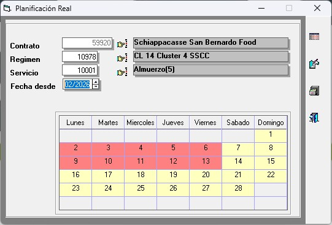
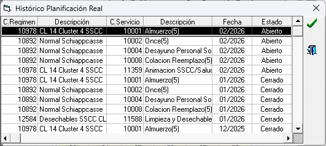
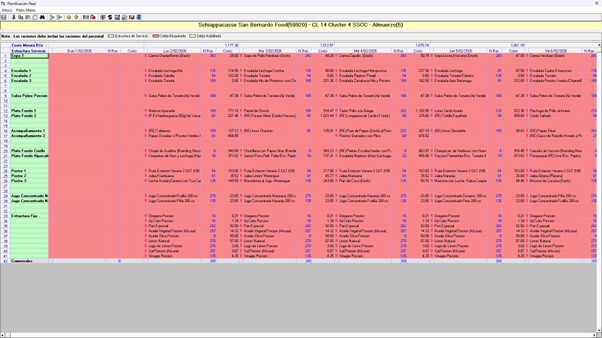
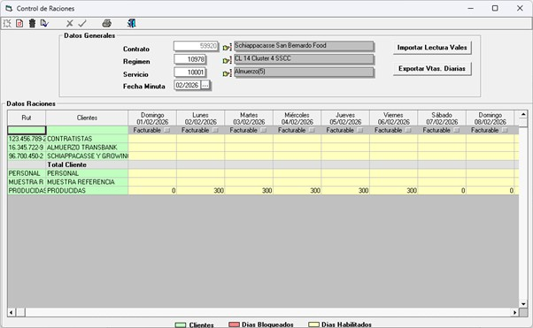
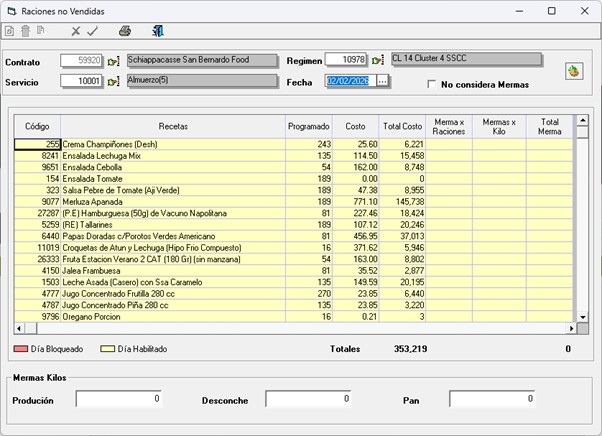
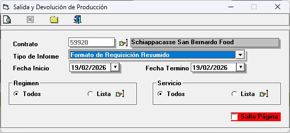
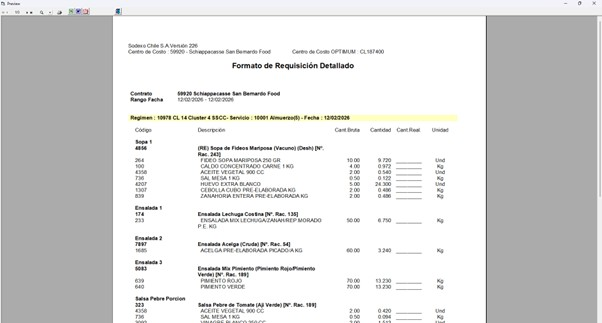
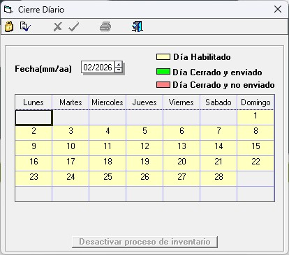
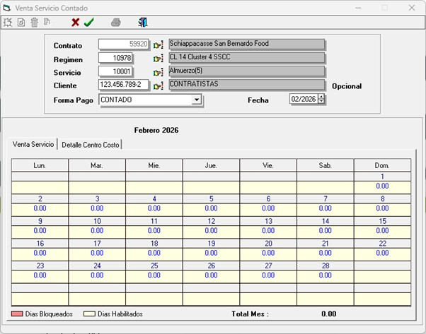
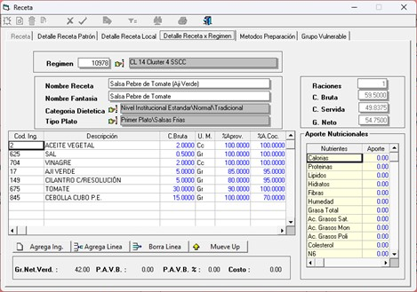

# Documentación Funcional — Módulo de Producción SGP

> **Estado:** Borrador
> **Fuente:** Sesiones de levantamiento (Dic 2025 – Feb 2026) + análisis sistema actual
> **Fecha:** Marzo 2026
> **Pendiente de validación por:** Responsable de negocio | Product Owner

---

## Tabla de Contenidos

1. [Descripción General del Módulo](#1-descripción-general-del-módulo)
2. [Flujos de Proceso](#2-flujos-de-proceso)
   - 2.1 [Planificación Real (mensual)](#21-planificación-real-mensual)
   - 2.2 [Generación de Requisición](#22-generación-de-requisición)
   - 2.3 [Salida de Bodega a Producción](#23-salida-de-bodega-a-producción)
   - 2.4 [Registro de Mermas y Raciones No Vendidas](#24-registro-de-mermas-y-raciones-no-vendidas)
   - 2.5 [Control de Raciones](#25-control-de-raciones)
   - 2.6 [Ventas (Contado, Cafetería, Directa)](#26-ventas-contado-cafetería-directa)
   - 2.7 [Cierre Diario](#27-cierre-diario)
3. [Pantallas y Formularios](#3-pantallas-y-formularios)
4. [Reglas de Negocio](#4-reglas-de-negocio)
   - 4.1 [Cierre diario y bloqueos operativos](#41-cierre-diario-y-bloqueos-operativos)
   - 4.2 [Planificación y cantidades producidas](#42-planificación-y-cantidades-producidas)
   - 4.3 [Salidas de producción y requisiciones](#43-salidas-de-producción-y-requisiciones)
   - 4.4 [Control de raciones y venta](#44-control-de-raciones-y-venta)
   - 4.5 [Mermas, desconche y raciones no vendidas](#45-mermas-desconche-y-raciones-no-vendidas)
   - 4.6 [Servicios especiales y adicionales](#46-servicios-especiales-y-adicionales)
   - 4.7 [Reportes de aportes y costos](#47-reportes-de-aportes-y-costos)
   - 4.8 [Integración con sistemas externos](#48-integración-con-sistemas-externos)
5. [Reportes Disponibles](#5-reportes-disponibles)
6. [Mejoras Propuestas al Sistema](#6-mejoras-propuestas-al-sistema)
7. [Dudas Abiertas y Decisiones Pendientes](#7-dudas-abiertas-y-decisiones-pendientes)
8. [Glosario de Términos de Negocio](#8-glosario-de-términos-de-negocio)

---

## 1. Descripción General del Módulo

### Propósito y alcance

El módulo de **Producción** gestiona el ciclo operativo diario de los casinos de alimentación Sodexo Chile. Cubre todo el proceso productivo desde la planificación mensual de minutas hasta el cierre diario del casino, pasando por la generación de requisiciones de bodega, el registro de salidas de producción, el control de raciones vendidas, el registro de mermas y las ventas de servicios.

Es el núcleo operativo del sistema: sus datos alimentan los reportes de costos, condicionan la impresión de requisiciones y son requisito para ejecutar el cierre diario. Cualquier error u omisión en este módulo impacta directamente los estados de resultado del casino y los reportes de gestión a nivel central.

### Actores y roles

| Rol | Responsabilidades principales en el módulo |
|---|---|
| **Chef / Operador de sitio** | Ajusta la planificación real mensual, registra cantidades producidas, ingresa mermas y raciones no vendidas día a día |
| **Bodeguero** | Gestiona salidas de bodega a producción, confirma o ajusta cantidades entregadas, genera requisiciones |
| **Administrador de casino** | Ejecuta el cierre diario, registra ventas (contado, cafetería, directa), supervisa actividades diarias obligatorias |
| **Supervisor de zona** | Revisa reportes de aportes y costos, monitorea cumplimiento de actividades diarias en los sitios a su cargo |
| **Administrador central (SGP)** | Configura parámetros, desbloquea registros vencidos, gestiona minutas patrón, supervisa reportes consolidados |

### Relación con otros módulos

- **Planificación centralizada:** El administrador central crea las minutas patrón que luego el sitio ajusta en Producción (Planificación Real).
- **Bodega e Inventario:** Las salidas de bodega a producción descuentan el stock de bodega; las devoluciones lo incrementan. El cierre diario recalcula el costo promedio ponderado (PMP) de cada producto.
- **Facturación / SPRS:** El control de raciones alimenta la cantidad de raciones a facturar por cliente, que se confirma en el sistema SPRS antes de emitir la factura.
- **SAP:** La requisición de tipo "Estructura Detallada" genera un archivo para el sistema SAP de gestión de compras.
- **Reportes de gestión:** Los datos de producción, costos y mermas consolidados desde este módulo alimentan los reportes de Food Cost y estado de resultados del casino.

---

## 2. Flujos de Proceso

### 2.1 Planificación Real (mensual)

La planificación real es el proceso por el cual el chef del sitio ajusta, mes a mes, la minuta que proviene del administrador central para adaptarla a la realidad operativa del casino.

**Paso a paso:**

1. El chef ingresa al selector de planificación y selecciona el contrato, régimen, servicio y el mes a planificar.
2. El sistema presenta el calendario mensual con la minuta patrón ya cargada (recetas y raciones planificadas para cada día).
3. El chef revisa la minuta: puede ajustar la cantidad de raciones y modificar recetas según la realidad operativa del día (cambios de producto, disponibilidad de insumos, etc.).
4. Para reemplazar una receta, el chef pone en cero la receta original y agrega la nueva en una línea en blanco haciendo doble clic para abrir el buscador de recetas.
5. El sistema valida que los cambios no entren en conflicto con mermas o raciones ya registradas para esa fecha.
6. Al guardar, el sistema registra la planificación real del período. El color de la celda indica el origen: verde para recetas locales o patrón, amarillo para minutas centralizadas (solo lectura).
7. Al cerrar el formulario, el sistema actualiza las variables de período que condicionan el resto de los módulos del casino.

**Restricciones:**
- Las minutas de regímenes centralizados (de gran escala) solo pueden ser consultadas, no modificadas.
- Si el período está bloqueado (por cierre mensual o bloqueo administrativo), no se permite ninguna edición.

---

### 2.2 Generación de Requisición

La requisición es el documento que el sitio entrega a bodega para que prepare y despacho los insumos necesarios para producción.

**Paso a paso:**

1. El chef o administrador de casino ingresa al módulo de Requisición Salida Bodega.
2. Selecciona el régimen, servicio, bodega, rango de fechas y tipo de informe requerido.
3. **En la versión 2.27**, el sistema valida que el sitio haya ingresado las cantidades producidas (Q producidas) antes de habilitar la impresión. Si no están registradas, la impresión queda bloqueada.
4. El sistema calcula los insumos necesarios multiplicando las raciones planificadas por la composición de cada receta, ajustando por el factor de rendimiento del producto.
5. Se generan dos vistas principales:
   - **Vista resumida:** para el bodeguero, muestra los insumos totales a despachar.
   - **Vista detallada por sector:** para el chef, agrupa insumos por sección de la minuta (sopa, ensalada, fondo, acompañamiento, postre).
6. El tipo "Estructura Detallada" (tipo 2) además guarda el resultado en el sistema para su posterior envío a SAP.
7. Los otros tipos de informe se generan directamente como reportes Crystal Reports para impresión.

**Restricciones:**
- Solo se incluyen en el cálculo los días con servicios activos (no los días sin operación).
- Si hay servicios sin comensales registrados, el sistema emite una advertencia antes de generar la requisición.

---

### 2.3 Salida de Bodega a Producción

La salida de bodega registra la entrega real de insumos desde bodega hacia el área de producción.

**Paso a paso:**

1. El bodeguero selecciona régimen y servicio para la salida del día.
2. El sistema carga automáticamente los productos y cantidades que provienen de la planificación real, con una aproximación de ±5 unidades respecto al valor exacto.
3. El bodeguero puede elegir la vista de trabajo:
   - **Vista resumida:** sin distinción por sectores de la minuta.
   - **Vista por sector:** con insumos agrupados por sección (sopa, ensalada, fondo, etc.).
4. El bodeguero revisa las cantidades y puede sobrescribir el valor sugerido para ingresar la cantidad real entregada.
5. Si la planificación y los pasos previos están correctos, las cantidades se confirman por defecto sin necesidad de ajustes significativos.
6. Al confirmar la salida, el sistema descuenta el stock de bodega, genera el documento de salida (tipo SP) con correlativo, y registra el costo valorizado al precio promedio ponderado vigente.
7. Si existe un documento de devolución (tipo DP) asociado a esa misma salida, el sistema lo valida antes de permitir modificaciones.

**Restricciones:**
- Si el stock de bodega quedaría negativo con la salida ingresada, el sistema alerta al usuario y revierte la operación.
- El módulo opera en dos modos: alta (nuevo registro) y modificación (elimina el registro previo y lo reemplaza).

---

### 2.4 Registro de Mermas y Raciones No Vendidas

Las mermas corresponden a los insumos o preparaciones que no llegan a ser consumidas. El sistema distingue tres tipos: merma de preparación (raciones no vendidas por receta), merma de producción (materia prima en kilos) y desconche (residuos generados por los comensales).

**Paso a paso:**

1. El chef o encargado ingresa al formulario de Mermas por Preparación para el servicio del día.
2. El sistema presenta la lista de recetas planificadas para ese servicio, con sus raciones programadas, costo unitario y costo total.
3. Para cada receta, el usuario puede ingresar:
   - **Merma por raciones:** cuántas raciones de esa receta no se vendieron.
   - **Merma por kilos:** el peso en kilos de lo no consumido (el sistema convierte a costo automáticamente).
   - **Merma bruta por kilos:** kilos totales de merma bruta de la preparación.
4. Adicionalmente, en la parte inferior del formulario, el usuario registra los valores globales del servicio:
   - **Desconche:** kilos de residuo generado por los comensales.
   - **Pan:** kilos de pan no consumido (separado del desconche cuando el sitio lo permite).
   - **Producción:** kilos de merma de producción (materia prima no utilizable).
5. El usuario puede marcar la casilla "No considera Mermas" si no aplica para ese servicio.
6. Al guardar, el sistema valida que la merma por raciones no supere las raciones planificadas de esa receta.
7. Los días anteriores al día de cierre configurado quedan bloqueados (marcados en rojo), impidiendo modificaciones retroactivas.

**Restricciones:**
- La merma por raciones no puede ser mayor al número de raciones planificadas de esa receta.
- No se puede modificar la merma de un día que ya fue cerrado.
- Si hay mermas registradas para una receta y se intenta cambiar esa receta en la planificación, el sistema rechaza el cambio.

---

### 2.5 Control de Raciones

El control de raciones registra diariamente la cantidad de raciones consumidas por cada cliente (mandante y contratistas), personal del casino y muestras de referencia.

**Paso a paso:**

1. El administrador de casino ingresa al formulario de Control de Raciones para el mes en curso.
2. El sistema presenta una grilla con los clientes en filas y los días del mes en columnas.
3. El usuario ingresa manualmente la cantidad de raciones por cliente y por día (actualmente digital y manual; en versión futura vendría integrado desde SPRS).
4. La fila "PRODUCIDAS" muestra el total de raciones producidas planificadas y está protegida: no puede ser editada sin una clave especial.
5. El usuario puede ingresar una estimación teórica de raciones y corregirla después de validar con el cliente, antes de que se genere la factura.
6. El sistema permite registrar y corregir raciones durante todo el mes hasta el cierre mensual.
7. Al marcar un período como facturable, el sistema elimina las raciones de clientes ordinarios preservando las categorías especiales (PRODUCIDAS, PERSONAL, MERMAS).

**Restricciones:**
- El módulo permanece siempre abierto (sin bloqueo por cierre diario) hasta el cierre de mes.
- La fila PRODUCIDAS solo puede ser editada por usuarios con clave de autorización.
- Solo deben aparecer como clientes los contratistas a quienes efectivamente se les vendió.

---

### 2.6 Ventas (Contado, Cafetería, Directa)

El módulo gestiona tres modalidades de venta distintas al casino regular:

**Venta Servicio Contado:**
1. El administrador selecciona el período (mes) y el cliente.
2. Ingresa el monto total vendido por día en la grilla del calendario.
3. Puede registrar en cinco formas de pago: contado, cheque, cheque restaurant, tarjeta de crédito o vale.
4. Para casinos con centros de costo dependientes, puede detallar la venta por cada centro de costo en una pestaña secundaria.
5. Al confirmar, el sistema registra la venta. Al borrar, revierte el registro.

**Venta Cafetería:**
1. El administrador ingresa a la pestaña de Venta Cafetería y selecciona el período.
2. Registra los productos vendidos y su precio, vinculado a una bodega específica.
3. Puede gestionar también el inventario de productos de cafetería en una pestaña secundaria.
4. Al cerrar la venta (candado), el sistema descuenta el stock de bodega y registra el ingreso.
5. Al reabrir una venta ya cerrada, el sistema revierte los movimientos de stock.

**Venta Directa:**
1. Similar a venta contado, pero registra la venta directa de productos sin categoría de servicio regular.
2. Al confirmar, descuenta stock de bodega según los productos vendidos.
3. El sistema alerta visualmente (en azul) cuando la cantidad vendida supera el stock disponible.

---

### 2.7 Cierre Diario

El cierre diario es el proceso que consolida toda la actividad del casino para un día específico y deja el registro listo para la generación de costos y reportes.

**Paso a paso:**

1. El administrador de casino accede al Mantenedor de Cierre Diario y se posiciona sobre el día a cerrar.
2. El sistema ejecuta una serie de validaciones previas (hasta 14 controles) antes de permitir el cierre:
   - Que las salidas de producción estén registradas.
   - Que las ventas del día estén completas.
   - Que el inventario esté cuadrado.
   - Que las mermas estén ingresadas.
   - Que el control de raciones no tenga inconsistencias.
   - Entre otras validaciones según la configuración del casino.
3. Las validaciones pueden ser:
   - **Bloqueantes:** impiden continuar con el cierre hasta ser subsanadas.
   - **Alertas:** informan de una situación pero permiten continuar.
4. Una vez superadas las validaciones, el sistema calcula el costo promedio ponderado (PMP) actualizado para cada producto del inventario.
5. Si el casino tiene inventario rotativo, actualiza los saldos según el conteo físico registrado.
6. Los días feriados son considerados especialmente en el recálculo del PMP.
7. Al cerrarse exitosamente, el día cambia de color en el calendario (de cyan a azul o verde según si fue enviado a central).
8. Solo el PC configurado como servidor de contabilidad puede ejecutar el cierre; otros equipos reciben un mensaje de error.

**Restricciones:**
- No se puede cerrar un día si las actividades obligatorias configuradas para ese casino no están completadas.
- El cierre puede ser reabierto por el administrador central si se detecta un error, reiniciando el cálculo de PMP para ese día.
- El estado del día en el calendario distingue: habilitado (cyan), cerrado no enviado (azul), cerrado enviado a central (verde).

---

## 3. Pantallas y Formularios

### 3.1 Selector de Planificación

**Descripción:** Pantalla inicial del proceso de planificación. Permite al chef seleccionar el contrato (casino), régimen, servicio y el mes a trabajar antes de ingresar al editor de la minuta real o teórica.

**Quién la usa:** Chef, Administrador de casino.

**Para qué sirve:** Determina el contexto de trabajo (casino, régimen, servicio, período) y lanza el editor correspondiente.

**Controles principales:** Selector de contrato por RUT, selector de régimen, selector de servicio, selector de mes y año, calendario mensual de navegación.

  
*Selector Planificación*

*Captura adicional:*  
  
*Histórico de Planificaciones*

---

### 3.2 Editor de Planificación Real

**Descripción:** Formulario principal donde el chef ajusta la minuta real del mes. Presenta una grilla con los días del mes en columnas y las recetas planificadas en filas, con información de cantidad de raciones y costo por receta.

**Quién la usa:** Chef.

**Para qué sirve:** Permite ajustar recetas, cantidades y raciones planificadas para cada día del mes en cada servicio. Las celdas en verde corresponden a recetas del sitio o patrón; las amarillas corresponden a minutas centralizadas y son de solo lectura.

**Controles principales:** Grilla de planificación (recetas por día), campo de raciones, campo de costo, botón de búsqueda de recetas (doble clic en línea vacía).

  
*Editor Planificación Real*

---

### 3.3 Control de Raciones

**Descripción:** Formulario mensual donde se registra la cantidad de raciones consumidas por cada cliente del casino, además del personal y las muestras de referencia.

**Quién la usa:** Administrador de casino.

**Para qué sirve:** Llevar el registro diario de raciones por cliente para efectos de facturación y control de producción. La fila "PRODUCIDAS" (protegida) sirve como referencia del total producido planificado.

**Controles principales:** Grilla clientes por días del mes, campo de raciones por celda, fila PRODUCIDAS (protegida), botones de guardar y limpiar.

  
*Control de Raciones*

---

### 3.4 Mermas por Preparación

**Descripción:** Formulario diario donde se registran las mermas de raciones no vendidas por receta, la merma de producción general en kilos, el desconche y el pan.

**Quién la usa:** Chef, Administrador de casino.

**Para qué sirve:** Registrar qué preparaciones sobraron al final del servicio (en raciones o kilos), la merma de materia prima en cocina y los residuos generados por los comensales. Esta información es esencial para el reporte de raciones no vendidas y para el control de costos.

**Controles principales:** Grilla de recetas (raciones planificadas, costo unitario, merma por raciones, merma por kilos, merma bruta), campos adicionales de Desconche, Pan y Producción (en kilos), casilla "No considera Mermas".

  
*Mermas por Preparación*

---

### 3.5 Requisición Salida Bodega (7 tipos)

**Descripción:** Módulo de generación de informes de requisición de insumos para bodega. Ofrece siete tipos de informe según la necesidad del usuario.

**Quién la usa:** Chef (tipos detallados), Bodeguero (tipos resumidos), Administrador de casino.

**Para qué sirve:** Comunicar a bodega qué insumos debe preparar para producción. Permite generar la lista de productos necesarios según la planificación del período seleccionado. El tipo "Estructura Detallada" además guarda los datos para el sistema SAP.

**Los 7 tipos de informe:**
- **Resumido:** insumos totales agrupados, sin detalle de sector.
- **Por Sector:** insumos agrupados por sección de la minuta (sopa, fondo, postre, etc.).
- **Estructura Detallada:** desglose máximo por receta e ingrediente; se guarda en el sistema para SAP.
- **Estructura Resumida:** desglose intermedio por estructura de menú.
- **Resumen:** vista consolidada total.
- **Devolución:** insumos devueltos a bodega desde producción.
- **Menos Devolución:** salidas netas descontando devoluciones.

**Controles principales:** Selector de tipo de informe (desplegable), selector de régimen, servicios, bodega y rango de fechas, botones de generar y exportar.

  
*Impresión Requisiciones*

*Captura adicional:*  
  
*Requisición Generada*

---

### 3.6 Salida de Bodega a Producción

**Descripción:** Formulario donde el bodeguero registra la entrega real de insumos desde bodega a producción para un servicio determinado.

**Quién la usa:** Bodeguero.

**Para qué sirve:** Registrar qué productos y en qué cantidades salieron de bodega hacia cocina. El sistema sugiere las cantidades según la planificación y el bodeguero puede confirmar o ajustar.

**Controles principales:** Selector de régimen y servicio, selector de modo de visualización (resumido o por sector), grilla de productos con cantidad planificada (referencia) y cantidad real entregada (editable), botón de confirmar salida.

---

### 3.7 Cierre Diario

**Descripción:** Pantalla donde el administrador de casino ejecuta el cierre del día. Muestra el calendario mensual con colores que indican el estado de cada día y permite seleccionar el día a cerrar.

**Quién la usa:** Administrador de casino (desde el PC habilitado como servidor de contabilidad).

**Para qué sirve:** Consolidar el día operativo, calcular costos actualizados, validar que todas las actividades obligatorias estén completas y dejar el registro listo para reportes y facturación.

**Controles principales:** Calendario mensual (con colores de estado), botón de cerrar día, botón de reabrir día (requiere autorización central), indicadores de validaciones pendientes.

**Estados del calendario:**
- Cyan: día habilitado para cierre.
- Azul: cerrado pero no enviado a central.
- Verde: cerrado y enviado a central.

  
*Cierre Diario*

---

### 3.8 Venta Servicio Contado

**Descripción:** Formulario para registrar ventas al contado que no generan factura con desglose de raciones. Presenta una grilla calendario con montos por día.

**Quién la usa:** Administrador de casino.

**Para qué sirve:** Registrar ingresos de ventas directas (sin contrato de servicio regular), incluyendo la forma de pago utilizada. Para casinos con centros de costo dependientes, permite detallar la venta por centro de costo.

**Controles principales:** Selector de período, grilla de montos por día, selector de forma de pago (contado / cheque / cheque restaurant / tarjeta de crédito / vale), pestaña de detalle por centro de costo.

  
*Venta Contado*

---

### 3.9 Venta Cafetería

**Descripción:** Formulario para gestionar las ventas del área de cafetería del casino, incluyendo inventario de productos.

**Quién la usa:** Administrador de casino.

**Para qué sirve:** Registrar ventas de productos de cafetería (café, colaciones, bebidas, etc.) con tres modalidades de pago: crédito (requiere cliente), cuenta (requiere cliente) y contado. Al cerrar la venta, el sistema descuenta el stock de bodega automáticamente.

**Controles principales:** Pestaña de Venta Cafetería (registro de productos y cantidades vendidas), pestaña de Inventario Producto (stock actual de cafetería), botón de cierre (candado) y de reapertura.

---

### 3.10 Venta Directa

**Descripción:** Formulario para registrar ventas directas de productos fuera del esquema regular de servicios.

**Quién la usa:** Administrador de casino.

**Para qué sirve:** Registrar la salida y venta de productos que no corresponden a servicios planificados regulares. Al confirmar, descuenta el stock de bodega.

**Controles principales:** Grilla de productos con cantidad y precio, indicador visual de stock (azul cuando la venta supera el stock disponible), botón de confirmar.

---

### 3.11 Árbol de Ingredientes (Solo lectura)

**Descripción:** Pantalla de consulta que muestra la composición completa de una receta: sus ingredientes, proporciones, aportes nutricionales y costo.

**Quién la usa:** Chef, Supervisor, Administrador central (solo consulta).

**Para qué sirve:** Verificar cómo está compuesta una receta, qué ingredientes la integran y cuáles son sus valores nutricionales y de costo. No permite modificaciones.

**Controles principales:** Selector de receta, árbol de ingredientes expandible, tabla de aportes nutricionales, información de costo por ración.

  
*Receta*

---

### 3.12 Tabla de Gramaje

**Descripción:** Formulario de mantenimiento que define los gramos por porción asignados a cada combinación de zona, sub-segmento, ingrediente de receta y régimen.

**Quién la usa:** Administrador central.

**Para qué sirve:** Configurar las porciones estándar de cada ingrediente según el tipo de servicio, zona y segmento del casino. Estos valores son la base para calcular las cantidades en la planificación y las salidas de bodega.

**Controles principales:** Árbol de navegación (zona → sub-segmento → ingrediente → régimen), grilla de valores de gramaje por tipo de minuta y fecha de vigencia.

---

### 3.13 Mantenedor de Actividades Diarias

**Descripción:** Sección dentro del mantenedor de casino donde se configura qué actividades del flujo diario son obligatorias para poder cerrar el día.

**Quién la usa:** Administrador central.

**Para qué sirve:** Definir, para cada casino, qué actividades (salida de producción, control de raciones, mermas, raciones no vendidas, etc.) deben estar completadas antes de permitir el cierre diario. Algunas actividades se configuran como bloqueantes y otras como alertas.

---

### 3.14 Módulo de Servicios Especiales

**Descripción:** Formulario para registrar salidas y ventas de eventos no planificados dentro del casino (cenas de gala, eventos corporativos, etc.).

**Quién la usa:** Administrador de casino, Chef.

**Para qué sirve:** Registrar eventos especiales de forma separada del flujo regular de producción, evitando que sus costos y consumos se sumen distorsionadamente a los servicios del día. Al cerrar el evento (mediante un candado), el sistema genera los movimientos de stock en bodega, registra el costo y la venta asociada.

**Controles principales:** Registro de productos usados, campo de raciones o monto total de venta (ambas formas son válidas), botón de cierre (candado), opción de registrar devoluciones del evento.

---

## 4. Reglas de Negocio

> Las reglas marcadas con **Explícita** fueron declaradas directamente en las sesiones de levantamiento.
> Las marcadas con **Inferida** fueron deducidas del contexto de las sesiones o del análisis técnico del sistema.

---

### 4.1 Cierre diario y bloqueos operativos

| # | Regla | Certeza | Fuente |
|---|-------|:-------:|--------|
| RN-CD-01 | El parámetro "servicio principal" permite seleccionar un servicio (ej. almuerzo) y marcarlo como obligatorio para el ingreso de cantidades producidas en el sitio. | Explícita | Sesión 03a — 00:04:14 |
| RN-CD-02 | Si un servicio está marcado como obligatorio para Q producidas y el sitio no las ingresa en el día, el sistema bloquea el cierre diario impidiendo continuar con otras tareas. | Explícita | Sesión 03a — 00:04:14 |
| RN-CD-03 | Las cantidades producidas se bloquean en la planificación después de 72 horas, impidiendo su edición posterior. | Explícita | Sesión 03a — 00:04:14 |
| RN-CD-04 | Si las Q producidas quedan en blanco y se superan las 72 horas de bloqueo, solo el administrador central puede desbloquearlas desde el mantenedor; quedan en cero permanentemente para el sitio. | Explícita | Sesión 03a — 00:06:12 |
| RN-CD-05 | Las actividades diarias configurables como obligatorias incluyen: salida de producción, control de raciones, mermas y raciones no vendidas. | Explícita | Sesión 03a — 00:06:12 |
| RN-CD-06 | Algunas actividades diarias son bloqueantes para el cierre diario y otras solo generan un mensaje de advertencia permitiendo continuar. | Explícita | Sesión 03a — 00:06:12 |
| RN-CD-07 | La versión 2.27 del sistema incorpora la restricción de que si el sitio no ha ingresado las Q producidas, no puede imprimir las requisiciones. | Explícita | Sesión 03a — 00:08:09 |
| RN-CD-08 | Las Q producidas afectan los reportes de planificación y los cálculos de diferencia entre producido y vendido; si se quedan en cero, los reportes se ven impactados negativamente. | Explícita | Sesión 03a — 00:08:09 |
| RN-CD-09 | La versión 2.27 con la restricción de impresión de requisiciones requiere que el parámetro de servicio principal esté correctamente configurado para que la lógica funcione. | Explícita | Sesión 03a — 00:08:09 |
| RN-CD-10 | La versión 2.27 fue aprobada y piloteada pero no llegó a desplegarse para todos los sitios antes del proceso de migración. | Explícita | Sesión 03a — 00:08:09 |
| RN-CD-11 | El cierre diario es un paso manual que realiza el operador del sitio posicionándose sobre el día en el mantenedor; al cerrarlo, el estado cambia de color en el calendario. | Explícita | Sesión 03a — 02:45:23 |
| RN-CD-12 | Solo el equipo configurado como servidor de contabilidad (parámetro "SvrAppCont") puede ejecutar el cierre diario; otros equipos reciben un error de acceso. | Técnica | Análisis código M_RCDiar |
| RN-CD-13 | El cierre diario puede ser reabierto por el administrador central, lo cual reinicia el cálculo de costos para ese día. | Técnica | Análisis código M_RCDiar |

---

### 4.2 Planificación y cantidades producidas

| # | Regla | Certeza | Fuente |
|---|-------|:-------:|--------|
| RN-PL-01 | Los sitios pueden agregar recetas en líneas en blanco de la planificación, haciendo doble clic para abrir el buscador de recetas y asignar cantidad. | Explícita | Sesión 03a — 00:38:27 |
| RN-PL-02 | Para reemplazar una receta, el usuario debe poner en cero la receta original y agregar la nueva en una línea en blanco; no existe función de reemplazo directo. | Explícita | Sesión 03a — 00:38:27 |
| RN-PL-03 | El número de raciones planificadas y el número de raciones realmente cocinadas pueden diferir; esta diferencia debería reflejarse en el campo Q del reporte comparativo. | Explícita | Sesión 03a — 00:38:27 |
| RN-PL-04 | En las salidas de producción, el sistema muestra por defecto la cantidad planificada para cada producto con una aproximación de ±5 unidades respecto al valor exacto. | Explícita | Sesión 03a — 01:40:30 |
| RN-PL-05 | El bodeguero puede sobrescribir la cantidad por defecto (planificada) e ingresar la cantidad real entregada al momento de registrar la salida. | Explícita | Sesión 03a — 01:40:30 |
| RN-PL-06 | Si la planificación y los pasos previos están correctos, las salidas de producción deberían confirmarse por defecto sin necesidad de ajustes significativos. | Explícita | Sesión 03a — 01:40:30 |
| RN-PL-07 | El campo "producidas" en el control de raciones proviene de la planificación y no es editable por el usuario. | Explícita | Sesión 03a — 02:13:36 |
| RN-PL-08 | El campo "programado" corresponde a la cantidad de raciones planificadas por el chef, que puede modificar lo que viene desde los planificadores; a este dato modificado se le denomina "real". | Explícita | Sesión 03a — 02:36:52 |
| RN-PL-09 | El costo tiene cuatro estados secuenciales según el flujo de producción: costo planificado (administrador SGP), costo teórico (sitio), costo real (declarado) y costo realizado (efectivo). | Explícita | Sesión 04 — 03:32:36 |
| RN-PL-10 | El costo planificado corresponde al nivel del administrador central SGP. | Explícita | Sesión 04 — 03:32:36 |
| RN-PL-11 | El costo teórico corresponde al costo del sitio, generado cuando la minuta del administrador se traspasa a la minuta del sitio. | Explícita | Sesión 04 — 03:32:36 |
| RN-PL-12 | El costo real corresponde a lo que el sitio declara que va a sacar a producción. | Explícita | Sesión 04 — 03:32:36 |
| RN-PL-13 | El costo realizado corresponde a lo que el sitio efectivamente produjo, considerando salidas adicionales y devoluciones. | Explícita | Sesión 04 — 03:32:36 |
| RN-PL-14 | Los costos relevantes para mostrar en el sistema son el costo planificado (SGP administrador) y el costo del sitio (costo local). | Explícita | Sesión 04 — 03:32:36 |
| RN-PL-15 | La estructura de la minuta se mantiene igual al pasar del administrador al sitio; solo cambia la denominación del costo. | Explícita | Sesión 04 — 03:32:36 |
| RN-PL-16 | El sistema registra tres métricas de raciones: planificada, producida y vendida, permitiendo comparar brechas entre producción y entrega real. | Explícita | Sesión 04 — 03:43:32 |
| RN-PL-17 | El sistema compara lo producido contra lo efectivamente entregado y esa diferencia es la brecha que el planificador ajusta mes a mes. | Explícita | Sesión 04 — 03:43:32 |
| RN-PL-18 | Las minutas de regímenes centralizados (código mayor a 9999) son de solo lectura para el sitio; el color amarillo indica esta condición en la grilla. | Técnica | Análisis código M_MinRea |
| RN-PL-19 | Si hay mermas registradas para una receta, no se puede cambiar esa receta en la planificación; el sistema rechaza el cambio con un mensaje de error. | Técnica | Análisis código M_MinRea |

---

### 4.3 Salidas de producción y requisiciones

| # | Regla | Certeza | Fuente |
|---|-------|:-------:|--------|
| RN-SB-01 | La vista detallada de la requisición sirve para el área de producción (chef), mientras que la resumida sirve para bodega para preparar el despacho de productos. | Explícita | Sesión 03a — 00:57:07 |
| RN-SB-02 | Los adicionales (consumos no planificados) actualmente no generan una requisición formal; se registran en papeles o formularios impresos informalmente fuera del sistema. | Explícita | Sesión 03a — 00:57:07 |
| RN-SB-03 | Los adicionales deben generar una salida de producción y requieren ser registrados en el sistema para no quedar fuera del control de consumo. | Explícita | Sesión 03a — 00:57:07 |
| RN-SB-04 | Los adicionales deben registrarse como una salida identificada y separada de la planificación, con trazabilidad para justificar consumos no planificados. | Explícita | Sesión 03a — 00:57:07 |
| RN-SB-05 | Los adicionales deben estar vinculados obligatoriamente a un servicio y régimen específico para garantizar trazabilidad y correcta imputación. | Explícita | Sesión 03a — 00:59:07 |
| RN-SB-06 | El sistema actualmente exige seleccionar régimen y servicio al registrar una salida extra o adicional. | Explícita | Sesión 03a — 00:59:07 |
| RN-SB-07 | Cuando los usuarios registran adicionales en un servicio incorrecto, los reportes de desviación muestran datos erróneos atribuidos al servicio equivocado. | Explícita | Sesión 03a — 00:59:07 |
| RN-SB-08 | La estructura fija de servicio era una funcionalidad para registrar desechables y alcuzas como salida aparte; actualmente no se utiliza. | Explícita | Sesión 03a — 00:59:07 |
| RN-SB-09 | Las salidas de producción se cargan seleccionando régimen y servicio; el sistema muestra por defecto los productos y cantidades de la planificación. | Explícita | Sesión 03a — 01:38:32 |
| RN-SB-10 | Las salidas de producción pueden visualizarse en modo resumido o detallado por sector; el modo detallado presenta los productos agrupados según la estructura de la minuta. | Explícita | Sesión 03a — 01:38:32 |
| RN-SB-11 | Las salidas por sector permiten generar informes de costos desagregados por cada sector de la minuta (sopa, ensalada, plato de fondo, acompañamiento, postre). | Explícita | Sesión 03a — 01:38:32 |
| RN-SB-12 | Si una estructura de minuta no está sectorizada, el sistema no permite realizar las salidas por sector. | Explícita | Sesión 03a — 01:38:32 |
| RN-SB-13 | El registro de mermas y salidas se realiza día a día y servicio por servicio, guardándose de forma incremental. | Explícita | Sesión 03a — 02:36:52 |
| RN-SB-14 | Las salidas generadas por eventos especiales se suman actualmente a las salidas de producción regular, sin diferenciación en los reportes de costo. | Explícita | Sesión 03a — 02:45:23 |
| RN-SB-15 | Se propone que las salidas de eventos especiales se identifiquen como categoría separada dentro de las salidas de producción para facilitar el análisis de costos. | Inferida | Sesión 03a — 02:45:23 |
| RN-SB-16 | El reporte "Insumos no planificados en salida a bodega" muestra por servicio el total de la salida y los insumos utilizados que no estaban planificados, permitiendo identificar cambios de producto. | Explícita | Sesión 03b — 00:39:04 |
| RN-SB-17 | El reporte tiene un defecto: cuando se usa más de un producto (planificado y no planificado), suma el total como "no planificado" en lugar de mostrar solo el exceso sobre lo planificado. | Explícita | Sesión 03b — 00:39:04 |
| RN-SB-18 | El reporte muestra tanto lo que se sacó sin estar planificado como lo que estaba planificado y no fue utilizado, requiriendo cruces de análisis para interpretarlo correctamente. | Explícita | Sesión 03b — 00:39:04 |
| RN-SB-19 | El reporte permite filtrar por servicio del régimen y muestra el costo total de la salida, indicando cuánto correspondía a insumos planificados o no planificados. | Explícita | Sesión 03b — 00:39:04 |
| RN-SB-20 | Si el stock de bodega quedaría negativo después de una salida, el sistema revierte la operación. | Técnica | Análisis código M_SalBod |

---

### 4.4 Control de raciones y venta

| # | Regla | Certeza | Fuente |
|---|-------|:-------:|--------|
| RN-CR-01 | El control de raciones permite registrar diariamente la cantidad vendida por cliente; actualmente se digita manualmente pero se integrará desde el sistema SPRS. | Explícita | Sesión 03a — 02:13:36 |
| RN-CR-02 | El maestro de clientes está abierto en el sitio permitiendo crear clientes genéricos o ficticios sin validación, lo que genera datos no controlados. | Explícita | Sesión 03a — 02:13:36 |
| RN-CR-03 | Las muestras de referencia en el control de raciones equivalen aproximadamente a tres bandejas. | Explícita | Sesión 03a — 02:13:36 |
| RN-CR-04 | El total de raciones vendidas por cliente, más el personal, más las muestras, debe ser cercano o igual a las raciones producidas planificadas. | Explícita | Sesión 03a — 02:13:36 |
| RN-CR-05 | La suma de raciones por cliente más personal más muestras debe cuadrar con el total de raciones producidas planificadas. | Explícita | Sesión 03a — 02:15:36 |
| RN-CR-06 | Con la integración con SPRS, los clientes del control de raciones provendrán del sistema externo y no podrán crearse clientes o RUT ficticios. | Explícita | Sesión 03a — 02:15:36 |
| RN-CR-07 | Todo cliente que haya sido facturado en la compañía está registrado en SPRS como venta. | Explícita | Sesión 03a — 02:15:36 |
| RN-CR-08 | El cliente en el control de raciones se identifica mediante un RUT (mandante); con la integración SPRS, este dato vendría validado del sistema externo. | Inferida | Sesión 03a — 02:15:36 |
| RN-CR-09 | En el control de raciones, el mandante aparece primero y luego se listan los contratistas asociados a ese mandante. | Explícita | Sesión 03a — 02:17:36 |
| RN-CR-10 | Solo los contratistas a los que se les vendió a través del sistema de venta de contratista deben aparecer como clientes en el listado. | Explícita | Sesión 03a — 02:17:36 |
| RN-CR-11 | La cantidad de raciones corresponde a los vales quemados (consumidos) contados para el mandante y cada contratista. | Explícita | Sesión 03a — 02:17:36 |
| RN-CR-12 | El módulo de control de raciones permanece siempre abierto (no se bloquea) hasta el cierre de mes, permitiendo correcciones posteriores. | Explícita | Sesión 03a — 02:17:36 |
| RN-CR-13 | El usuario puede ingresar una venta teórica (estimado) de raciones y luego corregirla tras validación con el cliente antes de facturar. | Explícita | Sesión 03a — 02:17:36 |
| RN-CR-14 | Se requiere una integración entre el SGP y el sistema de venta de contratista para obtener los vales quemados automáticamente. | Explícita | Sesión 03a — 02:17:36 |
| RN-CR-15 | La cantidad de raciones final a facturar (después de negociación con el cliente) se registra en el sistema SPRS, no en el SGP. | Explícita | Sesión 03a — 02:19:49 |
| RN-CR-16 | El módulo "Venta Contado" fue creado para registrar ventas directas sin facturación a clientes, ingresando montos totales en pesos. | Explícita | Sesión 03a — 02:19:49 |
| RN-CR-17 | El ingreso de venta contado como monto total sin desglose de raciones provoca pérdida de visibilidad de las raciones. | Explícita | Sesión 03a — 02:19:49 |
| RN-CR-18 | Existen registros de venta contado creados sin precio de venta asociado, lo que se considera un problema del estado actual del sistema. | Explícita | Sesión 03a — 02:21:51 |
| RN-CR-19 | Para los servicios de pago contado de alimentación se debe obligar a ingresar tanto la cantidad (Q) como el precio por ración en el módulo correspondiente. | Explícita | Sesión 03a — 02:21:51 |
| RN-CR-20 | El control de raciones solo debe registrar cantidades (Q); la venta contado debe manejarse en un módulo separado que capture cantidad y precio. | Inferida | Sesión 03a — 02:21:51 |
| RN-CR-21 | La venta anticipada de contratista debería reducir significativamente el uso del módulo de venta contado. | Inferida | Sesión 03a — 02:21:51 |
| RN-CR-22 | El formulario de control de raciones debe registrar únicamente raciones (Q); la venta contado debería alimentarlo desde un módulo separado. | Inferida | Sesión 03a — 02:23:48 |
| RN-CR-23 | Para los servicios tipo "estar médico" (salud), no es posible ingresar un precio por ración porque se venden productos individuales de precio variable. | Explícita | Sesión 03a — 02:23:48 |
| RN-CR-24 | Se propone parametrizar un precio estándar por ración para un sitio, permitiendo que el operador lo modifique si la venta fue a un precio distinto. | Inferida | Sesión 03a — 02:23:48 |
| RN-CR-25 | La salida de bodega incluye detalle de productos a precio costo; se propone vincularlo al ingreso de venta aplicándole precio de venta. | Inferida | Sesión 03a — 02:23:48 |
| RN-CR-26 | En servicios de salud (estares médicos), los movimientos de productos se registran a través de la salida de producción, pero la venta no puede ingresarse como precio por ración. | Explícita | Sesión 03a — 02:25:48 |
| RN-CR-27 | Anteriormente se creaban clientes ficticios (productos) para detallar la venta de estares médicos, lo que generó proliferación de clientes incorrectos en el sistema. | Explícita | Sesión 03a — 02:25:48 |
| RN-CR-28 | Actualmente, la única forma de ingresar la venta de un estar médico es registrar el total vendido del día para ese servicio, sin detalle por producto. | Explícita | Sesión 03a — 02:25:48 |
| RN-CR-29 | Se propone vincular la salida de bodega al ingreso de venta para los casos de estares médicos, trayendo el detalle de productos y asignando precio de venta. | Inferida | Sesión 03a — 02:25:48 |
| RN-CR-30 | En algunos sitios del segmento salud, la venta de productos en estares médicos puede representar entre el 20% y 30% del total de ventas del sitio. | Explícita | Sesión 03a — 02:25:48 |
| RN-CR-31 | Los productos vendidos en estares médicos no son 100% planificables porque dependen de la demanda diaria variable del cliente. | Explícita | Sesión 03a — 02:25:48 |
| RN-CR-32 | Las raciones pueden clasificarse como "personal" o "vendida", y también existe la categoría "muestra" o "referencia". | Inferida | Sesión 04 — 03:43:32 |
| RN-CR-33 | Los vales de venta generan salidas de producción, pero los ingresos asociados se registran previamente; el control requiere el vale quemado para efectos de trazabilidad. | Explícita | Sesión 04 — 03:43:32 |
| RN-CR-34 | El cliente en el sistema de ventas debería representarse con un RUT ficticio denominado "vales" para consolidar todos los consumos bajo ese concepto. | Inferida | Sesión 04 — 03:43:32 |

---

### 4.5 Mermas, desconche y raciones no vendidas

| # | Regla | Certeza | Fuente |
|---|-------|:-------:|--------|
| RN-ME-01 | Las raciones no vendidas se registran como mermas de línea o mermas de preparación dentro del módulo de producción. | Explícita | Sesión 03a — 02:27:59 |
| RN-ME-02 | Las mermas de producción y las mermas de desconche se registran también en el mismo módulo de producción. | Explícita | Sesión 03a — 02:27:59 |
| RN-ME-03 | La merma de producción se registra como un monto total en kilos, sin desglose por tipo de producto. | Explícita | Sesión 03a — 02:27:59 |
| RN-ME-04 | Para registrar merma de producción detallada por producto, sería necesario crear un producto específico por cada tipo de merma en el sistema. | Inferida | Sesión 03a — 02:27:59 |
| RN-ME-05 | Se propone agrupar las mermas de producción por familias de productos (ej. proteínas, verduras) en lugar de producto individual para facilitar el ingreso. | Inferida | Sesión 03a — 02:30:04 |
| RN-ME-06 | Se identifican al menos dos categorías de merma de producción: merma natural de materia prima (limpieza de carnes y verduras) y merma por mala cocción o mala manipulación. | Explícita | Sesión 03a — 02:30:04 |
| RN-ME-07 | Se requeriría crear un mantenedor en el administrador para gestionar los motivos o grupos de merma de producción. | Inferida | Sesión 03a — 02:30:04 |
| RN-ME-08 | La merma de desconche se registra en kilos como valor total, sin distinción de tipo de residuo. | Explícita | Sesión 03a — 02:32:07 |
| RN-ME-09 | El sistema anterior separaba la merma de desconche en biológica y no biológica; en SGP actual solo se registra como un total en kilos. | Explícita | Sesión 03a — 02:32:07 |
| RN-ME-10 | La capacidad de separar residuos biológicos y no biológicos en el desconche depende de si el sitio tiene autodesconche (separación realizada por el propio cliente). | Explícita | Sesión 03a — 02:32:07 |
| RN-ME-11 | Se propone registrar tres valores en la merma de desconche: biológico, no biológico y pan; el campo no biológico no sería obligatorio. | Inferida | Sesión 03a — 02:32:07 |
| RN-ME-12 | La separación del pan en la merma de desconche es opcional según la capacidad operativa del sitio. | Explícita | Sesión 03a — 02:32:07 |
| RN-ME-13 | El pan debería registrarse separado de las raciones no vendidas en la merma de desconche. | Explícita | Sesión 03a — 02:34:04 |
| RN-ME-14 | La merma (de desconche, producción y raciones no vendidas) siempre se registra por servicio, no como merma general del día. | Explícita | Sesión 03a — 02:34:04 |
| RN-ME-15 | Se propone usar un mantenedor aparte para configurar si los tres valores de desconche (biológico, no biológico, pan) van juntos o separados según el sitio. | Inferida | Sesión 03a — 02:34:04 |
| RN-ME-16 | Las mermas de producción, desconche y raciones no vendidas se registran por servicio; la única merma no registrada por servicio es la de bodega. | Explícita | Sesión 03a — 02:34:55 |
| RN-ME-17 | La merma de desconche (EFAN) también se registra por servicio. | Explícita | Sesión 03a — 02:34:55 |
| RN-ME-18 | La pantalla de raciones no vendidas muestra las recetas planificadas, la cantidad planificada, el costo unitario y el costo total de lo planificado. | Explícita | Sesión 03a — 02:34:55 |
| RN-ME-19 | Las mermas de raciones no vendidas se pueden ingresar por raciones o por kilo según lo que sea más práctico para el sitio o el producto. | Explícita | Sesión 03a — 02:34:55 |
| RN-ME-20 | Al ingresar la merma en kilos, el sistema calcula automáticamente el costo de la merma y la conversión a raciones equivalentes. | Explícita | Sesión 03a — 02:34:55 |
| RN-ME-21 | Al ingresar la merma por unidad, el sistema acepta directamente el valor en unidades sin conversión adicional. | Explícita | Sesión 03a — 02:34:55 |
| RN-ME-22 | La unidad de medida utilizada en el sistema es siempre el kilogramo; todos los reportes e informes se expresan en esa unidad. | Explícita | Sesión 03a — 02:36:52 |
| RN-ME-23 | Las mermas de producción y desconches se registran solo en kilos por los sitios en campos específicos del módulo de mermas de línea. | Explícita | Sesión 04 — 03:38:38 |
| RN-ME-24 | Actualmente solo se utiliza la información de mermas para verificar cobertura; no se realiza análisis de volumen (toneladas) con dichos datos. | Explícita | Sesión 04 — 03:38:38 |
| RN-ME-25 | El reporte de estaciones no vendidas incluye: seco, régimen, servicio, descripción, fecha de minuta, período, descripción de receta, programado, costo, costo total, merma, gramos y cantidad servida. | Explícita | Sesión 04 — 03:38:38 |
| RN-ME-26 | La merma por raciones de una receta no puede superar el número de raciones planificadas para esa receta en ese servicio. | Técnica | Análisis código M_MerPre |

---

### 4.6 Servicios especiales y adicionales

| # | Regla | Certeza | Fuente |
|---|-------|:-------:|--------|
| RN-SE-01 | El módulo de servicios especiales fue creado para registrar salidas de eventos no planificados, resolviendo el problema de sumar esas salidas a servicios regulares como el almuerzo. | Explícita | Sesión 03a — 02:42:58 |
| RN-SE-02 | En el módulo de servicios especiales se puede registrar el evento con número de raciones o con monto total de venta; ambas formas son válidas. | Explícita | Sesión 03a — 02:42:58 |
| RN-SE-03 | El cierre del evento especial se realiza mediante un candado en la interfaz; solo al cerrarlo se generan los movimientos de stock en bodega, el costo asociado y la venta. | Explícita | Sesión 03a — 02:42:58 |
| RN-SE-04 | En el estado de resultados, los eventos especiales del mes se muestran como un total sumado, no detallados por evento individual. | Explícita | Sesión 03a — 02:42:58 |
| RN-SE-05 | Existe un reporte de detalle (footcos) donde se puede ver el desglose de cada evento especial individualmente. | Explícita | Sesión 03a — 02:42:58 |
| RN-SE-06 | El módulo de servicios especiales permite registrar devoluciones de productos de un evento ya cerrado, revirtiendo parcialmente el movimiento de stock. | Explícita | Sesión 03a — 02:45:23 |

---

### 4.7 Reportes de aportes y costos

| # | Regla | Certeza | Fuente |
|---|-------|:-------:|--------|
| RN-RE-01 | El reporte de aportes compara lo planificado (raciones y costo estimado) versus lo realizado (lo que realmente se sacó de bodega) para cada día del mes, mostrando el costo por bandeja planificado y el real. | Explícita | Sesión 03a — 00:36:09 |
| RN-RE-02 | El acumulado del reporte de aportes se calcula dinámicamente según el día seleccionado, sumando todos los días hasta ese punto del mes. | Explícita | Sesión 03a — 00:36:09 |
| RN-RE-03 | El reporte de aportes no puede ser editado desde la vista del administrador; la línea de datos corresponde a lo registrado en el sitio. | Explícita | Sesión 03a — 00:36:09 |
| RN-RE-04 | Si hay cambios frecuentes en las minutas por parte de los sitios, se debe verificar si dichos cambios afectan la frecuencia de uso de recetas o cárnicos. | Inferida | Sesión 03a — 00:36:09 |
| RN-RE-05 | En el reporte de aportes, el costo bandeja acumulado se calcula como promedio ponderado (total costo dividido por total raciones acumuladas), mientras que materia prima, costo total y raciones son sumatoria directa de los días. | Explícita | Sesión 03a — 00:38:27 |
| RN-RE-06 | El separador decimal del sistema debe estandarizarse a coma (,) y el separador de miles a punto (.), conforme al estándar chileno. | Explícita | Sesión 03a — 01:40:30 |
| RN-RE-07 | Los mantenedores del módulo de producción comparten los mismos íconos de acción (imprimir, visualizar, incluir) que el módulo administrador. | Explícita | Sesión 03a — 02:36:52 |
| RN-RE-08 | La mayoría de los mantenedores del sistema cuentan con un botón de imprimir, incluyendo el de mermas. | Explícita | Sesión 03a — 02:38:49 |
| RN-RE-09 | Los informes del módulo de reportes muestran de forma separada todo lo registrado en los mantenedores de producción (mermas, salidas, etc.). | Explícita | Sesión 03a — 02:38:49 |
| RN-RE-10 | Se requiere trazabilidad y aprobación para las salidas y mermas significativas, de modo que no puedan realizarse sin respaldo ni validación de un supervisor. | Inferida | Sesión 03a — 02:38:49 |

---

### 4.8 Integración con sistemas externos

| # | Regla | Certeza | Fuente |
|---|-------|:-------:|--------|
| RN-INT-01 | La requisición de tipo "Estructura Detallada" genera y guarda datos en el sistema para ser enviados al sistema SAP de gestión de compras. | Técnica | Análisis código I_SalBod |
| RN-INT-02 | La integración con FLMS sincroniza las mermas, salidas de bodega y devoluciones generadas en SGP hacia el sistema legado. | Técnica | Análisis SPs FLMS |
| RN-INT-03 | La integración FLMS valida 9 tipos de errores antes de aceptar los datos (casino, tipo documento, régimen, servicio, totales, ingrediente, producto, cantidad negativa, etc.). | Técnica | Análisis SPs FLMS |
| RN-INT-04 | En caso de error en la integración FLMS, el sistema marca el registro con estado "error" y permite un proceso de reproceso manual. | Técnica | Análisis SPs FLMS |
| RN-INT-05 | Con la integración SPRS, los clientes del control de raciones provendrían validados del sistema externo, eliminando la posibilidad de crear clientes ficticios. | Explícita | Sesión 03a — 02:15:36 |
| RN-INT-06 | La cantidad de raciones final a facturar se registra en el sistema SPRS tras la negociación con el cliente; el SGP solo provee el dato base. | Explícita | Sesión 03a — 02:19:49 |

---

## 5. Reportes Disponibles

### 5.1 Reporte de Aportes Diarios

**Descripción:** Compara día a día, para el mes seleccionado, lo planificado (raciones y costo estimado) versus lo realizado (lo efectivamente sacado de bodega). Incluye el costo por bandeja diario y el acumulado del mes hasta el día seleccionado.

**Quién lo usa:** Supervisor de zona, Administrador central, Administrador de casino.

**Filtros disponibles:** Casino, régimen, servicio, período (mes/año), día de corte para acumulado.

**Formato de salida:** Pantalla interactiva + impresión.

**Observaciones:** El costo bandeja acumulado se calcula como promedio ponderado (no suma). Los datos no son editables desde la vista de administrador central.

---

### 5.2 Requisición de Bodega (7 tipos)

**Descripción:** Documento que indica a bodega qué insumos debe preparar para producción, con siete variantes de detalle y agrupación.

**Quién lo usa:** Bodeguero (tipos resumidos), Chef (tipos detallados), Administrador de casino.

**Filtros disponibles:** Régimen, servicios, bodega, rango de fechas.

**Formato de salida:** Impresión Crystal Reports (tipos 0,1,3,4,5,6) / Guardado en sistema + exportación Excel (tipo 2).

| Tipo | Nombre | Uso principal |
|------|--------|---------------|
| 0 | Resumido | Bodega: despacho general |
| 1 | Por Sector | Chef: organización por sección de minuta |
| 2 | Estructura Detallada | Bodega + integración SAP |
| 3 | Estructura Resumida | Intermedio bodega/chef |
| 4 | Resumen | Control de consumo total |
| 5 | Devolución | Control de devoluciones |
| 6 | Menos Devolución | Salidas netas de producción |

---

### 5.3 Reporte Insumos No Planificados en Salida a Bodega

**Descripción:** Muestra por servicio del régimen los insumos utilizados que no estaban planificados y los planificados que no fueron utilizados, con sus costos.

**Quién lo usa:** Supervisor de zona, Administrador central.

**Filtros disponibles:** Casino, régimen, servicio, período.

**Formato de salida:** Pantalla + impresión.

**Observaciones:** Tiene un defecto conocido: cuando se usa un producto planificado junto con uno no planificado, suma el total como "no planificado" en lugar de mostrar solo el exceso. Pendiente corrección.

---

### 5.4 Reporte de Estaciones No Vendidas (RNV)

**Descripción:** Muestra las estaciones de la minuta con raciones no vendidas, incluyendo el detalle de costo y cantidad de la merma registrada.

**Quién lo usa:** Chef, Supervisor, Administrador de casino.

**Filtros disponibles:** Casino, régimen, servicio, período.

**Formato de salida:** Pantalla + impresión.

**Campos del reporte:** Seco, régimen, servicio, descripción, fecha de minuta, período, descripción de receta, programado, costo, costo total, merma, gramos y cantidad servida.

---

### 5.5 Reportes de Costo (4 estados)

**Descripción:** Serie de cuatro reportes que muestran el costo en cada etapa del flujo productivo, permitiendo comparar brechas entre lo planificado y lo efectivamente producido.

**Quién los usa:** Supervisor de zona, Administrador central.

**Filtros disponibles:** Casino, período, régimen, servicio.

**Formato de salida:** Pantalla + impresión.

| Reporte | Descripción |
|---------|-------------|
| Costo Planificado | Costo según la minuta patrón del administrador central SGP |
| Costo Teórico | Costo del sitio al traspasar la minuta del administrador |
| Costo Real | Costo de lo que el sitio declara sacar a producción |
| Costo Realizado | Costo efectivo considerando salidas adicionales y devoluciones |

---

### 5.6 Reporte Planificada / Producida / Vendida

**Descripción:** Muestra las tres métricas de raciones (planificada, producida y vendida) para cada línea de la minuta, permitiendo analizar brechas entre producción y entrega real.

**Quién lo usa:** Supervisor de zona, Planificador, Administrador central.

**Filtros disponibles:** Casino, período, régimen.

**Formato de salida:** Pantalla + impresión.

---

### 5.7 Reporte de Estado de Resultados

**Descripción:** Resumen operacional del casino que incluye ventas, costos, mermas y el total de ventas de servicios especiales del mes (como monto sumado, no detallado por evento).

**Quién lo usa:** Administrador de casino, Supervisor de zona.

**Filtros disponibles:** Casino, período.

**Formato de salida:** Pantalla + impresión.

---

### 5.8 Reporte Detalle Eventos Especiales

**Descripción:** Detalla cada evento especial registrado en el mes con sus productos, cantidades, costos y monto de venta asociado.

**Quién lo usa:** Administrador de casino, Supervisor.

**Filtros disponibles:** Casino, período.

**Formato de salida:** Pantalla + impresión.

---

## 6. Mejoras Propuestas al Sistema

Esta sección consolida todas las mejoras identificadas en las sesiones de levantamiento, organizadas por área temática. Cada mejora describe el problema actual y la propuesta de solución discutida.

---

### 6.1 Registro digital de adicionales (hoy se usa papel)

**Problema actual:** Los consumos adicionales no planificados (insumos que se usan en un servicio fuera de la planificación) se registran actualmente en formularios impresos o en papeles que no ingresan al sistema. Esto implica que no hay trazabilidad de esos consumos, los reportes de desviación no los capturan y los costos reales del servicio quedan subregistrados.

**Propuesta de mejora:** Crear un flujo digital dentro del sistema para registrar adicionales como una salida separada e identificada, vinculada obligatoriamente a un servicio y régimen específico. El registro digital debería generar un documento de salida con número correlativo, permitiendo auditoría y trazabilidad de todos los consumos no planificados.

**Consideraciones:** Definir si el personal en servicio puede acceder al sistema en tiempo real para registrar el adicional, o si el registro se realiza al final del turno. Para casinos con alta variabilidad (ej. minería), se debe flexibilizar la asignación de servicio sin permitir asignaciones erróneas masivas.

**Fuente:** Sesión 03a — 00:57:07, 00:59:07

---

### 6.2 Integración Control de Raciones con sistema SPRS

**Problema actual:** El control de raciones se digita manualmente cada día. Los clientes (mandantes y contratistas) pueden crearse libremente en el sitio sin validación, lo que genera RUT ficticios y datos no confiables para la facturación. No hay conexión automática con el sistema de venta de contratistas para obtener los vales quemados (consumos reales).

**Propuesta de mejora:** Integrar el control de raciones con el sistema SPRS para que:
- Los clientes (mandante y contratistas) provengan directamente de SPRS validados, sin posibilidad de creación libre en el sitio.
- Los vales quemados se carguen automáticamente desde el sistema de venta de contratistas, eliminando la digitación manual.
- La cantidad final a facturar (tras negociación con el cliente) se registre en SPRS y se refleje en SGP sin reproceso.

**Fuente:** Sesión 03a — 02:13:36, 02:15:36, 02:17:36

---

### 6.3 Mejora registro mermas de producción y desconche

**Problema actual:** La merma de producción se registra como un único valor total en kilos, sin distinción entre tipos. El desconche se registra también como un total en kilos, sin separar residuos biológicos de no biológicos ni el pan. El sistema anterior (FLMS) tenía esa separación. Solo el 40% de los sitios registra mermas de producción y desconches actualmente.

**Propuesta de mejora:**

1. **Merma de producción:** crear un mantenedor de grupos de merma (ej. proteínas, verduras, preparaciones fallidas, merma natural) para que el sitio registre la merma por categoría, en lugar de un solo total en kilos. Esto requiere definir la granularidad adecuada junto con los sitios.

2. **Merma de desconche:** separar el registro en tres campos: biológico (residuos orgánicos), no biológico (opcional según capacidad del sitio) y pan. El campo "no biológico" no sería obligatorio; el de pan, en cambio, sí cuando el sitio tiene la capacidad operativa de pesarlo separado.

3. **Configuración por sitio:** crear un mantenedor para definir, casino por casino, si los campos de desconche van agrupados o separados, y qué categorías de merma aplican.

**Fuente:** Sesión 03a — 02:27:59, 02:30:04, 02:32:07, 02:34:04

---

### 6.4 Módulo de venta contado y estares médicos

**Problema actual:** El módulo de Venta Contado fue diseñado para registrar un monto total diario sin desglose por raciones ni por productos, lo que genera pérdida de visibilidad de las raciones vendidas. Para los casinos del segmento salud (estares médicos y clínicas), que pueden representar el 20-30% de la venta del sitio, no existe forma de registrar el detalle de productos vendidos con su precio unitario. Anteriormente se creaban clientes ficticios para intentar registrar ese detalle, generando datos incorrectos en el sistema.

**Propuesta de mejora:**
- **Para venta contado estándar:** obligar el ingreso de cantidad de raciones (Q) junto al precio por ración (PE), no solo el monto total.
- **Para estares médicos:** vincular la salida de bodega al módulo de venta, trayendo el detalle de productos con su costo y permitiendo al operador asignar el precio de venta de cada uno. También se propone parametrizar un precio estándar por ración para el sitio, modificable caso a caso.
- **Separación de módulos:** el control de raciones debe quedar dedicado solo al registro de cantidades (Q) para efectos de facturación; la venta contado debe ser un módulo independiente que capture cantidad y precio.

**Fuente:** Sesión 03a — 02:19:49, 02:21:51, 02:23:48, 02:25:48

---

### 6.5 Registro de cantidades producidas obligatorio

**Problema actual:** Las cantidades producidas (Q producidas) son opcionales en la versión actual en producción. Si el sitio no las ingresa y pasan 72 horas, el campo se bloquea y queda en cero definitivamente, afectando todos los reportes comparativos del mes. La versión 2.27 que incorpora la obligatoriedad fue aprobada y piloteada pero no desplegada para todos los sitios antes de la migración.

**Propuesta de mejora:** Definir la lógica del nuevo sistema respecto a la obligatoriedad de las Q producidas:
- Determinar qué actividades del cierre diario serán bloqueantes y cuáles solo generarán alertas.
- Evaluar si el mecanismo de bloqueo de 72 horas es el adecuado o si debe rediseñarse (ej. bloquear al cierre del día, no por tiempo transcurrido).
- Evaluar si en el reporte de aportes se agrega un segundo campo Q para mostrar las raciones realmente cocinadas, diferenciándolo del Q planificado.

**Fuente:** Sesión 03a — 00:04:14, 00:06:12, 00:08:09, 00:38:27

---

### 6.6 Separación de eventos especiales en reportes de costo

**Problema actual:** Los costos generados por eventos especiales (cenas de gala, eventos corporativos) se suman a las salidas de producción regular en los reportes de costo, distorsionando los indicadores del casino. El estado de resultados solo muestra el total mensual de ventas especiales, sin detalle por evento.

**Propuesta de mejora:** Identificar y separar las salidas de eventos especiales como una categoría propia en los reportes de costo, para que los indicadores de producción regular (food cost, costo bandeja) no se vean contaminados. En el estado de resultados, evaluar si se muestra el detalle por evento o se mantiene como total (decisión pendiente de definición con los stakeholders).

**Fuente:** Sesión 03a — 02:42:58, 02:45:23

---

### 6.7 Cierre diario — flujo propuesto con resumen

**Problema actual:** El cierre diario es un proceso manual que el operador ejecuta sin un resumen consolidado de las actividades del día. No hay una vista que muestre al operador las grandes cifras antes de cerrar (total de merma del día, diferencia entre producido y vendido, incidencias pendientes). El flujo actual genera trabajo operativo significativo sin siempre lograr el objetivo de forzar el ingreso de datos.

**Propuesta de mejora:** Diseñar un flujo de cierre diario que incluya una pantalla de resumen pre-cierre con las principales métricas del día (merma total, raciones producidas vs vendidas, actividades completadas vs pendientes). Este resumen permitiría al operador validar la información antes de confirmar el cierre y a los supervisores identificar inconsistencias sin necesidad de revisar cada módulo por separado.

**Fuente:** Sesión 03a — 02:38:49, 02:45:23

---

### 6.8 Corrección reporte Insumos No Planificados (bug actual)

**Problema actual:** El reporte de "Insumos no planificados en salida a bodega" tiene un defecto de cálculo: cuando en un servicio se utiliza tanto un producto planificado como uno no planificado (ej. se planificó pollo y se usó adicionalmente choclo), el reporte muestra el total de todos los productos como "no planificado" en lugar de mostrar solo el exceso o el producto adicional. Esto obliga a hacer cruces manuales para interpretar correctamente los datos.

**Propuesta de mejora:** Corregir el cálculo del reporte para que muestre por separado:
- Lo que se usó y estaba planificado.
- Lo que se usó y no estaba planificado (el exceso real).
- Lo que estaba planificado y no fue utilizado.

**Fuente:** Sesión 03b — 00:39:04

---

### 6.9 Estandarización de separadores numéricos

**Problema actual:** El sistema actualmente usa punto (.) como separador decimal en algunos formatos, lo cual no corresponde al estándar chileno (coma como decimal, punto como miles).

**Propuesta de mejora:** Estandarizar todos los campos numéricos del sistema a la convención chilena: coma (,) como separador decimal y punto (.) como separador de miles. Antes de implementar, validar que el cambio no afecte integraciones con otros módulos ni la migración de datos históricos.

**Fuente:** Sesión 03a — 01:40:30

---

### 6.10 Trazabilidad y aprobación de salidas y mermas significativas

**Problema actual:** Las salidas de producción y las mermas no requieren validación de un supervisor para montos o cantidades significativas. Cualquier operador puede registrar cualquier cantidad sin que quede un registro de aprobación.

**Propuesta de mejora:** Implementar un flujo de aprobación para salidas y mermas que superen umbrales definidos, de modo que quede registro de quién autorizó la operación. Esto podría implementarse como una firma digital o aprobación desde el módulo del supervisor antes de que el registro quede definitivo.

**Fuente:** Sesión 03a — 02:38:49

---

## 7. Dudas Abiertas y Decisiones Pendientes

Las siguientes dudas requieren resolución antes de que este documento sea considerado validado y pueda utilizarse como base para el diseño del nuevo sistema.

### Prioridad Alta (25 ítems)

| # | Duda | Tipo | Fuente |
|---|------|------|--------|
| DA-01 | Se debe definir qué actividades diarias son bloqueantes y cuáles son solo alertas en la nueva versión del sistema, dado que el mecanismo actual genera trabajo operativo significativo sin lograr el objetivo de obligar el ingreso de datos. | Pendiente definición | Sesión 03a — 00:06:12 |
| DA-02 | Se debe confirmar si la validación de servicios principales y actividades diarias se mantendrá en el nuevo sistema tal como está o si se rediseñará el mecanismo de obligatoriedad. | Pendiente definición | Sesión 03a — 00:08:09 |
| DA-03 | La versión 2.27 está aprobada y piloteada pero no desplegada para todos los sitios; se debe definir si se incorpora en la migración o se replantea la lógica. | Pendiente definición | Sesión 03a — 00:08:09 |
| DA-04 | ¿Se debe agregar un segundo campo Q en el reporte de aportes para registrar las raciones realmente cocinadas, diferenciando del Q planificado? | Pendiente definición | Sesión 03a — 00:38:27 |
| DA-05 | ¿Cómo se debería implementar el registro de adicionales en el sistema para evitar el uso de papeles y garantizar su trazabilidad? | Pendiente definición | Sesión 03a — 00:57:07 |
| DA-06 | ¿El personal en servicio puede acceder al sistema para registrar adicionales en tiempo real, o es inviable operacionalmente? | Pendiente definición | Sesión 03a — 00:57:07 |
| DA-07 | ¿Cómo evitar que los usuarios registren adicionales en un servicio incorrecto sin restringir excesivamente el sistema (ej: minería puede servir choclo en desayuno)? | Pendiente definición | Sesión 03a — 00:59:07 |
| DA-08 | ¿El cambio de configuración de separador decimal de punto a coma generará problemas en datos existentes o en integraciones con otros módulos? | Requiere validación | Sesión 03a — 01:40:30 |
| DA-09 | Queda pendiente definir el mecanismo exacto de integración del control de raciones con el sistema SPRS para evitar la digitación manual. | Pendiente definición | Sesión 03a — 02:13:36 |
| DA-10 | Queda pendiente definir si los contratistas vendrán del sistema externo donde están cargados (distinto a SPRS) o si se integrarán directamente desde SPRS al control de raciones. | Pendiente definición | Sesión 03a — 02:15:36 |
| DA-11 | Pendiente definir cómo se implementará la integración entre SGP y el sistema de venta contratista para alimentar automáticamente los vales quemados. | Pendiente definición | Sesión 03a — 02:17:36 |
| DA-12 | No está claro si el ingreso final de raciones a facturar se realiza dentro del SPRS o dentro del SGP. | Sin respuesta | Sesión 03a — 02:19:49 |
| DA-13 | Pendiente definir cómo manejar la venta contado en relación al módulo de control de raciones y el SPRS. | Pendiente definición | Sesión 03a — 02:21:51 |
| DA-14 | Pendiente definir cómo vincular la salida de bodega (con detalle de productos) al ingreso de venta contado para los casos de clínicas y estares médicos. | Pendiente definición | Sesión 03a — 02:23:48 |
| DA-15 | Pendiente definir cómo se vincula la salida de bodega al ingreso de venta para los casos particulares de estares médicos y clínicas, y cómo se maneja en el SPRS. | Pendiente definición | Sesión 03a — 02:25:48 |
| DA-16 | No está claro si el sistema SPRS registra el detalle de venta de estares médicos o solo un total, lo que afecta la integración. | Sin respuesta | Sesión 03a — 02:25:48 |
| DA-17 | Pendiente decidir si se mantiene la separación biológico / no biológico / pan en la merma de desconche del nuevo sistema, dado que el sistema anterior FLMS la tenía. | Pendiente definición | Sesión 03a — 02:32:07 |
| DA-18 | Se mencionan "ventas especiales" como algo faltante en la revisión; queda pendiente confirmar si este submódulo fue cubierto completamente en el levantamiento. | Pendiente definición | Sesión 03a — 02:36:52 |
| DA-19 | Queda pendiente definir si se mantendrá la impresión en papel de los registros diarios o se reemplazará por un flujo digital con aprobación. | Pendiente definición | Sesión 03a — 02:38:49 |
| DA-20 | Se propone un flujo de cierre diario con resumen de grandes cifras (merma, diferencia producido vs vendido) pero no está definido cómo implementarlo. | Pendiente definición | Sesión 03a — 02:38:49 |
| DA-21 | Queda pendiente definir si el cierre diario se mantendrá como paso manual del sitio o se modificará su flujo. | Pendiente definición | Sesión 03a — 02:45:23 |
| DA-22 | El reporte "Insumos no planificados" tiene un defecto de cálculo; se debe definir si se corregirá este comportamiento en el nuevo sistema. | Pendiente definición | Sesión 03b — 00:39:04 |
| DA-23 | Se debe confirmar cuáles son exactamente los costos que el sistema mostrará: solo el planificado (SGP administrador) y el local (costo del sitio), o también otros estados. | Pendiente definición | Sesión 04 — 03:32:36 |
| DA-24 | Solo el 40% de los sitios está registrando mermas de producción y desconches; no está definido qué acción se tomará con los sitios que no lo hacen. | Pendiente definición | Sesión 04 — 03:38:38 |
| DA-25 | Se debe definir cómo administrar los vales en el sistema: la integración con el sistema de proveedores (SPRS u otro) para registrar la venta efectiva aún no está resuelta. | Pendiente definición | Sesión 04 — 03:43:32 |

---

### Prioridad Media (19 ítems)

| # | Duda | Tipo | Fuente |
|---|------|------|--------|
| DM-01 | ¿El reporte de aportes debe mantenerse igual en el nuevo sistema o requiere mejoras de usabilidad para que los sitios lo usen más activamente? | Pendiente definición | Sesión 03a — 00:36:09 |
| DM-02 | ¿La estructura fija de servicio debe eliminarse del sistema o simplemente deshabilitarse? | Pendiente definición | Sesión 03a — 00:59:07 |
| DM-03 | ¿El nuevo esquema de separación por tipo de producto (congelados vs otros) en la requisición reemplazaría o complementaría el orden lógico por sector en salidas de producción? | Pendiente definición | Sesión 03a — 01:38:32 |
| DM-04 | No queda claro por qué el total de cliente en el control de raciones no suma correctamente en el ejemplo mostrado en la sesión. | Sin respuesta | Sesión 03a — 02:13:36 |
| DM-05 | No queda definido si el campo identificador del cliente en la integración SPRS será el RUT (mandante) u otro identificador. | Pendiente definición | Sesión 03a — 02:15:36 |
| DM-06 | Se requiere definir si es deseable implementar trazabilidad que muestre el valor original de raciones ingresado y la corrección posterior negociada con el cliente. | Pendiente definición | Sesión 03a — 02:19:49 |
| DM-07 | Pendiente definir el mecanismo concreto para manejar precio por ración en el control de raciones (precio parametrizado vs ingreso manual). | Pendiente definición | Sesión 03a — 02:23:48 |
| DM-08 | Se debate si es válido o factible crear productos individuales en el sistema para registrar cada tipo de merma de producción de forma detallada. | Pendiente definición | Sesión 03a — 02:27:59 |
| DM-09 | No está claro cómo se pesan físicamente las mermas de producción en los sitios (¿bolsa conjunta o separada por tipo?). | Sin respuesta | Sesión 03a — 02:27:59 |
| DM-10 | Pendiente definir con los sitios si es factible y adecuado agrupar las mermas de producción por familias de productos. | Pendiente definición | Sesión 03a — 02:30:04 |
| DM-11 | No está definida la granularidad final de los grupos de merma de producción (¿proteínas, verduras, preparación fallida?). | Pendiente definición | Sesión 03a — 02:30:04 |
| DM-12 | No está definido si el campo "no biológico" será obligatorio o no en el registro de merma de desconche. | Pendiente definición | Sesión 03a — 02:32:07 |
| DM-13 | Pendiente definir dónde se configurará si los campos de desconche (biológico, no biológico, pan) van agrupados o separados por sitio. | Pendiente definición | Sesión 03a — 02:34:04 |
| DM-14 | En sitios pequeños con desayuno y almuerzo, el desconche puede realizarse al final del día acumulando bolsas de distintos servicios, lo que dificulta el registro por servicio. | Pendiente definición | Sesión 03a — 02:34:55 |
| DM-15 | El término utilizado para el dato real modificado por el chef fue mencionado indistintamente como "real" y "curial"; se requiere confirmar cuál es el término oficial del sistema. | Inconsistencia terminológica | Sesión 03a — 02:36:52 |
| DM-16 | Se menciona revisar si se quiere ver el detalle de los eventos especiales en el estado de resultados o mantenerlo como total; queda pendiente. | Pendiente definición | Sesión 03a — 02:42:58 |
| DM-17 | Queda pendiente definir si las salidas de eventos especiales se separarán de las salidas de producción regular en los reportes de costo. | Pendiente definición | Sesión 03a — 02:45:23 |
| DM-18 | Se consulta qué gestión se realiza con los resultados del reporte de insumos no planificados: si se hacen ajustes de inventario o es solo control. | Sin respuesta | Sesión 03b — 00:39:04 |
| DM-19 | Existe desorden en la gestión de clientes del sistema; se debe definir si se usará RUT ficticio "vales" o si se mantendrá la estructura actual de clientes. | Pendiente definición | Sesión 04 — 03:43:32 |

---

### Prioridad Baja (2 ítems)

| # | Duda | Tipo | Fuente |
|---|------|------|--------|
| DB-01 | ¿La regla de aproximación ±5 en cantidades planificadas es fija en el sistema o es configurable por parámetro? | Requiere validación | Sesión 03a — 01:40:30 |
| DB-02 | No queda claro si los informes del módulo 13 serán revisados en la misma sesión o en una posterior. | Sin respuesta | Sesión 03a — 02:45:23 |

---

## 8. Glosario de Términos de Negocio

| Término | Definición |
|---------|-----------|
| **Adicional** | Consumo de insumos o preparaciones que ocurre fuera de la planificación regular del servicio. Actualmente se registra en papel; debería ingresar al sistema como salida separada. |
| **Autodesconche** | Modalidad operativa en que el propio cliente del casino realiza la separación de residuos (biológicos y no biológicos) en la línea de servicio, en lugar de hacerlo el personal del casino. |
| **Bodega** | Área física donde se almacenan los insumos y materias primas del casino. Sus movimientos de entrada y salida están controlados por el sistema. |
| **Brecha** | Diferencia entre lo planificado y lo efectivamente producido o vendido. Es el indicador clave que monitorean los planificadores y supervisores mes a mes. |
| **Casino** | Sitio de alimentación colectiva administrado por Sodexo Chile. Puede ser industrial, minero, hospitalario u hospitalario. En el sistema también se denomina "sitio" o "centro de costo" (Ceco). |
| **Cierre diario** | Proceso manual que ejecuta el administrador de casino al final del día operativo para consolidar todos los movimientos (salidas, ventas, mermas) y recalcular el costo promedio ponderado del inventario. |
| **Costo bandeja** | Costo total de la minuta dividido por el número de raciones. Es el indicador principal de eficiencia productiva del casino. |
| **Costo planificado** | Costo calculado según la minuta patrón del administrador central SGP, antes de que el sitio realice cualquier ajuste. |
| **Costo realizado** | Costo efectivo del día, calculado después de considerar todas las salidas reales de bodega, incluyendo adicionales y descontando devoluciones. |
| **Costo real** | Costo de lo que el sitio declara que va a sacar a producción, es decir, la planificación real del sitio. |
| **Costo teórico** | Costo del sitio generado cuando la minuta del administrador central se traspasa a la minuta del sitio. Es la base de costos antes de ajustes. |
| **Desconche (EFAN)** | Residuos generados por los comensales al terminar de comer. Se mide en kilogramos y puede separarse en biológicos (restos de comida), no biológicos (envoltorios, etc.) y pan. |
| **Estar médico** | Tipo de servicio de alimentación presente en casinos del segmento salud (clínicas, hospitales) donde se venden productos individuales a precio variable, sin un menú planificado fijo. |
| **Evento especial** | Servicio de alimentación extraordinario no contemplado en la planificación regular del casino (cenas de gala, reuniones corporativas, etc.). Se registra en el módulo de servicios especiales. |
| **FLMS** | Sistema legado anterior a SGP, con el que se mantiene integración para sincronización de mermas, salidas y devoluciones. |
| **Food Cost** | Indicador porcentual que relaciona el costo de los alimentos con los ingresos por venta. Es el KPI central de gestión del casino. |
| **Mandante** | Cliente principal del casino; la empresa o institución que contrata el servicio de alimentación. En el control de raciones aparece primero, seguido de sus contratistas. |
| **Merma de desconche** | Ver "Desconche". |
| **Merma de preparación** | Insumos o preparaciones que se cocinaron pero no fueron consumidos al final del servicio. Se registra por receta, en raciones o kilogramos. |
| **Merma de producción** | Pérdida de materia prima durante el proceso de cocina (limpieza, corte, cocción fallida). Se registra en kilogramos totales, sin desglose por producto en el sistema actual. |
| **Minuta** | Menú diario planificado para un servicio específico (desayuno, almuerzo, once, cena) dentro de un régimen. Contiene las recetas y las raciones estimadas. |
| **Minuta centralizada** | Minuta creada por el administrador central que no puede ser modificada por el sitio. Se indica en color amarillo en el editor de planificación. |
| **Período bloqueado** | Mes o período que ha sido cerrado contablemente y no admite modificaciones en las minutas o registros de producción. |
| **PMP (Precio Medio Ponderado)** | Método de valorización de inventario que recalcula el costo unitario de cada producto combinando el stock existente con las nuevas entradas. Se recalcula en cada cierre diario. |
| **Q producidas** | Cantidad de raciones efectivamente cocinadas en el servicio. Es un dato clave que el chef debe ingresar diariamente y que sirve como base para los reportes comparativos. |
| **Ración** | Unidad de medida de producción y venta en el casino. Equivale a una porción servida a un comensal. |
| **Régimen** | Categoría de servicio de alimentación (ej. turno A, turno B, dieta especial). Un casino puede tener múltiples regímenes activos simultáneamente. |
| **Requisición** | Documento formal que el área de producción entrega a bodega solicitando los insumos necesarios para preparar las recetas del día o período planificado. |
| **RNV (Raciones No Vendidas)** | Raciones preparadas que no fueron consumidas al final del servicio. Se registran como merma de preparación en el sistema. |
| **SAP** | Sistema de gestión empresarial (ERP) con el que SGP intercambia datos de requisiciones de insumos (tipo Estructura Detallada). |
| **Servicio** | Instancia de alimentación dentro de un régimen (ej. almuerzo, cena, colación). Cada servicio tiene su propia planificación, salida y registro de mermas. |
| **Servicio principal** | Servicio configurado en el mantenedor del casino como obligatorio para el ingreso de cantidades producidas. Su incumplimiento puede bloquear el cierre diario. |
| **SPRS** | Sistema de ventas y relación con clientes de Sodexo, con el que SGP debe integrarse para validar clientes, registrar vales quemados y confirmar raciones a facturar. |
| **Vale quemado** | Vale de alimentación que fue efectivamente consumido (canjeado) por el cliente o comensal. La cantidad de vales quemados es la base para facturar raciones a los contratistas. |

---

*Documento generado en base a sesiones de levantamiento (Dic 2025 – Feb 2026) y análisis de código fuente del sistema SGP-Producción.*
*Estado: Borrador — Pendiente validación con responsables de negocio y técnicos.*
