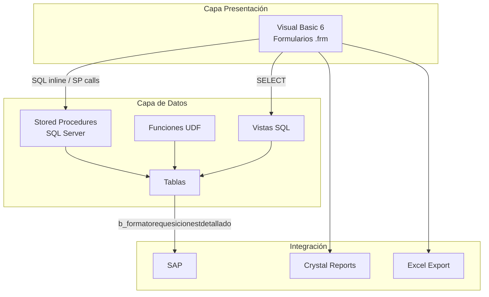
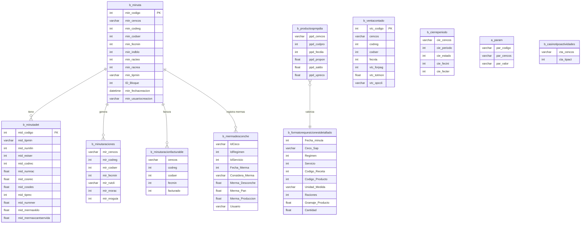
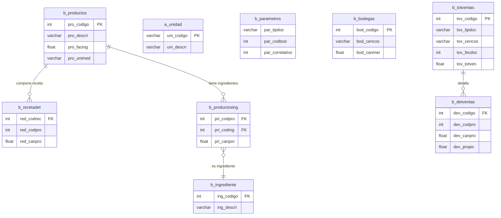
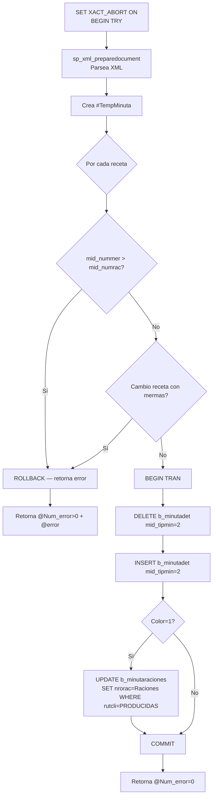
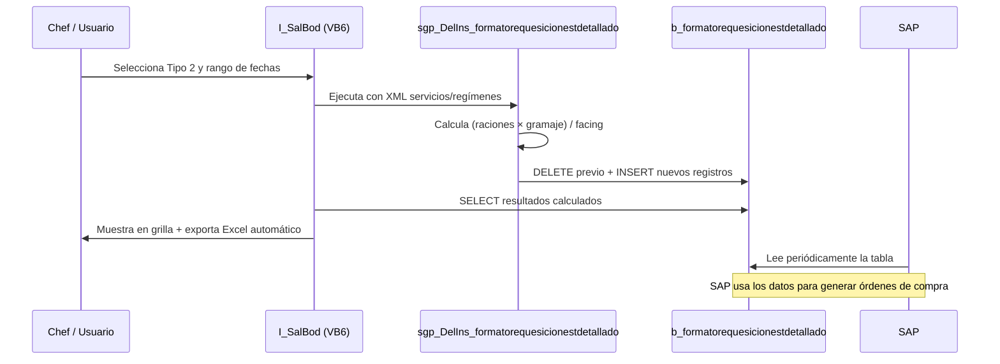
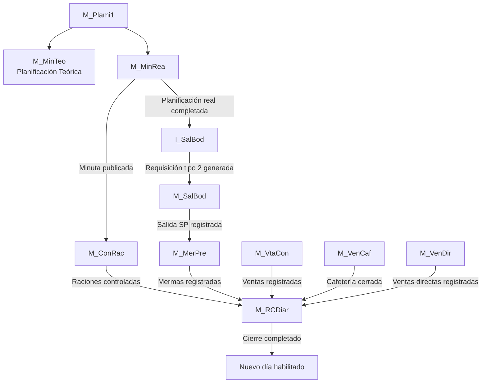
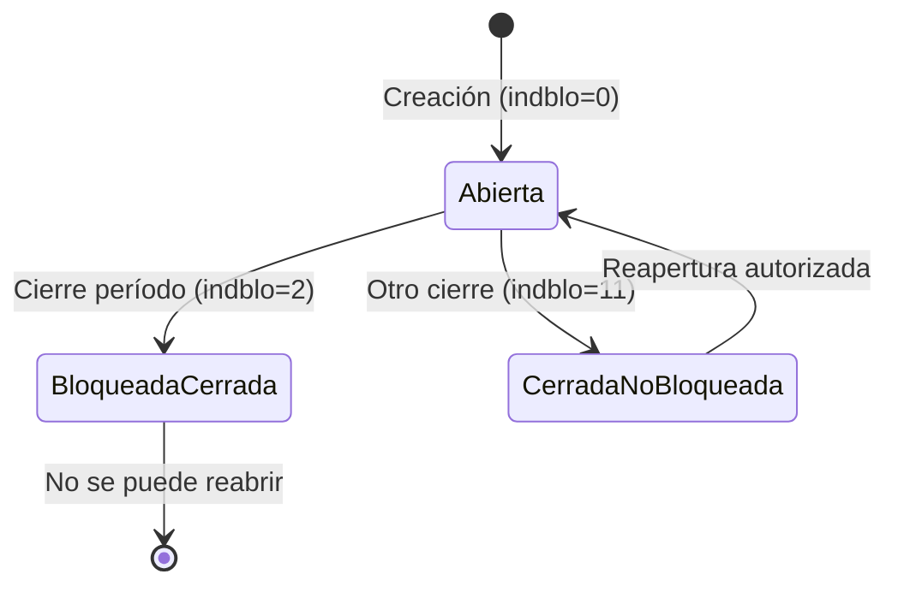
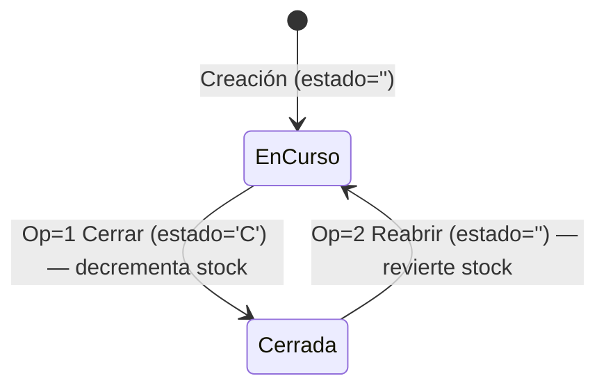

# Documentación Técnica — Módulo de Producción SGP

> Estado: Borrador
> Fuente: Análisis código fuente VB6 (553 archivos) + SQL Server (39.776 líneas)
> Tecnología actual: Visual Basic 6 + SQL Server
> Fecha: Marzo 2026

---

## Tabla de Contenidos

1. [Arquitectura del Sistema](#1-arquitectura-del-sistema)
2. [Modelo de Datos](#2-modelo-de-datos)
   - 2.1 [Diagrama Entidad-Relación](#21-diagrama-entidad-relación)
   - 2.2 [Descripción Detallada de Tablas](#22-descripción-detallada-de-tablas)
3. [Formularios VB6 — Detalles Técnicos](#3-formularios-vb6--detalles-técnicos)
4. [Stored Procedures](#4-stored-procedures)
   - 4.1 [Módulo Planificación](#41-módulo-planificación)
   - 4.2 [Módulo Control de Raciones](#42-módulo-control-de-raciones)
   - 4.3 [Módulo Mermas](#43-módulo-mermas)
   - 4.4 [Módulo Requisición](#44-módulo-requisición)
   - 4.5 [Módulo Salida Bodega](#45-módulo-salida-bodega)
   - 4.6 [Módulo Cierre Diario](#46-módulo-cierre-diario)
5. [Funciones (UDFs)](#5-funciones-udfs)
6. [Vistas SQL](#6-vistas-sql)
7. [Validaciones del Sistema](#7-validaciones-del-sistema)
   - 7.1 [Validaciones Frontend VB6](#71-validaciones-frontend-vb6)
   - 7.2 [Validaciones en Stored Procedures](#72-validaciones-en-stored-procedures)
8. [Integraciones y Dependencias](#8-integraciones-y-dependencias)
   - 8.1 [Integración SGP → SAP / Requisición](#81-integración-sgp--sap--requisición)
   - 8.2 [Crystal Reports](#82-crystal-reports)
   - 8.3 [Exportación Excel](#83-exportación-excel)
   - 8.4 [Dependencias entre Formularios](#84-dependencias-entre-formularios)
9. [Manejo de Transacciones](#9-manejo-de-transacciones)
10. [Trazabilidad y Auditoría](#10-trazabilidad-y-auditoría)
11. [Valorización y Costos](#11-valorización-y-costos)
12. [Casos Especiales y Excepciones](#12-casos-especiales-y-excepciones)
13. [Preguntas Técnicas Abiertas](#13-preguntas-técnicas-abiertas)
14. [Glosario Técnico](#14-glosario-técnico)

---

## 1. Arquitectura del Sistema

### 1.1 Stack Tecnológico

| Capa | Tecnología | Descripción |
|---|---|---|
| Presentación | Visual Basic 6 (.frm, .bas, .cls) | 553 archivos de código fuente |
| Base de datos | SQL Server | 39.776 líneas de definición |
| Reportería | Crystal Reports | Reportes de requisición e inventario |
| Exportación | Microsoft Excel | Salida de datos para SAP y alertas |
| Integración ERP | SAP | Requisiciones de bodega |

### 1.2 Capas de la Aplicación

**Capa de Presentación:** Formularios VB6 que manejan la interfaz de usuario, validaciones frontend y construcción de XML para llamadas a SPs. Utilizan componentes FarPoint Spread (grillas), controles FarPoint (fpText, fpLongInteger, fpDoubleSingle) y SSTab (pestañas).

**Capa de Datos:** Stored Procedures, Funciones UDF y Vistas SQL. La lógica de negocio compleja reside en SPs que manejan sus propias transacciones con BEGIN TRAN / COMMIT / ROLLBACK. El intercambio de datos estructura-a-SP se realiza mediante documentos XML pasados como TEXT.

**Capa de Integración:** Tabla de interfaz `b_formatorequesicionestdetallado` que actúa como puente entre SGP LOCAL y SAP para el envío de requisiciones. Crystal Reports consume datos directamente para generar reportes de salida.

### 1.3 Patrón de Transacciones (Dual)

El sistema usa dos niveles de control transaccional según el formulario:

- **BeginTrans VB6:** Usado cuando el formulario construye múltiples sentencias SQL inline y necesita atomicidad a nivel ADO/DAO (M_ConRac, M_SalBod, M_VtaCon, M_VenCaf, M_VenDir).
- **BEGIN TRAN en SP:** Usado cuando la lógica transaccional está encapsulada completamente en el stored procedure, con SET XACT_ABORT ON y bloques BEGIN TRY/CATCH (sgp_Ins_XmlMinutaReal, sgp_Upd_XmlMermaPreparacion).
- **Sin transacciones explícitas:** Formularios que delegan completamente en SPs autogestionados (M_Plami1, M_MinRea, M_MerPre, I_SalBod).

> ⚠️ **Crítico para el nuevo desarrollo:** No se deben anidar transacciones VB6 con transacciones de SP. Los SPs que tienen BEGIN TRAN propio deben ser llamados fuera de un BeginTrans VB6, o el nuevo sistema debe usar un único nivel de transacción consistente.

### 1.4 Diagrama de Arquitectura



---

## 2. Modelo de Datos

### 2.1 Diagrama Entidad-Relación

#### Tablas del proceso de producción



#### Tablas maestras y de movimientos



### 2.2 Descripción Detallada de Tablas

#### b_minuta — Encabezado de Minuta

Registra una planificación de menú para un día, régimen y servicio específico dentro de un casino.

| Campo | Tipo | Descripción | Valores posibles |
|---|---|---|---|
| `min_codigo` | INT PK | Identificador único de minuta | Autonumérico |
| `min_cencos` | VARCHAR(10) | Centro de costo (casino) | Código del contrato |
| `min_codreg` | INT | Código de régimen alimentario | ≤9999=local, >9999=centralizado |
| `min_codser` | INT | Código de servicio | Desayuno, almuerzo, etc. |
| `min_fecmin` | INT | Fecha en formato YYYYMMDD | Ej: 20260115 |
| `min_indblo` | INT | Estado de bloqueo | 0=abierto, 2=cerrado bloqueado, 11=cerrado no bloqueado |
| `min_racteo` | INT | Raciones planificadas (teóricas) | >0 |
| `min_racrea` | INT | Raciones producidas (reales) | >0 |
| `min_tipmin` | VARCHAR(1) | Tipo de minuta | '1'=teórica, '2'=real |
| `ID_Bloque` | INT | Identificador de bloque de bloqueo | FK a tabla de bloqueos |
| `min_fechacreacion` | DATETIME | Fecha y hora de creación | Timestamp |
| `min_usuariocreacion` | VARCHAR(20) | Usuario que creó el registro | Login de usuario |

#### b_minutadet — Detalle de Minuta (Recetas por Día)

Almacena las recetas que componen cada minuta, incluyendo raciones, costos y mermas registradas.

| Campo | Tipo | Descripción | Valores posibles |
|---|---|---|---|
| `mid_codigo` | INT FK | FK → b_minuta.min_codigo | |
| `mid_tipmin` | VARCHAR(1) | Tipo de minuta (clave compuesta) | '1'=teórica, '2'=real |
| `mid_numlin` | INT | Número de línea (clave compuesta) | Secuencial por minuta |
| `mid_estser` | INT | Estado del servicio | |
| `mid_codrec` | INT | Código de receta | FK a tabla de recetas |
| `mid_numrac` | FLOAT | Número de raciones planificadas | >0 |
| `mid_cosrec` | FLOAT | Costo alimento de la receta | Calculado por fn_sgp_p_CalculaCosaliCosdes(Op=1) |
| `mid_cosdes` | FLOAT | Costo desechable de la receta | Calculado por fn_sgp_p_CalculaCosaliCosdes(Op=2) |
| `mid_tiprec` | INT | Tipo receta | 0=patrón global, >0=régimen específico |
| `mid_nummer` | FLOAT | Merma por raciones (cantidad) | ≤ mid_numrac |
| `mid_mermaxkilo` | FLOAT | Merma bruta en kilogramos | |
| `mid_mermaxcantservida` | FLOAT | Merma en cantidad servida | |

#### b_minutaraciones — Raciones por Cliente por Día

Registra las raciones de cada cliente o tipo especial para cada combinación de día/régimen/servicio.

| Campo | Tipo | Descripción | Valores posibles |
|---|---|---|---|
| `mir_cencos` | VARCHAR(10) | Centro de costo (PK compuesta) | |
| `mir_codreg` | INT | Régimen (PK compuesta) | |
| `mir_codser` | INT | Servicio (PK compuesta) | |
| `mir_fecmin` | INT | Fecha YYYYMMDD (PK compuesta) | |
| `mir_rutcli` | VARCHAR(10) | Identificador de fila (PK compuesta) | RUT real, 'PRODUCIDAS', 'PERSONAL', 'MERMAS' |
| `mir_nrorac` | INT | Número de raciones | |
| `mir_nroguia` | INT | Número de guía asociada | Sin documentación detallada — ver Q-008 |

> ⚠️ El campo `mir_rutcli` tiene uso dual: almacena RUTs reales de clientes O valores de control del sistema ('PRODUCIDAS', 'PERSONAL', 'MERMAS'). Estos últimos son preservados en operaciones de borrado durante la facturación.

#### b_minutaracionfacturable — Control de Facturación de Raciones

| Campo | Tipo | Descripción | Valores |
|---|---|---|---|
| `cencos` | VARCHAR(10) | Centro de costo (PK compuesta) | |
| `codreg` | INT | Régimen (PK compuesta) | |
| `codser` | INT | Servicio (PK compuesta) | |
| `fecmin` | INT | Fecha YYYYMMDD (PK compuesta) | |
| `facturado` | INT | Estado de facturación | 0=no facturado, 1=facturado |

#### b_mermadesconche — Mermas Globales por Día

Almacena las mermas globales de desconche, pan y producción, separadas de las mermas por receta que están en b_minutadet.

| Campo | Tipo | Descripción |
|---|---|---|
| `IdCeco` | VARCHAR(10) | Centro de costo (PK compuesta) |
| `IdRegimen` | INT | Régimen (PK compuesta) |
| `IdServicio` | INT | Servicio (PK compuesta) |
| `Fecha_Merma` | INT | Fecha YYYYMMDD (PK compuesta) |
| `Considera_Merma` | VARCHAR(1) | 'S'=considera en costos, 'N'=excluye del cálculo |
| `Merma_Desconche` | FLOAT | Kilogramos de desconche |
| `Merma_Pan` | FLOAT | Kilogramos de merma de pan |
| `Merma_Produccion` | FLOAT | Kilogramos de merma de producción general |
| `Fecha_Modificacion` | DATETIME | Última modificación |
| `Fecha_Creacion` | DATETIME | Creación del registro |
| `Usuario` | VARCHAR(20) | Usuario responsable |

#### b_productospmpdia — Precio Promedio Ponderado por Día

Tabla central de valorización. Contiene el PMP calculado para cada producto, casino y día después del cierre diario.

| Campo | Tipo | Descripción |
|---|---|---|
| `ppd_cencos` | VARCHAR(10) | Centro de costo (PK compuesta) |
| `ppd_codpro` | INT | Código de producto (PK compuesta) |
| `ppd_fecdia` | INT | Fecha YYYYMMDD (PK compuesta) |
| `ppd_propon` | FLOAT | Precio Medio Ponderado del día |
| `ppd_saldo` | FLOAT | Saldo en stock al cierre |
| `ppd_upreco` | FLOAT | Último precio de reposición |

#### b_formatorequesicionestdetallado — Requisición para SAP

Tabla de interfaz que almacena la requisición calculada para ser consumida por SAP. No tiene campos de auditoría.

| Campo | Tipo | Descripción |
|---|---|---|
| `Fecha_minuta` | INT | Fecha de la minuta en formato YYYYMMDD |
| `Ceco_Sap` | VARCHAR | Centro de costo en formato SAP |
| `Regimen` | INT | Código de régimen |
| `Servicio` | INT | Código de servicio |
| `Codigo_Receta` | INT | Código de receta origen |
| `Codigo_Producto` | INT | Código de producto requerido |
| `Unidad_Medida` | VARCHAR | Unidad de medida del producto |
| `Raciones` | INT | Raciones planificadas |
| `Gramaje_Producto` | FLOAT | Gramos por ración (red_canpro) |
| `Cantidad` | FLOAT | Cantidad calculada: (Raciones × Gramaje) / Facing |

#### b_ventacontado / b_ventacontadodet — Venta Servicio Contado

`b_ventacontado` — Encabezado de venta al contado:

| Campo | Tipo | Descripción | Valores |
|---|---|---|---|
| `vtc_codigo` | INT PK | Identificador único | Autonumérico |
| `cencos` | VARCHAR(10) | Centro de costo | |
| `codreg` | INT | Régimen | |
| `codser` | INT | Servicio | |
| `fecvta` | INT | Fecha de venta YYYYMMDD | |
| `vtc_forpag` | INT | Forma de pago | 0=Contado, 1=Cheque, 2=Cheque Restaurant, 3=Tarjeta Crédito, 4=Vale |
| `vtc_totmon` | FLOAT | Monto total de la venta | |
| `vtc_opccli` | VARCHAR | Opción de cliente | |

`b_ventacontadodet` — Detalle por centro de costo (cuando cliente es CoCo en b_clientecencos).

#### b_cierreperiodo — Estado de Período Mensual

| Campo | Tipo | Descripción | Valores |
|---|---|---|---|
| `cie_cencos` | VARCHAR(10) | Centro de costo (PK compuesta) | |
| `cie_periodo` | INT | Período YYYYMM (PK compuesta) | Ej: 202601 |
| `cie_estado` | INT | Estado del período | 1=abierto, 0=cerrado |
| `cie_fecini` | INT | Fecha inicio período YYYYMMDD | |
| `cie_fecter` | INT | Fecha término período YYYYMMDD | |

#### b_parametros — Correlativos de Documentos

| Campo | Tipo | Descripción |
|---|---|---|
| `par_tipdoc` | VARCHAR | Tipo de documento: SP, DP, ME, SE, DE |
| `par_codbod` | INT | Código de bodega |
| `par_correlativo` | INT | Número correlativo actual |

#### a_param — Parámetros de Configuración por Casino

| `par_codigo` | Encriptado | Descripción | Consumido por |
|---|---|---|---|
| `ciediario` | Sí | Fecha del último cierre diario (base para control de acceso a edición) | M_MerPre, M_RCDiar, sgp_DelIns_formatorequesicionestdetallado |
| `parcomdia` | Sí | Password para editar la fila PRODUCIDAS en Control de Raciones | M_ConRac |
| `ctainsumo` | No | Cuenta contable para insumos alimentarios | fn_sgp_p_CalculaCosaliCosdes(Op=1) |
| `ctalimdes` | No | Cuenta contable para desechables | fn_sgp_p_CalculaCosaliCosdes(Op=2) |
| `addreceta` | No | Máximo de recetas adicionales por día | M_MinRea |
| `5etapas` | No | Indicador de casino con régimen centralizado (>9999) | M_MinRea |
| `pargrarnve` | No | Gramos por ración no vendida para cálculo de merma RNV | sgp_Sel_MermaPorPreparacion |
| `SvrAppCont` | No | Nombre del PC autorizado para ejecutar el cierre diario | M_RCDiar |

#### b_casinotipoactividades — Control de Actividades para Cierre

| `cta_tipact` | Actividad | Descripción |
|---|---|---|
| 1 | Proveedores | Registro de compras/proveedores |
| 2 | SalidaProd | Salidas de bodega a producción |
| 3 | Devoluciones | Devoluciones de producción |
| 4 | Mermas | Registro de mermas del día |
| 5 | RNV | Raciones No Vendidas procesadas |
| 6 | CtrlRaciones | Control de raciones completado |
| 7 | Cafetería | Ventas de cafetería cerradas |
| 8 | VentaServ | Ventas servicio contado registradas |
| 9 | VentaDir | Ventas directas registradas |
| 10 | Inventario | Inventario físico ingresado (si aplica) |

#### b_totventas / b_detventas — Movimientos de Bodega

`b_totventas` — Encabezado de documento de movimiento:

| Campo | Tipo | Descripción | Tipos de documento |
|---|---|---|---|
| `tov_codigo` | INT PK | Identificador único | |
| `tov_tipdoc` | VARCHAR | Tipo de documento | SP=Salida Producción, DP=Devolución Producción, ME=Merma |
| `tov_cencos` | VARCHAR(10) | Centro de costo | |
| `tov_fecdoc` | INT | Fecha del documento YYYYMMDD | |
| `tov_totven` | FLOAT | Total del documento | |

`b_detventas` — Detalle de productos del movimiento:

| Campo | Tipo | Descripción |
|---|---|---|
| `dev_codigo` | INT FK | FK → b_totventas.tov_codigo |
| `dev_codpro` | INT | Código de producto |
| `dev_canpro` | FLOAT | Cantidad del producto |
| `dev_propic` | FLOAT | Precio unitario (PMP al momento del movimiento) |

#### b_bodegas — Stock de Bodega

| Campo | Tipo | Descripción |
|---|---|---|
| `bod_codigo` | INT PK | Identificador único de bodega |
| `bod_cencos` | VARCHAR(10) | Centro de costo |
| `bod_canmer` | FLOAT | Cantidad en stock (se decrementa en salidas, incrementa en devoluciones) |

#### b_totventascaf / b_detventascaf — Ventas de Cafetería

`b_totventascaf`:

| Campo | Tipo | Descripción | Valores |
|---|---|---|---|
| `tvc_estado` | VARCHAR(1) | Estado de la venta | ''=en curso, 'C'=cerrada |

`b_detventascaf` — Ítems vendidos. `b_detventascafpro` — Productos descontados de bodega.

---

## 3. Formularios VB6 — Detalles Técnicos

### M_Plami1.frm — Selector/Lanzador de Planificación

| Atributo | Detalle |
|---|---|
| Archivo | `codigo_fuente/M_Plami1.frm` |
| Tamaño | 1.246 líneas |
| Función | Formulario modal de selección. Punto de entrada al proceso de planificación |
| Transacciones | Sin BeginTrans VB6. Sin transacciones de SP propias |

**Controles principales:**

| Control | Tipo | Binding |
|---|---|---|
| `fpText` | TextBox FarPoint | RUT del contrato |
| `fpLongInteger1(1)` | NumericField FarPoint | Código de régimen |
| `fpLongInteger1(2)` | NumericField FarPoint | Código de servicio |
| `fpDateTime1` | DateTimePicker FarPoint | Mes y año de planificación |
| `vaSpread1` | Grid FarPoint Spread | Calendario 7×6 días del mes |

**Variables globales asignadas** (consumidas por todos los formularios hijos):

| Variable | Descripción |
|---|---|
| `vg_codcasino` | Centro de costo seleccionado |
| `vg_codregimen` | Régimen seleccionado |
| `vg_codservicio` | Servicio seleccionado |
| `vg_fecha` | Fecha de trabajo |
| `Vg_FechaDesde` | Inicio del período mensual |
| `Vg_FechaHasta` | Fin del período mensual |

**Stored Procedures invocados:** No invoca SPs directamente. Usa módulos de lectura centralizados: `RutinaLectura.Cliente`, `RutinaLectura.Regimen`, `RutinaLectura.Servicio`, `RutinaLectura.EstServicio`, `RutinaLectura.Minutas`.

**Notas técnicas:** La validación de bloqueo de período (`ValidarAccesoMinutaBloqueyBloqueo`) llama a `sgp_Sel_ValidarMinBloque`. Si retorna registros con `min_indblo IN (2, 11)`, bloquea el acceso a M_MinRea.

---

### M_MinRea.frm — Editor Planificación Real

| Atributo | Detalle |
|---|---|
| Archivo | `codigo_fuente/M_MinRea.frm` |
| Tamaño | 5.111 líneas (mayor complejidad del módulo) |
| Función | Editor donde el chef define/ajusta recetas del día para cada servicio |
| Transacciones | Sin BeginTrans VB6. Transacciones manejadas dentro de sgp_Ins_XmlMinutaReal |

**Estructura de la grilla vaSpread1** (5 columnas por día del mes):

| Columna | Nombre | Editable | Descripción |
|---|---|---|---|
| 0 | CodEstructura | No | Código de estructura de la receta |
| 1 | NomReceta | No | Nombre descriptivo |
| 2 | NºRaciones | Sí | Raciones planificadas |
| 3 | Costo | No | Costo calculado |
| 4 | CodReceta | No (oculto) | Código interno |

**Código de colores:**

| Color | Significado |
|---|---|
| Verde | Receta local o patrón (régimen ≤ 9999) |
| Amarillo | Receta centralizada 5-etapas (régimen > 9999) — solo lectura |

**Stored Procedures invocados:** `sgp_Ins_XmlMinutaReal` (grabación), `sgp_Sel_ValidarMinBloque` (validación bloqueo).

**Funciones VB6 auxiliares:** `VectorCol()` (mapa días en grilla), `DetallePlantillaMinuta()` (carga inicial).

**Parámetros a_param consumidos:** `addreceta` (máximo recetas adicionales/día), `5etapas` (modo centralizado).

---

### M_ConRac.frm — Control de Raciones

| Atributo | Detalle |
|---|---|
| Archivo | `codigo_fuente/M_ConRac.frm` |
| Tamaño | 2.930 líneas |
| Función | Registra raciones consumidas por cliente para cada día del período |
| Transacciones | BeginTrans VB6 en líneas 1908, 1981, 2059, 2068 |

**Estructura de la grilla:** Matriz clientes × días. Filas especiales: PRODUCIDAS, PERSONAL, MERMAS.

**Stored Procedures invocados:**

| SP | Operación |
|---|---|
| `sgp_Sel_DetalleLecturaxPeriodo(Ceco, YYYYMM)` | Carga grilla |
| `sgp_Del_MinutaRaciones` | Borra raciones del período |
| `sgp_Ins_MinutaRaciones` | Inserta raciones |
| `sgp_Del_MinutaRacionFacturable` | Borra marca facturable |
| `sgp_Ins_MinutaRacionFacturable(Ceco,Reg,Ser,Fecha,Fac)` | Marca facturación / borra clientes reales |
| `sgp_Sel_MinutaRacionesFacturable` | Historial facturación |
| `sgp_Sel_MinutaconcomensalesCeroConRac` | Detecta inconsistencias |

**Notas técnicas:** La fila PRODUCIDAS requiere password desencriptando `a_param 'parcomdia'` con `sgp_p_desencripta`. Con Fac=1, el SP elimina raciones de clientes reales pero preserva 'PRODUCIDAS', 'PERSONAL' y 'MERMAS'.

---

### M_MerPre.frm — Mermas por Preparación

| Atributo | Detalle |
|---|---|
| Archivo | `codigo_fuente/M_MerPre.frm` |
| Tamaño | ~80KB, aprox. 2.564 líneas |
| Función | Registra mermas por receta y mermas globales (desconche, pan, producción) |
| Transacciones | Sin BeginTrans VB6. Transacciones en sgp_Upd_XmlMermaPreparacion |

**Estructura de la grilla** (10 columnas):

| Col | Nombre | Editable | Campo BD |
|---|---|---|---|
| 0 | CodRec | No | mid_codrec |
| 1 | NomRec | No | Nombre receta |
| 2 | RacionesPlan | No | mid_numrac |
| 3 | CostoUnit | No | Calculado |
| 4 | CostoTotal | No | Calculado |
| 5 | MermaxRaciones | Sí | mid_nummer |
| 6 | MermaxKilosServida | Sí | mid_mermaxcantservida |
| 7 | CostoMerma | No (calculado) | — |
| 8 | NumLin | No (oculto) | mid_numlin |
| 9 | MermaBrutaxKilos | Sí | mid_mermaxkilo |

**Controles adicionales:**

| Control | Tipo | Campo BD |
|---|---|---|
| `Desconche` | fpDoubleSingle | b_mermadesconche.Merma_Desconche |
| `Pan` | fpDoubleSingle | b_mermadesconche.Merma_Pan |
| `Produccion` | fpDoubleSingle | b_mermadesconche.Merma_Produccion |
| `ChcMerma` | CheckBox | Considera_Merma='N' si marcado |

**Variable global consumida:** `vg_ciedia` (días anteriores bloqueados en rojo).

---

### I_SalBod.frm — Informe Requisición Salida Bodega

| Atributo | Detalle |
|---|---|
| Archivo | `codigo_fuente/I_SalBod.frm` |
| Tamaño | ~41KB, 1.228 líneas |
| Función | Genera requisición de materias primas. Tipo 2 guarda en BD para SAP |
| Transacciones | Sin BeginTrans VB6. Sin transacciones propias |

**Tipos de informe (Combo1[2]):**

| Índice | Nombre | Generación | Destino |
|---|---|---|---|
| 0 | Resumido | Crystal Reports | Pantalla/Impresora |
| 1 | xSector | Crystal Reports | Pantalla/Impresora |
| 2 | xEstructura Detallado | Guarda en BD | SAP + Excel automático |
| 3 | xEstructura Resumido | Crystal Reports | Pantalla/Impresora |
| 4 | Resumen | Crystal Reports | Pantalla/Impresora |
| 5 | Devolución | Crystal Reports | Pantalla/Impresora |
| 6 | MenosDev | Crystal Reports | Pantalla/Impresora |

**Stored Procedures invocados:** `sgp_Sel_ValidarServicioComensalesCeroSalProduccion`, `sgp_Upd_ValidarProductoVigente`, `sgp_DelIns_formatorequesicionestdetallado`, `sgp_Sel_formatorequesicionestdetallado`.

---

### M_SalBod.frm — Salida Bodega a Producción

| Atributo | Detalle |
|---|---|
| Archivo | `codigo_fuente/M_SalBod.frm` |
| Tamaño | 3.564 líneas |
| Función | Registra salida de mercaderías de bodega a cocina. Genera documento SP |
| Transacciones | BeginTrans / CommitTrans VB6. ROLLBACK si stock negativo |

**Tipo de documento:** SP (Salida Producción). Correlativo en `b_parametros` donde `par_tipdoc='SP'`.

**Modos de operación:**

| Modo | Descripción |
|---|---|
| A (Alta) | INSERT nuevo documento SP |
| M (Modificar) | DELETE documento existente + INSERT nuevo |

**Fuente de datos para cálculo:**

| Fuente | Condición | Tabla |
|---|---|---|
| Minuta Real | Existe planificación real | `b_minutadet` donde `mid_tipmin='2'` |
| Estructura Fija | Sin minuta o preferencia | `b_minutafijadia` |

**Fórmula de cálculo:** `Cantidad = raciones × red_canpro / rec_basrac`

**Stored Procedures invocados:** `sgp_Sel_ValidarDevolucionProduccion`.

---

### M_RCDiar.frm — Cierre Diario

| Atributo | Detalle |
|---|---|
| Archivo | `codigo_fuente/M_RCDiar.frm` |
| Tamaño | 1.477 líneas |
| Función | Proceso crítico de cierre diario: valida actividades, calcula PMP, actualiza estado |
| Transacciones | Sin BeginTrans VB6 explícito. PMP calculado por funciones internas |

> ⚠️ **Restricción de acceso:** Solo el PC cuyo nombre coincide con `a_param 'SvrAppCont'` puede ejecutar el cierre. La validación usa `GetComputerName()` de la API de Windows.

**Código de colores del calendario:**

| Color | Significado |
|---|---|
| Cyan | Día habilitado para cierre |
| Azul | Cerrado, no enviado al servidor central |
| Verde | Cerrado y enviado exitosamente |

**Stored Procedures invocados:** `sgp_Sel_Param`, `sgp_Ins_Param`, `sgp_Upd_Param`, `sgp_Sel_EnviarMensajeInventarioCalendarizado`, `sgp_Upd_ReabrirCierreDiario`.

**Variables globales consumidas:** `vg_tipbase` (='2' habilita PMP), controla el método `CalcularPMPDiaSql()` vs `CalcularPMPDiaSqlPEL()`.

---

### M_VtaCon.frm — Venta Servicio Contado

| Atributo | Detalle |
|---|---|
| Archivo | `codigo_fuente/M_VtaCon.frm` |
| Tamaño | 1.942 líneas |
| Función | Registra ventas de servicios con formas de pago múltiples |
| Transacciones | BeginTrans / CommitTrans VB6 en operaciones Borrar y Confirmar |

**Nota técnica crítica:** Este formulario NO usa Stored Procedures. Ejecuta SQL inline directo desde VB6 contra `b_ventacontado` y `b_ventacontadodet`.

**Tab2 (Detalle CoCo):** Solo visible cuando el cliente aparece en `b_clientecencos`. Permite ingresar montos diferenciados por sub-centro de costo.

---

### M_VenCaf.frm — Venta Cafetería

| Atributo | Detalle |
|---|---|
| Archivo | `codigo_fuente/M_VenCaf.frm` |
| Tamaño | 2.089 líneas |
| Función | Gestiona ventas de cafetería con control de stock propio |
| Transacciones | BeginTrans / CommitTrans VB6 en múltiples operaciones |

**Ciclo de vida de la venta:**

| Operación | Estado `tvc_estado` | Efecto en b_bodegas |
|---|---|---|
| Crear | `''` (vacío) | Sin efecto |
| Op=1 Cerrar | `'C'` | `bod_canmer = bod_canmer - cantidad` |
| Op=2 Reabrir | `''` | Revierte decremento |

---

### M_VenDir.frm — Venta Directa

| Atributo | Detalle |
|---|---|
| Archivo | `codigo_fuente/M_VenDir.frm` |
| Tamaño | 1.447 líneas |
| Función | Registra ventas directas de productos del casino |
| Transacciones | BeginTrans / CommitTrans VB6 |

**Control visual:** Color azul en celda cuando la cantidad supera el stock disponible (advertencia, no bloqueo).

---

### M_Produ1.frm — Árbol Ingrediente

| Atributo | Detalle |
|---|---|
| Archivo | `codigo_fuente/M_Produ1.frm` |
| Función | Solo lectura. Visualiza composición de receta e información nutricional |
| Transacciones | Sin transacciones (solo lectura) |

**Tablas consultadas:** `b_ingrediente`, `b_productos`, `a_unidad`, `b_productospmpdia`.

---

### M_TabGra.frm — Tabla Gramaje

| Atributo | Detalle |
|---|---|
| Archivo | `codigo_fuente/M_TabGra.frm` |
| Tamaño | 1.782 líneas |
| Función | Define gramos/porción por combinación Zona/SubSegmento/IngReceta/Régimen/TipMin/Fecha |
| Transacciones | Sin documentación específica |

**Jerarquía del TreeView:** Zona → Sub-segmento → Ingrediente de Receta → Régimen.

**SP invocado:** `sgpadm_s_zona(6, 0, '')` para obtener la jerarquía de zonas.

---

## 4. Stored Procedures

### 4.1 Módulo Planificación

#### sgp_Ins_XmlMinutaReal

Graba o reemplaza la planificación real de un día. Es el SP más crítico del módulo.

**Firma:**
```sql
EXEC sgp_Ins_XmlMinutaReal
    @XmlMinuta    TEXT,         -- Documento XML con las recetas
    @Ceco         VARCHAR(10),  -- Centro de costo
    @CodRegimen   INT,          -- Código de régimen
    @CodServicio  INT,          -- Código de servicio
    @FechaDia     INT,          -- Fecha YYYYMMDD
    @Raciones     INT,          -- Raciones totales del día
    @Color        VARCHAR(1),   -- '0'=preserva costos, '1'=actualiza PRODUCIDAS
    @Usuario      VARCHAR(20)   -- Login del usuario
```

**Estructura XML de entrada:**
```xml
<GrabaMinuta>
  <Minuta Op="0"
          NumRacion="150"
          DescReceta="CAZUELA DE VACUNO"
          CodReceta="1234"
          TipoReceta="0"
          CosAli="850.50"
          CosDes="45.00"/>
</GrabaMinuta>
```

**Tablas afectadas:** `b_minutadet` (DELETE + INSERT con `mid_tipmin='2'`), `b_minutaraciones` (UPDATE si @Color='1').

**Transacción:** BEGIN TRAN / COMMIT / ROLLBACK internos. SET XACT_ABORT ON, BEGIN TRY/CATCH.

**Lógica interna:**



**Retorno:**

| Variable | Tipo | Descripción |
|---|---|---|
| `@Num_error` | INT | 0=sin error, >0=error |
| `@error` | VARCHAR | Mensaje descriptivo del error |
| `@cRows` | INT | Filas afectadas |

**Parámetro @Color:**

| Valor | Efecto |
|---|---|
| `'0'` | Preserva costos. No modifica b_minutaraciones |
| `'1'` | Actualiza raciones PRODUCIDAS en b_minutaraciones |

---

#### sgp_Ins_XmlMinutaTeorica

Similar a `sgp_Ins_XmlMinutaReal` con las siguientes diferencias:
- Inserta con `mid_tipmin='1'`
- Sin validaciones de mermas (la teórica no tiene mermas registradas)

---

#### sgp_Sel_ValidarMinBloque

```sql
SELECT min_codigo, min_indblo
FROM b_minuta
WHERE min_cencos = @Ceco
  AND min_fecmin = @FechaMinuta
  AND min_indblo IN (2, 11)
```

Retorna registros si el período está bloqueado. Sin registros = período habilitado para edición.

---

#### sgp_Sel_ValidarMinutaBloqueModificado / sgp_Sel_ValidarMinutaBloqueNuevo

Variantes de validación de bloqueo para casos específicos de modificación y creación de minutas nuevas.

---

### 4.2 Módulo Control de Raciones

#### sgp_Del_MinutaRaciones / sgp_Ins_MinutaRaciones

Operaciones simples DELETE e INSERT sobre `b_minutaraciones`. Se usan en secuencia desde M_ConRac dentro de un BeginTrans VB6.

---

#### sgp_Del_MinutaRacionFacturable

Elimina registros de `b_minutaracionfacturable` para un rango de fechas del período.

---

#### sgp_Ins_MinutaRacionFacturable

**Parámetros:** `@Ceco`, `@Reg`, `@Ser`, `@Fecha`, `@Fac INT`

**Lógica cuando @Fac = 1:**
```sql
DELETE FROM b_minutaraciones
WHERE mir_cencos = @Ceco
  AND mir_codreg = @Reg
  AND mir_codser = @Ser
  AND mir_fecmin = @Fecha
  AND mir_rutcli NOT IN ('PRODUCIDAS', 'PERSONAL', 'MERMAS')
```

Elimina raciones de clientes reales preservando las filas de control del sistema.

---

#### sgp_Sel_DetalleLecturaxPeriodo

```sql
EXEC sgp_Sel_DetalleLecturaxPeriodo
    @Ceco    = '001',
    @Periodo = 202601  -- YYYYMM
```

Agrupa `b_detallelectura` por período. Retorna lecturas de vales por punto de servicio.

---

#### sgp_Sel_MinutaRacionesFacturable

Retorna el historial de facturación de raciones para el período del casino.

---

#### sgp_Sel_MinutaconcomensalesCeroConRac

Detecta minutas donde `min_racrea=0` pero existen raciones cargadas en `b_minutaraciones`. Señal de inconsistencia de datos.

---

#### sgp_Sel_ValidarRacionesProducidas

Valida `min_racrea=0`. Excluye servicios 11056 y 11057. Excluye raciones ya facturadas.

---

#### sgp_Sel_ValidarClienteSinraciones

Detecta clientes presentes en `b_preciovta` que no tienen raciones registradas en el período.

---

### 4.3 Módulo Mermas

#### sgp_Upd_XmlMermaPreparacion

Actualiza mermas por receta en `b_minutadet` e inserta/actualiza mermas globales en `b_mermadesconche`.

**Firma:**
```sql
EXEC sgp_Upd_XmlMermaPreparacion
    @XmlMerma          TEXT,
    @Ceco              VARCHAR(10),
    @Regimen           INT,
    @Servicio          INT,
    @Fecha             INT,          -- YYYYMMDD
    @Considera_Merma   VARCHAR(1),   -- 'S' o 'N'
    @Merma_Desconche   FLOAT,
    @Merma_Pan         FLOAT,
    @Merma_Produccion  FLOAT,
    @Usuario           VARCHAR(20)
```

**Estructura XML de entrada:**
```xml
<GrabaMerma>
  <Merma CR="1234"
         NM="5"
         MO="2.500"
         MS="1.200"
         NL="1"/>
</GrabaMerma>
```

| Atributo XML | Campo BD | Descripción |
|---|---|---|
| `CR` | mid_codrec | Código de receta |
| `NM` | mid_nummer | Merma por raciones |
| `MO` | mid_mermaxkilo | Merma bruta en kg |
| `MS` | mid_mermaxcantservida | Merma servida en kg |
| `NL` | mid_numlin | Número de línea |

**Operaciones BD:**
1. `UPDATE b_minutadet SET mid_nummer, mid_mermaxkilo, mid_mermaxcantservida WHERE mid_tipmin='2'`
2. Si existe en `b_mermadesconche`: UPDATE campos de merma global
3. Si no existe: INSERT en `b_mermadesconche`
4. BEGIN TRAN / COMMIT / ROLLBACK

---

#### sgp_Sel_MermaPorPreparacion

```sql
EXEC sgp_Sel_MermaPorPreparacion
    @cencos = '001',
    @codreg = 5001,
    @codser = 1001,
    @fecha  = 20260115,
    @codbod = 1
```

**Cálculo clave de cantidad bruta:**
```sql
CantBruta = CASE
    WHEN mid_nummer > 0 AND mid_mermaxkilo = 0
    THEN dbo.SGP_FN_RNVCantidadesReceta(params) * mid_nummer
    ELSE mid_mermaxkilo
END
```

Usa `a_param 'pargrarnve'` como factor para `SGP_FN_RNVCantidadesReceta`.

---

#### sgp_Sel_ValidarMinutaMermaPorPreparacion

Verifica que exista al menos un registro `mid_tipmin='2'` para el día/régimen/servicio/casino. Si no existe, M_MerPre muestra mensaje de error y no carga la grilla.

---

#### sgp_Sel_DetalleMermasCierreDiario

Retorna el detalle de mermas para el período YYYYMM. Usa el parámetro `pargrarnve` de `a_param` en el cálculo de mermas RNV.

---

#### sgp_Sel_MermaDesconcheCierreDiario

Retorna datos de `b_mermadesconche` para el período mensual.

---

### 4.4 Módulo Requisición

#### sgp_DelIns_formatorequesicionestdetallado

Calcula y graba la requisición de materias primas para el período seleccionado.

**Firma:**
```sql
EXEC sgp_DelIns_formatorequesicionestdetallado
    @XmlServicio   TEXT,         -- Lista de servicios seleccionados
    @XmlRegimen    TEXT,         -- Lista de regímenes seleccionados
    @Ceco          VARCHAR(10),
    @CodBod        INT,
    @FecIni        INT,          -- YYYYMMDD inicio
    @FecFin        INT,          -- YYYYMMDD fin
    @Usuario       VARCHAR(20)
```

**Estructura XML de entrada:**
```xml
<!-- XMLServicio -->
<Servicio>
  <Ser Ser="1001"/>
  <Ser Ser="1002"/>
</Servicio>

<!-- XMLRegimen -->
<Regimen>
  <Reg Reg="5001"/>
  <Reg Reg="5002"/>
</Regimen>
```

**Fórmula de cálculo:**
```
Cantidad = (mid_numrac × red_canpro) / pro_facing
```

| Variable | Tabla.Campo | Descripción |
|---|---|---|
| `mid_numrac` | b_minutadet.mid_numrac | Raciones planificadas por receta |
| `red_canpro` | b_recetadet.red_canpro | Gramaje del producto en la receta |
| `pro_facing` | b_productos.pro_facing | Factor de empaque/conversión |

**Restricciones:** Solo `mid_tipmin='2'`, excluye días cerrados, hace DELETE previo + INSERT.

---

#### sgp_Sel_formatorequesicionestdetallado

Mismo cálculo que `sgp_DelIns` pero solo SELECT. Recupera la requisición ya calculada.

---

#### sgp_Sel_ValidarServicioComensalesCeroSalProduccion

Detecta servicios con comensales=0 en el período. Si retorna registros, I_SalBod muestra advertencia y exporta Excel de alerta automáticamente.

---

#### sgp_Upd_ValidarProductoVigente

**Parámetros:** `@Ceco`, `@CodBod`

Valida que los productos incluidos en la requisición estén vigentes en la bodega del casino. Retorna error específico por producto no vigente.

---

### 4.5 Módulo Salida Bodega

#### sgp_Sel_ValidarDevolucionProduccion

**Firma:**
```sql
EXEC sgp_Sel_ValidarDevolucionProduccion
    @Ceco    VARCHAR(10),
    @codreg  INT,
    @codser  INT,
    @codbod  INT,
    @Fecha   INT,
    @numdoc  INT
```

Verifica si existe un documento de Devolución de Producción (DP) para el mismo SP identificado por `@numdoc`. Si retorna registros, M_SalBod bloquea la modificación del SP.

---

#### sgp_Sel_CalcularSalidaProduccionMinutaTeorica

Compara la salida de bodega teórica (calculada desde `b_minutadet mid_tipmin='1'`) contra la realizada (registrada en `b_totventas tov_tipdoc='SP'`). Usado para análisis de desvíos.

---

### 4.6 Módulo Cierre Diario

#### sgp_Upd_ReabrirCierreDiario

Revierte un cierre diario ya ejecutado, reseteando los registros PMP del día.

**Firma:**
```sql
EXEC sgp_Upd_ReabrirCierreDiario
    @cencos   VARCHAR(10),
    @yyyymmdd INT
```

**Lógica SQL:**
```sql
-- Paso 1: Resetear saldos
UPDATE b_productospmpdia SET ppd_saldo = 0
WHERE ppd_cencos = @cencos AND ppd_fecdia = @yyyymmdd

-- Paso 2: Limpiar registros sin movimiento
DELETE b_productospmpdia
WHERE ppd_cencos = @cencos AND ppd_fecdia = @yyyymmdd
  AND ppd_propon = 0 AND ppd_saldo = 0

-- Paso 3: Reinsertar base para recálculo
INSERT INTO b_productospmpdia (ppd_cencos, ppd_codpro, ppd_fecdia, ppd_propon, ppd_saldo)
VALUES (@cencos, @codpro, @yyyymmdd, 0, 0)
```

> ⚠️ **Riesgo:** La reapertura invalida todos los PMP del día. Documentos posteriores que ya usaron esos PMP pueden quedar inconsistentes.

---

#### sgp_Sel_CierrePeriodo

Retorna `cie_estado=1` de `b_cierreperiodo` para validar que el período está abierto antes de ejecutar el cierre.

---

#### sgp_Sel_TraerCostoFoodCostMinutaCierreDiario

Genera tabla temporal `#TempPaso` con tres columnas de costo: teórico, real y vendido. Usado para el cálculo del Food Cost en el cierre.

---

#### sgp_Sel_ValidarInventarioCalendarizado / sgp_Upd_ValidarInventarioCalendarizado

Verifican y actualizan el estado del inventario calendarizado como parte de las validaciones previas al cierre diario.

---

#### sgp_Sel_EnviarMensajeInventarioCalendarizado

Verifica si existen mensajes pendientes de inventario calendarizado que deben ser procesados antes del cierre.

---

## 5. Funciones (UDFs)

### sgp_p_desencripta

| Atributo | Detalle |
|---|---|
| Tipo | Escalar |
| Retorno | VARCHAR(200) |
| Consumida por | M_ConRac (parcomdia), M_RCDiar (ciediario), Sel_FechaUltimoCierre, sgp_DelIns_formatorequesicionestdetallado |

**Implementación:**
```sql
CREATE FUNCTION sgp_p_desencripta(@psw_encripta VARCHAR(200))
RETURNS VARCHAR(200)
AS BEGIN
    -- Algoritmo: CHAR(ASCII(char) - 73 - posicion_1based)
    DECLARE @resultado VARCHAR(200) = ''
    DECLARE @i INT = 1
    WHILE @i <= LEN(@psw_encripta)
    BEGIN
        SET @resultado = @resultado +
            CHAR(ASCII(SUBSTRING(@psw_encripta, @i, 1)) - 73 - @i)
        SET @i = @i + 1
    END
    RETURN @resultado
END
```

> ⚠️ La clave de encriptación (constante 73) está embebida en el código SQL. Este mecanismo protege la fecha de cierre y el password de la fila PRODUCIDAS. El nuevo sistema debe migrar a un mecanismo de cifrado estándar.

---

### fn_sgp_p_CalculaCosaliCosdes

| Atributo | Detalle |
|---|---|
| Tipo | Escalar, retorna FLOAT |
| Consumida por | M_MinRea (cálculo de costos en grilla), b_minutadet |

**Firma:**
```sql
CREATE FUNCTION fn_sgp_p_CalculaCosaliCosdes(
    @Op      INT,          -- 1=alimento, 2=desechable
    @CenCos  VARCHAR(10),
    @CodRec  INT,
    @TipRec  INT,
    @TipMin  VARCHAR(1),
    @Fecha   INT
)
RETURNS FLOAT
```

**Lógica:**

| @Op | Cuenta contable | Descripción |
|---|---|---|
| 1 | `ctainsumo` (de a_param) | Costo de insumos alimentarios |
| 2 | `ctalimdes` (de a_param) | Costo de desechables |

**Algoritmo:**
```sql
RETURN (
    SELECT SUM(red_canpro * mic_cospro)
    FROM b_recetadet
    JOIN b_minutacosto ON ...
    WHERE codrec = @CodRec AND fecha <= @Fecha
)
```

**Receta patrón:** Si `@TipRec=0`, busca con `cencos='0'` (patrón global sin casino específico).

---

### fn_sgp_Pro_TraerDiaSeguridad

| Atributo | Detalle |
|---|---|
| Tipo | Escalar |
| Parámetros | `@codigo` (tipo de producto), `@Ceco` (centro de costo) |
| Consumida por | Cálculo de días de seguridad en planificación de abastecimiento |

**Lógica:** Recorre el árbol `a_tipopro → b_paramdesp` para retornar los días de seguridad configurados para el producto en el casino.

```sql
RETURN SELECT par_diaseg
FROM b_paramdesp
WHERE par_codpro IN (
    SELECT tip_codpro FROM a_tipopro WHERE tip_codigo = @codigo
)
AND par_cencos = @Ceco
```

---

## 6. Vistas SQL

### Sel_FechaUltimoCierre

| Atributo | Detalle |
|---|---|
| Propósito | Expone la fecha del último cierre diario desencriptada, por casino |
| Tablas | `a_param` |
| Consumida por | Múltiples procesos de control de acceso a edición |

```sql
CREATE VIEW Sel_FechaUltimoCierre AS
SELECT
    par_cencos,
    DATEADD(DAY, -1,
        CONVERT(DATE, dbo.sgp_p_desencripta(par_valor))
    ) AS FechaCierre,
    GETDATE() AS FechaProceso
FROM a_param
WHERE par_codigo = 'ciediario'
```

**Campos calculados:**
- `FechaCierre`: Día anterior al cierre (ayer)
- `FechaProceso`: Fecha actual del sistema

---

### Sel_Minuta_Planificada

| Atributo | Detalle |
|---|---|
| Propósito | Minutas reales con ponderación porcentual por receta |
| Tablas | `b_minuta`, `b_minutadet` |
| Consumida por | Análisis y reportes de planificación |

```sql
CREATE VIEW Sel_Minuta_Planificada AS
SELECT
    m.*,
    md.*,
    ROUND((md.mid_numrac / m.min_racrea) * 100, 0) AS Ponderacion
FROM b_minuta m
JOIN b_minutadet md ON m.min_codigo = md.mid_codigo
WHERE md.mid_tipmin = '2'
  AND md.mid_numrac > 0
  AND m.min_racrea > 0
```

**Campo calculado:** `Ponderacion = ROUND((mid_numrac / min_racrea) * 100, 0)` — Porcentaje de las raciones totales del día que corresponde a cada receta.

---

### Sel_Precio_Stock_SGP

| Atributo | Detalle |
|---|---|
| Propósito | Precios y stocks al último cierre diario, por producto y bodega |
| Tablas | `b_productos`, `b_productospmpdia`, `b_bodegas` |
| Consumida por | Valorización de inventario, consultas de stock |

```sql
CREATE VIEW Sel_Precio_Stock_SGP AS
SELECT p.*, ppd.ppd_propon, ppd.ppd_saldo, b.bod_canmer
FROM b_productos p
JOIN b_productospmpdia ppd ON p.pro_codigo = ppd.ppd_codpro
JOIN b_bodegas b ON ...
WHERE ppd.ppd_fecdia = (SELECT MAX(ppd_fecdia) FROM b_productospmpdia ...)
  AND b.bod_canmer > 0
```

---

### Sel_Producto_Ingrediente_SGP

| Atributo | Detalle |
|---|---|
| Propósito | Árbol completo producto → ingrediente con PMP actual |
| Tablas | `b_productos`, `b_productosing`, `b_contlistpreing`, `b_productospmpdia`, `b_ingrediente` |
| Consumida por | M_Produ1 (árbol ingrediente), análisis nutricional y de costos |

```sql
CREATE VIEW Sel_Producto_Ingrediente_SGP AS
SELECT
    p.pro_codigo,
    p.pro_descri,
    i.ing_codigo,
    i.ing_descri,
    ppd.ppd_propon AS PMP
FROM b_productos p
JOIN b_productosing pri ON p.pro_codigo = pri.pri_codpro
JOIN b_contlistpreing cli ON ...
JOIN b_productospmpdia ppd ON p.pro_codigo = ppd.ppd_codpro
JOIN b_ingrediente i ON pri.pri_coding = i.ing_codigo
```

---

## 7. Validaciones del Sistema

### 7.1 Validaciones Frontend VB6

| Formulario | Condición validada | Acción si falla |
|---|---|---|
| M_Plami1 | `min_indblo IN (2, 11)` — período bloqueado | Mensaje de error, no abre M_MinRea |
| M_MinRea | Régimen > 9999 + parámetro 5etapas activo | Celda amarilla de solo lectura |
| M_MerPre | Col5 (MermaxRaciones) ≤ `mid_numrac` | Rechaza el valor, muestra mensaje |
| M_MerPre | Día anterior a `vg_ciedia` | Fila bloqueada en color rojo |
| M_ConRac | Edición fila PRODUCIDAS sin password | Bloquea edición de la celda |
| M_SalBod | Stock resultante negativo tras operación | ROLLBACK VB6 y mensaje al usuario |
| M_SalBod | Existe documento DP para el SP a modificar | Bloquea modificación del documento |
| M_VenDir | Cantidad > stock disponible | Color azul en celda (advertencia, no bloqueo) |
| M_RCDiar | `GetComputerName()` ≠ `a_param 'SvrAppCont'` | Botón de cierre deshabilitado |
| M_RCDiar | Actividades del día incompletas en b_casinotipoactividades | Lista actividades pendientes |

### 7.2 Validaciones en Stored Procedures

| SP | Condición validada | Comportamiento |
|---|---|---|
| `sgp_Ins_XmlMinutaReal` | `mid_nummer > mid_numrac` (merma > raciones) | ROLLBACK, retorna `@Num_error > 0` |
| `sgp_Ins_XmlMinutaReal` | Cambio de receta con mermas existentes (`mid_nummer > 0`) | ROLLBACK, retorna `@Num_error > 0` con `@error` descriptivo |
| `sgp_Sel_ValidarMinBloque` | `min_indblo IN (2, 11)` | Retorna registros = bloqueo activo |
| `sgp_Sel_ValidarMinutaMermaPorPreparacion` | No existe `mid_tipmin='2'` para el día | Sin datos = error en M_MerPre |
| `sgp_Sel_ValidarServicioComensalesCeroSalProduccion` | Servicios con comensales=0 | Retorna registros = advertencia en I_SalBod |
| `sgp_Upd_ValidarProductoVigente` | Productos no vigentes en bodega | Error específico por producto |
| `sgp_Sel_ValidarDevolucionProduccion` | Existe DP para el SP a modificar | Retorna registros = bloqueo en M_SalBod |

---

## 8. Integraciones y Dependencias

### 8.1 Integración SGP → SAP / Requisición



---

### 8.3 Crystal Reports

| ID | Nombre del informe | Formulario | Tipo informe |
|---|---|---|---|
| R-001 | Requisición Resumida | I_SalBod tipo 0 | Crystal Reports |
| R-002 | Requisición por Sector | I_SalBod tipo 1 | Crystal Reports |
| R-004 | Requisición xEstructura Resumido | I_SalBod tipo 3 | Crystal Reports |
| R-005 | Requisición Resumen | I_SalBod tipo 4 | Crystal Reports |
| R-006 | Devoluciones | I_SalBod tipo 5 | Crystal Reports |
| R-007 | Requisición MenosDev | I_SalBod tipo 6 | Crystal Reports |

Los reportes Crystal Reports consumen directamente los datos de las tablas y vistas del módulo. No hay SPs específicos de Crystal Reports documentados.

---

### 8.4 Exportación Excel

| Trigger | Formulario | Contenido |
|---|---|---|
| Requisición Tipo 2 (siempre) | I_SalBod | Datos completos de `b_formatorequesicionestdetallado` |
| Servicios sin comensales detectados | I_SalBod | Lista de servicios con comensales=0 (alerta) |

Ambas exportaciones se generan automáticamente sin interacción adicional del usuario.

---

### 8.5 Dependencias entre Formularios



**Variables globales compartidas entre formularios:** `vg_codcasino`, `vg_codregimen`, `vg_codservicio`, `vg_fecha`, `Vg_FechaDesde`, `Vg_FechaHasta` (asignadas por M_Plami1, consumidas por todos los hijos).

---

## 9. Manejo de Transacciones

### Formularios con BeginTrans VB6

| Formulario | Operaciones cubiertas | Condición de ROLLBACK |
|---|---|---|
| M_ConRac | Borrar/insertar raciones + marcar facturable | Error en alguna operación del bloque |
| M_SalBod | INSERT b_totventas SP + INSERT b_detventas + UPDATE b_bodegas | Stock negativo en cualquier producto |
| M_VtaCon | Borrar y Confirmar venta contado (SQL inline) | Error en operación SQL |
| M_VenCaf | Cerrar (Op=1) y Reabrir (Op=2) venta cafetería | Error en secuencia de operaciones |
| M_VenDir | INSERT ventas directas + UPDATE stock | Error en operación SQL |

### SPs con transacciones propias

| SP | Patrón | Detalles |
|---|---|---|
| `sgp_Ins_XmlMinutaReal` | SET XACT_ABORT ON + BEGIN TRY/CATCH + BEGIN TRAN/COMMIT/ROLLBACK | Transacción completa: parseo XML → validaciones → DELETE + INSERT → actualización raciones |
| `sgp_Upd_XmlMermaPreparacion` | BEGIN TRAN / COMMIT / ROLLBACK | Actualiza b_minutadet + INSERT/UPDATE b_mermadesconche |

### Formularios sin transacciones explícitas (SPs autogestionados)

| Formulario | Motivo |
|---|---|
| M_Plami1 | Solo lectura / apertura de ventanas |
| M_MinRea | Delega completamente en sgp_Ins_XmlMinutaReal |
| M_MerPre | Delega completamente en sgp_Upd_XmlMermaPreparacion |
| I_SalBod | SP sgp_DelIns_formatorequesicionestdetallado es autónomo |

### Tabla resumen de transacciones por formulario

| Formulario | Nivel de transacción | SP con transacción interna |
|---|---|---|
| M_Plami1 | Ninguno | No aplica |
| M_MinRea | Ninguno (VB6) | sgp_Ins_XmlMinutaReal (Sí) |
| M_ConRac | BeginTrans VB6 | No |
| M_MerPre | Ninguno (VB6) | sgp_Upd_XmlMermaPreparacion (Sí) |
| I_SalBod | Ninguno | sgp_DelIns_formatorequesicionestdetallado (No documentado explícitamente) |
| M_SalBod | BeginTrans VB6 | No |
| M_RCDiar | Ninguno (VB6 explícito) | CalcularPMPDiaSql (interno) |
| M_VtaCon | BeginTrans VB6 | No aplica (SQL inline) |
| M_VenCaf | BeginTrans VB6 | No |
| M_VenDir | BeginTrans VB6 | No |

---

## 10. Trazabilidad y Auditoría

### 10.1 Campos de Auditoría por Tabla

| Tabla | Campo usuario | Campo fecha | Observación |
|---|---|---|---|
| `b_minuta` | `min_usuariocreacion` | `min_fechacreacion` | Solo auditoría de creación |
| `b_mermadesconche` | `Usuario` | `Fecha_Modificacion`, `Fecha_Creacion` | Auditoría de creación y última modificación |
| `b_formatorequesicionestdetallado` | Sin campo usuario | Sin campo fecha | Sin auditoría (tabla de interfaz para SAP) |
| Llamadas a SP | Parámetro `@Usuario` en firma | Implícito por timestamp | El usuario se pasa como parámetro explícito |

### 10.2 Tablas de Log

| Tabla | Descripción |
|---|---|
| `log_enviocierrediario` | Registro de envíos del cierre diario al servidor central |
| `log_cierrediario` | Log detallado de cada ejecución del proceso de cierre |

### 10.3 Ciclo de Vida de los Documentos

#### Estado de Minuta (b_minuta.min_indblo)



#### Estado de Período (b_cierreperiodo.cie_estado)

| Estado | Valor | Descripción |
|---|---|---|
| Abierto | 1 | Período en operación normal, acepta modificaciones |
| Cerrado | 0 | Período finalizado, sin modificaciones permitidas |

#### Estado de Venta Cafetería (b_totventascaf.tvc_estado)



### 10.4 Trazabilidad del PMP

El PMP queda registrado para cada combinación (cencos, codpro, fecdia) en `b_productospmpdia`. Esto permite reconstruir el costo de inventario para cualquier fecha histórica. El campo `ppd_upreco` almacena el último precio de reposición para comparación.

---

## 11. Valorización y Costos

### 11.1 Algoritmo PMP (Precio Medio Ponderado)

**Fórmula:**
```
PMP_nuevo = (Stock_anterior × PMP_anterior + Cantidad_entrada × Precio_entrada)
            / (Stock_anterior + Cantidad_entrada)
```

**Ejecución:** Una vez al día durante el cierre diario.

| Método | Condición de uso |
|---|---|
| `CalcularPMPDiaSql()` | Método estándar |
| `CalcularPMPDiaSqlPEL()` | Cuando hay reproceso de integración SAP (PEL) |

**Tabla resultado:** `b_productospmpdia` (ppd_cencos, ppd_codpro, ppd_fecdia, ppd_propon, ppd_saldo).

---

### 11.2 Costo de Receta

La función `fn_sgp_p_CalculaCosaliCosdes` calcula dos tipos de costo:

| @Op | Cuenta | Descripción |
|---|---|---|
| 1 | `ctainsumo` (de a_param) | Costo alimentos/insumos |
| 2 | `ctalimdes` (de a_param) | Costo desechables |

**Fórmula:**
```sql
Costo = SUM(red_canpro * mic_cospro)
FROM b_recetadet JOIN b_minutacosto
WHERE codrec = @CodRec AND fecha <= @Fecha
```

Para recetas patrón: busca con `cencos='0'` (patrón global).

---

### 11.3 Costo de Merma

Calculado en la grilla de M_MerPre:

```
CostoMerma = CostoTotal × (MermaxRaciones / RacionesPlan)
```

---

### 11.4 Fórmula de Requisición

```
Cantidad_requerida = Raciones × Gramaje_por_ración / Facing_producto
```

| Variable | Tabla.Campo |
|---|---|
| `Raciones` | `b_minutadet.mid_numrac` |
| `Gramaje_por_ración` | `b_recetadet.red_canpro` |
| `Facing` | `b_productos.pro_facing` |

---

### 11.5 Ponderación de Minuta

Calculada en la vista `Sel_Minuta_Planificada`:

```sql
Ponderacion = ROUND((mid_numrac / min_racrea) * 100, 0)
```

Representa el porcentaje del total de raciones del día que corresponde a cada receta.

---

### 11.6 Diagrama de Flujo de Costos


---

## 12. Casos Especiales y Excepciones

### 12.1 Casinos 5-Etapas

**Descripción:** Casinos que reciben minutas centralizadas desde una cocina central. Los regímenes tienen código > 9999.

**Configuración:** `a_param '5etapas'` activo en el casino.

**Comportamiento en M_MinRea:**
- Celdas de la grilla se muestran en **amarillo**
- Solo lectura — el chef no puede modificarlas
- La requisición se genera igualmente desde los datos de la minuta centralizada

---

### 12.2 Inventario Rotativo

**Descripción:** Casinos donde el saldo de inventario se toma del stock físico en lugar del calculado por movimientos.

**Comportamiento en cierre:**
```sql
UPDATE b_productospmpdia
SET ppd_saldo = tin_stofis   -- stock físico tomado en inventario
WHERE ppd_fecdia = @fecha AND ppd_cencos = @ceco
```

Reemplaza el saldo calculado acumulativamente con el stock físico del último inventario.

---

### 12.3 Días Feriados (b_Fecha_Inhabiles)

**Comportamiento:** El cierre diario detecta feriados en `b_Fecha_Inhabiles`. Para cada feriado dentro del período, recalcula el PMP nuevamente, garantizando que el PMP del día siguiente al feriado incluya correctamente los movimientos.

---

### 12.4 Reproceso SAP (PEL)

**Descripción:** Cuando SAP envía una corrección de datos (PEL), el cálculo de PMP usa el método alternativo `CalcularPMPDiaSqlPEL()` que procesa primero los movimientos del reproceso antes de recalcular el PMP.

---

### 12.5 Control Stock Negativo

**En M_SalBod (bloqueo total):**
- Si durante la generación del SP el stock de algún producto queda negativo: ROLLBACK de toda la transacción VB6, el documento SP no se genera, se informa el producto y cantidad problemática.

**En M_VenDir (advertencia visual):**
- Color **azul** en las líneas donde la cantidad supera el stock disponible.
- No bloquea automáticamente — permite al usuario tomar la decisión.

---

### 12.6 Clientes CoCo (Centro de Costo)

**Descripción:** Clientes configurados en `b_clientecencos` que requieren desglose de ventas por sub-unidad de costo.

**Impacto en M_VtaCon:** Si el cliente está en `b_clientecencos`, se habilita el Tab2 (Detalle Centro Costo) que permite ingresar montos diferenciados. Los datos se almacenan en `b_ventacontadodet`.

---

### 12.7 Receta Patrón vs Receta de Régimen

| Tipo | `mid_tiprec` | `cencos` en fn_sgp_p_CalculaCosaliCosdes |
|---|---|---|
| Receta Patrón | 0 | `'0'` (búsqueda global) |
| Receta de Régimen | > 0 | Centro de costo específico |

La función busca primero en el régimen específico; si no encuentra costo, usa el patrón global (`cencos='0'`).

---

## 13. Preguntas Técnicas Abiertas

> ⚠️ Las siguientes preguntas no tienen respuesta definitiva a la fecha. Son críticas para el diseño del nuevo sistema y deben resolverse antes de iniciar el desarrollo.

**Pregunta-PROD-001**
*¿Cuál es la distinción exacta entre `min_indblo=2` (cerrado bloqueado) y `min_indblo=11` (cerrado no bloqueado)?*
*Contexto:* Ambos valores bloquean la edición en M_Plami1 y M_MinRea mediante el mismo SP `sgp_Sel_ValidarMinBloque`.
*Impacto en nuevo desarrollo:* Definición del modelo de estados del workflow de planificación. Si son estados distintos, el nuevo sistema debe manejar dos caminos de cierre diferentes.

---

**Pregunta-PROD-002**
*¿Qué módulo genera la planificación teórica inicial (M_MinTeo)? ¿Tiene lógica similar a M_MinRea?*
*Contexto:* M_MinTeo se referencia en el flujo general pero no fue analizado en detalle durante el levantamiento.
*Impacto en nuevo desarrollo:* Cobertura del módulo de planificación en el nuevo sistema.

---

**Pregunta-PROD-003**
*¿El proceso de digitalización de la requisición (bodeguero confirma físico vs planificado) está implementado o es solo una propuesta futura?*
*Contexto:* Mencionado en sesiones de levantamiento como mejora deseada.
*Impacto en nuevo desarrollo:* Alcance del módulo de bodega.

---

**Pregunta-PROD-004**
*¿Cuáles son los criterios exactos para que un casino tenga inventario rotativo?*
*Contexto:* Solo se menciona la existencia del modo. No hay documentación de las condiciones de activación.
*Impacto en nuevo desarrollo:* Configuración del módulo de cierre diario y gestión de inventario.

---

**Pregunta-PROD-005**
*¿Qué es la tabla `b_minutafijadia` y cuándo se usa como fuente alternativa en M_SalBod?*
*Contexto:* Se referencia como fuente alternativa a la minuta real para calcular cantidades en la salida de bodega.
*Impacto en nuevo desarrollo:* Flujo alternativo del proceso de salida de bodega.

---

**Pregunta-PROD-006**
*¿Qué SP o proceso actualiza `b_casinotipoactividades` al completar cada actividad del día?*
*Contexto:* La tabla se verifica en el cierre pero no se documentó el mecanismo de actualización.
*Impacto en nuevo desarrollo:* Automatización del control de validaciones previas al cierre diario.

---

**Pregunta-PROD-007**
*¿Qué representa `mir_nroguia` en `b_minutaraciones` y desde qué módulo se genera?*
*Contexto:* Campo presente en la tabla sin documentación en el análisis realizado.
*Impacto en nuevo desarrollo:* Modelo de datos del control de raciones.

---

**Pregunta-PROD-008**
*¿La tabla `b_detallelectura` corresponde a lecturas de tarjetas/vales electrónicos? ¿Qué sistema externo las genera?*
*Contexto:* Usada en `sgp_Sel_DetalleLecturaxPeriodo` para cargar la grilla de M_ConRac.
*Impacto en nuevo desarrollo:* Integración con sistemas de control de acceso o tarjetas de comida.

---

**Pregunta-PROD-009**
*¿El parámetro `pargrarnve` (gramos por ración no vendida) es fijo por casino o varía por receta?*
*Contexto:* Usado en `sgp_Sel_MermaPorPreparacion` para calcular la cantidad bruta de merma RNV.
*Impacto en nuevo desarrollo:* Granularidad del parámetro en la configuración del nuevo sistema.

---

**Pregunta-PROD-010**
*¿Qué ocurre con los documentos tipo ME, SE y DE en el correlativo de `b_parametros`?*
*Contexto:* Se mencionan los tipos SP/DP/ME/SE/DE pero solo SP y DP están documentados en detalle.
*Impacto en nuevo desarrollo:* Modelo completo de tipos de documentos de movimiento de bodega.

---

**Pregunta-PROD-012**
*¿Existe un proceso para sincronizar la planificación teórica con cambios de última hora antes de producción?*
*Contexto:* Gap identificado en las sesiones de levantamiento (diciembre 2025 - enero 2026).
*Impacto en nuevo desarrollo:* Workflow de aprobación y publicación de cambios en la planificación.

---

**Pregunta-PROD-013**
*¿Cómo se maneja el control de versiones de la planificación cuando el chef cambia la minuta real después de generada la requisición tipo 2?*
*Contexto:* La requisición tipo 2 se genera puntualmente en un momento dado. Si la minuta cambia después, la requisición queda desactualizada.
*Impacto en nuevo desarrollo:* Consistencia de datos entre planificación y requisición, posible necesidad de versionado o invalidación de requisición.

---

## 14. Glosario Técnico

| Término | Definición |
|---|---|
| **Ceco / Centro de Costo** | Identificador único de cada casino operado por Sodexo Chile. Corresponde al código del contrato. |
| **Régimen** | Clasificación del tipo de alimentación dentro de un casino (ej: régimen normal, hipercalórico). Código ≤ 9999 = local/patrón. Código > 9999 = centralizado (5-etapas). |
| **Servicio** | Tiempo de comida dentro de un régimen: desayuno, almuerzo, once, cena, etc. |
| **Minuta** | Planificación del menú para un día específico dentro de un régimen y servicio. `mid_tipmin='1'`=teórica, `mid_tipmin='2'`=real. |
| **Minuta Teórica** | Planificación inicial del menú, hecha con anticipación. Sirve como base para la planificación real. |
| **Minuta Real** | Planificación ajustada por el chef antes de la producción del día. Es la fuente para el cálculo de requisiciones y salidas de bodega. |
| **Raciones** | Número de porciones a servir. Tres niveles: planificadas (`min_racteo`), producidas (`min_racrea`/PRODUCIDAS), vendidas (RUT cliente en b_minutaraciones). |
| **PMP** | Precio Medio Ponderado. Método de valorización de inventario: `(stock_ant × PMP_ant + qty_entrada × precio_entrada) / (stock_ant + qty_entrada)`. Se calcula diariamente en el cierre. |
| **SP** | Salida Producción. Documento que registra la salida de mercaderías desde bodega hacia cocina. Tipo documento en b_totventas: `tov_tipdoc='SP'`. |
| **DP** | Devolución Producción. Documento que registra el retorno de mercaderías no utilizadas de cocina a bodega. |
| **ME** | Merma. Tipo de documento para registros de pérdida de materias primas. |
| **5-Etapas** | Sistema de producción centralizado donde una cocina central prepara y distribuye a varios casinos. Regímenes con código > 9999. |
| **Facing** | Factor de conversión que representa la cantidad de producto por unidad de empaque. Campo `b_productos.pro_facing`. |
| **Merma por Preparación** | Pérdida de materia prima durante el proceso de cocción/preparación. Campo `mid_nummer` (por raciones) y `mid_mermaxkilo` (por kilos) en b_minutadet. |
| **Desconche** | Tipo de merma global correspondiente a restos de alimentos después del servicio. Campo `Merma_Desconche` en b_mermadesconche. |
| **RNV** | Raciones No Vendidas. Raciones producidas pero no consumidas. Relacionado con `pargrarnve` y `SGP_FN_RNVCantidadesReceta`. |
| **Food Cost** | Porcentaje del costo de alimentos sobre el total de ventas. Calculado por `sgp_Sel_TraerCostoFoodCostMinutaCierreDiario`. |
| **CoCo** | Cliente con configuración de "Centro de Costo" que requiere desglose de ventas por sub-unidad. Configurado en `b_clientecencos`. |
| **ciediario** | Código de `a_param` que almacena **encriptada** la fecha del último cierre diario. Desencriptado con `sgp_p_desencripta`. |
| **parcomdia** | Código de `a_param` que almacena **encriptado** el password para editar la fila PRODUCIDAS en M_ConRac. |
| **SvrAppCont** | Código de `a_param` con el nombre del PC autorizado para ejecutar el cierre diario. Validado con `GetComputerName()`. |
| **addreceta** | Código de `a_param` que limita el número de recetas adicionales por día en la planificación (típico: 5). |
| **pargrarnve** | Código de `a_param` con los gramos por ración no vendida para el cálculo de merma RNV en sgp_Sel_MermaPorPreparacion. |
| **InvBlo / indblo** | Indicador de bloqueo de minuta en `b_minuta.min_indblo`: 0=abierta, 2=cerrada bloqueada, 11=cerrada no bloqueada. |
| **vaSpread1** | Componente de grilla FarPoint Spread usado en formularios VB6. Soporta grillas complejas con múltiples columnas por día. |
| **fpText / fpLongInteger / fpDoubleSingle** | Controles de entrada de datos del componente FarPoint para VB6. Equivalen a TextBox/NumericUpDown/NumericDecimal. |
| **SSTab** | Control de pestañas (tabs) de Sheridan Software usado en formularios VB6. Equivale a TabControl moderno. |
| **BeginTrans / CommitTrans / RollbackTrans** | Métodos de control transaccional en ADO/DAO desde VB6. Equivalen a BEGIN TRAN / COMMIT / ROLLBACK en SQL. |
| **SET XACT_ABORT ON** | Instrucción SQL Server que revierte automáticamente la transacción ante cualquier error de runtime. |
| **sp_xml_preparedocument** | SP del sistema SQL Server que parsea un documento XML y retorna un handle para procesarlo con OPENXML. |
| **tin_stofis** | Campo que representa el stock físico tomado en un inventario físico rotativo. Reemplaza a `ppd_saldo` cuando inventario rotativo está activo. |
| **ppd_fecdia** | Fecha del día de cálculo del PMP en formato entero YYYYMMDD en `b_productospmpdia`. |
| **mid_tipmin** | Tipo de minuta en `b_minutadet`: '1'=teórica, '2'=real. Parte de la clave compuesta del detalle. |
| **red_canpro** | Cantidad de producto por ración en `b_recetadet` (gramaje de la receta). |
| **pro_facing** | Factor de empaque/presentación del producto en `b_productos`. Divisor en la fórmula de requisición. |
| **RutinaLectura** | Módulo VB6 centralizado de lectura de datos maestros (.bas o .cls). Encapsula SELECT de clientes, regímenes, servicios y minutas. |

---

*Documento generado en marzo de 2026 a partir del análisis del archivo Documentacion_SGP_Produccion.md (2.090 líneas), código fuente VB6 (553 archivos) y base de datos SQL Server (39.776 líneas).*
