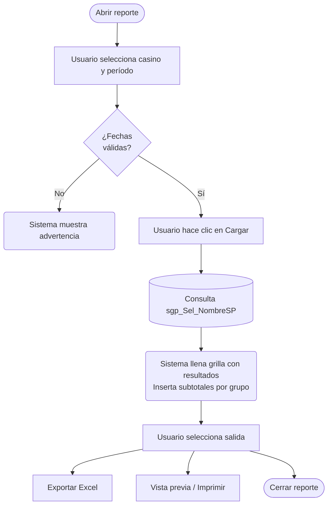

# Prompt — Generación de Documentación Funcional de Reportes SGP Admin

> **Cómo usar:** modifica los valores de la sección **Parámetros** y entrega el documento completo como prompt al agente.

---

## ▶ PARÁMETROS — modificar antes de usar

```
BASE_PROYECTO  = C:\Users\Joaquin.Suazo\Documents\SGP-Producción
RUTA_FUENTE    = {{BASE_PROYECTO}}\codigo_fuente\SGP_Admin
RUTA_SQL       = {{BASE_PROYECTO}}\base_de_datos\SGP_Admin.sql
RUTA_DOC       = {{BASE_PROYECTO}}\doc_funcional

FORMULARIO     = I_PlanifBloque.frm
NOMBRE_MD      = Informe_Planificación.md
```

---

## PROMPT

Analiza el formulario VB6 ubicado en:

```
{{RUTA_FUENTE}}\{{FORMULARIO}}
```

y genera un documento Markdown funcional. Escríbelo en:

```
{{RUTA_DOC}}\md_pantallas\SGP_Admin\{{NOMBRE_MD}}
```

---

### Contexto del sistema

El sistema **SGP Admin** es el módulo administrativo centralizado de SGP, que gestiona la configuración, reportería y supervisión de los casinos Sodexo Chile. Está desarrollado en **Visual Basic 6** con base de datos **SQL Server**. Los formularios de tipo reporte (`I_`, `L_`, `R_`) permiten consultar, exportar e imprimir información operativa consolidada de uno o varios casinos.

Los documentos Markdown son de uso funcional: los leen analistas, jefes de casino, coordinadores de zona y administradores corporativos que no saben programación. El lenguaje debe ser claro, orientado al usuario y libre de jerga técnica. **Los nombres técnicos (tablas, SPs, campos, parámetros) se escriben entre paréntesis** en el texto explicativo, nunca como términos principales.

---

### Paso 1 — Lee el formulario VB6

Lee el archivo completo. Extrae exclusivamente lo que está en el código — no inferir propósito, audiencia ni contexto de negocio más allá de lo que el formulario explicita.

- **Caption del formulario:** el título exacto que aparece en la barra del formulario (`Me.Caption` o la propiedad `Caption` del `.frm`).
- **Tablas principales:** las que aparecen en FROM, INTO, UPDATE, DELETE (nombre exacto).
- **SPs o funciones SQL:** referencias a `.Execute`, llamadas con prefijo `sgp_`, `sgpadm_` o `fg_Cal`. Para formularios con múltiples tipos de informe, anota qué SP se llama en cada `Case`.
- **Controles de la pantalla:** lista todos los controles visibles con su `Caption` o etiqueta real tal como aparece en el código:
  - Campos de filtro (textboxes, campos numéricos, campos de fecha) con su etiqueta Label.
  - Listas desplegables (combo) con sus `AddItem` — anota cada opción con su texto exacto y código interno si lo tiene.
  - Checkboxes y opciones (OptionButton) con su `Caption`.
  - Frames con su `Caption` y qué controles contienen.
  - Grillas (vaSpread / MSFlexGrid) y TreeView con su propósito observable (qué datos cargan).
  - Botones del Toolbar con su `ToolTipText` exacto.
  - Barra de progreso (ProgressBar) si existe.
- **Comportamiento condicional de controles:** qué paneles o botones se habilitan/deshabilitan según la opción seleccionada en el combo (busca los bloques `Select Case` en el evento del combo).
- **Formato de salida por tipo:** para cada tipo de informe (o para el único si no hay selector), determina si genera Excel (`CreateObject("Excel.Application")`), RTF con vista previa (`VSPrinter` / `Preview.VSPrinter`), RTF directo, o impresora. Anota la orientación del documento RTF si está presente (`.Orientation = orPortrait` / `orLandscape`).
- **Funciones de exportación:** si la generación del informe se delega a una función externa (en otro `.bas` o módulo), anota el nombre de esa función y en qué archivo está definida.
- **Validaciones:** bloques `If` con `MsgBox`, condiciones antes de ejecutar (fechas vacías, rangos excesivos, casinos sin datos, etc.). Anota el texto exacto del mensaje.
- **Flujo principal:** pasos que realiza el usuario desde que abre el formulario hasta obtener el resultado.

---

### Paso 2 — Busca SPs y funciones en el SQL

Si encontraste SPs o funciones en el paso anterior, conviértelos y búscalos:

```bash
iconv -f UTF-16 -t UTF-8 "{{RUTA_SQL}}" > /tmp/SGP_Local_utf8.sql

grep -n "nombre_sp_o_funcion" /tmp/SGP_Local_utf8.sql
```

Por cada SP o función encontrado, lee el bloque completo y extrae:
- Qué tablas consulta.
- Qué parámetros recibe y cuáles son opcionales (valor 0 = sin filtro).
- Qué lógica aplica (filtros, agrupaciones, cálculos).
- Qué columnas devuelve y qué representa cada una en el negocio.

Si no hay SPs (operaciones SQL inline), documenta igualmente las consultas principales encontradas en el VB6.

---

### Paso 3 — Redacta el MD con esta estructura exacta

---

#### Encabezado

```
# <Nombre funcional del reporte>

**Formulario:** `<nombre>.frm`
**Tabla(s) principal(es):** `<tabla1>` (<descripción breve en español>)
**Consulta principal:** `<nombre_sp>` — o bien — Sin procedimiento almacenado: consulta directa al servidor

---
```

---

#### Sección 1.1 — Descripción de la pantalla

Escribe 2–3 párrafos que expliquen:
- Qué información entrega este reporte y para qué decisión o proceso operativo sirve.
- A qué área está dirigido (operaciones de casino, administración zonal, finanzas, auditoría).
- Si consolida datos de un solo casino o de múltiples casinos.
- Cómo se organiza visualmente la pantalla (panel de filtros, grilla de resultados, panel de log, etc.).

---

#### Sección 1.2 — Flujo del reporte

Genera el diagrama usando **Mermaid** (`flowchart TD`). El diagrama debe mostrar el proceso completo desde la perspectiva del usuario: qué selecciona, cuándo ejecuta, qué ve y cómo obtiene el resultado final.

Usa estas convenciones de forma:

| Tipo de nodo | Forma Mermaid | Cuándo usarla |
|---|---|---|
| Acción del usuario | `[Texto]` — rectángulo | El usuario selecciona un filtro, presiona un botón o ingresa datos |
| Acción del sistema | `(Texto)` — rectángulo redondeado | El sistema carga datos, valida, calcula o genera el documento |
| Decisión / validación | `{Texto}` — rombo | El sistema evalúa una condición antes de continuar |
| Consulta a base de datos | `[(Texto)]` — cilindro | Se ejecuta una consulta o procedimiento almacenado |
| Inicio / Fin | `([Texto])` — estadio | Punto de entrada o salida del flujo |

Ejemplo de estructura base (adaptar al formulario real):

````

````

**Reglas para el diagrama:**
- Incluir siempre la rama de error/validación con su rombo.
- Los nodos de base de datos deben nombrar la tabla o SP real.
- Si hay múltiples formatos de salida (Excel, RTF, imprimir), mostrar cada uno como rama separada.
- No incluir nombres de funciones VB6 ni eventos internos.

---

#### Sección 1.3 — Funcionalidades

Lista cada acción disponible en el formulario. Agrupa por tipo de operación si hay más de cuatro:

```
| Funcionalidad | Descripción |
|---|---|
| **<Nombre del botón o acción>** | <Qué hace en términos funcionales. Incluir el nombre técnico entre paréntesis si aporta precisión.> |
```

Incluye:
- Botones de carga / ejecución del reporte.
- Opciones de exportación (Excel, RTF, PDF, impresora).
- Filtros interactivos con buscador de catálogo.
- Navegación (histórico, períodos anteriores).
- Acciones sobre filas de la grilla (si aplica).

---

#### Sección 1.4 — Reglas de negocio

Documenta **todas** las reglas que determinan cómo se comporta el reporte: restricciones de uso, condiciones de validación y lógica de cálculo aplicada sobre los datos. Esta sección tiene dos partes obligatorias.

---

##### Parte A — Validaciones y restricciones

Cada regla que controla si el reporte puede ejecutarse o cómo se filtran los datos:

```
| # | Momento | Condición | Resultado |
|---|---|---|---|
| 1 | Al ejecutar el reporte | <condición en lenguaje de negocio> | <mensaje al usuario o acción del sistema> |
```

Agrupa por momento si hay muchas reglas:
- **Al abrir:** qué carga o bloquea el sistema al iniciar el formulario.
- **Al seleccionar filtros:** validaciones cruzadas entre campos (ej. fecha inicio ≤ fecha fin, rango máximo permitido).
- **Al ejecutar:** condiciones que deben cumplirse para lanzar la consulta (campos obligatorios, existencia de datos).
- **Al exportar o imprimir:** restricciones específicas de ese formato de salida.

---

##### Parte B — Reglas de cálculo

Documenta **cada valor que el sistema calcula**, ya sea en la consulta al servidor, en el procedimiento almacenado o en la propia pantalla al construir el reporte. Incluye:
- Valores que resultan de operaciones aritméticas entre campos.
- Totales, subtotales o promedios que el sistema agrega sobre los datos.
- Valores derivados de cruzar varias tablas que no corresponden a un campo directo.
- Resultados devueltos por procedimientos almacenados o funciones del sistema.

Para cada cálculo, usa este formato:

```
**Regla de cálculo — <Nombre funcional del valor>**

<Explicación en lenguaje simple: qué representa este valor, en qué momento del proceso se obtiene y por qué no se almacena directamente sino que se calcula.>

**Origen del cálculo:** <una de las opciones>
- Fórmula aritmética entre campos
- Procedimiento almacenado (`nombre_sp`)
- Función del sistema (`nombre_funcion`)
- Subconsulta o cruce de tablas

**Fórmula o lógica:**
<Nombre resultado> = <Componente A> × <Componente B> + <Componente C> …
— o bien —
<Descripción paso a paso de la lógica si no es una fórmula simple>

| Componente | Qué representa | Origen |
|---|---|---|
| <Componente A> | <descripción funcional> | (`tabla.campo`) o procedimiento `nombre` o "ingresado por el usuario" |
| <Componente B> | <descripción funcional> | (`tabla.campo`) |

> Ejemplo: <ejemplo concreto con valores ficticios que ilustre el cálculo paso a paso>
```

---

#### Sección 1.5 — Tablas asociadas

Lista todas las tablas que intervienen en el reporte, tanto las que aportan datos como las que se usan para descripciones o cruces de información.

```
| Tabla (nombre técnico) | Rol en el reporte | Campos clave utilizados |
|---|---|---|
| `<nombre_tabla>` | <Para qué se usa: fuente principal, catálogo de referencia, etc.> | `<campo1>`, `<campo2>` |
```

---

#### Sección: Detalle del reporte de salida

Esta sección describe exactamente qué información entrega el reporte al usuario final. Si el formulario tiene un selector de tipo de informe (combo con múltiples opciones), **cada tipo debe documentarse como subtítulo propio**. Si el reporte es único, documenta directamente su contenido.

---

##### Paso previo — Identificar los tipos de informe

Lee el bloque `Combo1.AddItem` en el formulario. Cada línea tiene este patrón:

```
Combo1(0).AddItem "<Nombre visible>" & Space(150) & "(<código>)"
```

El texto antes del `Space(150)` es el nombre exacto que ve el usuario en el selector. El número entre paréntesis es el código interno. **Usa esos nombres y códigos tal como aparecen** — no los renombres.

---

##### Tabla de resumen de tipos

Siempre empieza esta sección con una tabla de resumen que lista todos los tipos disponibles. Antecede el texto con la indicación del formato de exportación general (todos van a Excel, o algunos a RTF, etc.):

```
<Frase introductoria: cuántos tipos hay, que todos se exportan a X, y si el archivo tiene una hoja por servicio u otra estructura.>

### Resumen de tipos disponibles

| Código | Nombre en el selector | Procedimiento almacenado principal |
|---|---|---|
| (<código>) | <Nombre exacto del combo> | `<nombre_sp>` |
```

---

##### Subtítulo por tipo de informe

Después de la tabla de resumen, crea un subtítulo `###` por cada tipo con el formato:

```
### (<código>) <Nombre exacto del combo> (`<nombre_función>`)
```

El nombre de la función se obtiene del bloque `Select Case` del formulario: es la función que se llama en el `Case` correspondiente al código del tipo. Si el tipo llama funciones distintas según una condición (por ejemplo, si una casilla está marcada), incluye ambas separadas por `/`. La función estará definida en el propio `.frm` o en un módulo `.bas` del proyecto.

Dentro de cada subtítulo documenta:

1. **Párrafo descriptivo** (2–4 oraciones): qué información muestra, para qué proceso o decisión sirve, a qué usuario está dirigido.

2. **Restricciones propias del tipo** (si las hay): por ejemplo, "El rango de fechas debe estar dentro del mismo mes" o "Máximo 31 días". Solo si aplica a este tipo específico.

3. **Cómo se seleccionan los servicios**: indica si usa la grilla de servicios (casillas de verificación por servicio) o el árbol jerárquico (servicio → estructura de servicio). Esta diferencia es relevante porque determina el nivel de detalle disponible.

4. **Columnas del Excel**: tabla de lo que contiene el archivo generado.

```
**Columnas del Excel:**

| Col | Nombre visible | Descripción funcional |
|---|---|---|
| <letra o N°> | <nombre que ve el usuario> | <qué representa en el negocio> |
```

   Si una columna es calculada, agrega inmediatamente después la subsección de cálculo (ver formato en Sección 1.4 Parte B).

5. **Opciones de configuración disponibles**: lista los parámetros que el usuario puede ajustar antes de exportar (tipo de gramaje, selección de nutrientes, nombre oficial vs. nombre de fantasía, semana cerrada, etc.). Solo incluye las que apliquen a este tipo — no todas los tipos tienen las mismas opciones habilitadas.

```
**Opciones de configuración disponibles:**
- **<Nombre de la opción>:** <qué controla y qué valores tiene>.
```

6. **Formato de exportación**: describe la estructura física del archivo Excel generado.

```
**Formato de exportación:** Excel. <Una hoja por servicio / una única hoja / el usuario elige la ruta con cuadro de diálogo>. Encabezado en filas <N–M> con <qué contiene>. Datos desde fila <N>. <Otras características: agrupaciones, subtotales, formato visual aplicado, columnas fijas, etc.>
```

---

##### Cuándo NO hay selector de tipos

Si el formulario genera un único reporte (sin combo de tipos), omite la tabla de resumen y el subtítulo por tipo. Documenta directamente:

- **Columnas** de la grilla o del archivo de salida (mismo formato de tabla).
- **Agrupaciones y totales** si aplica.
- **Formato de salida disponible** (pantalla / Excel / RTF / impresora).

```
| Formato | Descripción |
|---|---|
| **Pantalla (grilla)** | <Qué ve el usuario en la grilla interactiva.> |
| **Excel** | <Estructura del archivo: encabezado, filas de datos, subtotales.> |
| **Vista previa / Imprimir** | <Descripción del documento RTF o impreso.> |
```

---

#### Sección: Relación con Otros Módulos

```
| Módulo | Relación |
|---|---|
| **<Nombre>** | <De dónde vienen los datos que este reporte consume / qué proceso opera sobre esa información.> |
```

---

#### Pie del MD

```
---

*Fuentes: `<formulario>.frm`, SP `<nombre>` en `SGP_Local.sql`, tabla(s) `<tabla>` en `SGP_Local.sql`*
```

---

### Reglas de redacción — obligatorias en todo el documento

Todo texto explicativo del MD (párrafos, descripciones de secciones, entradas de tablas funcionales) debe escribirse en **lenguaje funcional de usuario**: claro, orientado a quien opera el sistema, sin exponer implementación interna. Los nombres técnicos pertenecen a tablas de referencia y bloques de código — no al texto que explica.

| ❌ Evitar en el texto explicativo | ✅ Usar en su lugar |
|---|---|
| Nombres de componentes VB6 como término principal (`vaSpread1`, `fpDateTime1`, `Combo1`) | "grilla de resultados", "campo de fecha", "lista desplegable" |
| Nombres de métodos internos como verbo principal (`GrabaRegistro()`, `LlenaDatos()`) | "el sistema guarda", "el sistema carga el catálogo" |
| Nombres de funciones de exportación de módulos `.bas` (`I_MenuPlanMecanoBloque`, `ExportarExcelMenuMensualMKT`) | Omitir del texto; solo incluirlos en la tabla de SPs/funciones referenciadas si es necesario |
| Objetos de automatización o diálogos de sistema (`VSPrinter`, `Preview.VSPrinter`, `CommonDialog.ShowSave`, `CreateObject("Excel.Application")`) | "ventana de Vista Previa del sistema", "cuadro de diálogo de guardado donde el usuario elige el nombre y la carpeta del archivo", "genera un archivo Excel" |
| Nombres internos de formularios secundarios (`B_HistPm`, `B_MTaEst`) | "formulario de histórico de minutas en bloque", "selector de servicios", "selector de nutrientes" |
| Parámetros y constantes internas (`EstadoPresentacion = "1"`, `@@spid`, `paso_servicio`) | Omitir del texto; si es imprescindible mencionar la tabla temporal, describirla como "tabla temporal que aísla los datos de cada usuario conectado simultáneamente" |
| Campos de control de estado como condición visible (`red_IndentificadorIngSumaTablaGramaje = '1'`) | "marcados como referencia de gramaje en la receta" |
| Códigos de error numéricos (`-2147467259`) | "el registro tiene datos asociados en otra tabla" |
| Nombres de eventos VB6 (`Form_Load`, `ButtonClicked`) | "al abrir el formulario", "al hacer clic en el botón" |
| Variables globales como sujeto (`vg_tipbase`, `vg_pais`) | "según la configuración del sistema", "el país configurado en sesión" |
| Jerga SQL en texto libre ("JOIN", "WHERE", "NULL", "FK") | Reservar esos términos solo para bloques de código; en texto explicar en palabras |
| Nombres de tablas sin contexto | Siempre acompañar con la descripción funcional entre paréntesis la primera vez que aparecen |

---

*Referencia de estilo: `{{RUTA_DOC}}\md_pantallas\SGP_Local\Lectura_Vales.md` — última actualización: 2026-03-23*
