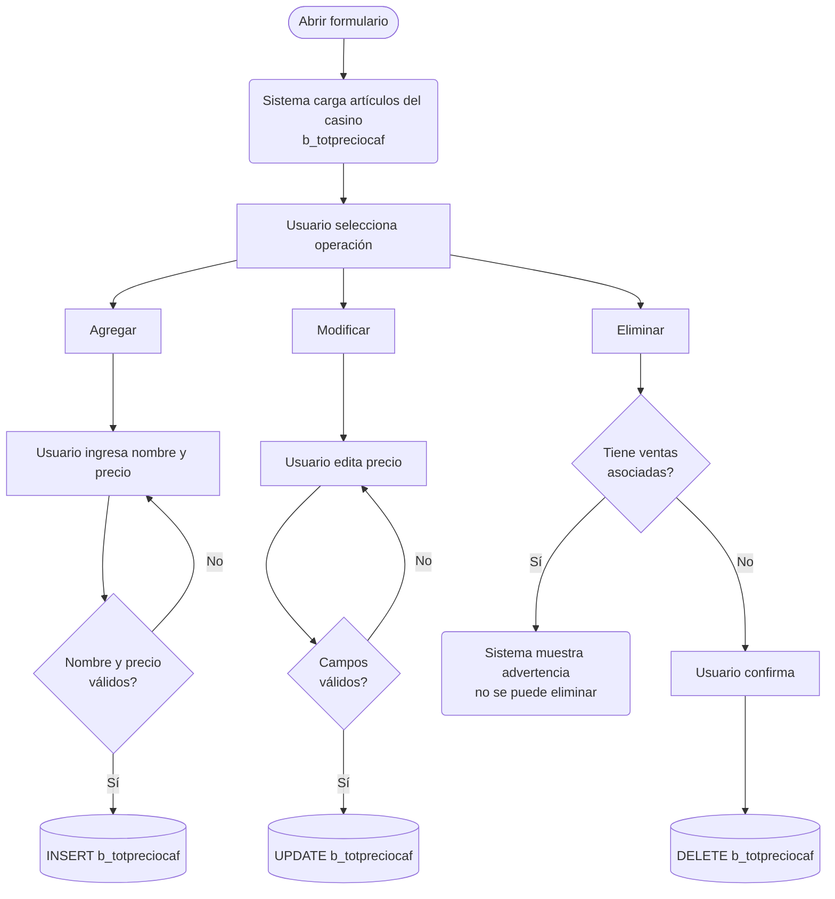

# Prompt — Generación de Documentación Funcional de Formularios SGP

> **Cómo usar:** modifica los valores de la sección **Parámetros** y entrega el documento completo como prompt al agente.

---

## ▶ PARÁMETROS — modificar antes de usar

```
BASE_PROYECTO  = C:\Users\Joaquin.Suazo\Documents\SGP-Producción
RUTA_FUENTE    = {{BASE_PROYECTO}}\codigo_fuente\SGP_Local
RUTA_SQL       = {{BASE_PROYECTO}}\base_de_datos\SGP_Local.sql
RUTA_DOC       = {{BASE_PROYECTO}}\doc_funcional

FORMULARIO     = L_LecVal.frm
NOMBRE_MD      = Lectura_Vales.md
```

---

## PROMPT

Analiza el formulario VB6 ubicado en:

```
{{RUTA_FUENTE}}\{{FORMULARIO}}
```

y genera un documento Markdown funcional. Escríbelo en:

```
{{RUTA_DOC}}\md_pantallas\SGP_Local\{{NOMBRE_MD}}
```

---

### Contexto del sistema

El sistema **SGP Local** gestiona producción y servicios de alimentación para casinos Sodexo Chile. Está desarrollado en **Visual Basic 6** con base de datos **SQL Server** (y compatibilidad Access legacy). Los formularios `.frm` contienen la lógica de interfaz y negocio; los procedimientos almacenados y funciones están en el archivo SQL.

Los documentos Markdown son de uso funcional: los leen analistas, jefes de casino y coordinadores que no saben programación. El lenguaje debe ser claro, orientado al usuario y libre de jerga técnica interna.

---

### Paso 1 — Lee el formulario VB6

Lee el archivo completo. Extrae:

- **Propósito general:** qué tarea del usuario resuelve.
- **Tablas principales:** las que se leen o escriben (busca `FROM`, `INTO`, `UPDATE`, `DELETE`).
- **SPs o funciones SQL:** referencias a `.Execute`, `sgp_`, `fg_Cal`, `RutinaLectura.`.
- **Operaciones disponibles:** botones de Toolbar o Command (Agregar, Modificar, Eliminar, Grabar, Cancelar, Refrescar, Imprimir, Cerrar).
- **Validaciones:** bloques `If`, mensajes `MsgBox`, condiciones antes de grabar.
- **Estructura de grillas:** columnas del Spread o MSFlexGrid con su tabla y campo de origen.
- **Campos de encabezado:** combos o textboxes que el usuario completa antes de operar.
- **Flujo principal:** pasos que realiza el usuario de principio a fin.

---

### Paso 2 — Busca SPs y funciones en el SQL

Si encontraste SPs o funciones en el paso anterior, conviértelos y búscalos:

```bash
iconv -f UTF-16 -t UTF-8 "{{RUTA_SQL}}" > /tmp/SGP_Local_utf8.sql

grep -n "nombre_sp_o_funcion" /tmp/SGP_Local_utf8.sql
```

Por cada SP o función encontrado, lee el bloque completo y extrae:
- Qué tablas consulta o modifica.
- Qué parámetros recibe.
- Qué lógica aplica.
- Qué devuelve.

Si no hay SPs (operaciones SQL inline), documenta igualmente las consultas encontradas en el VB6.

---

### Paso 3 — Redacta el MD con esta estructura exacta

---

#### Encabezado

```
# <Nombre funcional del formulario>

**Formulario VB6:** `<nombre>.frm`
**Tabla(s) principal(es):** `<tabla1>` (<descripción breve>), `<tabla2>` (<descripción breve>)
**SP principal:** `<nombre_sp>` — o bien — Sin Stored Procedures: todas las operaciones se realizan con SQL directo

---
```

---

#### Sección: Contexto

Escribe 2–3 párrafos que expliquen:
- Para qué sirve el formulario en el proceso operativo del casino.
- A qué etapa del flujo pertenece (planificación, salida a producción, ventas, mermas, cierre).
- Si depende de fechas, períodos, minuta u otros prerequisitos.
- Cómo se organiza visualmente (pestañas, paneles, etc.).

---

#### Sección: Parámetros de Entrada

Tabla con los campos del encabezado que el usuario completa antes de operar:

```
| Campo | Descripción | Obligatorio |
|---|---|---|
| <campo> | <qué representa y para qué sirve> | Sí / No |
```

Si no hay encabezado, indica que el formulario carga automáticamente al abrirse.

---

#### Sección: Estructura de la Grilla

Una subsección por cada grilla o pestaña:

```
| Col | Nombre | Origen | Editable | Visible | Calculado | Observaciones |
|---|---|---|---|---|---|---|
| 1 | <nombre visible al usuario> | `<tabla.campo>` | Sí / No | Sí / No | Sí / No | <reglas o condiciones> |
```

- **Visible:** indica si la columna se muestra al usuario o es interna (oculta para uso del sistema).
- **Calculado:** indica si el valor no se lee directamente de un campo almacenado, sino que se obtiene mediante algún tipo de cálculo. Esto incluye cualquiera de los siguientes casos:
  - Operación aritmética entre campos de la grilla o de la base de datos.
  - Resultado devuelto por un Stored Procedure.
  - Resultado devuelto por una función SQL (escalar o de tabla).
  - Resultado devuelto por una función VB6 del sistema (por ejemplo `fg_CalCtoRecInv`, `fg_Pict`, etc.).
  - Valor derivado de una subconsulta o cruce de tablas que no corresponde a un campo directo.

Para toda columna con **Calculado = Sí**, agrega inmediatamente después de la tabla una subsección con este formato:

```
##### Cálculo — <Nombre de la columna>

<Explicación en lenguaje simple de qué representa el valor y por qué se calcula en lugar de almacenarse directamente.>

**Origen del cálculo:** <una de las siguientes opciones>
- Fórmula aritmética entre campos
- Stored Procedure: `<nombre_sp>`
- Función SQL: `<nombre_funcion>`
- Función del sistema: `<nombre_funcion_vb6>`
- Subconsulta / cruce de tablas

**Fórmula o lógica:**
<Nombre resultado> = <componente A> × <componente B> + <componente C> …
— o bien —
<Descripción paso a paso de lo que hace el SP o función que produce el valor>

| Componente | Descripción | Origen |
|---|---|---|
| <componente A> | <qué representa en el proceso> | `<tabla.campo>`, SP/función `<nombre>`, o "ingresado por el usuario" |
| <componente B> | <qué representa> | `<tabla.campo>` |

> <Ejemplo concreto con valores ficticios que ilustre el cálculo paso a paso.>
```

Incluye notas al pie si hay columnas internas importantes (por ejemplo, claves de referencia).

---

#### Sección: Operaciones Disponibles

```
| Botón | Acción |
|---|---|
| **Agregar** | <qué hace funcionalmente> |
| **Modificar** | <qué habilita y qué restringe> |
| **Eliminar** | <condiciones y resultado> |
| **Grabar** | <qué persiste y en qué tabla> |
| **Cancelar** | <qué descarta y cómo restaura> |
| **Refrescar** | <qué recarga> |
| **Imprimir** | <qué informe genera> |
| **Cerrar** | Cierra el formulario. |
```

Si las operaciones varían por pestaña, agrega una columna "Pestaña".

---

#### Sección: Validaciones

Agrupa por pestaña o momento. Cada validación en una fila:

```
| # | Momento | Condición | Resultado |
|---|---|---|---|
| 1 | Al grabar | <qué se verifica en lenguaje de negocio> | <mensaje que ve el usuario o acción del sistema> |
```

---

#### Sección: Flujo de Datos

Genera el diagrama usando **Mermaid** (`flowchart TD`), no texto ASCII. El diagrama debe mostrar el proceso desde la perspectiva del usuario: qué ingresa, qué carga el sistema, qué operaciones puede realizar y qué persiste al grabar.

Usa estas convenciones de forma según el tipo de nodo:

| Tipo de nodo | Forma Mermaid | Cuándo usarla |
|---|---|---|
| Acción del usuario | `[Texto]` — rectángulo | El usuario presiona un botón o ingresa datos |
| Acción del sistema | `(Texto)` — rectángulo redondeado | El sistema carga, valida o calcula algo |
| Decisión / validación | `{Texto}` — rombo | El sistema evalúa una condición |
| Persistencia en BD | `[(Texto)]` — cilindro | Se graba o lee desde una tabla |
| Inicio / Fin | `([Texto])` — estadio | Punto de entrada o salida del flujo |

Ejemplo de estructura base (adaptar al formulario real):

````

````

**Reglas para el diagrama:**
- Cada rama de operación (Agregar, Modificar, Eliminar) debe tener su propio camino.
- Las validaciones deben representarse como rombos con las ramas Sí/No etiquetadas.
- Los nodos de persistencia deben indicar la tabla real que se lee o escribe.
- No incluir nombres de funciones VB6 ni eventos internos: describir lo que el usuario o el sistema hace funcionalmente.
- Si el formulario tiene dos pestañas con flujos independientes, generar un diagrama por pestaña.

---

#### Sección: Dónde se Almacena

Una subsección por tabla principal:

```
### <Nombre descriptivo> (`<nombre_tabla>`)

| Campo | Descripción |
|---|---|
| `campo_codigo` | <para qué sirve en el proceso> |
| `campo_fecha`  | <cuándo se graba y qué representa> |
```

Al final de cada tabla indica la **clave primaria** explicando qué combinación de valores identifica unívocamente un registro.

---

#### Sección: Consultas de Lectura *(incluir solo si no hay SP)*

Por cada consulta, escribe en este orden:

1. **Título descriptivo** (qué información obtiene).
2. **Párrafo explicativo** en lenguaje simple: qué trae, cuándo se ejecuta, qué campos retorna y para qué se usan. Si cruza varias tablas, explica por qué en palabras, sin mencionar JOIN ni WHERE.
3. **Bloque SQL** a continuación.

```
**<Título>**

> <Explicación en lenguaje simple.>

```sql
<consulta>
```
```

---

#### Sección: SP / Funciones Referenciados *(incluir solo si existen)*

Por cada SP o función:

```
### `nombre_sp` — <descripción en una línea>

**Parámetros de entrada:**

| Parámetro | Descripción |
|---|---|
| `:param` | <qué representa> |

**Lógica principal:**
<descripción funcional de qué hace el SP, sin código>

**Tablas que modifica:** `<tabla1>`, `<tabla2>`
```

---

#### Sección: Relación con Otros Módulos

```
| Módulo | Relación |
|---|---|
| **<Nombre>** | <prerequisito / destino de datos / comparte datos / bloquea eliminación, etc.> |
```

---

#### Pie del MD

```
---

*Fuentes: `<formulario>.frm`, `<otros archivos consultados>`, tabla(s) `<tabla>` en `SGP_Local.sql`*
```

---

### Reglas de redacción — obligatorias en todo el documento

| ❌ Evitar | ✅ Usar en su lugar |
|---|---|
| Nombres de componentes VB6 (`vaSpread1`, `fpText1`, `Combo1`) | "grilla de artículos", "campo de búsqueda", "lista desplegable" |
| Nombres de métodos internos (`GrabaRegistro()`, `MoverDatosGrillas()`) | "el sistema guarda el registro", "el sistema recarga la grilla" |
| Códigos de error numéricos (`-2147467259`, `3034`) | "el registro tiene datos asociados en otra tabla" |
| Nombres de eventos VB6 (`Form_Load`, `LeaveCell`, `ButtonClicked`) | "al abrir el formulario", "al salir de la fila", "al hacer clic en el botón" |
| Propiedades de formulario (`TabEnabled`, `Cancel = True`) | "la pestaña queda deshabilitada", "el cursor permanece en el campo" |
| Variables globales (`vg_tipbase`, `vg_pais`, `MuestraCasino`) | "según la configuración del sistema", "el casino activo en sesión" |
| Jerga SQL en texto libre ("JOIN", "WHERE", "NULL", "FK") | Reservar esos términos solo para bloques de código; en texto explicar con palabras |

---

*Referencia de estilo: `{{RUTA_DOC}}\ListaPrecioCafeteria.md` — última actualización: 2026-03-13*
